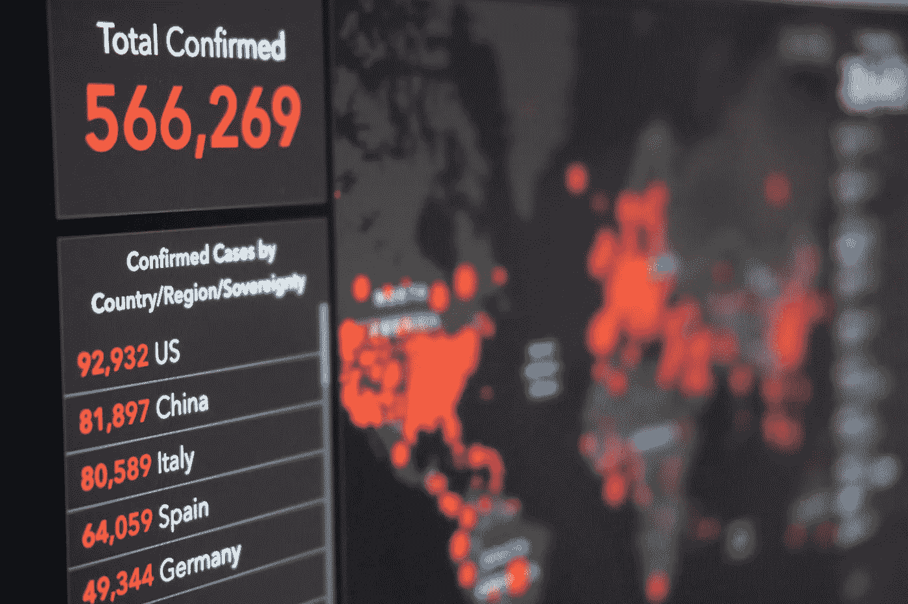
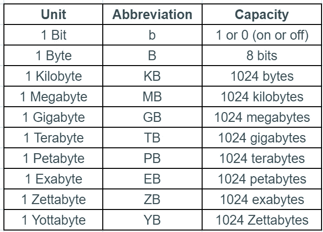
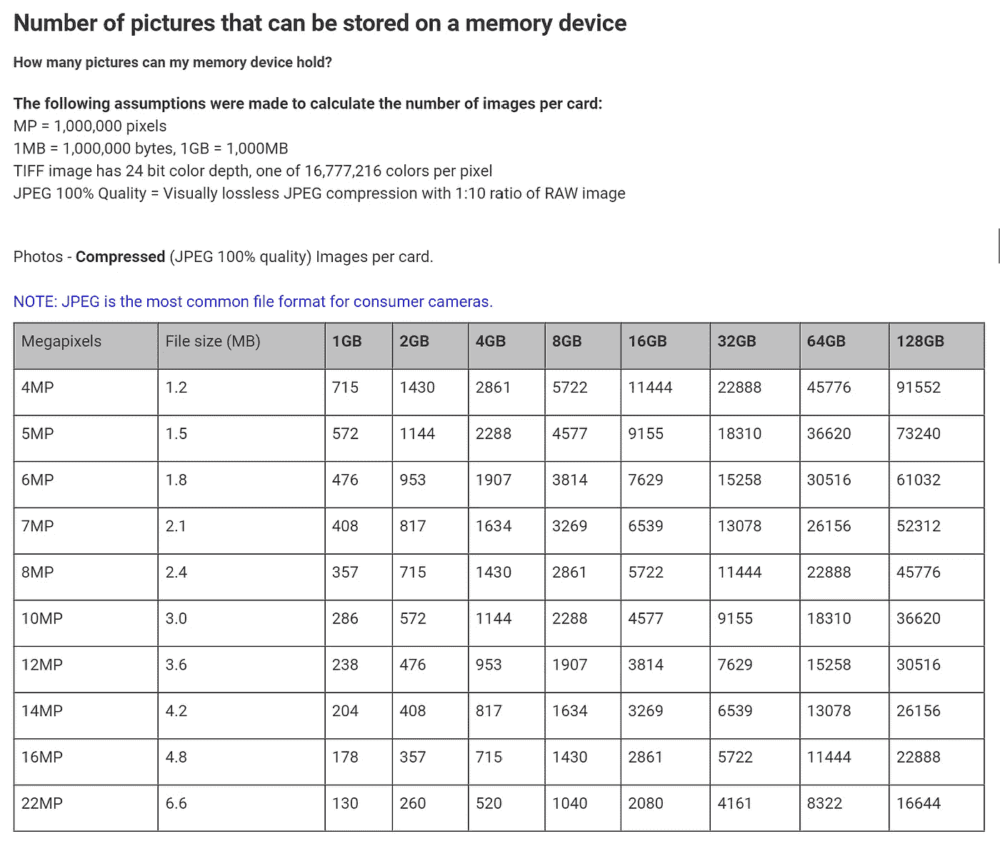

# 是时候让 AP 统计成为所有人的高中数学新要求了

> 原文：<https://medium.com/analytics-vidhya/its-time-to-make-ap-statistics-the-new-high-school-math-requirement-for-all-b7178e34951e?source=collection_archive---------26----------------------->

我经常被初中生和高中生的父母问到，如果他们的孩子想从事工程、软件开发、数学、医学或科学方面的职业，他们应该走什么样的道路。在过去，我的回答是自动的，描述了一条总是以 AB 或 BC 风格作为顶点课程登陆微积分的路径。简而言之，我不再相信这是正确的道路，也不再相信这是让学生为未来等待他们的世界做好准备的最佳方式。

世界已经变了。疫情提醒我们，驾驭和解决复杂问题的能力对于学生和成年人来说是一项至关重要的技能。收集、分析数据并利用分析结果进行推理和决策是一项基本技能。在这篇文章中，我列举了更多的理由，说明为什么我认为向 AP 统计的转变对未来的全球公民至关重要。

在我们讨论每天创建多少数据(包括现在和将来)之前，有必要先了解一下数据是如何以单位进行扩展的。

2010 年 5 月，《科学美国人》发表了一篇题为[“人脑的记忆容量是多少？”](https://www.scientificamerican.com/article/what-is-the-memory-capacity/)在其中，作者估计人脑的记忆容量相当于 2.5 Petabytes。

## “人类大脑由大约 10 亿个神经元组成。每个神经元与其他神经元形成约 1000 个连接，总计超过 1 万亿个连接。如果每个神经元只能存储一个单一的记忆，空间不足将是一个问题。你可能只有几千兆字节的存储空间，类似于 iPod 或 USB 闪存驱动器中的空间。然而，神经元结合在一起，使每个神经元同时帮助许多记忆，以指数方式将大脑的记忆存储容量增加到大约 2.5 千兆字节(或 100 万千兆字节)。相比之下，如果你的大脑像电视中的数字录像机一样工作，2.5 千兆字节就足以容纳 300 万小时的电视节目。你必须让电视连续运行 300 多年，才能用完所有的存储空间。”

这真是太神奇了！一些研究人员预计，味觉、嗅觉和其他感官等其他机制也在发挥作用，可以显著提高这一估计值，至少达到艾字节水平。

在电脑或平板电脑上工作时，您可能更熟悉兆字节和千兆字节的用法。最新的 2021 款 1 1 英寸 iPad Pro 拥有 8 GB 内存，存储容量从 128GB 到 2TB 不等。它的相机包括一个 12MP 宽相机和一个 10MP 超宽相机。史蒂夫·乔布斯将 iPod 描述为“一个可以在口袋里装 1000 首歌的小设备”。“那么，使用 12MP 的摄像头，2TB 的存储能容纳多少张照片呢？要回答这个问题，我们需要确定单张照片占用了多少内存。下面是 SanDisk 的一个表格，您可以看到一张 12MP 压缩照片的文件大小为 3.6MB。因此，对于最低内存配置为 128GB 的 iPad Pro，您可以存储 30，516 张 12MP 照片。所以对于 2TB 的配置，可以存储 16 乘以 30516 张 12MP 的照片。这相当于 488，256 张照片。您可以使用下表执行自己的计算。

[https://kb . sandisk . com/app/answers/detail/a _ id/69/~/可存储在存储设备上的图片数量](https://kb.sandisk.com/app/answers/detail/a_id/69/~/number-of-pictures-that-can-be-stored-on-a-memory-device)

# 2020 年以来的数据事实

我们的世界被数据淹没了。以下是当今社会使用数据的几个事实。

*   2020 年，人们每秒钟创造 1.7 MB 的数据。
*   到 2022 年，全球 70%的 GDP 将实现数字化。
*   2021 年，68%的 Instagram 用户查看品牌的照片。
*   到 2025 年，全球将有超过 200 zb 的数据存储在云存储中。
*   2020 年，用户每天发送约 50 万条推文。
*   到 2020 年底，**440 亿字节**将构成整个数字世界。
*   每天，**发送 3064 亿封电子邮件**，发出 **5 亿条推文**。

这张由英特尔制作的物联网(IoT) [信息图](https://ise-erp.com/iot-infographic/)陈述如下:

## “物联网正在爆炸式增长。它由数十亿个“智能”设备组成——从微型芯片到庞大的机器——这些设备使用无线技术相互交流(和我们交流)。我们的物联网世界正以惊人的速度增长，从 2006 年的 20 亿个对象增长到 2020 年的 2000 亿个。”

资料来源:国际数据公司、英特尔公司、联合国

纳赛尔·塔米米在 [Unsplash](https://unsplash.com/s/photos/statistics?utm_source=unsplash&utm_medium=referral&utm_content=creditCopyText) 上拍摄的照片

# 奇怪的新未来

设备收集数据的速度呈爆炸式增长。我们获取这些数据、分析这些数据并根据这些数据做出决策的能力在各个领域都将变得越来越重要。这里有一个具体的例子来说明为什么这些技能如此重要。

牛津纳米孔技术公司能够以低于 1000 美元的价格提供实时 DNA 测序。他们的迷你设备由笔记本电脑的 USB 端口供电，可以在 16 小时内给出分析结果。基于这种分析，该技术允许客户确定他们易患的相当多的疾病。在未来，你的子孙后代将不得不根据来自类似于 minION 的技术以及尚未发明的技术的数据，代表你就你的医疗保健做出决定。毫无疑问，这些公司将为你的决策提供指导。然而，不了解与医疗保健相关的事件的概率和统计数据可能会导致巨大的成本，甚至更糟的是，亲人的死亡。

# 需要 AP 统计数据的主要原因

我就开门见山了。数据无处不在，并将继续要求我们参与决策。将数学作为批判性思维的工具将变得越来越重要。目前，由于这门学科的理论性质，微积分是一门大多数学生都无法接触的课程。因此，许多学生错过了更高层次的分析思维。数据收集、分析和决策传统的数学教学方式不涉及数据收集、数据清理、数据分析和数据报告。下面是一个列表，并不意味着详尽无遗，而是作为讨论的起点。如果你有更多的理由或反驳，请在帖子中分享，这样我就可以更新列表。

1.  建立学生的数学机构要求他们能够使用数学来影响我们世界的变化。统计学提供了一种与世界互动的简单方法，因此学生可以识别感兴趣的问题，并几乎立即收集数据来支持他们的假设。
2.  微积分主要教授一种数学建模的方法。该方法通过简化处理数据的最具挑战性和最高级的部分，锚定在各种形式的函数的优化中。
3.  最大似然法是教授微积分课程中典型的最优化概念的一个很好的工具。
4.  微积分不教学生数据收集、数据清理、数据分析和数据表示。
5.  我们生活的世界有杂乱的数据，我们衡量这些数据的能力充满了不确定性。这与 AP Calc 的微积分问题中共享的整齐数字不同。
6.  如果目标是让学生更广泛地理解数学，以便他们不仅参与其中，而且受到启发用它来解决问题，那么联系当前事件中的问题和主题将提供更大的参与途径。
7.  统计学教我们如何处理数据中的错误。
8.  统计学教会我们如何发现和处理数据中的异常。
9.  统计学告诉我们如何处理数据中的异常值。
10.  统计为我们提供了处理有噪声的数据集的工具，这样数据的行为仍然可以被捕获，而不会因噪声而失真
11.  这些技能很容易扩展到各种 STEM 相关领域。
12.  概率为决策和预测提供了坚实的基础。
13.  它为学生从事数据科学职业做准备

# 结论

我们必须始终适应当今社会的需求。在经历了前所未有的一年后，我们必须与回归我们所熟知的正常世界的趋势作斗争，并不断地问自己“我们如何才能最好地为学生的未来做准备。”我确实相信高等微积分有它的优点。但是作为一名数学家，AP 统计为学生提供了更具延展性的技能。