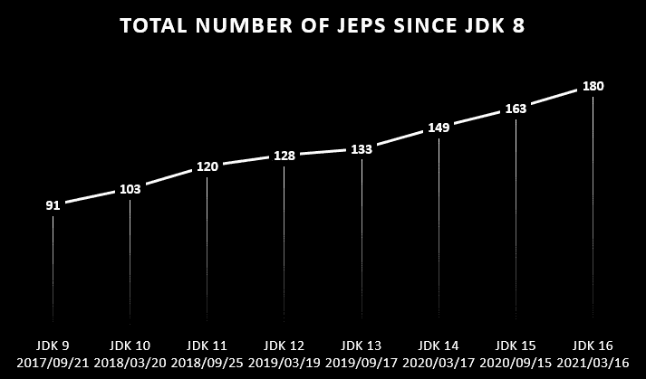

# Java 16-25 年及其未来的生命周期

> 原文：<https://medium.com/analytics-vidhya/java-25-years-of-evolution-and-the-lifecycle-ahead-8ea1f792f6da?source=collection_archive---------9----------------------->

他的开始听起来像是一个狂热爱好者，但是 Java 已经出现了，如果不是在软件这个术语被创造出来后不久就处于软件革命的中心的话。开发生命周期和社区支持一直是一种必须克服其前辈的缺点的语言(就软件行业中最受珍视但又被诅咒的语言而言)。本文将介绍 Java 8 到 Java 16 发布后发生的所有变化，并重点介绍一些帮助 Java 变得更加活跃和对开发人员友好的关键变化。

# 🚼初始版本

从第一次修订到第八次迭代，它一直是主要版本走出沙箱的障碍，并在社区中引起巨大的反弹，同时也破坏了贡献和功能、补丁或仅仅是反馈实现的速度，而它对其他编程语言是无缝的。

从 Java 7 到 Java 8 的过渡持续了 3 年，足以发布一些主要特性来改进语言。更不用说，也是 Java 7 缺少了很多主要的特性，这些特性帮助了同时代的其他语言在发布迭代中不断发展。

# 📅什么变了？

幸运的是，在一系列糟糕的更新之后，hiccup 填补了特性发布周期，以及 Oracle 发布节奏问题带来的所有负面影响。随着从 Java 7 到 8 的过渡，更新周期的逐步调整有助于 Java 通过开发人员和贡献者早期缺乏的支持而发展。

值得称赞的是，它现在拥有一些最广泛、最方便的特性，这些特性易于挑选和使用，并且不会转移对业务逻辑的关注(是的，在 JDK10 中提供了 lambda 表达式、谓词和`var`声明语法)。公平地说，像这样的特性实现将需要比六个月更长的周期，但是可以在后续版本中发布，而不是延长到三年的发布周期。

# 🔄🛣️路线图

自从 Java 9 发布以来，发布节奏在每个 Java 版本的时间表方面都有了很大的改进。Java 的开发周期变得更加灵活。这使得它在社区中更容易维护，并导致更快的采用，而不是花费几个月的时间来学习一种全新版本的语言，以赶上一个装满新功能的包。

Java 发布路线图，来源:[https://en.wikipedia.org/wiki/Java_version_history](https://en.wikipedia.org/wiki/Java_version_history)

自从新的生命周期开始以来，社区采取了一种更加开放源代码的方法，让用户在开放源代码和 Java 商业发行版之间进行选择。因此，开源和基于社区的 JDK 发行版(OpenJDK)已经成为主要的开发选择。但是，Oracle JDK 发行版正在扩展对其旧版本和当前长期支持(LTS)版本的支持，下一轮计划是每隔几个迭代就发布一个主要的 LTS 版本。

## TLDR？跳到变更日志？
快速链接: [Java 9](#dcc0) 、 [Java 10](#d2e5) 、 [Java 11](#d3ee) 、[Java 12–13](#86ea)、 [Java 14](#febb) 、 [Java 15](#1fa6) 、 [Java 16](#a5f8)

来源:[https://advanced web . Hu/a-categorized-list-of-all-Java-and-JVM-features-since-JDK-8-to-16/](https://advancedweb.hu/a-categorized-list-of-all-java-and-jvm-features-since-jdk-8-to-16/)

从 JDK8 到 16 正在实施的增强建议达到了前所未有的 180 条，这已经成为整个周期的游戏规则改变者，并为更快、更顺畅的持续改进和增强打开了一扇新的大门。让我们看看从 Java 9 到最新的 Java 16 的所有重要特性。

# Java 9

Java 9 于 2017 年 9 月发布，有三个**最重要的变化:**

## **1。** [**模块化**](https://www.youtube.com/watch?v=DItYExUOPeM)

*   作为[拼图项目](https://openjdk.java.net/projects/jigsaw/)*的一部分介绍了一个 ***模块*** 是一组具有共同特征的代码。这增加了对现有 Java 包的封装，减少了版本冲突，增加了更多的安全性和性能，并开发了更小的定制 JDK。*
*   *它重申了一个更加安全的契约的想法:被实现的**依赖模块**需要公开什么，以及**依赖模块实现需要什么**，以便只有相关代码是公共的(**或者更确切地说是公共和导出的**)。*

## ***一个模块:***

*   *可以是命名的、未命名的或自动的(由编译器定义)*
*   *一般是写在 module-info.java 的文件里面`src/main/java`*

## ***2。接口中的私有方法***

*这使得能够在接口中编写私有和私有静态方法，以避免冗余代码，例如编写异常，这些异常可能在实现类缺少从接口重写方法的情况下引发。*

**

***JShell 命令示例***

## *3. [**JShell**](https://docs.oracle.com/javase/9/jshell/introduction-jshell.htm)*

*Oracle 开发了**一个 REPL(** *读取-评估-打印-循环)* 工具，非常类似于 Python 的 IDLE 或者 Scala 的 shell 又名 **JShell** 。顾名思义，它可以用来运行命令、创建变量、类、方法，并快速测试它们。*

# *Java 10*

*6 个月后，也就是 2018 年 3 月，Java 10 仅带来了两项重大变化:*

## ***1。甲骨文 JDK vs 公开赛 JDK***

*作为对开发人员友好的一步，社区决定增强 OpenJDK 发行版，并将其作为主要的 JDK 进行推广。然而，如果一个人想要一个 Oracle JDK 发行版和对旧的 LTS 版本(如 8 和 11)的扩展支持，就需要从 Oracle 订阅一个商业许可证。*

**

***var 关键字用于字符串值的用法***

## *2.**变量推断***

*Java 10 带来了非常需要的关键字`var`，**消除了定义每个变量类型的礼仪需要。本质上，人们可以将任何类型的值赋给变量，而不用担心类型。然而，需要注意的是，一旦定义了，类型就不能改变，这并不能说明**仍然是静态类型语言**。***

## ***注意:变量应该是***

*   *一经声明就被定义*
*   *只有局部变量*(既不是类成员也不是函数参数)**

# *Java 11*

*2018 年 9 月，Java 11 的发布带来了**两个**关键性的变化。这也是第一个长期支持到 2026 年的版本。*

## ***1。局部参数的类型推断***

*对 lambda 表达式的形参使用`var`会导致参数的类型被推断出来。这允许在带有注释验证的谓词中使用变量时有更多的自由语法。*

## *2. **javac 更新***

*消除了传统的两步编译-运行过程，从 Java 11 开始不再需要`javac`命令来编译 Java 文件。相反，编译和运行过程可以通过运行`java`命令一步完成。*

# *Java 12 和 13*

## ***1。开关情况表达式***

*Java 12 为 **switch-case 块的风格带来了一个单一但语法优雅的变化，**消除了 switch-case 中多余的中断，语法与 lambda 表达式同义。*

****

***更新 switch case 语句(Java12，13)***

**

***Java 13 用 yield 关键字切换表达式***

***Java 13** 进一步改进了 **switch-case 块中的表达式定义，**允许每个 case 使用`yield`关键字返回值。这提高了可读性，而不是在早期的 case 表达式中使用箭头(→)操作符。注意， **break 仍然可以和**任何表达式类型一起使用。*

## *2.多行文本块(预览🔬)*

> **文本块的基本原则是通过最小化呈现跨越多行的字符串所需的 Java 语法来提供清晰度。* [***甲骨文***](https://docs.oracle.com/en/java/javase/15/text-blocks/index.html)*

****

***Java 13 中的多行文本块预览***

*简单地说，文本块的目的是允许以更简单的方式定义包含换行符(\n)和回车符(\r)的字符串，这与 python 定义多行字符串的方式非常相似。*

# *Java 14*

*Java 14 的发布带来了语法和内部的大量改进(是的，是重大的改进)。*

**

## ***1。空指针异常(如释重负)***

*空指针异常(NPE)一直是一个活生生的 Java 开发人员的噩梦，也是发生最频繁的问题。Optional 在一定程度上对修正带有变量或值的 NPE 问题有很大的帮助，但是不能解决一个核心问题—**npe 没有有意义的消息。***

****

***增强了 Java 14 中的 NullPointerException 冗长性***

*这里， **getUser** ()或 **getName** ()可能会返回空值，从而导致 NullPointerException。这里的问题是，异常并没有详细说明是什么导致了异常的发生。如果使用以下标志，JVM 现在会在 NullPointerExceptions 中隐式生成有意义的消息。`***-XX:+ShowCodeDetailsInExceptionMessages***` *突出显示导致异常发生的变量*。*

## ***2。记录(预览**🔍 **)***

*   *向 Java 添加新特性背后的驱动因素大部分(如果不是一直的话)是为了**减少开发人员为实际编写核心业务逻辑而执行的准备工作的过程**，而不是不断地关注每个所需实体的声明，只贡献了不到 1%。一个这样的例子是在 Java 中定义 POJOs 或实体类，它们通常满足对实体建模或对正在执行的一些动作建模的需要。*
*   *这就是 Records 的用武之地，它大大减少了传统的 Java 类定义样板文件，此外，还允许更新现有的方法(比如参数化的构造函数)。*

## *TLDR？*

*   *简化的类别定义*
*   *显著减少 POJOs 的样板代码*
*   *仅实现需要定制业务逻辑的内容*

****

***Java 14 中使用 Record 进行类代码简化***

## *3.模式匹配的实例(预览🔍)*

*一个古老(但最常用)特性的有趣更新是在条件检查中使用变量名。这防止了额外的造型，从而减少了代码工作量。例如，在下面的代码块中，它执行两个主要任务:—*

1.  *变量的类型检查(如 instanceof 之前所做的)*
2.  *消除对正在检查类型的变量进行强制转换*

# *Java 15*

*Java 最近的迭代给语言带来了三个主要的变化，或者增强了面向对象编程的思想，或者为开发人员增强了语言的安全性，另外，文本块(在 preview 的早期)现在是语言的标准部分。*

## *1.密封和非密封 classes❗*

*在增强面向对象编程方面向前迈了一步，密封和非密封关键字是 Java 15 的预览版。*

*`**sealed**`(听起来像某种形式的打包，因为这正是它所做的)确保接口可以创建一个契约，指定哪些类可以扩展或实现它，并且所有类都遵守它，而`**non-sealed**`做的正好相反，打破契约，允许扩展和实现类*

**

## *2.爱德华兹曲线数字签名🔒*

***edd sa**(*Edwards-Curve 数字签名算法*)[RFC 8032](https://tools.ietf.org/html/rfc8032)是通过 [JEP 339](https://openjdk.java.net/jeps/339) 最新增加的 Java 15 的签名方案。虽然它没有取代 JDK 现有的*椭圆曲线数字签名算法* ( **ECDSA** )，但是它:*

*   *提供独立于平台的 EdDSA 实现。*
*   *执行时间不变，与密钥长度无关。*
*   *提供标准化的参数设置 **Ed25519** 和 **Ed448***
*   *是 TLS 1.3 中允许的三种签名方案之一。*

*一些库已经提供了这一功能，但现在它是 Java 本身的核心特性，并且比现有的 ECDSA 实现更好。*

## *4.隐藏类🔍*

*这些是比普通功能更高级的功能。这些防止了与框架无关的框架类的使用，这些类被定义为在字节码级别使用(通过反射)。*

## *性能*

*   *不能命名为超类型*
*   *不能是声明字段类型*
*   *不能是参数类型或返回类型*
*   *无法通过`Class::forName`、`ClassLoader::loadClass`、`Lookup::findClass`被类加载器找到*

# *Java 16🆕*

*Java 16 是最近发布的语言版本，引入了主要的孵化 API 和 C++ 14 语言特性。本次迭代共有 [**17 个特性**](https://openjdk.java.net/projects/jdk/16/) 。*

## *1.原料药(孵化)*

*   ***Vector API** 是定义的向量模块的初始模型。这不是传统系列的一部分，而是全新的`jdk.incubator.vector`套装。它的主要目标是在执行非常类似于 Python-Numpy(或 Pandas) vectors 的矢量化操作时减少 CPU 的计算开销。它表达了编译成最佳硬件指令的矢量计算。*
*   *[**外来链接器 API**](https://openjdk.java.net/jeps/389)这个 API 提供外来函数支持，不需要任何中间的 JNI 胶水代码。这是通过将外部函数公开为方法句柄来实现的，方法句柄可以在纯 Java 代码中声明和调用。编写、构建和分发依赖于外来库的 Java 库和应用程序被大大简化了。*
*   ***外来内存访问 API** 这为 Java 程序提供了对 Java 堆外外来内存的安全有效的访问。**外部链接器 API** 与此一起，为第三方本地互操作框架提供了一个有效的基础。*

## *2. [C++ 14 的特性](https://openjdk.java.net/jeps/347)*

*   *这样做的目的是允许在 JDK 内对 C++源代码进行修改，以利用 C++14 语言的特性，并给出关于哪些特性可以在热点代码中使用的具体指导。*

# *将来的*

## *现代 LTS Java 版本*

***Java 17(LTS 发布)**将于 2021 年 9 月发布。根据时间表，这将成为下一个长期支持的版本，并将带来大量的预览功能和一直到 JDK16 的增强功能，进一步增强 Java 平台的稳定性、安全性和性能。*

# *结论*

*Java 一直处于开发周期的风口浪尖，因为许多关键任务和企业应用程序都是基于它开发的大量框架。敏捷方法直接或间接地从社区和语言特性的丰富性两方面推动了 Java 平台的发展。*

*就您喜欢或希望在即将到来的迭代中看到哪个特性，写下您的想法。*