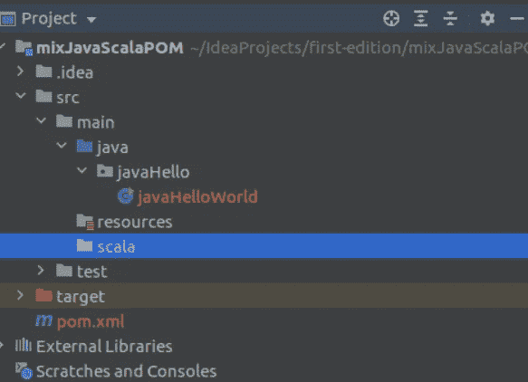
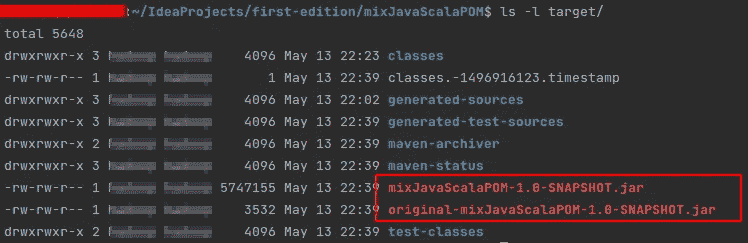

# 一个 IntelliJ 项目中的 JAVA + SCALA

> 原文：<https://medium.com/analytics-vidhya/java-scala-in-a-single-module-in-intellij-86a3b9c76156?source=collection_archive---------2----------------------->

## 在一个 IntelliJ 项目模块中混合 JAVA 和 SCALA

作者创建的图像

因此，您可能想知道是否有可能在同一个 IntelliJ 项目中结合 JAVA 和 SCALA。

答案是肯定的，我的 IntelliJ 中有 [Apache Spark 项目。它使用标准的 maven 目录，在模块目录的`src/main`下有`java`和`scala`目录。](https://github.com/kefeimo/SparkStreamingDashboard)

网上的许多帖子都声称在同一个项目中混合存在同样的奇怪问题。如果这个问题多年来都没有得到解决，也没有真正的文章解释原因，那么你可能是那些对使用 scala 感到不安的人之一。

在这篇文章中，我将指导你如何在 IntelliJ(社区版，版本:2021.1.1)中实现这一点

事不宜迟，让我们走一遍这个过程。

# 辅导的

1.  **创建一个新的默认 POM 项目**

*   `File` → `New Project` → `Maven` (使用默认的 Maven 项目，不要从原型创建)→ `Next`

*   给项目一个`Name` → `Finish`

原来的`pom.xml`会是这个样子。让它保持现在的样子。

**2。创建一个简单的 java 文件**

右击源目录"`java` " → `new` → `Java Class`

在我的例子中，我首先创建了一个包目录(`java` → `new` → `Package`)，然后创建了一个 Java 类文件

编写一些简单的代码并运行。(如果您不熟悉 IntelliJ 并且不确定如何运行该应用程序，请查看此[链接](https://www.jetbrains.com/help/idea/creating-and-running-your-first-java-application.html))

结果。

接下来，让我们集成一些 scala 代码。

**3。启用 scala 框架支持**

注意这里没有 ***没有*** 选项让我们在 New 下创建一个 Scala 类或对象。

我们需要做的是添加 scala 框架支持。

右键单击模块名(对于我的例子是 mixJavaScalaPOM)→`Add Framework Support…`

在左侧面板中勾选`Scala`选项→在`Use library`中选择 Scala 版本(如果不存在，点击`Create`并选择 Scala SDK jar) → `OK`

再次右击 java 源代码路径，可以看到现在有一个`Scala Class`选项

**4。细化文件结构**

即使我们现在能够创建 Scala 类，但是将 Scala 文件放在 java 源文件路径下还是会令人困惑。让我们为 Scala 创建一个源文件路径。

4.1 在`main`下新建一个名为`scala`的目录

(注意颜色为灰色，表示正常目录；在 Intellij 约定中，源路径目录是蓝色的。)

4.2 将 scala 目录指定为源路径

`File` → `Project Structure` →(在提示的左边)`Project Settings` → `Modules`

右键点击新创建的`scala`目录→选择`Sources` → `OK`

(注意 scala 目录在这个操作之后变成了蓝色)

现在创建一个 Hello-world scala 对象文件并测试项目是否工作。

耶。[😀像魔咒一样工作。](https://emojipedia.org/grinning-face/)

如果我们想打包代码，最后一步。

**5。为依赖项和插件配置 pom 文件。**

*   JVM(例如，JDK-8)默认不包含 scala 编译器，所以如果想要打包代码并作为 jar 文件在 JVM 上运行，我们需要包含 scala 依赖项(即 scala-library)。基于项目，还有其他依赖项要包含。
*   我们还包括一些插件(maven-compiler-plugin、maven-shade-plugin 和 scala-maven-plugin ),所以我们可以制作 uber jar。

下面是更新后的 pom.xml(虽然有点罗嗦)

现在我们可以用`mvn package`命令打包代码了。(我更喜欢在命令行上打包我的 maven 项目。但是如果你喜欢在 IntelliJ 内部实现相同的目标，请查看此链接。)

这里我们有两个 jar 文件。

*   具有依赖关系的超级 jar(mixJavaScalaPOM-1.0-snapshot . jar)
*   一个普通的 jar(original-mixJavaScalaPOM-1.0-snapshot . jar)

现在用`java -cp`命令测试软件包。

(注意原始的 jar(非 uber jar)不适用于 scala 类，因为它没有打包 scala 库依赖项。)

# 摘要

在本教程中，我们将在 IntelliJ 中创建一个混合的 JAVA + SCALA 项目。该项目可以从 [Github](https://github.com/kefeimo/mixJavaScalaPOM) 下载。如果你有任何问题，请留下评论。下次见。