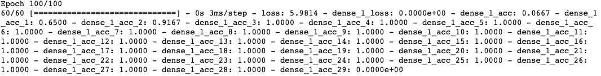
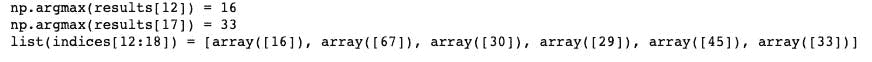
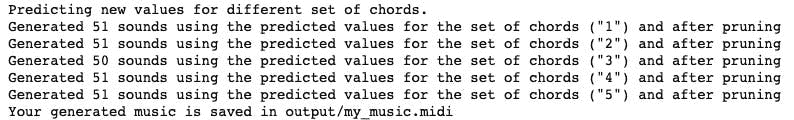

# LSTM 爵士音乐即兴表演

> 原文：<https://medium.com/analytics-vidhya/jazz-music-improv-with-lstm-205db2c4ed3c?source=collection_archive---------17----------------------->

# 背景:

利用长短期记忆(LSTM)创作新颖的爵士乐独奏。

该数据集是使用 78 个值的一代爵士乐的语料库。在这种情况下，价值观可以被认为是音符。

# 构建和训练模型:

这个模型被提议用来学习音乐模式，所以 LSTM 被设定了 64 维隐藏状态。然后为网络创建输入和输出层。

接下来是创建一个 djmodel()函数，它:

1.  创建了空的输出列表，在每一步保存 LSTM 输出单元格。
2.  使用 for 循环遍历 LSTM 层。其中包括:

a.创建自定义 lambda 层。

b.使用 reshapor 图层重塑 x 变量。

c.执行 LSTM 单元的一个步骤

d.将 densor 应用于 LSTM 单元的隐藏状态输出。

Densor 通过 dense 和 softmax 的组合传播 LSTM 输出激活值。

e.将预测值附加到输出列表。

3.已创建模型实例。

我使用 Adam optimizer 和分类交叉熵损失定义并编译了该模型。然后使用 100 个时期来拟合和训练模型。

# 预测和采样:

使用经过训练的模式，我通过创建一个函数来合成新的音乐，该函数在每一步采样，将输入来自先前 LSTM 的激活和细胞状态，并向前传播一步，并获得新的输出和细胞状态。然后，可以使用 densor 使用这个新的激活来生成输出。

接下来，我定义了我的推理模型，它被硬编码以生成 50 个值，然后创建了用于初始化 x 和 LSTM 状态变量的零值向量。

然后，我实现了 predict_and_sample 函数，该函数将输入作为其参数的一部分。为了预测对应于该输入的输出，I:

1.  使用您的推理模型来预测我的输入集给出的输出，该输入集的输出变量“pred”是一个长度为 20 的列表，其中每个元素都是一个 numpy 数组。
2.  已将“pred”转换为索引的 numpy 数组，每个对应的索引都是通过获取“pred”列表中某个元素的 argmax 来计算的。
3.  将索引转换成它们的独热向量表示。

最后，我使用调用 generate music 函数的变量 out_stream 生成了我的音乐，并将其保存到我的 out_stream 中。

生成的音乐是一个 midi 文件，我不得不使用在线文件转换器将其转换为 mp3 文件。这个文件被命名为 my-music.mp3，可以在输出文件夹中找到。

# 结论:

这段代码最好在 google colab 上运行，由于一些依赖问题，我使用了 tensor flow 1 . x . x 版和 Keras 2 . x . x 版。这是我在数据科学和机器学习之旅中的一门课程中做的一个项目。存放所有需求的文件夹可以在我的 [Github](https://github.com/Nwosu-Ihueze/Music_improv) 中找到。可以通过 [LinkedIn](https://www.linkedin.com/in/rosemary-nwosu-ihueze/) 或 [Twitter](https://twitter.com/adaihueze) 联系我。感谢您的阅读。