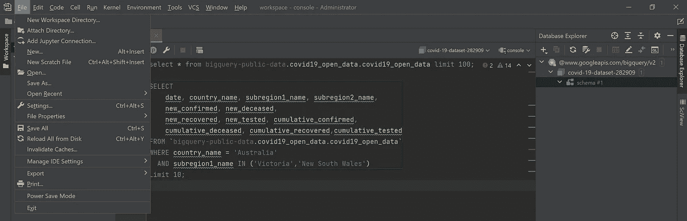
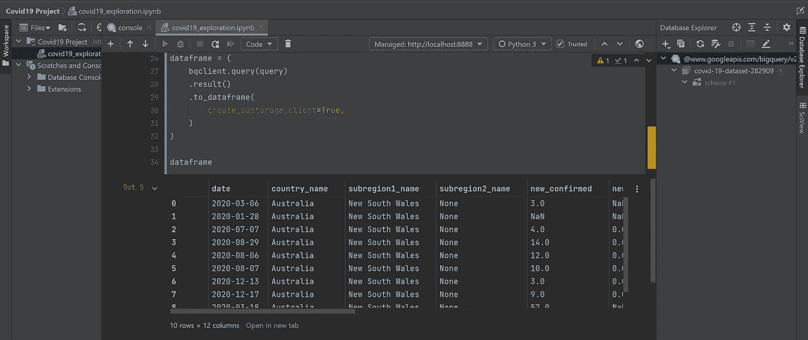
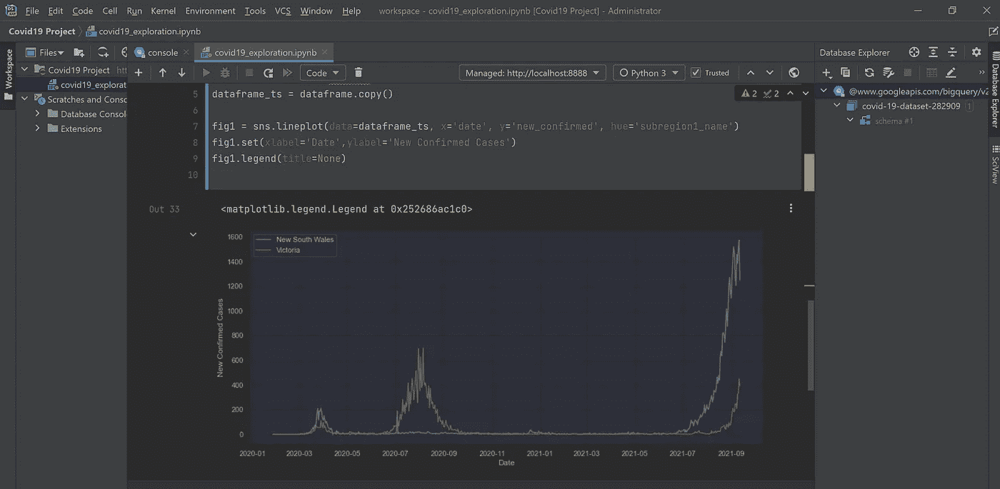

# Jetbrain DataSpell —在 ide 中使用 Jupyter 笔记本

> 原文：<https://medium.com/analytics-vidhya/jetbrain-dataspell-using-jupyter-notebooks-inside-the-ide-2698f85ff98c?source=collection_archive---------4----------------------->


DataSpell——面向数据人员的新 IDE

在我的上一篇文章中，我介绍了 Jetbrains 的新 IDE DataSpell。我介绍了如何使用 IDE 直接连接和查询数据库，而不需要单独的 SQL 编辑器。现在，几天后，经过专业的使用，我可以说，我一次都不需要打开我的 SQL 编辑器。上一篇文章可以在这里阅读:

[](/@palien2887/jetbrains-dataspell-a-brand-new-awesome-ide-for-data-scientists-7ec5ba2c66b5) [## jetbrains DataSpell——面向数据科学家的全新集成开发环境

### 最近，JetBrains，深受喜爱的 PyCharm 和 IntelliJ IDEA 以及其他各种产品的制造商，已经…

medium.com](/@palien2887/jetbrains-dataspell-a-brand-new-awesome-ide-for-data-scientists-7ec5ba2c66b5) 

另一个让我兴奋的功能是内置的 Jupyter 笔记本和连接。这很容易开始，只需点击文件>添加 Jupyter 连接，如下图所示，这将打开一个对话框，允许您启动一个新的连接，连接到现有的本地连接，甚至连接到 Jupyter 服务器。一个提示，在启动一个新的本地连接之前，确保你已经连接到你想要使用的工作目录，它会自动在那个目录中启动新的连接。



开始新的 Jupyter 连接

下一步，添加一个 Jupyter 笔记本，也在文件菜单中。这将在 ide 中打开一个新的笔记本，不需要外部控制台窗口或浏览器窗口(如果需要，终端也可以在 IDE 中使用)。

为了测试功能，我想做一些基本的典型用法，并探索我们在第一篇文章中连接的数据集。笔记本中的这个连接是使用 google 的两个包来处理的，您需要使用下面的代码行来安装这两个包(您可以在内置终端中完成):

```
pip install — upgrade ‘google-cloud-bigquery[bqstorage,pandas]’
```

安装完成后，您可以设置您的身份验证以连接到 bigquery 数据库(如果您还没有想要使用的项目和文件，请参阅下面文章中的如何创建项目和下载文件)。

[](/@palien2887/connecting-to-the-google-public-covid-19-datasets-with-bigquery-and-dbeaver-d4a340051bc8) [## 使用 BigQuery 和 DBeaver 连接到 Google 公共新冠肺炎数据集

### 如何通过 BigQuery 使用 Google BigQuery 公共数据集并将其连接到 DBeaver

medium.com](/@palien2887/connecting-to-the-google-public-covid-19-datasets-with-bigquery-and-dbeaver-d4a340051bc8) 

当您准备好项目和该项目的密钥文件后，下面的代码将验证连接，然后运行一个查询来检查它是否在这个特定的数据库上工作。注意，您必须输入密钥文件的路径。

```
from google.cloud import bigquery
from google.oauth2 import service_account

key_path = "<ENTER PATH TO KEYFILE HERE>"

credentials = service_account\
    .Credentials\
    .from_service_account_file(key_path,
                               scopes=["https://www.googleapis.com/auth/cloud-platform"],)

bqclient = bigquery.Client(credentials=credentials, project=credentials.project_id,)

## Download query results:
query = """
SELECT
date, country_name, subregion1_name, subregion2_name,
new_confirmed, new_deceased,
new_recovered, new_tested, cumulative_confirmed,
cumulative_deceased, cumulative_recovered,cumulative_tested
FROM `bigquery-public-data.covid19_open_data.covid19_open_data`
WHERE country_name = 'Australia'
AND subregion1_name IN ('Victoria','New South Wales')
Limit 10;
"""

dataframe = (
    bqclient.query(query)
    .result()
    .to_dataframe(
        create_bqstorage_client=True,
    )
)

dataframe
```

数据帧在编辑器中打印出来，但是在 IDE 中有一个链接可以在它自己的选项卡中打开，如下面的屏幕截图所示。



现在我们有了连接，我们可以使用它直接将我们想要的任何查询拉入笔记本中的数据帧。

接下来，我想看看 IDE 中的一些基本可视化效果，为了简单起见，我决定使用 Seaborn 绘图包使用以下代码按日期绘制新南威尔士州和维多利亚州的新确诊病例(注意，前面使用的查询提供了此数据，只需删除“限制 10”):

```
import matplotlib.pyplot as plt
import seaborn as sns

sns.set(rc={'figure.figsize':(14, 6)})
dataframe_ts = dataframe.copy()

fig1 = sns.lineplot(data=dataframe_ts, x='date', y='new_confirmed', hue='subregion1_name')
fig1.set(xlabel='Date',ylabel='New Confirmed Cases')
fig1.legend(title=None)
```

这在编辑器中输出了下面的图像，有点难以阅读，但对于默认设置来说还不错，而且一切都工作得天衣无缝。



**结论:**

因此，在我开始对这个数据集进行全面分析之前，我将在这里结束这篇文章，谈谈我对在 DataSpell 中使用 Jupyter 笔记本的想法，包括以下几点:

*   在 ide 中设置连接和笔记本既简单又无缝
*   笔记本的功能与在浏览器中使用它是一样的
*   您可以获得所有现成的 DataSpell 编辑功能，包括自动填充、代码建议、自动导入
*   在内置终端中安装软件包非常有用
*   情节就像笔记本预期的那样工作