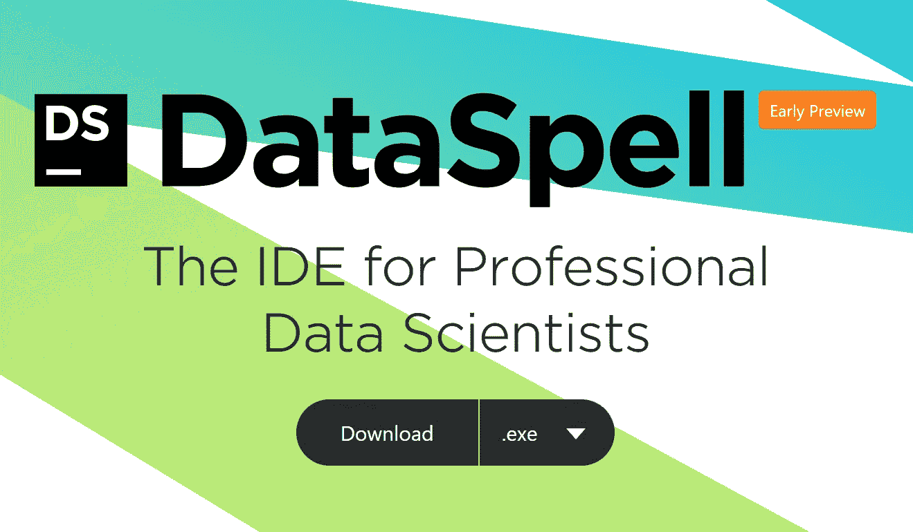
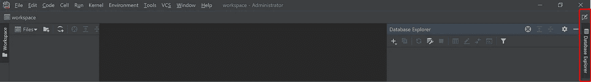
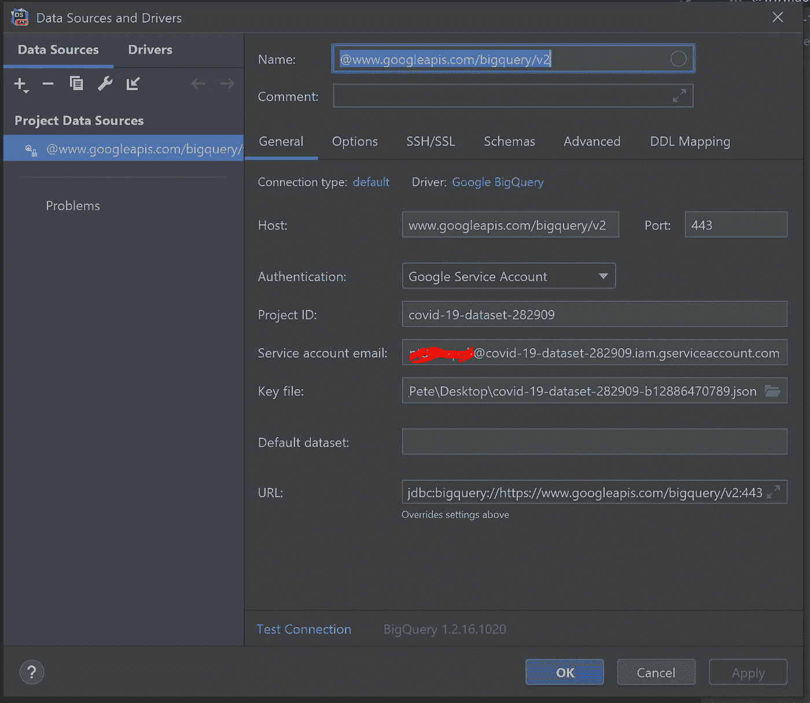
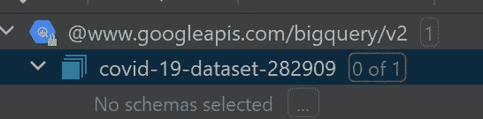
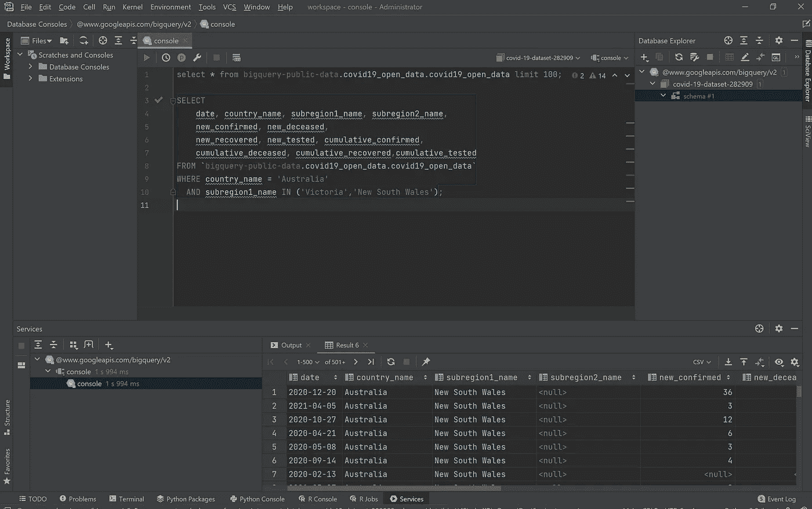

# jetbrains DataSpell——面向数据科学家的全新集成开发环境

> 原文：<https://medium.com/analytics-vidhya/jetbrains-dataspell-a-brand-new-awesome-ide-for-data-scientists-7ec5ba2c66b5?source=collection_archive---------2----------------------->

DataSpell——数据科学家的新 IDE

最近，JetBrains，深受喜爱的 PyCharm 和 IntelliJ IDEA 以及其他各种产品的制造商，发布了一些我期待已久的东西供公众试用。一个 IDE，它将我目前使用的许多工具合并到一个简单易用的包 DataSpell 中。

到目前为止，在试用期间，我已经能够基本上停止使用我作为专业数据分析师经常使用的主要工具:

*   TOAD 数据点(或 DBeaver)作为我的 SQL 编辑器
*   崇高的文本(和 Jupyter 笔记本)作为我的 python 脚本编辑器
*   源代码控制的 Git Bash

我将在三篇短文中介绍它如何在上述不同角色中发挥作用，并给出一个使用 Google BigQuery 开源新冠肺炎数据库的真实示例，从 SQL 编辑器开始，因为它是我最兴奋的 IDE 组成部分。

我在另一篇文章中介绍了这个数据集的背景和联系:

 [## 使用 BigQuery 和 DBeaver 连接到 Google 公共新冠肺炎数据集

### 如何通过 BigQuery 使用 Google BigQuery 公共数据集并将其连接到 DBeaver

medium.com](/@palien2887/connecting-to-the-google-public-covid-19-datasets-with-bigquery-and-dbeaver-d4a340051bc8) 

**数据库集成(SQL 编辑器):**

为了测试这一功能，我连接到新冠肺炎公共数据集，这很容易做到，只需打开工作区右侧的“数据库浏览器”面板，如下所示。

数据库浏览器面板

在这之后，下面的屏幕出现，你只需要下载驱动程序，输入服务帐户电子邮件地址，项目 ID 和关键文件的路径，见我上面的文章(特别是在 Google 中创建项目)为你自己的项目创建这些，或者检查 Jetbrains 自己的这个真正清晰的页面—[https://www . Jetbrains . com/help/dataspell/connect-to-big query . html # connecting-to-big query-with-a-Google-service-account](https://www.jetbrains.com/help/dataspell/connect-to-bigquery.html#connecting-to-bigquery-with-a-google-service-account)

连接屏幕—单击“测试连接”检查您的连接

在此之后，您将连接到新冠肺炎数据库，这里有一个让我有点困惑的技巧是，您的连接将出现在数据库浏览器中，但不会选择任何模式，如下所示。只需单击“0/1”并单击复选框，这将激活模式。

首次添加时，模式默认为未选中

现在，您可以打开一个新的数据库控制台来编写查询。为了测试它，我使用了我在上一个教程中使用的相同查询。您可以看到查询被很好地自动格式化，输出显示在屏幕的底部。如果同时运行多个查询，每个查询的结果将显示在单独的选项卡中。

对 BigQuery 数据运行一个简单的查询——很好的自动格式化

正如你所看到的，IDE 的数据库连接部分工作得很好，设置也很简单，我已经连接到 Redshift 用于其他用途，连接起来更加无缝。

在我的下一篇文章中，我将测试 IDE 中让我兴奋的第二部分，在 IDE 中使用 jupyter 笔记本，并且不需要打开浏览器。请点击此处查看这篇新帖子:

 [## Jetbrain DataSpell —在 ide 中使用 Jupyter 笔记本

### 在我的上一篇文章中，我介绍了 Jetbrains 的新 IDE DataSpell。我介绍了如何使用 IDE 进行直接…

medium.com](/@palien2887/jetbrain-dataspell-using-jupyter-notebooks-inside-the-ide-2698f85ff98c)