# 琼恩·雪诺和机器学习

> 原文：<https://medium.com/analytics-vidhya/jon-snow-and-machine-learning-68f79c12a574?source=collection_archive---------33----------------------->

## 我教琼恩·雪诺建立一个朴素贝叶斯分类器

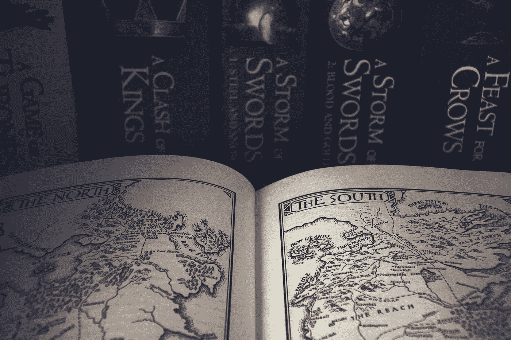

图片由 [simisi1](https://pixabay.com/users/simisi1-5920903/?utm_source=link-attribution&amp;utm_medium=referral&amp;utm_campaign=image&amp;utm_content=4180794) 来自 [Pixabay](https://pixabay.com/?utm_source=link-attribution&amp;utm_medium=referral&amp;utm_campaign=image&amp;utm_content=4180794)

欢迎来到琼恩·雪诺的埃尔康。在长城的另一边，我们有你们南方人不会相信的传统……就像我们的便利时髦的野人*朴素贝叶斯分类器*！这是一个简单的机器学习算法，可以区分类别。我，三眼乌鸦，很乐意教你如何建造一个。

在下面的文章中，我将逐步创建这个朴素贝叶斯算法，最终它将能够阅读乔治·r·r·马丁的*冰与火之歌*中的一章，并猜测该章来自哪部小说。把长爪放在门边，我们开始上课吧…

# **数据**

首先让我们看看我们正在处理的数据。我在笔记本上为每部小说创建了数据框架，每一章都有一行。它们包含章节的文本、讲述人(也称为章节的标题)、我电脑上的文件名和索引号。

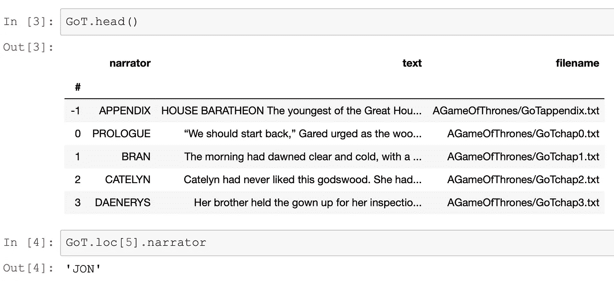

嘿！第五章是你！

# **训练和测试集**

第一项任务是创建我们的训练集和测试集。换句话说，我们会把我们的章节分成我们用来教授算法的部分，和我们用来测试算法的部分。

因为*乌鸦的盛宴*只有 46 章，并且因为我们希望所有的书都被平等地表示，我们将只使用每本书的前 46 章。让我们将前 40 章作为我们的训练集，后 6 章作为我们的测试集。

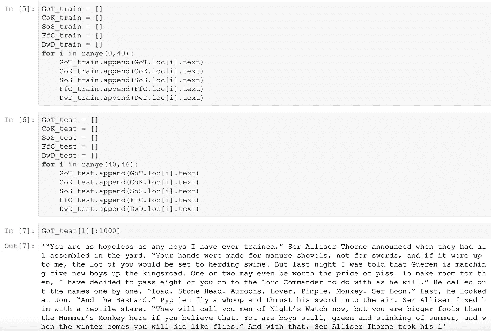

别理他，乔恩。你比艾里沙爵士更酷。

# **特性功能**

好吧，乔恩，我到目前为止？很好。现在我们需要做一个函数，可以查看一个章节，并拉出相关的*特性*。在我们的例子中，*特征*就是单词。

太好了！现在是大男孩的时候了:算法**本身。这部分我们需要一些统计数据。是时候回忆一下鲁温师傅在临冬城那些年教你的一切了。**

# **贝叶斯定理**

**第一步**:计算给定某本书某个单词的概率。例如，*乔恩*这个词出现在*权力的游戏*和*乌鸦的盛宴*中的可能性有多大？由于你在*盛宴*期间午睡，我们预计人数会更少。

我们将通过计算乔恩出现的章节数来解决这个问题。什么？？！？就这么简单？！

事实上就是这么简单。机器学习真的没有你们南方人说的那么难。

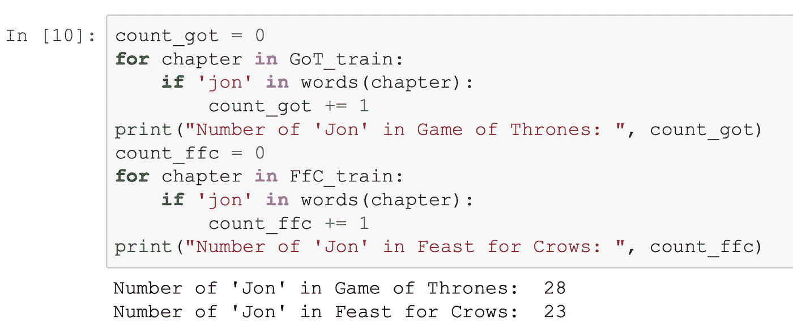

的确，在*盛宴*中少了*乔恩*。现在为了计算*乔恩*在*游戏*或者*盛宴*中出现的频率，我们简单的用总章节数除以里面有*乔恩*的章节数。

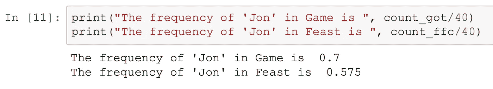

**第二步**:计算一本书给定某个单词的概率。

神奇的是。为此，我们需要一个名叫贝叶斯的人的帮助。什么？当然，乔恩，我是豪斯·贝伊斯的汤姆·贝伊斯。我不知道，他可能是从 Reach 来的。

贝叶斯提出了以下关于条件概率的定理。这个定理的证明实际上相当简单，但我不打算在这上面花时间。想知道就去查。定理本身如下:

**贝叶斯定理**

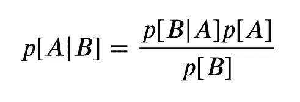

现在这个定理将让我们计算出我们拥有*权力的游戏*中的一章的概率，假设我们有单词*乔恩*。

我们知道 p[Jon|GoT]的概率。这只是乔恩给*权力的游戏*的频率。正如我们上面计算的，p[Jon|GoT] = 0.7。

我们知道 p[GoT]，它是 1/5，因为有五本书。

最后我们来到 p[乔恩]。我们实际上不知道乔恩的直接概率，但这里我们使用了一个小技巧。我们将要比较 p[GoT|Jon]的概率和 p[FfC|Jon]的概率。这两个方程在分母上有相同的 p[Jon],这些概率会相互抵消。所以在比较书籍的时候，我们可以忽略乔恩的直概率。

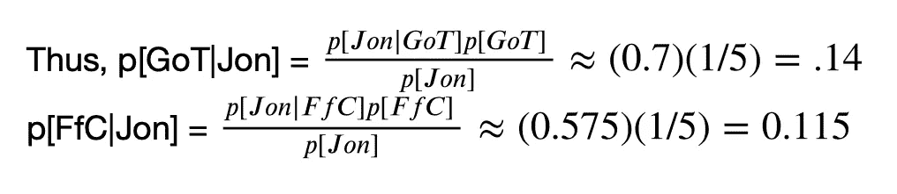

因此，如果我们知道一个章节中有单词*乔恩*，那么它有大约 14%的几率来自*游戏*，只有大约 11%的几率来自*盛宴*。(实际上这些概率更高，因为我们忽略了分母中的 p[Jon])

**第三步**:计算一本书给定*章节中所有*单词的概率。

最后，我们到达了算法的真正核心。我们不仅仅是考虑这一章中的一个单词，我们还考虑了这一章中的所有单词。希望这能给我们一个准确的猜测，这一章出自哪本书。

# **词汇**

对于下一部分，我们需要*词汇表*:每本书的单词集合，以及这个单词出现在多少章中。然后，我们将使用这些词汇来简化单词概率的计算。

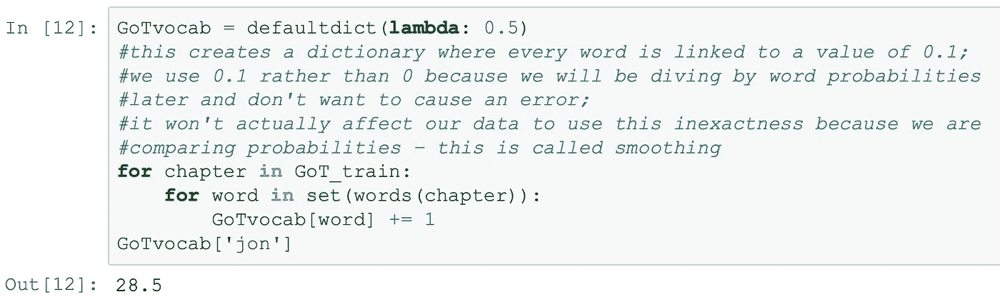

好奇 SOIAF 中最常见的单词是什么吗，亲爱的 Snow 先生？让我们来看看。

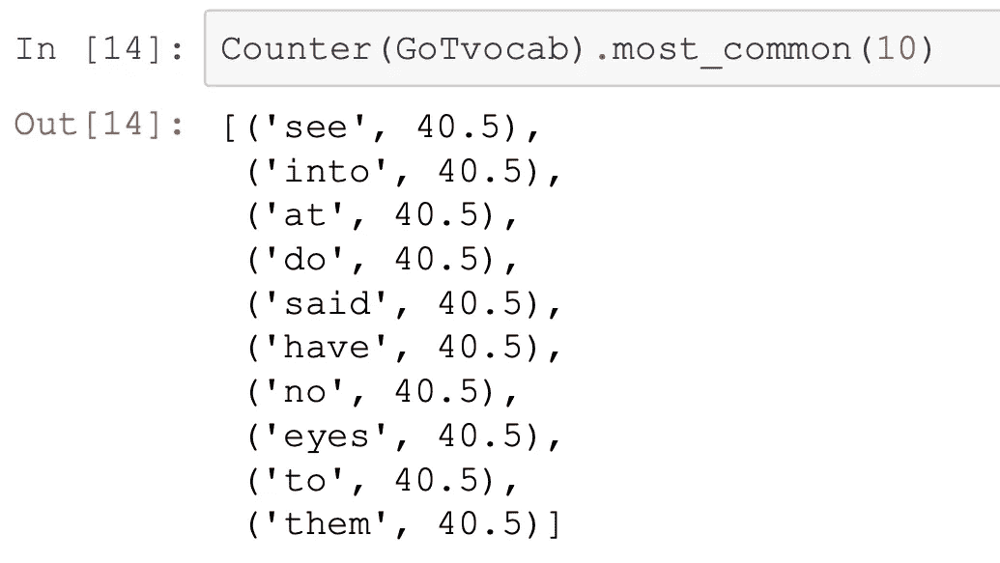

*见，入*，*于*……
耶，有道理。这些词几乎出现在每一章中。

事实上，一些最常见的单词会引起很大的噪音。为了使我们的分类器不被世界上的 *at-* s、 *do-* s 和 *the-* s 所淹没，我们应该使用只在一本书而不是另一本书中出现的词汇。这些是*辨别*单词，将我们的词汇限制在这些额外有用的单词将使算法更加准确。

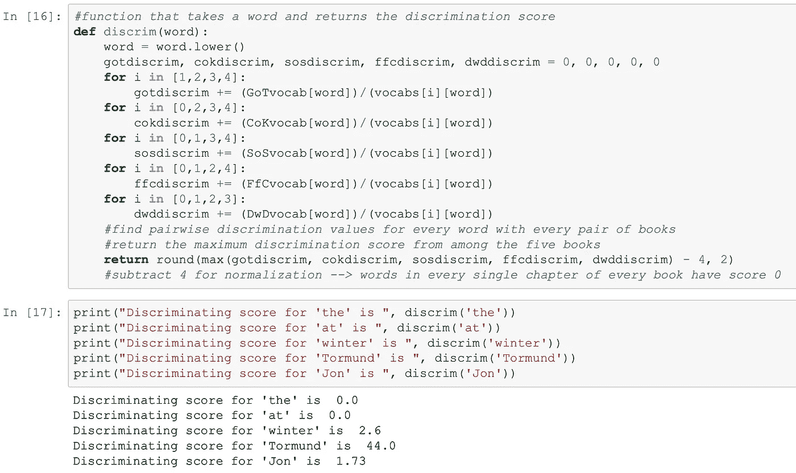

好吧，乔恩，你可能比 T21 还稀有，但我不认为你会入选我们最有辨别力的词汇名单。说到…

那些是一些有歧视性的词！我在里面看到了很多*乌鸦的盛宴*词汇——kettle black、maidenpool、duskendale、merry weather……但是我没想到会看到一个词是*而*。最重要的是！乔治·r·r·马丁的话中最有鉴别力的！

我想知道*和*在什么书里受欢迎？

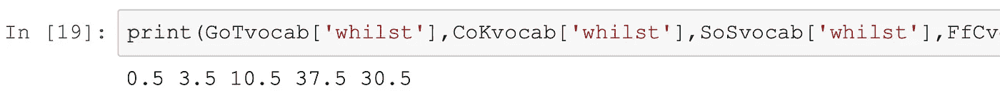

我应该猜到的。我们知道*盛宴*是一本忧郁的书，那是在我们知道它有多流行之前。

然而，严肃地说，看起来马丁在写作时已经对这个词产生了兴趣。在*权力的游戏*中根本没有这种事。这是他的写作风格随着时间的推移而发生微妙变化的一个例子吗？还是预示着冰与火之歌系列曲折蔓延的本质？

什么？你不能否认这一点，乔恩。谁知道你在长城附近徘徊了多少年。站起来和拉姆齐战斗吧。

乔恩，现在请你安静一会儿，我来创造我们的区别词汇。

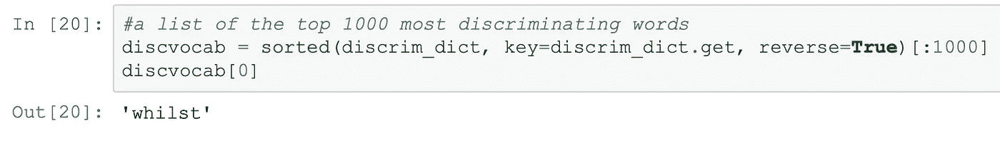

对于这一部分，我们需要做的最后一件事是创建一个函数，该函数只从《冰与火之歌》的一章中提取我们有区别的单词。

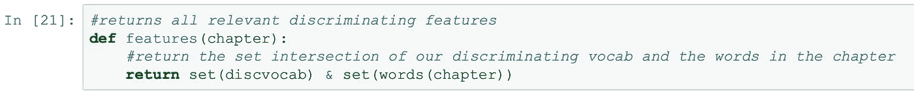

太好了！现在我们有了自己的识别词汇，我们可以深入研究贝叶斯计算。

# **算法**

对于给定的*章*，我们会给每本书打分。

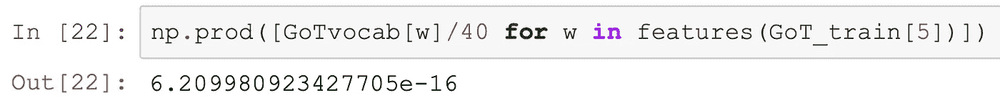

这是一个很小的数字。事实上，这是本章给出的所有单词来自《权力的游戏》一书的大概概率。使用这些概率，我们可以使用贝叶斯定理来计算给定这些单词的*权力的游戏*的概率。

跟我到目前为止？给定每本书在这一章中的单词的概率后，我们的算法只是返回概率最大的书名。

在这里。朴素贝叶斯分类器。

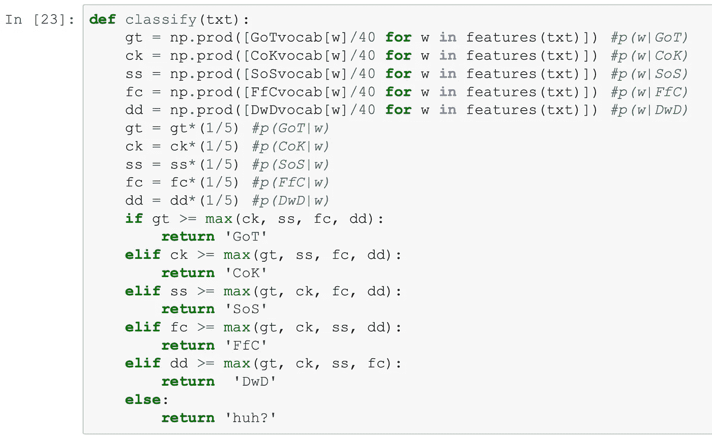

让我们测试一下她。

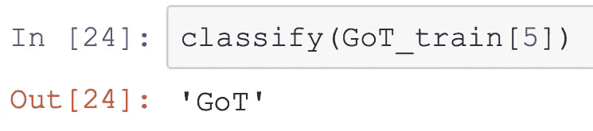

不错！它正确地确定了 GoT 训练集的第五章来自*《权力的游戏》*。测试集里的东西怎么样？

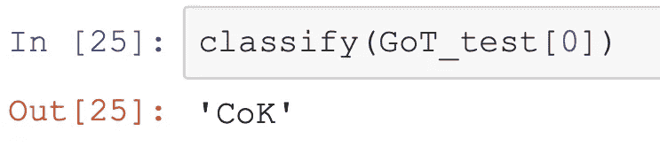

啊哦。那一次做得不太好…

# **精度**

我们有了自己的算法，剩下的唯一事情就是测试它做得有多好。下面的代码输出正确分类的测试章节的百分比。

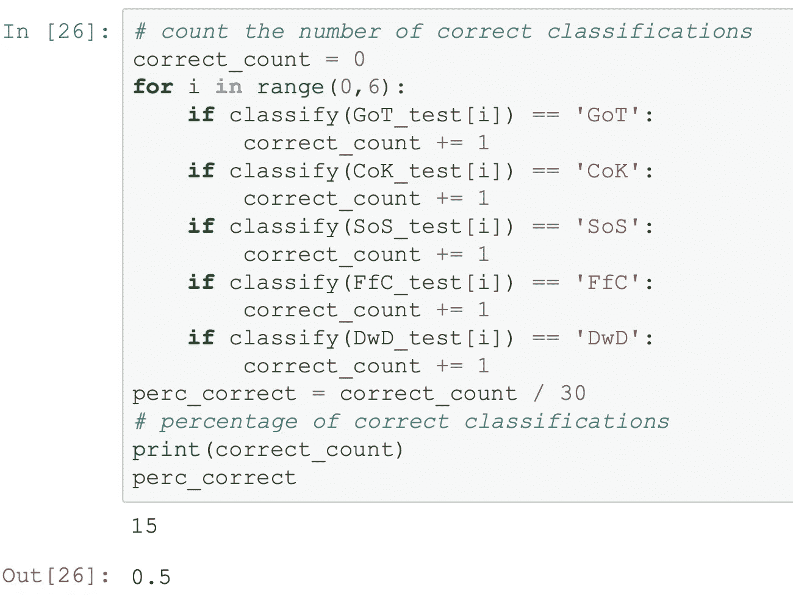

嗯……我们在 30 个章节中只答对了令人沮丧的 15 章，正好是测试集的 50%。

# **交叉验证的改进**

是的，我听到你在嘀咕。

“什么时候错了，”你问。为什么我们只获得了少得可怜的 50%的正确率？

在你更进一步之前，让我指出如果我们在五本书中随机猜测，我们只有 20%的准确率。50%不是巧合；这种准确性的大幅提高足以具有统计学意义。

是的，它可能没有杀死白鬼的匕首那么令人印象深刻，但是真的，乔恩，你没有抓住重点。这些书非常相似。乔治·r·r·马丁对他们都使用了极其相似的风格。他们大多有相同的性格。如果我们能在一个系列的*本书中获得 50%的准确率，更不用说是一个作者了……这个算法将很容易区分风格或流派。*

还要记住我们的模型是多么简单！我们可以对我们的模型做很多改进。如果我们继续构建这个算法，我们的下一个重大步骤将是添加**交叉验证**。

现在，我们的算法是基于我们提供给它的训练数据和使用我们给它的测试数据。但是如果我们选择了一组不好的章节来训练它呢？如果我们只是碰巧在《剑之风暴》的训练集中省略了所有关于奥柏伦·马泰尔的章节，然后试着在所有关于 T21·奥伯林的章节中测试它，会怎么样？你可以看到，我们的准确性非常依赖于我们选择的任意章节。

**交叉验证**说，为什么我们不在*每*章节的不同片段上训练和测试我们的算法呢？用第 1-40 章训练一次，然后用第 1-34 章和第 40-46 章，再用第 1-28 章和第 34-46 章等等。然后，我们可以平均我们的模型的准确性分数，以更好地了解算法在没有随机选择的情况下实际上是如何执行的。

…乔恩，你知道吗，我开始觉得你并没有真正理解机器学习的重要性。自动驾驶汽车！图像识别！艾丽莎。

你可以从你的朋友萨姆那里学到一些东西。你们南方人太怀疑真正的知识了。你知道吗，当我试图向你父亲展示朴素贝叶斯算法时，他对我说了一模一样的话。

…什么？你认为其他人和这个巫术有关？

你什么都不知道，琼恩·雪诺。