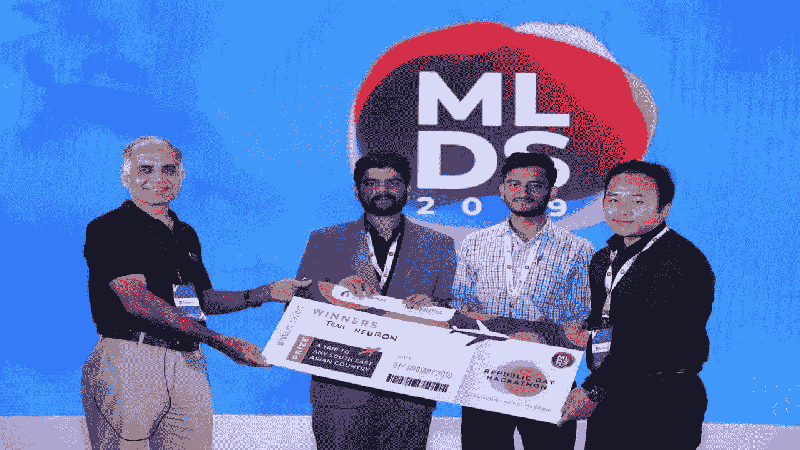
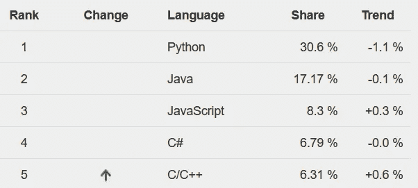
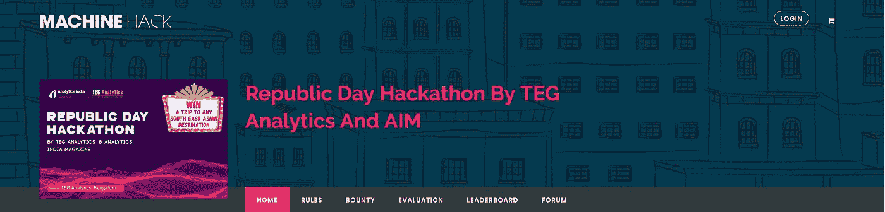
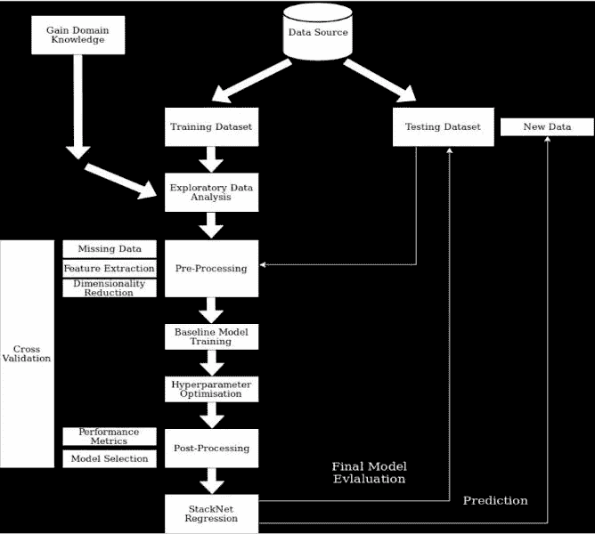
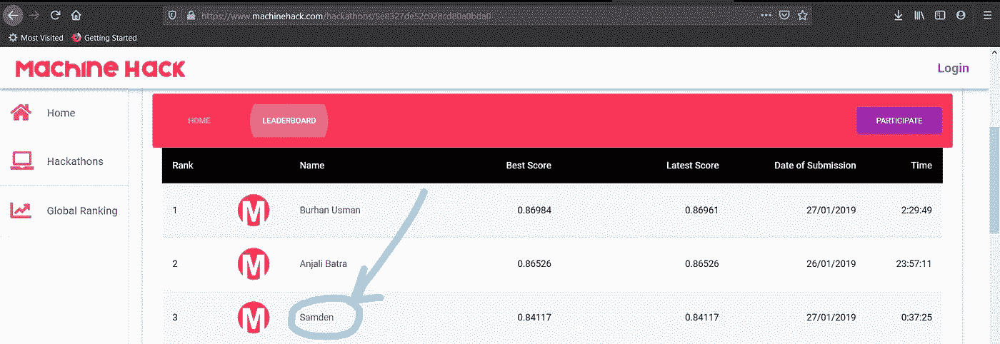
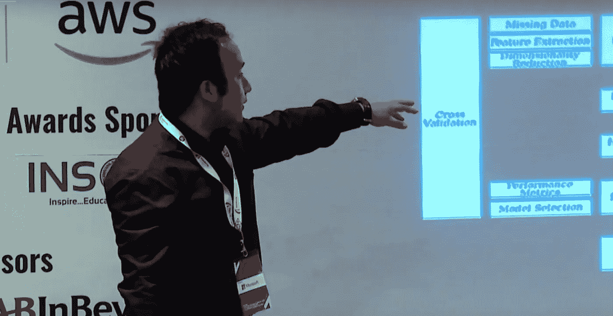
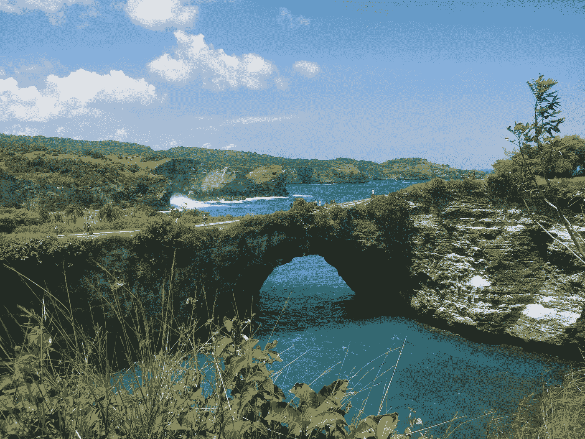

# 赢得我第一次数据科学黑客马拉松的旅程

> 原文：<https://medium.com/analytics-vidhya/journey-into-winning-my-first-data-science-hackathon-587b3d91ab50?source=collection_archive---------6----------------------->

在 2019 年机器学习开发者峰会上拍摄

在本文中，我将讲述我从对数据科学一无所知到在 6 个月后赢得数据科学黑客马拉松**的旅程。这只是我的旅程，我并不是真的推荐这条路。每个人都有自己的情况，所以更重要的是你**开始并继续**朝着你的目标努力，最重要的是你享受这个过程。我发现这句话非常适合我想表达的意思:**

> “旅程才是目的地。”丹·埃尔登

因此，在我大学二年级的时候，学长正式向我介绍了数据科学。在此之前，我听说过很多关于数据科学的知识，但从未真正花时间去认真理解它。因此，我的学长们进行了一次关于机器学习的介绍性会议，展示了一些算法和一些不同数据集上的实际例子。最后，我们得到了一个包含不同葡萄酒化学成分特征的数据集，我们必须预测或分类葡萄酒的质量，范围从 0 到 10。该数据集被广泛认为是初级 ML 数据集之一，称为[葡萄酒质量数据集](https://archive.ics.uci.edu/ml/datasets/wine+quality)。

图片来源:PYPL 编程语言普及

为了在这方面了解更多，我参加了一个关于 Python 的课程，首先让自己熟悉一种与数据科学相关的编程语言。根据 PYPL 编程语言受欢迎程度排名，截至 2021 年 6 月，Python 是最受欢迎的语言。在熟悉了这门语言之后，我想从头开始理解它的基本原理。

在网上搜索后，根据朋友的建议，我参加了著名的吴恩达机器学习课程。对于初学者和具有中级知识的人来说，这是一个了解机器学习基础的很好的课程。我强烈推荐所有的新人去看看那个课程。在这之后，为了拓宽我在深度学习方面的知识，你可能已经猜到了，我报名参加了同样由[吴恩达](https://en.wikipedia.org/wiki/Andrew_Ng)教授的[深度学习专业化](https://www.coursera.org/specializations/deep-learning)课程。一路上还有各种其他课程和教程，但这些课程脱颖而出，为我铺平了道路。

完成所有这些课程后，我和我的室友参加了几次黑客马拉松，也参与了一些项目。对于所有有志于数据科学的爱好者来说，一个早期的现实检查是，完成课程并不足以处理数据和构建具有高准确性的统计模型。在现实世界中，数据科学家花在数据准备上的时间最多，而花在使用算法上的时间只占很小一部分。根据《福布斯》的一篇文章,**数据科学家花 60%的时间清理和组织数据。**不是每个人都有机会使用最先进的机器学习算法，你可能最终只是使用原始模型，如线性或逻辑回归。

图片来源:福布斯

当我们参加这些黑客马拉松，却没有获得接近前 10%的排名，更不用说获胜了，这令人沮丧。我当时很天真，认为完成几门课程会让我有能力获得突破性的见解，或者拥有 90%以上的准确率或任何其他高指标的模型。

就在那时，我的室友在一个新开发的印度竞赛或黑客马拉松网站上发现了一个名为 [**机器黑客**](https://www.machinehack.com/) 的黑客马拉松。这次黑客马拉松的标题是**“TEG Analytics 和 AIM 举办的共和日黑客马拉松”。**

照片:机器黑客

这是一个新的开始，一个新的数据科学黑客马拉松，我们将再次尽最大努力，希望比以前的尝试更接近胜利。大奖表明，整个团队将获得一次为期 4 天 5 夜的国际旅行，前往东南亚的任何地方。如果我们这次赢了，我们已经可以看到我们可以去的不同地方了。

黑客马拉松决赛定于 1 月 28 日举行，我们有一周的时间来完成一些事情。就在周末之前有一个假期，我们打算利用我们能得到的每一个小时。

比尔·牛津在 [Unsplash](https://unsplash.com/s/photos/insurance?utm_source=unsplash&utm_medium=referral&utm_content=creditCopyText) 上的照片

由于黑客马拉松的问题陈述是**“预测医疗保险产品的市场竞争力”**或者通俗地说**“预测每个保险计划的注册人数”**，我们必须获得一些领域知识，因为我们在该领域没有任何先验知识。因此，在头两天，我们决定搜索互联网，了解什么是**“医疗保险”**。我们需要了解受益人的需求或偏好，以及医疗保险优势公司如何构建他们的计划。

一些真正好的资源有:
* Q1 医疗保险[网站](https://q1medicare.com/)
*凯泽家庭基金会[网站](https://www.kff.org/)
*显然医疗保险的官方[网站](https://www.medicare.gov/)
*以及 Deft Research [网站](https://www.deftresearch.com/)

在了解一些领域费用分摊术语后，如**、**、**、【共付额】、**、**、【共保】、**、**、【MOOP(最高自付费用)】**等，我们决定沉迷于所提供的数据集。

所提供的数据集包括三个层次的信息。计划层级信息
2。福利等级信息
3。州县一级的注册人数

我们在福利水平数据上投入了一些时间，但由于大学作业(内部考试和作业)，我们无法解码这些信息并将其转换成我们可以使用的形式。然后，我们将剩余的时间花在计划层信息(也称为景观文件)上，该文件包含人口统计信息、计划成本信息和唯一的计划标识符(也称为投标 id)。

下图展示了本次黑客马拉松的整个工作流程或方法。

照片:黑客马拉松工作流程

在执行了所有常见的数据科学流程(如 EDA)后，预处理就是建模(注:如果您想要更多技术信息和方法，可以访问我的 [GitHub repo)](https://github.com/SamdenLepcha/Predict-Market-Competitiveness-For-Insurance-Products) 。这显然是一个回归问题，我们预测的是一个连续变量，即注册人数。

经过多次迭代，我们最终使用了堆叠模型，并使用 Kaz-Anova 的 StackNet 进行了实现(他曾是 Kaggle 的最高级别特级大师)。查看他惊人的[仓库](https://github.com/kaz-Anova/StackNet)，我们使用了 H20 的 Python 实现。ai 在这里找到了[。新的堆叠模型加上他们在黑客马拉松最后一天提供的滞后变量，使我们能够在排行榜上获得前 3 名。](https://github.com/h2oai/pystacknet)

照片:哈卡森领导委员会

这意味着我们已经有资格参加即将在 2019 年机器学习开发者峰会上进行的黑客马拉松的最后阶段。我们已经排除了大部分障碍，但现在是时候进入更大的舞台了。想到现在我们不得不在数百人面前亮相，真是有点伤脑筋。尽管如此。我们尽了最大努力为这次活动做一个介绍。对任何参加数据科学黑客马拉松的人来说，一个小技巧是不要为演示留出太多时间。只有通过演示，您才能传达您的解决方案，因此也要为其分配适当的时间。到活动目的地的通勤路程很长，一路上，我们都在练习演示台词。

到达活动地点并会见了组织团队和竞争对手(第一和第二名团队)后，我们就可以进行展示了。当我们发现我们的竞争对手是一支专业数据科学家团队，而我们充其量只是几个数据科学发烧友时，我们已经失去了一些信心。然而，我们还是决定全力以赴，继续在众多观众面前展示。

演示过程中的作者图像

然后，我们等待并观看了竞争对手的演示，惊奇地发现他们并没有做任何与众不同的事情。事实上，他们的方法与我们所做的非常相似。

结果将在活动的最后一个项目中公布，在这个项目中，他们被授予来自不同公司和大学的所有杰出的数据科学人员。就在那时，他们带着一点悬念(老生常谈)宣布了黑客马拉松的获胜者。你已经可以猜到获胜者不是别人，正是我的团队**【神经元】**。标题上方的图片是接受 TEG Analytics 首席执行官奖励的团队。

你可以在我的 [Github](https://github.com/SamdenLepcha/Predict-Market-Competitiveness-For-Insurance-Products) 存储库中找到代码，在 [Youtube](https://www.youtube.com/watch?v=odrELjHvnsY&list=PL9Kc1zSa46OzbjNVPmRap4EUYx8tW2x5j&index=40) and also an [article](https://analyticsindiamag.com/how-these-data-science-enthusiasts-from-christ-university-solved-our-insurance-products-hackathon/) 上找到我们演示的视频，以及 **Analytics India Magazine** 发表的[文章](https://analyticsindiamag.com/how-these-data-science-enthusiasts-from-christ-university-solved-our-insurance-products-hackathon/)。

有了这个奖，我最终选择了巴厘岛作为我的目的地，这是一次难忘的经历。

照片由作者在巴厘岛努沙佩尼达的布罗肯海滩拍摄