# 梯度下降之旅——从局部到全球

> 原文：<https://medium.com/analytics-vidhya/journey-of-gradient-descent-from-local-to-global-c851eba3d367?source=collection_archive---------2----------------------->

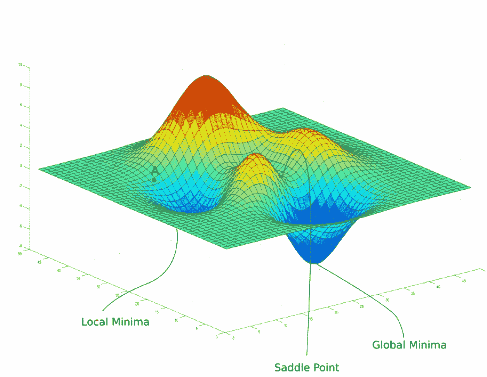

在我的上一篇文章中，我介绍了梯度下降的直觉，以及它背后的数学实现，以达到成本函数的最小值。这看起来就像走下山一样简单(是的，这就是梯度下降)。

最后一篇文章以这样一句话结束:*有时，可能会发生这样的情况，成本函数的值不是达到全局最小值，而是停留在局部最小值或鞍点。*

> 我还想给你看一些可能会破坏你热情的东西。

在深度学习中，有不同类型的成本函数，它们具有除此之外的不同形状。因此，在处理不同的成本函数时，这种简单形式的成本函数并不存在。

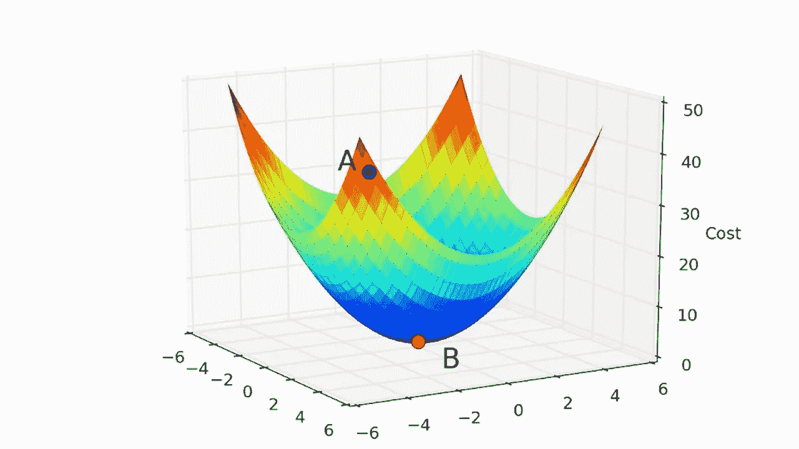

相反，它大多有许多凸面，因此看起来有点像这样:

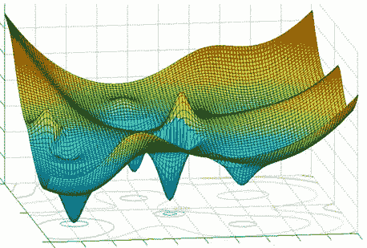

如图所示，成本函数实际上有很多局部最小值，我们需要达到全局最小值。

# 让我们开始吧。

在训练时，成本函数达到最小值是很重要的，该最小值是给出接近精确结果的全局最小值(成本函数的最低值)。但是，我们可能会陷入局部最小值(所有邻近值中的最低值)或鞍点。由于不是真正的最小值，结果可能达不到预期。

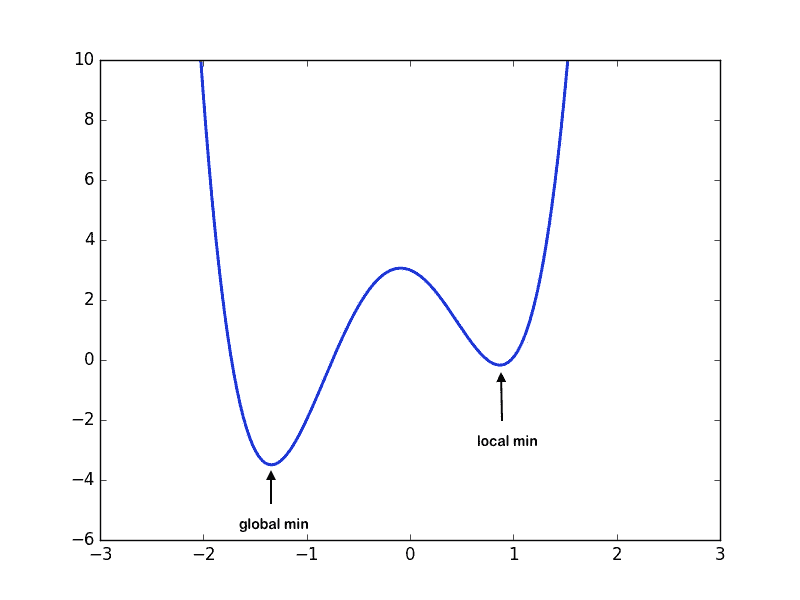

局部最小值和全局最小值

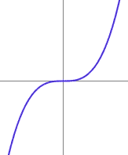

鞍点

我们不能完全避免陷入局部最小值或鞍点，但我们仍然可以使用一些技术来帮助缓解这个问题。

# 随机梯度下降(SGD)和小批量 SGD

SGD 和小批量 SGD 是梯度下降(GD)的变形版本。考虑一个具有 *n* 个示例( *n > 10* 个⁶).的数据集在 GD 中，我们考虑所有的 *n* 个点来降低代价函数，这使得该算法使用高计算能力。而在 SGD 中，在每个历元中仅使用单个( *n=1)* 数据点，并且相应地更新参数。在小批量 SGD 中，我们从样本中取出 *k* 个数据点( *k < n* )并更新我们的参数。这些选择样本*小于 n* 的方法使得算法计算友好。

在梯度下降中，代价函数的值逐渐减小，这增加了遇到局部极小值的机会，并且使得不可能走出那个点。而在 SGD 中，变化是突然的。因此，它降低了陷入局部最小值的概率，即使它陷入了，由于它的颠簸运动，它也有可能肯定会出来。

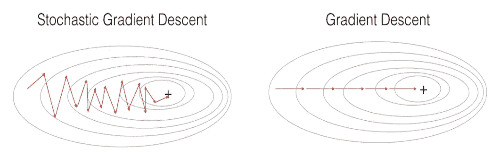

SGD 与梯度下降

# 正规化

当成本函数达到局部最小值时，更新参数的过程试图得出结论，但是我们需要防止这种情况。在这种情况下，我们惩罚大的重量。在局部最小值处，即使导数为零，由于添加了正则项，权重也保持更新。有两种类型的正则 L1(套索)和 L2(山脊)。

## L2 正则化(岭)

L2 正则化中的成本函数的等式为:

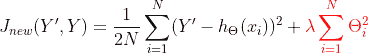

L2 正则化(岭)

## L1 正则化

L1 正则化中的成本函数的等式是:

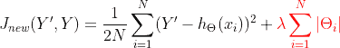

L1 正则化

这里，当 J(Y’，Y)的导数在局部最小值处为零时，正则项将惩罚成本函数，因此即使参数在局部最小值处也会被更新，而在全局最小值处，更新不会发生，因此我们可以使用*正则化*避免陷入局部最小值。

# 动力

动量只是将先前更新的权重的一部分添加到当前权重。

我们可以将权重更新等式写成如下:

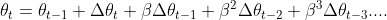

权重更新方程

这里β是动量因子，它*的范围在 0 和 1 之间(不包括 0 和 1)*它也是一个可以调节的超参数。

我在 YouTube 上发现了一个很好的势头可视化，由 [*迭戈·伊纳西奥*](https://www.youtube.com/user/diegodci) [*，*](https://www.youtube.com/channel/UChO9ZxMm1tCBqk8mrxPq-nA) *做观看。*

动量的可视化

# 改变学习率— *α*

我们可以使用*学习率*随着时间不断变化的值，而不是在整个训练过程中使用恒定的学习率。

改变学习率的方程式可以用简单的形式表示

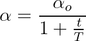

学习速率退火方程

这里 T 和 *α_o* 是可以调整的超参数。这里 *t* 可以从 *0 到 T* 变化，因此 *α* 与 *t 成反比关系。这里*的 *α* 变化，直到 *t* 碰到 *T* ，在此期间，模型被称为处于*搜索阶段*，因此，学习速率随着时间而降低，因此可以使沿着误差表面的移动更加平滑。

# 清盘

在这里，我们看到标准梯度下降可以在某种程度上进行优化，以便我们可以使用各种技术解决陷入局部最小值的问题，每种技术都增加了一个超参数供我们调整。然而，有许多算法，如 *Adam、Adagrad 和 Adadelta* ，它们往往工作得更快，但也更难实现。

这是不同算法收敛速度的一个例子。

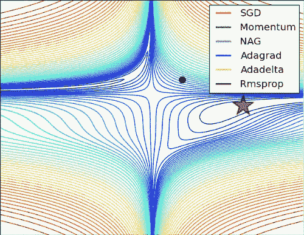

我们到此结束。

下一个故事再见。

谢了。