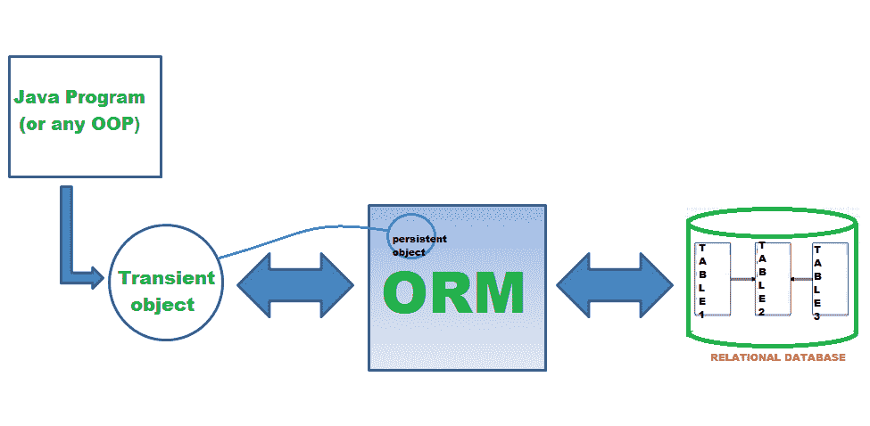

# JPA Hibernate -实体继承

> 原文：<https://medium.com/analytics-vidhya/jpa-hibernate-entity-inheritance-1f6aa7ea2eea?source=collection_archive---------1----------------------->

JPA 允许我们使用 **@Entity** 注释轻松地在数据库中创建表格。使用 Jpa，可以通过使用继承特性来创建实体。



JPA 有一些有用的继承策略:

# 1.mapped 超类

使用 **@MappedSuperclass** ，可以创建一个非实体超类，并且可以创建继承这个超类的实体子类。使用这个注释，为每个子类创建一个单独的表。但是，不会为超类本身创建表。

超级课堂:

```
**@MappedSuperclass**
public abstract class Devices { @Id
    @GeneratedValue(strategy = GenerationType.*AUTO*)
    private int id;    @Column(name="brand")
    private String brand;

    @Column(name="name")
    private String name;
```

继承类:

```
@Entity
@Table(name = "computer")
public class Computer extends Devices {
   //Any new object and field here}------------------------------------------------@Entity
@Table(name = "mobile_phone")
public class MobilePhone extends Devices{
   //Any new object and field here
}
```

# 2.单一表格

使用单一策略继承类型，您可以创建一个单一的表作为主实体。它不会为每个实体创建单独的表。我们添加了[**@鉴别值**](http://twitter.com/DiscriminatorValue) 符号来区分每个实体。如果我们不添加它，Hibernate 默认使用实体名作为区别值。这使得我们很容易创建查询。这种方法的一个缺点是，在实体表中创建了未使用的列，它们接受空值。因此，不能进行非空定义。

超级课堂:

```
**@Entity
@Inheritance(strategy = InheritanceType.SINGLE_TABLE)
@DiscriminatorColumn(name = "device")**
public abstract class Devices { @Id
    @GeneratedValue(strategy = GenerationType.*AUTO*)
    private int id;    @Column(name="brand")
    private String brand;

    @Column(name="name")
    private String name;
```

继承类:

```
@Entity
@DiscriminatorValue("computer")
public class Computer extends Devices {
   private String oS;-----------------------------------------------@Entity
@DiscriminatorValue("mobilephone")
public class MobilePhone extends Devices{
   private String color;
```

使用鉴别器值的查询示例:

设备表:id、品牌、名称、操作系统、颜色

→ **从**设备**中选择** * **，其中**设备=“计算机”

# 3.连接表

在这个策略中，为超类和子类创建单独的表。但是，超类中定义的对象不包括在子类的表中。超类的主键构成了子类的外键。另外，使用 [@PrimaryKeyJoinColumn](http://twitter.com/PrimaryKeyJoinColumn) ，我们可以为子类指定一个主键，这个主键是超类的外键。

超级课堂:

```
**@Entity
@Inheritance(strategy = InheritanceType.JOINED)**
public abstract class Devices { @Id
    @GeneratedValue(strategy = GenerationType.*AUTO*)
    private int id;

    @Column(name="brand")
    private String brand;

    @Column(name="name")
    private String name;
```

继承类:

```
@Entity
@PrimaryKeyJoinColumn(name = "computerId")
public class Computer extends Devices {
   private String oS;----------------------------------------------@Entity
@PrimaryKeyJoinColumn(name = "mobilephoneId")
public class MobilePhone extends Devices{
   private String color;
```

# 4.每类表格

该方法与 MappedSuperclass 方法非常相似，但与该方法不同的是，超类也是一个实体。这意味着还将为数据库中的超类创建一个表。这种继承结构允许我们创建与多态查询和子类的关系。但是当查询时，所有的子类都被扫描，这大大降低了性能。因此，在需要大量查询的作业中，应该避免使用这种方法。

超级课堂:

```
**@Entity
@Inheritance(strategy = InheritanceType.TABLE_PER_CLASS)**
public abstract class Devices {@Id
    @GeneratedValue(strategy = GenerationType.*AUTO*)
    private int id;

    @Column(name="brand")
    private String brand; @Column(name="name")
    private String name; @Column(name="os")
    private String oS;
```

继承类:

```
@Entity
public class Computer extends Devices {
   private String color;
```

在数据库**中，计算机**表有:ID、品牌、名称、操作系统、颜色

感谢您的阅读:)