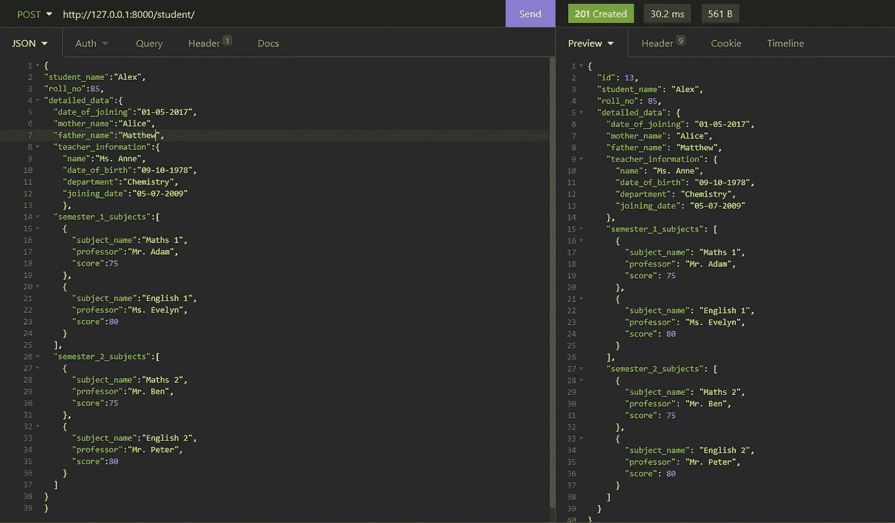

# Django Rest 框架中使用失眠症的 JSONField 模式验证

> 原文：<https://medium.com/analytics-vidhya/jsonfield-schema-validation-in-django-rest-framework-using-insomnia-a743923a5c0?source=collection_archive---------0----------------------->

在熟悉可以用来验证 DJANGO Rest 框架中 jsonfields 的方法之前，人们不禁会注意到，除了其他非 json 字段之外，在 POST-ing 中，是否包含以下内容并不重要:

1.  空的 jsonfield 或
2.  具有各种类型值的已填充 jsonfield

让我们考虑下面的例子来理解上面的内容:

models.py:

```
from django.db import modelsclass Student(models.Model):
    student_name=models.CharField(max_length=100)
    roll_no=models.IntegerField()
    detailed_data=models.JSONField()
```

serializers.py:

```
from rest_framework import serializers
from studentapp.models import Studentclass StudentSerializer(serializers.ModelSerializer):
    class Meta:
        model=Student
        fields='__all__'
```

views.py:

```
from studentapp.serializers import StudentSerializer
from rest_framework.views import APIView
from rest_framework.response import Response
from django.http import JsonResponse,HttpResponse
from rest_framework import statusclass StudentView(APIView):
    def post(self,request):
        serializer=StudentSerializer(data=request.data)
        if serializer.is_valid():
            serializer.save()
            return   Response(serializer.data,status=status.HTTP_201_CREATED)#inside if serializer.is_valid()
        return Response(serializer.errors,status=status.HTTP_400_BAD_REQUEST) #when serializer is not valid
```

urls.py

```
from django.contrib import admin
from django.urls import path,include
from studentapp.views import StudentViewurlpatterns = [ 
    path('student/',StudentView.as_view()),
]
```

从上面的学生模型中可以看出，我们有 3 个字段:一个是字符字段，另一个是整数字段，最后是 jsonfield。借助下面的截图，我们将看到开头提到的两点是如何发挥作用的。


在 JSON field“detailed _ data”中输入空值时


当将键值对输入到 out jsonfield 中时


当输入词典列表时

我们的 JSONField 字段“detailed_data”似乎没有遵循定义的结构。这就是关键词“模式”发挥作用的地方。Schema 是 JSONField 字段需要遵循的大纲或结构。如果我们在失眠中输入到“详细数据”中的数据/值符合结构(模式)，那么我们可以说“详细数据”的验证是成功的，但是，如果为“详细数据”中的字段输入的值的类型不同于模式中定义的类型，或者如果“详细数据”中的任何字段缺失；这意味着我们遇到了验证错误。让我们通过深入学生模型中的“detailed_data”字段来理解这一点。

让我们按照下面的“detailed _ data”JSON field 中的字段布局:

1.  加入日期—日期格式
2.  母亲的名字—字符类型
3.  父亲的名字—字符类型
4.  教师信息—字典包括:姓名、出生日期、部门、加入日期
5.  第一学期科目——字典列表，每个字典包括:科目名称、分数
6.  第二学期主题——另一份字典列表，其结构和子领域与第三学期相同。

鉴于上述情况，我们的目标是首先检查序列化(关于“学生姓名”和“学生编号”)是否有效(通过基本序列化检查)，然后通过与模式进行比较来检查“详细数据”内容的有效性。您可以执行以下任一操作:手动编写模式(或)使用 JSONModels。推荐使用后者，因为它可以自动生成模式，但是为了了解模式的样子，让我们来看一下这两种方法:

1.  **手动编写模式**

前面提到的布局模式如下:

```
{   "type":"object",
    "properties": {
     "date_of_joining": {"type":     "string","pattern":'^[0-9]{2}-[0-9]{2}-[0-9]{4}$'},
     "mother_name":{"type":"string"},
     "father_name":{"type":"string"},
     "teacher_information": {
                "type":"object",
                "properties":{
                   "name": {"type": "string"},
                   "date_of_birth": {"type":"string","pattern":'^[0-9]{2}-[0-9]{2}-[0-9]{4}$'},
                   "department":{"type":"string"},
                   "joining_date":{"type":"string","pattern":'^[0-9]{2}-[0-9]{2}-[0-9]{4}$'}
                        },
                 "required":["name","date_of_birth","department","joining_date"],  --(1)
                        "additionalProperties": False
                    },
     "semester_1_subjects":{
                 "type":"array",
                 "items":{
                      "type":"object",
                      "properties":{
                           "subject_name":{"type":"string"},
                           "professor":{"type":"string"},
                           "score":{"type":"integer"}
                            },
                       "required":["subject_name","professor","score"],                 --(2)
                       "additionalProperties":False
                        }
                    },
     "semester_2_subjects":{
                 "type":"array",
                 "items":{
                     "type":"object",
                     "properties":{
                         "subject_name":{"type":"string"},
                         "professor":{"type":"string"},
                         "score":{"type":"integer"}
                        },
                      "required":["subject_name","professor","score"],                --(3)
                      "additionalProperties":False
                        }
                    }
                },
                "required":["date_of_joining","mother_name","father_name","teacher_information","semester_1_subjects","semester_2_subjects"],       --(4)
                "additionalProperties":False
            }
```

在(1)中作为“必需”键的“值”的字段列表意味着必须包括那些字段(在 teacher_information 中),如果它们中的任何一个被遗漏，就会产生验证错误。这同样适用于第(2)和第(3)行。然而,( 4)处理的是场的外层。(1)、(2)和(3)处理在“教师信息”、“学期 1 _ 科目”和“学期 2 _ 科目”中包含字段的强制，(4)处理除了整体上包含上述字段之外的相同情况。

现在让我们将我们的模式包含在 views.py 中，并使用 Draft7Validator 将我们输入的内容与定义的模式进行比较。

```
import jsonschema
from jsonschema import Draft7Validatorclass StudentView(APIView):
    def post(self,request):
        data=request.data
        serializer=StudentSerializer(data=request.data)
        if serializer.is_valid():
            myschema= #insert above defined schema here
            v=Draft7Validator(myschema)
            if len(list(v.iter_errors(data["detailed_data"])))!=0:
                return Response({"error":str(list(v.iter_errors(data["detailed_data"])))})
            else:
                serializer.save()
                return Response(serializer.data,status=status.HTTP_201_CREATED)
       else:
         return Response(serializer.errors,status=status.HTTP_400_BAD_REQUEST)
```



数据发布的正确类型示例

在上面的图像中，您可以观察到所有字段的值都与模式中写入的类型完全相同，此外，完全没有丢失字段，这导致特定条目被保存，没有任何验证错误。让我们尝试在中做一些更改，看看验证错误是如何显示的。我们不要在“学期 _ 2 _ 科目”中包含第一个“教授”键-值对，对于“学期 _ 1 _ 科目”中的第二个“科目 _ 名称”也是如此。让我们为“教师信息”中的“部门”写一个整型值，为“加入日期”写一个错误的模式。


验证错误消息的显示

至此，我们已经涵盖了各种类型的验证错误。

这种方法需要我们手动编写模式，但是如果您不希望自己编写模式，而是希望有人为您代劳，该怎么办呢？这就是 JSON 模型发挥作用的地方。

**2。使用 JSON 模型**

为了能够生成前面的模式，我们需要在 models.py 中添加以下内容

```
from jsonmodels import models as m1,fieldsclass teacherField(m1.Base):
    name=fields.StringField(required=True)
    date_of_birth=fields.DateField(required=True)
    department=fields.StringField(required=True)
    joining_date=fields.DateField(required=True)class sem1Field(m1.Base):
    subject_name=fields.StringField(required=True)
    professor=fields.StringField(required=True)
    score=fields.IntField(required=True)class sem2Field(m1.Base):
    subject_name=fields.StringField(required=True)
    professor=fields.StringField(required=True)
    score=fields.IntField(required=True)class detailed_data_field(m1.Base):
    date_of_joining=fields.DateField(required=True)
    mother_name=fields.StringField(required=True)
    father_name=fields.StringField(required=True)
    teacher_information=fields.EmbeddedField(teacherField)
    semester_1_subjects=fields.EmbeddedField(sem1Field)
    semester_2_subjects=fields.EmbeddedField(sem2Field)
```

我们的新观点. py:

```
class StudentView(APIView):
    def post(self,request):
        data=request.data
        serializer=StudentSerializer(data=request.data)
        if serializer.is_valid():
            data1=detailed_data_field()
            myschema=data1.to_json_schema()
            print(myschema)
            v=Draft7Validator(myschema)
            if len(list(v.iter_errors(data["detailed_data"])))!=0:
                return Response({"error":str(list(v.iter_errors(data["detailed_data"])))})
            else:
                serializer.save()
                return Response(serializer.data,status=status.HTTP_201_CREATED)
        else:
            return Response(serializer.errors,status=status.HTTP_400_BAD_REQUEST)
```

生成的架构:

```
{
    "type": "object",
    "additionalProperties": False,
    "properties": {
        "date_of_joining": {"type": "string"},
        "father_name": {"type": "string"},
        "mother_name": {"type": "string"},
        "semester_1_subjects": {
            "type": "object",
            "additionalProperties": False,
            "properties": {
                "professor": {"type": "string"},
                "score": {"type": "number"},
                "subject_name": {"type": "string"},
            },
            "required": ["professor", "score", "subject_name"],
        },
        "semester_2_subjects": {
            "type": "object",
            "additionalProperties": False,
            "properties": {
                "professor": {"type": "string"},
                "score": {"type": "number"},
                "subject_name": {"type": "string"},
            },
            "required": ["professor", "score", "subject_name"],
        },
        "teacher_information": {
            "type": "object",
            "additionalProperties": False,
            "properties": {
                "date_of_birth": {"type": "string"},
                "department": {"type": "string"},
                "joining_date": {"type": "string"},
                "name": {"type": "string"},
            },
            "required": ["date_of_birth", "department", "joining_date", "name"],
        },
    },
    "required": ["date_of_joining", "father_name", "mother_name"],
}
```

据我所知，关于 Josn 模型必须提供的不同类型的字段，没有一个能为模式中的指定字段生成“type”:“array”。例如，当我们需要 type:array 时，我们的“学期 _1_subjects”和“学期 _2_subjects”字段在模式中有一个 type:object。让我们将第一种方法模式中的学期 1 科目部分与上面模式中的进行比较

```
# FROM NEW SCHEMA "semester_1_subjects": {
            "type": "object",
            "additionalProperties": False,
            "properties": {
                "professor": {"type": "string"},
                "score": {"type": "number"},
                "subject_name": {"type": "string"},
            },
            "required": ["professor", "score", "subject_name"],
        }#FROM OLDER SCHEMA"semester_1_subjects":{
            "type":"array",
            "items":{
                    "type":"object",
                    "properties":{
                           "subject_name":{"type":"string"},
                           "professor":{"type":"string"},
                           "score":{"type":"integer"}
                            },
                    "required":["subject_name","professor","score"],                 
                    "additionalProperties":False
                        }
                    }
```

我们需要使学期 _ 1 _ 科目的新模式看起来像旧的模式。学期 _ 2 _ 科目字段也是如此。为此，我们在视图中做了一些更改，以便稍微操作新的自动生成的模式，使其看起来像旧的模式。在新的模式中，我们可以看到最后一个“必填”字段中没有“学期 _ 1 _ 科目”、“学期 _ 2 _ 科目”和“教师 _ 信息”，并且与日期相关的字段没有任何约束，如格式等。，它只有“类型”:“字符串”。让我们通过在 JSON 模型的帮助下对交给我们的模式进行操作来纠正所有这些问题。

我们的更新视图. py:

```
class StudentView(APIView):
    def post(self,request):
        data=request.data
        serializer=StudentSerializer(data=request.data)
        if serializer.is_valid():
            data1=detailed_data_field()
            myschema=data1.to_json_schema()
            myfields=['semester_1_subjects','semester_2_subjects']
            for i in myfields:
                d={}
                d["items"]=myschema["properties"][i]
                myschema["properties"][i]=d
                myschema["properties"][i]["type"]="array"
                 #end of loop
myschema["required"].extend(["teacher_information","semester_1_subjects","semester_2_subjects"])
            myschema["properties"]["date_of_joining"]["pattern"]='^[0-9]{4}-[0-9]{2}-[0-9]{2}T[0-9]{2}:[0-9]{2}:[0-9]{2}.[0-9]{6}$'
            myschema["properties"]["teacher_information"]["date_of_birth"]='^[0-9]{4}-[0-9]{2}-[0-9]{2}T[0-9]{2}:[0-9]{2}:[0-9]{2}.[0-9]{6}$'
            v=Draft7Validator(myschema)
            if len(list(v.iter_errors(data["detailed_data"])))!=0:
                return Response({"error":str(list(v.iter_errors(data["detailed_data"])))})
            else:
                serializer.save()
                return Response(serializer.data,status=status.HTTP_201_CREATED)
        else:
            return Response(serializer.errors,status=status.HTTP_400_BAD_REQUEST)
```

现在，让我们像以前一样检查无效的值输入和字段缺失，以检查有效性验证。


它工作得很好！jsonmodels 中可能有字段，它将嵌入式字段与一个特性结合起来，构成了一个“类型”:“数组”，但就我目前所知，没有任何字段。如果有什么有助于实现同样的目标，请在评论区告诉我们吧！