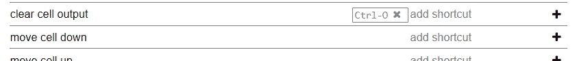
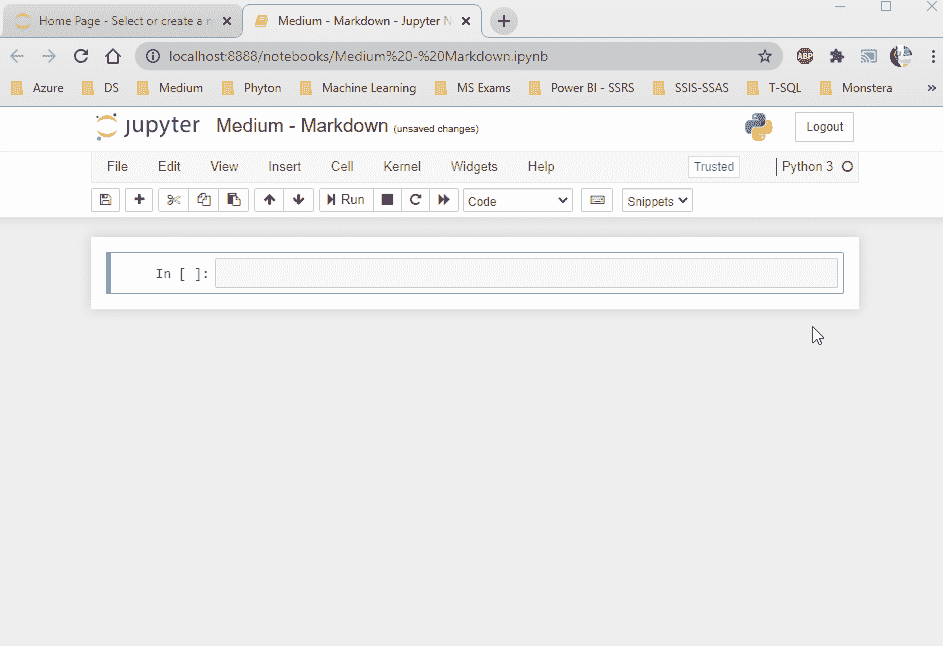

# Jupyter 笔记本提示和技巧

> 原文：<https://medium.com/analytics-vidhya/jupyter-notebook-tips-and-tricks-e9a1c0555512?source=collection_archive---------20----------------------->

Jupyter Notebook 是一个开源工具，为开发数据科学项目提供了一个交互式环境。

此外，它为初学者和讲师提供了一个非常易于使用的环境，因为你可以将它们分成标题，做简短的笔记和添加视觉效果。


首先，我们需要安装 Python 和 Anaconda 来使用 Jupyter Notebook。

通过[链接](https://www.python.org/downloads/)，我们可以访问 Python 版本。上一期用的最多的版本是 3.8.6。现在使用这个版本来找到你在互联网上所有常见问题的答案似乎是正确的。

我们可以通过安装 [Anaconda](https://www.anaconda.com/products/individual) 来访问 Jupyter 笔记本，它将成为我们的公路朋友。


照片由[内特·格兰特](https://unsplash.com/@nateggrant?utm_source=medium&utm_medium=referral)在 [Unsplash](https://unsplash.com?utm_source=medium&utm_medium=referral) 拍摄

因为我们可以很容易地从我们许多朋友的博客页面上获得关于安装的必要细节，所以我的目标是只分享信息以便简单有效地使用。为此，我们可以直接进入提示。

让我们从第一个好奇的话题开始。

> **快捷键**

我们可以从“代码”下拉区域旁边的键盘图标中看到快捷键列表。

你可以在下面找到最需要的快捷方式。您可以访问 [Edureka 备忘单](https://www.edureka.co/blog/wp-content/uploads/2018/10/Jupyter_Notebook_CheatSheet_Edureka.pdf)上的详细信息。


[Florian Krumm](https://unsplash.com/@floriankrumm?utm_source=medium&utm_medium=referral) 在 [Unsplash](https://unsplash.com?utm_source=medium&utm_medium=referral) 上拍摄的照片

Tab:它会显示一些选项，您可以通过这些选项来完成代码。

Shift + Tab:显示函数的工具提示。

Ctrl + /:转换为注释行。

m:将单元格变成降价块。

y:将单元格变成代码块。

dd:它删除了单元格。

a:在块的顶部添加新的单元格。

b:在块下添加新的单元格。

**要创建一个非默认快捷键**，我们按照菜单中**帮助—编辑键盘快捷键**的步骤操作。

例如，我们可以添加**清除单元格输出的**快捷方式



> **扩展**

最有用的函数来自 [Enes POLAT](https://medium.com/u/f92e14fec649?source=post_page-----e9a1c0555512--------------------------------) 的文章中提到的 **nbextensions** 插件，我在参考资料中分享了它的链接。

我建议您访问该页面，以便能够安装并检查**片段**的使用，该片段允许**对 markdown 或代码字段**进行分组，调用自动代码，如向导、**代码运行时**，这是每个程序员都应该收到的信息，以及包含更多内容的插件。

> **降价**

默认情况下，每一个新行都是一个代码块。我们可以通过使用快捷键(m)或代码弹出字段将活动行转换为 Markdown 来创建换行符和标题。

在使用时，您可以在[降价备忘单上查看其所有功能。](https://www.markdownguide.org/cheat-sheet)



> **在 Jupyter 笔记本中安装 Pip**

我们使用 pip 和 pip3 命令在我们的计算机上的 PyPI 站点上安装 Python 包。

我们可以通过打开终端(Anaconda 命令)并键入“python -m pip install packagename”来进行安装。但是，对于像我这样懒得打开新页面又不喜欢终端的朋友来说，这根本不是一个容易的办法:)

如果您正在使用 JupyterLab，您可以打开它旁边的 Shell 选项卡并开始工作。在 Jupyter Notebook 中，我们可以在以**(!)感叹号**。
例如，当我们想下载“请求”包时，

```
!pip3 install requests
```

对于旧版本，

```
import sys
!{sys.executable} -m pip install requests
```

**然而**，由于我们在这里下载的包而创建的输出行可以填满整个页面。这将是一个非常实际的使用包装的大小，我们粗略估计，不会带来很多行。

> **使用缓存**

假设您正在一个不稳定的服务器上工作，或者如果被立即中断对您来说意味着巨大的时间浪费，您可以使用 joblib 保存模型并工作，而不需要重新培训，以便不浪费所有的工作。

```
**from** sklearn.externals.joblib **import** Memory
memory = Memory(cachedir='/tmp', verbose=0)@memory.cache
**def** computation(p1, p2):
    ...
```

> **在第一个单元格中执行所有导入操作**

当您不想重新运行所有代码块并且不得不重新启动内核时，在笔记本的第一个单元中执行所有导入是一种救命的方法。

源文章:

[](https://towardsdatascience.com/three-great-additions-for-your-jupyter-notebooks-cd7373b00e96) [## Jupyter 笔记本的 3 大新增功能

### 我找到的最有用的扩展。不要错过这个。

towardsdatascience.com](https://towardsdatascience.com/three-great-additions-for-your-jupyter-notebooks-cd7373b00e96) [](/@r_kierzkowski/10-tips-on-using-jupyter-notebook-abc0ba7028a4) [## 使用 Jupyter 笔记本的 10 个技巧

### Jupyter Notebook(又名 iPython Notebook)是一款出色的编码工具。这是做重复性研究的理想选择。这里…

medium.com](/@r_kierzkowski/10-tips-on-using-jupyter-notebook-abc0ba7028a4) [](/@enespolat/jupyter-notebook-için-3-önemli-eklenti-96aec550b53d) [## Jupyter 笔记本电脑

### 用标题对代码进行分组，调用自动代码，并查看代码块的运行时间-好吧

我是 medium.com](/@enespolat/jupyter-notebook-için-3-önemli-eklenti-96aec550b53d)