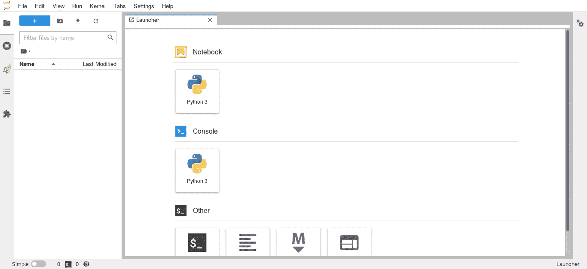
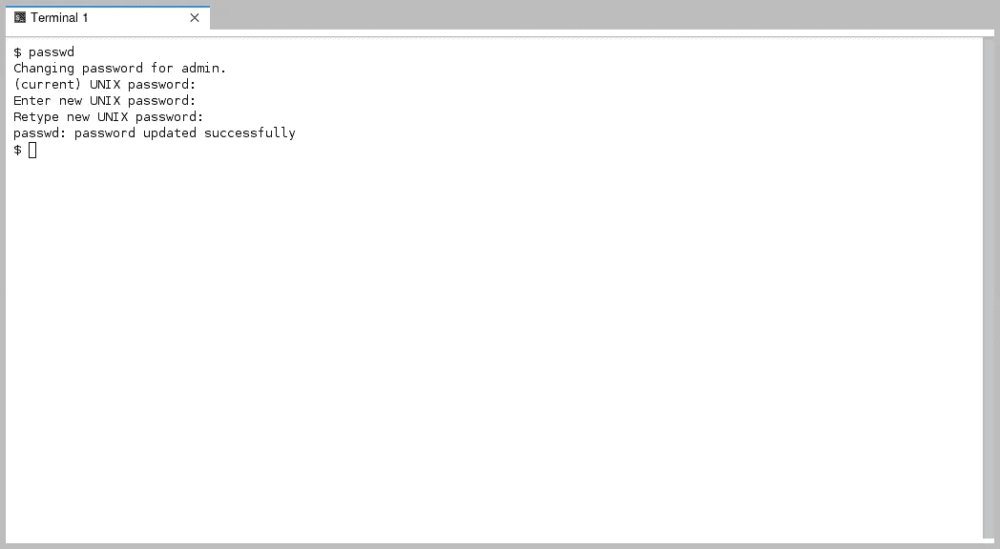

# JupyterHub 码头工人

> 原文：<https://medium.com/analytics-vidhya/jupyterhub-docker-31b7a3469872?source=collection_archive---------7----------------------->


[**JupyterHub**](https://jupyter.org/hub) 允许用户组使用**笔记本**的功能。您将能够通过中央服务器为多用户创建带有 JupyterHub 的容器和库，如 [Pandas](https://pandas.pydata.org/) 、 [Scipy](https://www.scipy.org/) 、 [matplotlib](https://matplotlib.org/stable/index.html) 和 [Dask](https://dask.org/) 。

[**JupyterHub Docker**](https://hub.docker.com/repository/docker/rancavil/jupyterhub-docker)是一个使用 JupyterHub 服务器创建环境的映像，用于与团队或用户组共享 IT 资源和笔记本 env。

JupyterHub Docker 将为每一位用户提供一个拥有 [**JupyterLab**](https://jupyterlab.readthedocs.io/en/latest/) (下一代笔记本界面)的环境。

## 创建容器

```
$ docker pull **rancavil/jupyterhub-docker**
$ docker run -d --name **<your-container-name>** -p 8000:8000 rancavil/jupyterhub-docker
```

你必须设置 **<你的容器名称>** 。

您可以使用以下内容进行检查:

```
CONTAINER ID        IMAGE                        COMMAND                  CREATED             STATUS              PORTS                    NAMES
ef7a357fbf58        rancavil/jupyterhub-docker   "jupyterhub --ip=0.0."   24 seconds ago      Up 3 seconds        **0.0.0.0:8000**->**8000**/tcp   **<your-container-name>**
```

转到您的浏览器:

```
http://**<server-name-or-ip>**:8000
```

你得用你自己的 **<服务器名或者 ip >** 。


现在，您可以使用以下凭证进入

```
username: **admin**
password: **change.it!**
```

**重要提示:**您必须更改密码默认值。

你马上就会看到，我们如何进入 [**JupyterLab**](https://jupyterlab.readthedocs.io/en/latest/) 环境。



**重要提示:**您必须使用**终端**选项更改默认密码(转到**文件- >新建- >终端**)或转到图标:


并在终端内部使用 Linux 命令 **passwd** :



你必须把当前密码( **change.it！**)，并输入您的新密码。一旦密码被更改，只需使用十字关闭**终端窗口**。

JupyterHub 的所有用户都是在容器中创建的 Linux 用户。 [**JupyterHub Docker 创建新用户，如何添加新用户**](https://rancavil.medium.com/jupyterhub-docker-how-to-add-new-users-d41f6b39ec30) 。

现在，您已经准备好在中心环境 JupyterHub 中使用 JupyterLab 了。