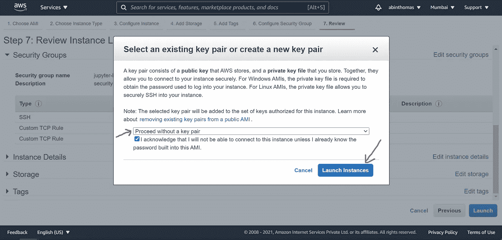
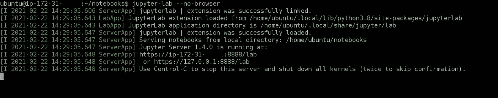

# AWS EC2 上的 JupyterLab

> 原文：<https://medium.com/analytics-vidhya/jupyterlab-on-aws-ec2-d6b2cb945e54?source=collection_archive---------3----------------------->

## 在 AWS EC2 机器上设置和运行 JupyterLab 的详细步骤。


图片来自维基百科([左](https://en.wikipedia.org/wiki/Amazon_Elastic_Compute_Cloud) ) ( [右](https://en.wikipedia.org/wiki/Project_Jupyter))

本教程记录了从 AWS EC2 提供 JupyterLab 所需的步骤。这对于运行需要连续网络访问的程序特别有用，比如网络抓取。我个人经常使用这种设置来测试和调试日内交易算法。

[JupyterLab](https://jupyter.org/) 是一个基于 web 的 Python IDE(交互式开发环境)。EC2 是亚马逊提供的一项服务，在云上提供虚拟机。

***注意:-*** *为了完整和简洁起见，常见的做法如 SSH 密钥设置、虚拟环境创建等。不包括在本教程中。*

## 启动 EC2 实例并连接

1.  从[这里](https://aws.amazon.com/)创建一个 AWS 账户(或登录到现有账户)。
2.  转到*服务*下的 *EC2* ，然后点击*实例*。


作者图片


作者图片

3.点击*启动实例*。


作者图片

4.选择 *Ubuntu Server 20.04 (64 位)。(或任何其他 Linux 发行版)*


作者图片

5.选择 *t2.micro (* [*或根据项目需求选择不同的实例类型*](https://aws.amazon.com/ec2/instance-types/) *)* ，然后转到安全组配置。


作者图片

6.为 JupyterLab 服务添加具有以下参数的入站规则。

```
╔═════════════════╦══════════╦════════════╦═══════════════════════╗
║      Type       ║ Protocol ║ Port Range ║       Source          ║
╠═════════════════╬══════════╬════════════╬═══════════════════════╣
║ Custom TCP Rule ║   TCP    ║    8888    ║ Custom 0.0.0.0/0,::/0 ║
╚═════════════════╩══════════╩════════════╩═══════════════════════╝
```

点击*查看并启动*。


作者图片


作者图片

7.选择*在没有密钥对的情况下继续*，然后点击*启动实例*。



作者图片

实例现在准备就绪。

8.转到 running instances 部分，并在它启动并运行时连接到它。


作者图片


作者图片


作者图片

## 安装 pip 和 JupyterLab

Ubuntu Server 20.04 LTS 版包含 Python 3。运行以下命令来安装 pip3。 [pip](https://pypi.org/project/pip/) 是用 python 写的包管理器。*(此时可以选择安装*[*conda*](https://www.anaconda.com/)*并创建一个环境)*

```
sudo apt update
sudo apt install python3-pip
```

使用 pip3 安装 JupyterLab。

```
pip3 install jupyterlab
```

*注意:-建议在安装 JupyterLab 后关闭并重新连接到服务器，因为某些命令可能无法运行，除非您重新启动终端。*

## 用密码保护 JupyterLab

由于 IDE 可以公开访问，因此最好用密码来保护它。使用 IPython 准备密码哈希。

```
ipythonfrom IPython.lib import passwd
passwd()quit()
```


作者图片

为了避免发送未加密的密码，让我们使用 SSL。创建自签名证书，并使当前用户成为文件所有者。

```
mkdir certs
cd certssudo openssl req -x509 -nodes -days 365 -newkey rsa:2048 -keyout mycert.pem -out mycert.pemsudo chown $USER:$USER mycert.pemcd ..
```

生成 jupyter 服务器配置文件，并使用密码哈希和证书路径对其进行更新。

```
jupyter server --generate-config
nano .jupyter/jupyter_server_config.py
```

如下所示更新配置文件。

```
c = get_config()
c.ServerApp.certfile = u'/home/ubuntu/certs/mycert.pem'
c.ServerApp.ip = '*'
c.ServerApp.password = u'sha1:e261d4617d68:3d1a307b7bcc279a6ac72b4dd5fb5a067c52b3c8'
c.ServerApp.port = 8888
```


作者图片

用您的密码哈希替换密码，如果不同，更新 SSL 证书路径。

按下`ctrl-x` 按下`y` 按下`Enter`

## 运行 JupyterLab

为了在 SSH 连接断开时保持 jupyter 服务器进程运行，该进程应该在[终端多路复用器](https://en.wikipedia.org/wiki/Terminal_multiplexer)中启动。为此，让我们使用一个简单的多路复用器 [GNU 屏幕](https://www.gnu.org/software/screen/)。大多数 Linux 发行版都预装了 GNU Screen。

只需键入`screen`即可开始新的会话。

```
screen
```

现在在无浏览器模式下启动 jupyter 进程。

```
jupyter-lab --no-browser
```



IDE 将可以在`https://<public-ip>:8888`访问。实例的公共 IP 地址可以在实例摘要页面上找到。浏览器可能会发出有关自签名证书的警告，这可以忽略。


按`ctrl-a ctrl-d`脱离屏幕会话

运行`screen -r`重新连接到会话。

如果我犯了什么错误，请留下评论。希望这有所帮助！