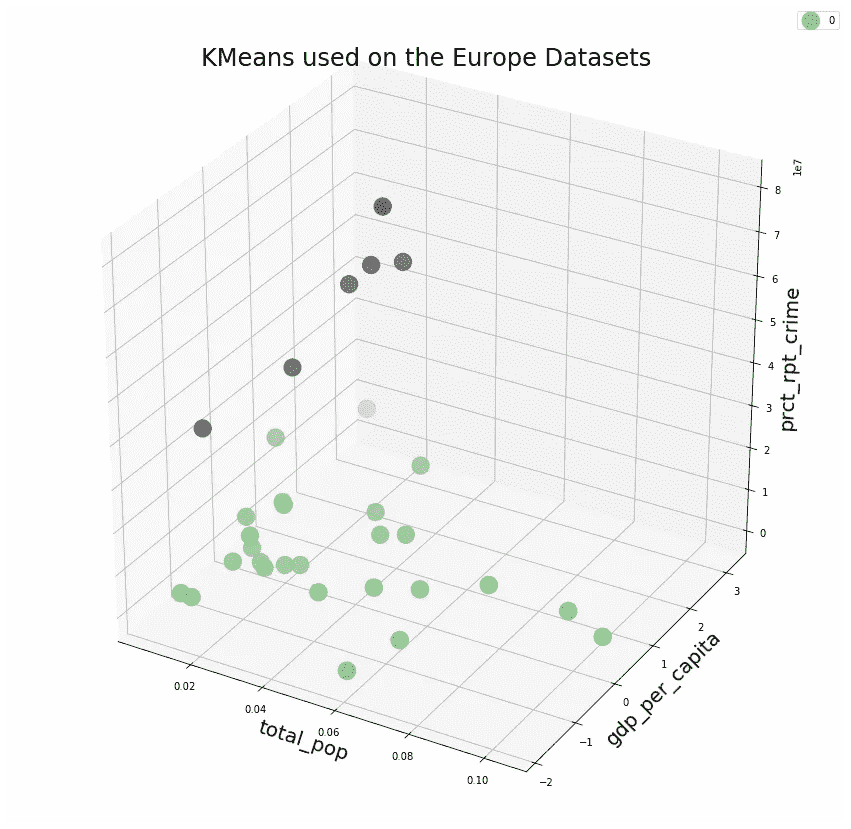
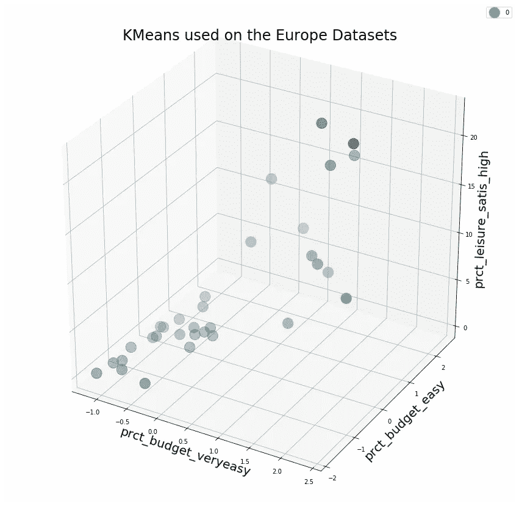

# K-均值的特征选择

> 原文：<https://medium.com/analytics-vidhya/k-means-algorithm-in-4-parts-4-4-42bc6c781e46?source=collection_archive---------0----------------------->


照片由[edu·格兰德](https://unsplash.com/@edgr?utm_source=medium&utm_medium=referral)在 [Unsplash](https://unsplash.com?utm_source=medium&utm_medium=referral) 上拍摄

当我们处理高维数据集时，我们可能会遇到聚类方法的问题。特征选择是监督学习的一种众所周知的技术，但对于非监督学习(如聚类)方法来说却很少。这里我们将开发一个相对简单的贪婪算法来对 Kaggle 上的[欧洲数据集](https://www.kaggle.com/roshansharma/europe-datasets)执行变量选择。

该算法将具有以下步骤:

0.确保变量是数值型的且经过缩放，例如使用 StandardScaler()及其 fit_transform()方法

1.  选择要保留的最大变量( *maxvars* )，最小和最大聚类数( *kmin* 和 *kmax* )并创建一个空列表: *selected_variables* 。
2.  从 kmin 到 kmax 循环。然后，依次使用每个变量，使用 K-Means 记录变量和聚类数的每个组合的轮廓值(从 kmin 到 kmax)。
3.  选择给出最大轮廓值的变量，将其添加到 *selected_variables* 中，并将其从测试变量列表中移除。
4.  通过使用 *selected_variables* 列表并依次添加每个剩余变量，重复 2 和 3 中的过程，直到达到某个停止标准(在这种情况下是要保留的变量数量， *maxvars* )。

因此，对于第一步，我们定义和初始化一些变量。

```
maxvars=3
kmin=2
kmax=8kmeans_kwargs = {"init": "random","n_init": 20,"max_iter": 1000,"random_state": 1984}
cut_off=0.5# We also define a cols variables containing a list of all features:
cols=list(df.columns) # We also set a list and a dictionary to store the silhouette values
# for each number of clusters tested so we can choose the k value
# maximising the silhouette score, with its corresponding featuresresults_for_each_k=[]
vars_for_each_k={}
```

然后，我们创建三个嵌套循环，外部的一个循环遍历集群数量 *k* 的值。然后我们有一个 while 循环来检查保留变量的数量是否低于由 *maxvars* 设置的阈值。*选择变量*列表将保存保留的特征名称。*结果*列表将保存每个变量的轮廓值。

```
for k in range(kmin,kmax+1):
    selected_variables=[]
    while(len(selected_variables)<maxvars):
        results=[] selected_variables=[]
    print(k)
    while(len(selected_variables)<maxvars):
        results=[]
```

内部循环逐一检查所有特征，将它们添加到已选择的变量中(如果有)，并评估轮廓值。然后，它选择获得最高值的变量，并将其添加到 *selected_variables* 列表中。

```
for col in cols:
            scols=[]
            scols.extend(selected_variables)
            scols.append(col) 
            kmeans = KMeans(n_clusters=k, **kmeans_kwargs)
            kmeans.fit(df[scols])
            results.append(silhouette_score(df[scols],   kmeans.predict(s)))# We identify the best variable, add it to our list and remove it 
# from the list of variables to be tested on the next iteration
        selected_var=cols[np.argmax(results)]
        selected_variables.append(selected_var)
        cols.remove(selected_var)
```

然后，我们可以在我们的循环中更新这个特定 k 值的变量列表和分数。

```
results_for_each_k.append(max(results))
vars_for_each_k[k]=selected_variables
```

最后，在三个循环运行之后，我们可以确定 k 和变量的最佳组合，拟合模型并绘制它。

```
best_k=np.argmax(results_for_each_k)+kmin
selected_variables=vars_for_each_k[best_k]
kmeans = KMeans(n_clusters=best_k, **kmeans_kwargs)
kmeans.fit(df_[selected_variables])
clusters=kmeans.predict(df[selected_variables])
```



基于人口、财富和犯罪率的 2 组国家的最终结果

如果我们选择 3 个集群，我们会得到不同的选择



对于 3 个集群，我们有不同的变量选择

每组国家的一些例子:

冰岛、瑞士、比利时、德国、卢森堡、荷兰、奥地利和英国

**集群 2:** 希腊、西班牙、法国、克罗地亚、意大利、塞浦路斯、拉脱维亚、立陶宛、匈牙利、马耳他、波兰、葡萄牙

**第三组:**挪威、丹麦、芬兰和瑞典

这是完整的代码，包括 3d 绘图。

当然，我们可以将变量选择与受约束的 K-Means 算法相结合，以强制均匀聚类，如前面的[和](https://fmarthoz.medium.com/k-means-algorithm-in-4-parts-6f44dc21d119)所示。