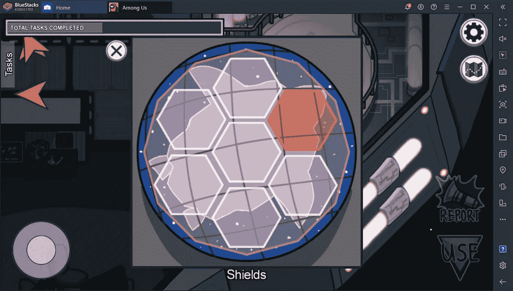
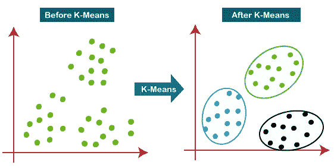
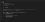
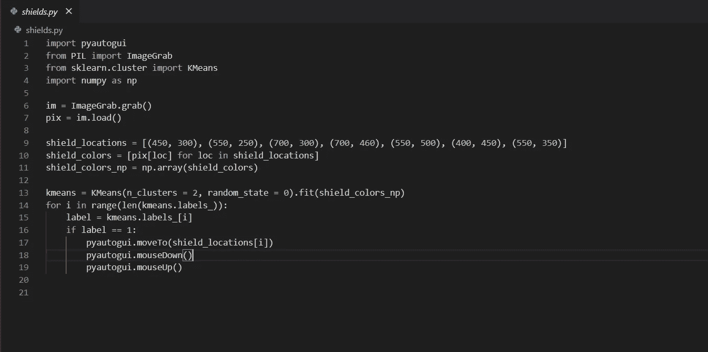
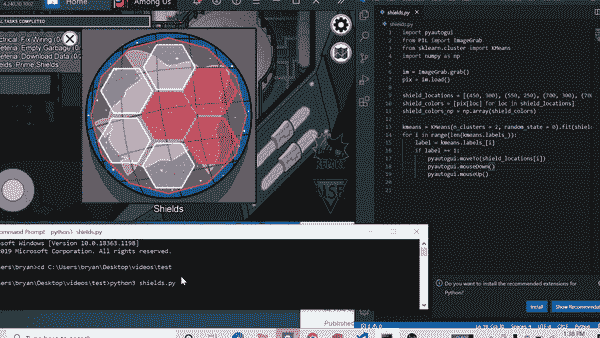

# 意思是在我们中间

> 原文：<https://medium.com/analytics-vidhya/k-means-algorithm-in-f09045c87be9?source=collection_archive---------31----------------------->

使用 k-means 算法解决主护盾任务。

通过在电气中的电线任务和在屏蔽室中的屏蔽任务，我意识到在游戏中的任务，在我们当中，是多么容易被自动化。在我们当中有一个团队合作和背叛的多人游戏，在这个游戏中，船员必须在被冒名顶替者屠杀之前完成任务。任务可能需要几秒到一分多钟才能完成。我认为这些任务自动化是一个挑战。

但并不是所有的任务都是简单的点击。

有些任务，比如下载或上传文件，需要简单地点击下载按钮，这在编程上并不具有挑战性。其他任务，如清理滑槽或做电线可能需要图像处理和鼠标动作自动化。但是最具挑战性的自动化任务需要数据科学。

数据科学能够从数据中得出结论。

有一个任务叫做“主护盾”，在这个任务中，船员必须修复用红色突出显示的护盾。但我们怎么知道哪个护盾受损了，哪个完好无损。点击一个当前不是红色的盾会使它变成红色，所以我们要避免点击错误的盾。但是，这个问题并不是每个盾牌的颜色变成白色或红色那么简单，因为这些盾牌是透明的，盾牌后面的背景并不均匀。

为了解决这个问题，我们将使用 k-means 聚类算法。

K-means 聚类是一种对不同点进行分组的方法。更准确地说，k 均值聚类是一种矢量量化方法，旨在将 n 个观察值划分为 k 个聚类，其中每个观察值属于具有最近均值或质心的聚类。在这种情况下，我们希望根据像素颜色将我们的 7 个盾牌分成两组。

k-means 聚类算法会自然地将屏蔽物分成两组，具有较暗像素质心的组将包含受损的屏蔽物。

除了使用 k-means 聚类算法，我们还使用了 PIL 来处理图像和像素的颜色，并使用 pyautogui 来自动移动鼠标。在使用 k-means 算法后，我们保存了七个护盾中每个护盾的位置，以便知道哪个护盾是哪个，这样我们就可以点击受损的护盾。

主护盾任务的 Python 代码。

Python 代码执行的 GIF。

感谢阅读！如果你有任何问题或要求，请告诉我。