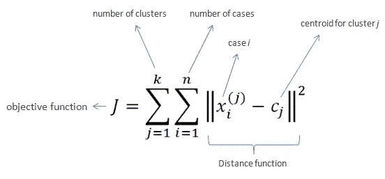
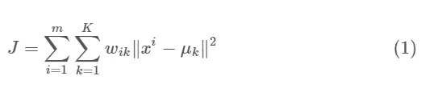
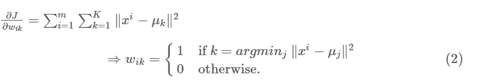
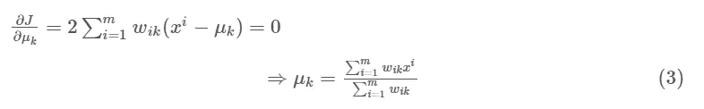
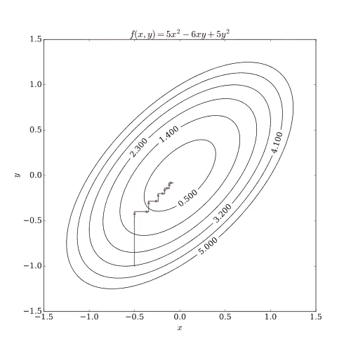

# k 均值聚类

> 原文：<https://medium.com/analytics-vidhya/k-means-clustering-3ce2456db7f1?source=collection_archive---------16----------------------->

从头开始解释和实现


K-means 聚类是一种无监督的机器学习技术。它的目标是将 n 个观测值划分为 k 个 T2 簇。

> **K 均值**算法是一种迭代算法，它试图将数据集划分为 *K* 个不同的非重叠子组(聚类),其中每个数据点仅属于**一个组**


来源:维基百科

> **目标→在 k 个簇中划分数据，其中 k 是我们已知的。**

# kmeans 算法流程

1.  指定集群的数量 *K*
2.  随机初始化 K 个中心(质心)。
3.  对数据集进行迭代，直到达到最大迭代次数，或者在聚类的质心发生变化之前。
4.  计算每个点与每个聚类中心的欧几里德距离。将每个点分配给一个距离最小的簇。这个步骤被称为**电子步骤(期望步骤)。{** *K-Means 是期望算法* **}** 的特例
5.  计算每个聚类的平均值，然后用该聚类的质心更新它。这一步被称为 **M-step(最大化步骤)**
6.  重复这些，直到我们达到最大迭代或我们正确的质心。

> **K-means 可以表述为 E-M(期望最大化)算法。e 步填充点，而 M 步更新中心。**

## K-means 背后的数学

正如我们在其他机器学习算法中看到的那样，我们有一个损失函数。所以我们这里又把它称为目标函数或惯性。



我们在这里引入 wik 是因为我们要为一个点不属于其他聚类的聚类增加距离。



我们首先相对于 wik 最小化 J，保持μk 固定。然后我们最小化 J . w . r . t .μk 并处理 wik 固定。

当我们首先区分 J w.r.t. wik 并更新集群的分配时，这是**电子步骤**。然后我们对 J w.r.t. μk 进行微分并更新质心，这被称为 **M 步**。

电子步骤是



M-step 是



这与我们将平均值作为分母表示 1 和 0 的总和是第 k 个簇中的点数是一样的。而分子是该簇中那些点的值的总和。

这种最小化误差并找到 wik 和μk 的方法叫做坐标下降法，它有这样一个图



来源:维基百科

K 均值代码

```
# Distance between two points Euclidian Distance
def distance(a1,a2):
    return np.sqrt(np.sum((a1-a2)**2))class **KMeans**():
    def __init__(self,k=5,max_iter=100):
        self.k= k
        self.max_iter=max_iter
        self.clusters = {}
        self.label = []

    def **initialization**(self,X):
        for i in range(self.k):
            center=np.zeros((2,))
            cx = np.random.uniform(low=38.8250, high=39.0000)
            cy = np.random.uniform(low=-76.9, high=-77.15)
            center[0] = cx
            center[1] = cy
            #center = 10*(2*np.random.random((X.shape[1],))-1)
            points = []
            cluster = {
                'center':center,
                'points':points,
                'id'    :i
            }
            self.clusters[i]=cluster
        self.label = np.zeros((X.shape[0],1))

    def **assignPointTOClusters**(self,X):
        for i in range(X.shape[0]):
            dist = []
            curr_x = X[i]

            for ki in range(self.k):
                d = distance(curr_x,self.clusters[ki]['center'])
                dist.append(d)

            current_cluster = np.argmin(dist)
            self.clusters[current_cluster]['points'].append(curr_x)
            self.label[i]=(self.clusters[current_cluster]['id'])

    def check(self,old_c,new_c):
        distances = [distance(old_c[i], new_c[i]) for i in range(self.k)]
        return sum(distances) == 0

    def **updateClusters**(self):
        for kx in range(self.k):
            pts = np.array(self.clusters[kx]['points'])

            if pts.shape[0]>0: # If cluster has some nonzero points
                new_u = pts.mean(axis=0)
                self.clusters[kx]['center'] = new_u
                # Clear the list
                self.clusters[kx]['points'] = []

    def **plotClusters**(self):
        for kx in range(self.k):
            print(len(self.clusters[kx]['points']))
            pts = np.array(self.clusters[kx]['points'])
            # plot points , cluster center
            try:
                plt.scatter(pts[:,0],pts[:,1])
            except:
                pass
            uk = self.clusters[kx]['center']
            plt.scatter(uk[0],uk[1],color='black',marker="*")
        plt.show()

    def **fit**(self,X):
        print(self.k)
        self.initialization(X)
        for i in range(self.max_iter):
            print("i is ",i)
            self.assignPointTOClusters(X)
            self.plotClusters()
            old_c = [self.clusters[i]['center'] for i in range(self.k)]
            self.updateClusters()
            new_c = [self.clusters[i]['center'] for i in range(self.k)]
            if self.check(old_c,new_c):
                break
```

# K-Means++只是一个介绍

*   K-Means 对初始化非常敏感，如果初始化不好，我们的算法就不能得到期望的聚类数。
*   为了克服这个问题，我们使用称为 K-Means++的技术(在论文[中描述了 K-Means 类型算法的鲁棒种子选择](https://arxiv.org/abs/1202.1585))，该技术选择初始中心，使得它们统计上接近最终中心。