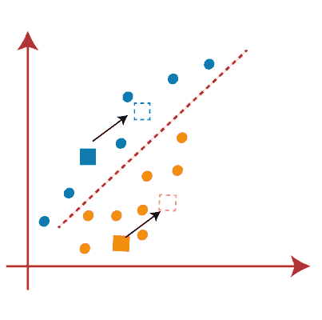
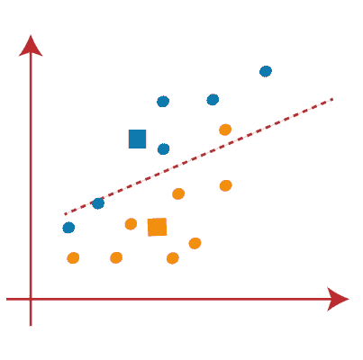

# k-均值聚类及其在安全领域的应用

> 原文：<https://medium.com/analytics-vidhya/k-means-clustering-and-its-use-cases-in-security-domain-70f696778de4?source=collection_archive---------9----------------------->

互联网用户的活动逐年增加，并对用户本身的行为产生了影响。对用户行为的评估通常只基于互联网上的交互，而不知道任何其他活动。日志活动可以用作研究用户行为的另一种方式。互联网活动日志是大数据的一种类型，因此使用 K-Means 技术进行数据挖掘可以作为分析用户行为的解决方案。本研究在进行聚类的过程中采用 K-Means 算法分为三类，即高、中、低。高等教育机构的结果显示，这些集群中的每一个都产生了网站，这些网站被经常访问的顺序是:网站搜索引擎、社交媒体、新闻和信息。这项研究还表明，网络特征分析受到环境因素和日常活动的强烈影响。

# 什么是 K-means 聚类？

K-means 是一种基于质心的算法，或基于距离的算法，其中我们计算距离以将一个点分配给一个聚类。在 K-Means 中，每个聚类都与一个质心相关联。

K-means 算法的主要目标是最小化和它们各自的聚类质心之间的距离之和。

现在让我们举一个例子来理解 K-Means 实际上是如何工作的:

我们有这几个点，我们想应用 k-means 为这些点创建聚类。我们可以这样做。

## 步骤 1:选择聚类数 k

k-means 的第一步是挑选聚类数 k。

## 步骤 2:从数据中随机选择 k 个点作为质心

接下来，我们随机选择每个聚类的质心。假设我们想要 2 个集群，那么这里 k 等于 2。然后我们随机选择质心:

在这里，蓝色和橙色的框代表这些集群的质心。

## 步骤 3:将所有点分配给最近的聚类质心

初始化质心后，我们将每个点分配给最近的聚类质心:

在这里，您可以看到靠近蓝色点的点被分配给蓝色簇，而靠近橙色点的点被分配给橙色簇。

## 步骤 4:重新计算新形成的簇的质心

因为我们需要找到最近的聚类，所以我们将通过选择一个新的质心来重复这个过程。为了选择新的质心，我们将计算这些质心的重心，并将找到如下新的质心:

## 步骤 5:接下来，我们将每个数据点重新分配给新的质心。

为此，我们将重复寻找中线的相同过程。中间值如下图所示:

从上面的图像中，我们可以看到，一个黄色的点在线的左侧，两个蓝色的点在线的右侧。因此，这三个点将被分配给新的质心。

## 步骤 6:由于重新分配已经发生，所以我们将再次进入步骤 4，这是寻找新的质心或 K 点。

我们将通过寻找质心的重心来重复该过程，因此新的质心将如下图所示:

因为我们得到了新的质心，所以我们将再次绘制中线并重新分配数据点。所以，图像会是:

我们可以在上图中看到:线的两边没有不相似的数据点，这意味着我们的模型形成了。考虑下图:

由于我们的模型已经准备好了，所以我们现在可以删除假定的质心，两个最终的集群将如下图所示:

## K-means 聚类中“K 个簇数”的取值如何选择？

K-means 聚类算法的性能取决于它所形成的高效聚类。但是选择最佳的集群数量是一项艰巨的任务。有一些不同的方法可以找到最佳聚类数，但这里我们讨论的是找到聚类数或 k 值的最合适的方法。该方法如下所示:

## 肘法

肘方法是寻找最佳聚类数的最流行的方法之一。这种方法使用了 WCSS 值的概念。 **WCSS** 代表聚类平方和内的**，定义了一个聚类内的总变差。计算 WCSS 值(针对 3 个集群)的公式如下所示:**

WCSS =∑聚类 1 中的 Pi 距离(Pi C1)2+∑聚类 2 中的 Pi 距离(Pi C2)2+∑聚类 3 中的 Pi 距离(Pi C3)2

在 WCSS 的上述公式中，

∑聚类 1 中的 Pi 距离(Pi C1)2:它是聚类 1 中每个数据点与其质心之间的距离的平方和，其他两项也是如此。

为了测量数据点和质心之间的距离，我们可以使用任何方法，如欧几里德距离或曼哈顿距离。

为了找到聚类的最佳值，肘方法遵循以下步骤:

*   它针对不同的 K 值(范围从 1 到 10)对给定的数据集执行 K 均值聚类。
*   对于每个 K 值，计算 WCSS 值。
*   绘制计算的 WCSS 值和聚类数 k 之间的曲线
*   弯曲的尖点或图中的点看起来像一只手臂，那么该点被认为是 k 的最佳值。

因为图中显示的是看起来像弯头的急弯，所以它被称为弯头法。弯头方法的图形如下图所示:

# 基于 K-均值聚类的犯罪分析

## 犯罪模式分析的步骤

*   确定城市犯罪的地理空间情节:第一步是收集给定城市的犯罪信息。这通常可以从多个地方获得，例如执法报告、受害统计调查、报纸文章的整理等。这些数据可以绘制在地理地图上，如上图所示。
*   使用 K-means 数据挖掘方法有助于我们识别模式，因为人类很难处理大量的数据，尤其是在有缺失信息的情况下检测模式。
*   群集在识别由一个或同一组嫌疑人犯下的疯狂犯罪中是有用的。这些集群然后被呈现给侦探，他们利用他们的领域专业知识来解决案件。

## **使用以下步骤进行聚类分析:**

*   记录的分类——首先根据侦探的经验对最重要的特征进行分类。
*   然后，数据挖掘被用于检测更复杂的模式，因为在现实生活中，有许多与犯罪相关的属性，而我们通常只有部分可用信息。
*   识别聚类的重要属性。
*   基于被聚类的犯罪类型动态地对不同的属性赋予不同的权重。
*   对犯罪模式的数据集进行聚类，并将结果与重要属性的统计数据一起呈现给侦探或领域专家。
*   侦探查看集群并给出建议。
*   未解决的犯罪基于重要的属性被聚集，并且结果被给侦探用于检查。
*   在本文中，我们将使用 K-means 方法来生成聚类。K 均值算法由以下步骤组成:
*   决定聚类的数量，K。K-means 聚类分析要求您在算法开始之前知道要生成多少个聚类。
*   初始化 K 个集群或随机生成它们。聚类的不同起点可能会产生不同的结果。
*   将每个观测值分配给最近的聚类中心。这是一种迭代技术，它随着我们的进展构建集群。
*   重新计算新的聚类中心。请注意，您需要指定用于确定聚类之间距离的算法。
*   重复这个过程，直到在最后一次迭代中没有观测值改变它们的隶属度。
*   下图显示了 K 均值聚类分析的一个示例。在本例中，我们展示了 3 个集群的创建过程(每个集群使用不同的颜色)。

*   分析模式并得出结论这包括对形成的每个集群的分析。计算机无法理解每个集群的独特之处。这就是人类专业知识发挥作用的地方。例如，所有以红色显示的犯罪可能都是使用类似的枪支实施的，或者所有以蓝色显示的犯罪可能都是由于珠宝盗窃，当时人们在路上行走，攻击者骑着摩托车等。这有助于发现犯罪模式和趋势相关性。一旦发现特定模式，执法人员可以部署额外的适当资源来侦查和制止犯罪活动。

## 聚类在犯罪模式分析中的优势

使用这种方法进行犯罪模式分析有几个优点:

*   这种方法有助于我们分析历史犯罪率，提高当前的破案率。
*   通过使用基于观察到的模式的预防机制，采取措施防止将来发生事故。
*   减少被分配到新地点的警官的培训时间，这些警官以前不了解特定地点的犯罪。
*   通过在正确的时间将有限的资源优化地重新部署到正确的位置来提高运营效率。

## 犯罪模式检测的局限性

使用这种方法进行犯罪模式检测有一些限制:

*   犯罪模式分析只能帮助侦探，而不能取代他们。由人类专家来解释集群告诉我们什么。
*   数据挖掘对输入数据的质量很敏感，有时可能不准确。信息缺失也会导致错误。
*   绘制数据挖掘属性是一项艰巨的任务，因此需要一名熟练的数据挖掘者和一名具有良好领域知识的犯罪数据分析师。

> 事情的结局

**感谢阅读。**

参考:

[https://www . Java point . com/k-means-clustering-algorithm-in-machine-learning](https://www.javatpoint.com/k-means-clustering-algorithm-in-machine-learning)