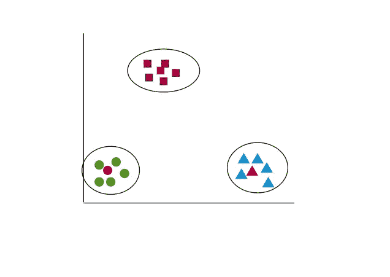
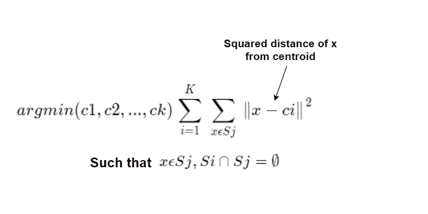
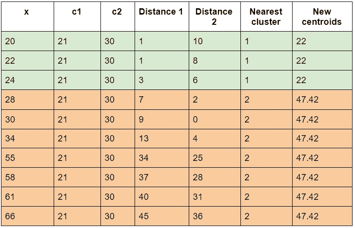
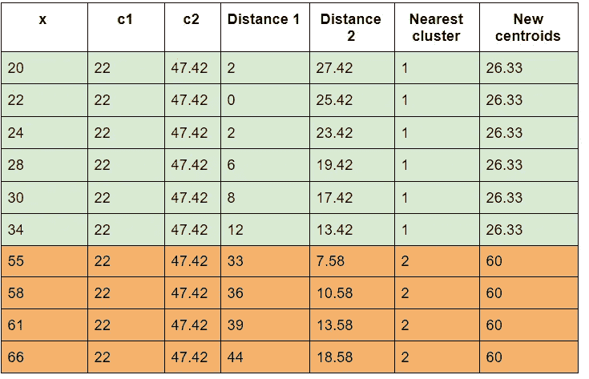
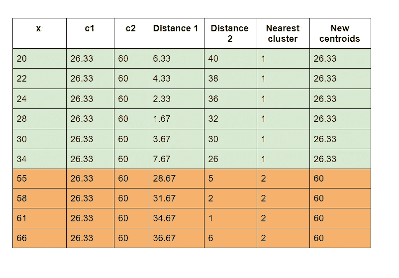

# k 均值聚类:简单的直觉

> 原文：<https://medium.com/analytics-vidhya/k-means-clustering-simple-intuition-16a55daa3ffa?source=collection_archive---------14----------------------->

理解 K-Means 算法的一种简单直观的方法。

**什么是聚类？** 聚类是一种任务，其中每个数据点与“相似”的数据点聚集在一起，它们形成一个聚类。换句话说，与存在于另一个聚类中的数据点相比，一个聚类或组中的数据点彼此非常“相似”。

K-Means 聚类是一种非常强大有效的[无监督机器学习](https://en.wikipedia.org/wiki/Unsupervised_learning)算法。

**K-Means 聚类的简单直觉**

K-means 旨在将“n”个点分成“K”个聚类，其中聚类“Xi”中的每个点是相似的，或者我们可以说具有小的“聚类内距离”和高的“聚类间距离”。这是 K-means 聚类的基本直觉。
**类内距离** :-同组或同类的点。
**类间距离** :-跨不同类的点。

理想的集群应该是具有非常小的集群内距离和高的集群间距离的集群。

K-means 将点分组到簇中。现在，对于每个集群，它给出了质心 C1，C2，…。，Ck，其中 k =聚类数。形心不过是中庸点(中心点)。因此，对于每个聚类，我们得到一个质心，并且两个不同聚类的交集总是空集。
这里的聚类数就是超参数。

正如我们在上面的图中看到的，每个聚类中的粉红色点是质心，靠近质心的点被分组在一起。

**K 均值的数学公式**

上面的公式说找到我的质心，所有的聚类和所有点都属于某个集合 Sj，其中聚类内的距离被最小化，这样数据点 x(这是博客中提到的 Xi，请不要混淆)应该只属于那个集合 Sj，任何两个集合的交集应该是一个空集。

如果你对这个公式有一点困惑，这是正常的，只要记住我们试图实现的是什么，任务是什么。

任务是如何找到 K 形心。我们将使用[劳氏算法](https://en.wikipedia.org/wiki/Lloyd%27s_algorithm)来确定。

算法:-

初始化:我们首先从数据集中随机选取 K 个点，称之为质心。这也被称为随机初始化方案。

**分配**:对于每个点‘Xi’:选择最近的质心(根据欧几里德距离函数)并创建一个集合。

**更新阶段:**通过取特定集合中所有点的平均值来重新计算或更新质心，并生成新的质心。

**收敛阶段:**重复分配和更新阶段，直到收敛。

这里的融合是什么？当质心更新时，变化不大。基本上，前一阶段和下一阶段的质心相同或大致相同，这就是收敛阶段。

最后，我们得到了一个簇中的质心和点集。

我很肯定，通过下面的例子，人们可以很容易理解 K-means 实际上是如何工作的。

假设我们想根据人们的年龄对购物习惯进行分组。为了简单起见，我们使用一维数据集。
**年龄:20，22，24，28，30，34，55，58，61，66** 。

这里 **n=10** 并且我们想要 2 个集群，所以 **K=2。**

我们随机选取 2 个质心，因为我们想要两个集群。假设我们取了 **c1=21** 和 **c2=30**

**距离 1 = | x*I-*c*1 |
距离 2 = | x*I-*C2*|****

第一次迭代后:

我们的新质心将是 **c1=22** 和 **c2=47.42**
新质心是通过分别取簇 1 和 2 中存在的所有 x 的平均值来计算的。

第二次迭代后。

我们的新质心将是 **c1=26.33** 和 **c2=60**
新质心是通过分别取簇 1 和簇 2 中所有 x 的平均值来计算的。

第三次迭代后:

正如我们所看到的，第二次迭代和第三次迭代中的新质心是相同的，所以我们已经达到了收敛阶段或收敛点。

因此，我们确定了一个年龄组 20-34 岁，第二组阶段 55-66 岁。

这只是一个玩具数据集，在现实生活中不需要这么简单。这是为了更好地理解 K 均值聚类的工作原理。

我希望您对 K-Means 聚类的工作原理有更好的直觉。

如果你喜欢这个博客，那么请鼓掌，并随时提出任何问题或反馈。很乐意帮忙。

也请关注更多博客和有见地的故事。

我的领英:[www.linkedin.com/in/vihaanshah](http://www.linkedin.com/in/vihaanshah)

参考:
[应用课程](https://www.appliedaicourse.com/)给出简单明了的 K-means 背后的直觉。

谢谢你。