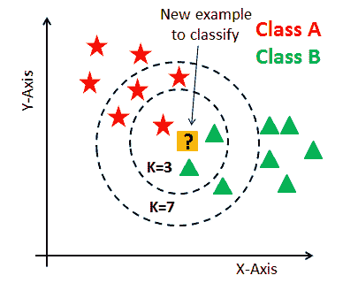
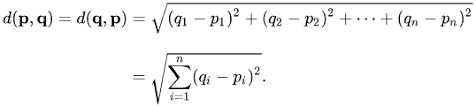
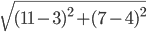

# k 近邻:背后的数学原理，工作原理和一个例子

> 原文：<https://medium.com/analytics-vidhya/k-nearest-neighbor-the-maths-behind-it-how-it-works-and-an-example-f1de1208546c?source=collection_archive---------3----------------------->

k-最近邻(KNN)是一种监督分类算法，它基于通过查找与基础数据的相似性来预测数据。KNN 最广泛地用于分类问题，但也可用于解决回归问题。最初的假设是数据以簇的形式存在，或者以非常接近的方式存在。KNN 是一种非参数算法，这意味着它不会试图对数据进行假设，例如，它不关心数据是否正态分布。

那么 KNN 是如何实现的呢？现在让我们来复习一下。初始化 K 的值，K 将是我们将尝试并关联新预测的接近数据点的总数。

我们必须知道的一件事是，我们如何选择 k 的值。显然，这里没有适合所有人的大小，但正统和首选的值通常是 5。1 或 2 可能太低，无法捕捉未知或新数据点周围的大量信息，甚至可能指向异常值或过于具体的数据点，如果太多，您可能会有一个过于笼统的模型。

2.计算所有数据点和新数据点之间的相似性。这是使用欧几里德距离来完成的。你以为你逃脱了数学的部分，是吗？我们开始吧，好吗？

这个等式表示点 *p* 和点 *q* 之间的距离，也是从 *q* 到 *p* 的距离。要计算距离，我们将每个坐标的维度相减，求和，应用 2 的幂，然后平方根。让我们举一个例子:我们希望找到点(3，4)和点(11，7)之间的距离。注意:在大多数情况下，你会发现多维数据点之间的距离远远大于 2。不过，让我们继续，等式应该是这样的:

结果是 8.544。

3.使用上述欧几里德距离在训练数据中选择最近的 K 个观察值。

4.使用最流行的响应作为新数据点的预测。

现在，为了知道哪个 K 对于数据集是正确的，我们使用不同的值运行 KNN 算法几次，例如在 3 和 6 之间的范围上，因此运行算法 4 次。一个好的做法是尝试为 K 选择一个奇数，以避免票数相等，并实现平局决胜。