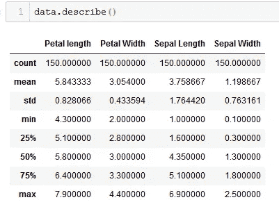
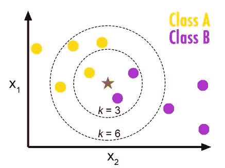
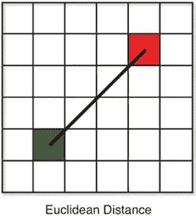
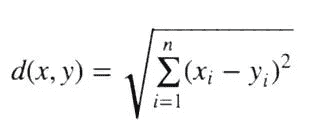
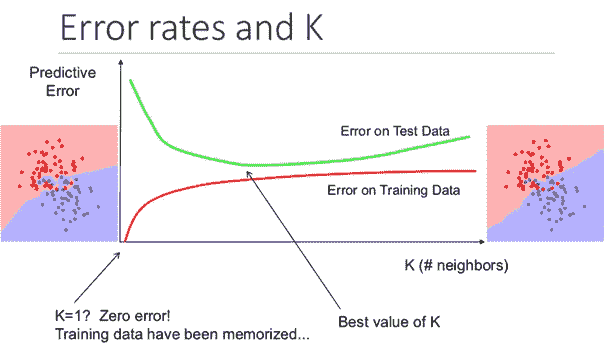

# 有划痕的 k-最近邻(KNN)

> 原文：<https://medium.com/analytics-vidhya/k-nearest-neighbor-with-scratch-knn-75bf088729b?source=collection_archive---------5----------------------->

你好，欢迎来到我们的**带划痕的 K 近邻**，我们带划痕的机器学习系列的第三篇文章。在本文中，我们将和您一起研究并编写 K-最近邻算法。

在编码我们的算法时，我们将使用**虹膜数据集**作为数据集。Iris 数据集是分类问题的理想数据集。您可以在此 或在 **sklearn 库**中访问数据集 [**。下面你可以看到如何将数据集导入你的代码。**](https://www.kaggle.com/uciml/iris)

> **从** **sklearn** **导入**数据集
> iris = datasets.load_iris()

df.describe()

## k-最近的**邻居**

使用 K-最近邻算法的主要目的是找出我们的分类数据属于哪个类别。
我们的算法*(K-最近邻，或简称 KNN)*通过查看其在坐标系中最近的邻居来预测数据。

## 这意味着什么呢？

如果我们将数据视为在一个坐标系中，中间(星号)是我们将预测的数据在坐标系中的位置。最接近它的 **K** 元素告诉我们我们的数据实际上接近哪一个类别。在这幅图中，我们看到对 K 处理了 2 个不同的值，3 和 6，如果 K 是 3，那么在最接近我们可以估计的值的点上有 **1 A 和 2 B** 类成员。通过查看此不等式，我们可以说我们的 star 数据属于 B 类。在此图中，我们看到 6 个变量用于 K。对于 K 的 6 个值，情况会发生变化，我们的数据与来自 **4 A 和 2 B** 类的数据相邻。在这种情况下，对于我们的星形数据来说，似乎最合理的决策是 a 类。

当使用我们的算法时，我们的目标是找到最佳 K 值并最小化误差幅度。

简要地；在 KNN 算法的基础上，有 2 个不同的基本极点:**距离和 K** (最近邻数)。正如我在课文前面部分所写的，我们决定用 k。

## 那么我们用什么作为距离变量呢？

作为这个问题的答案，在 KNN 算法中有多个距离测量公式要使用。这些:

1.  闵可夫斯基距离
2.  曼哈顿距离
3.  欧几里得距离
4.  余弦距离
5.  雅克卡距离
6.  汉娩距

像这些有不同的距离测量公式。我们将使用**欧几里德距离**，它在我们的代码中经常使用。要观察其他距离度量对代码的影响，我建议您阅读文章 [***“距离度量选择对 KNN 分类器性能的影响——综述”。***](https://arxiv.org/pdf/1708.04321.pdf)

# 欧几里得距离

欧氏距离是 KNN 算法中最常用的距离类型。它采用几何学中的测距原理作为工作原理。

欧几里德距离公式

## 为什么 K 值很重要？

给出了该图中选择的不同 K 值的误差率。选择接近 1 且等于 1 的 K 值会导致代码中的**过拟合**。那么什么是过度拟合呢？过度拟合是一种情况，其中代码对可能通过记忆数据得到的不同数据无能为力。在这种情况下，我们的代码将查看最近的单个数据，并在不分析数据的情况下做出错误的预测。结果，我们的错误率增加了。

为了找到最佳的 K 值，我们需要在代码中尝试多个 K 值，并选择最佳的一个。

## 让我们编码:

***1。首先，让我们导入必要的库。***

**②*。我们上传我们的数据，并在预处理后将它们提供给模型😊***

在这个代码片段中，在加载我们的数据集之后，我们将它们分成两部分，分别为 df 和 df_test。之后，我们尝试范围(3，10)中的值来确定 K 值并计算错误分数。

***3。我们编码我们的类结构。***

我们开始用“__init__”函数中的预定义来编写我们的类结构。下一步，我们添加“__distance”函数，并定义我们将在类中使用的欧几里德函数。最后一步，我们将用“预测”函数结束代码。在 Predict 函数中，我们使用“heapq”结构对测量的距离进行排序。在这里，您可以将距离排序到一个普通的列表中，但是“heapq”结构会对您的代码有所改进。将测得的距离从小到大排序后，通过处理第一个 K 元素就可以得出你的数据属于哪一类的结果。

**这篇文章就是这样😊**

要查看完整版代码，请访问我的 Github 页面:[**https://github.com/capogluuu/ml_scratch**](https://github.com/capogluuu/ml_scratch)

# 谢谢你