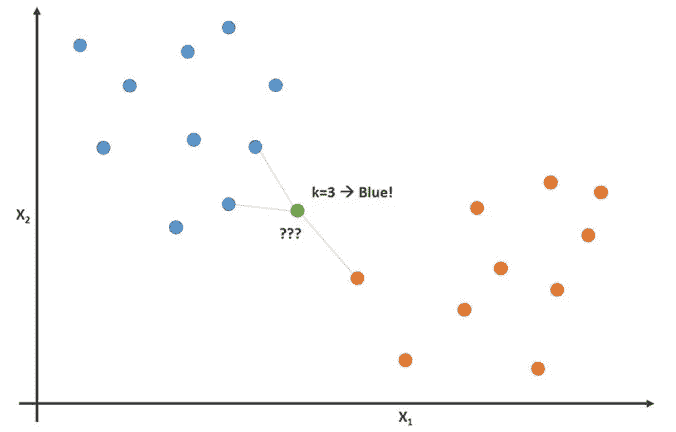
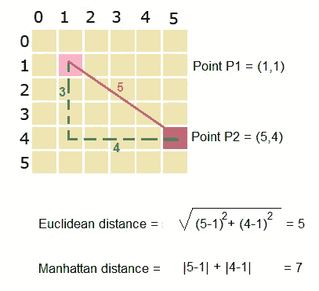

# 简而言之，k-最近邻

> 原文：<https://medium.com/analytics-vidhya/k-nearest-neighbors-in-a-nutshell-761464057775?source=collection_archive---------12----------------------->

k 最近邻

> 你是五个和你相处时间最长的人当中的平均 T2。

上面的引用很好地总结了 K-最近邻算法。唯一的区别是，在 KNN，朋友的数量可能会有所不同。

k-最近邻是一种非常简单但直观的机器学习算法，我们将深入研究这种算法的本质细节。

**什么是 K 近邻算法？**

k-最近邻是一种分类算法(也可用于回归),其基本原理是属于同一类的点应该彼此更靠近。让我们借助一个例子来理解这一点

k-最近邻

假设我们有一个数据集，它有两个特征 X1 和 X2，我们使用散点图来绘制数据点。在上图中，我们可以看到橙色的点属于类别 1，蓝色的点属于类别 2。

现在，一个新的数据点(即绿点)出现了，我们需要分类它是属于橙色类还是蓝色类。

现在我们执行以下步骤。

1.  选择 K 值(此处为 3)，即我们要考虑的离绿点最近的点的数量。
2.  计算绿点与这些点的距离，找出 K(这里是 3)个最近的点。
3.  在找到 K(这里是 3)个最近的点之后，我们检查这些点属于哪一类。
4.  现在，我们的绿点将属于在所选最近点中具有最大点数的类别。

**直觉**

K-最近邻背后的直觉是，与属于不同类别的点相比，属于同一类别的点应该彼此更接近**。**

**我该如何选择 K？**

*   选择 k 的值是一个高度迭代的过程。
*   您可以尝试 K 的多个值，并为每个 K 值计算预测的错误率。
*   现在绘制 K v/s 误差率，并选择误差率最小的 K 值。

**我们如何计算点与点之间的距离？**

现在我们知道了 K 近邻是如何工作的。让我们看看如何计算两点之间的距离。在 K-NN 中最好有两种方法来测量距离。

*   **欧几里得和曼哈顿的距离**

欧几里德距离和曼哈顿距离

*   上面清楚地显示了欧几里德距离和曼哈顿距离
*   当数据维数过高时，曼哈顿距离优于欧几里德距离。

**数据对 KNN 的影响**

*   如果我们有高度不平衡的数据，那么我们的 KNN 模型将偏向于具有更多数据点的类。这是因为当我们计算最近邻时，大部分点很有可能属于具有更多数据点的类(随着 K 值的增加，这种可能性也会增加)。
*   KNN 对数据集中异常值的存在高度敏感。离群值会对我们的 KNN 模型的性能产生不利影响。

**KNN 的实际应用**

*   **推荐系统:** KNN 被大量用于推荐系统，就像你在亚马逊、网飞等网站上看到的那种。KNN 用于推荐与您搜索的类别最接近的组。
*   **概念搜索:**概念搜索是基于根据您提供的查询从非结构化数据库中搜索相似项目的概念的搜索。

**给你的作业**

*   了解如何使用 scikit learn 在我们的数据上实现 KNN。
*   了解如何在回归问题中使用 KNN。

**到那时快乐学习！**