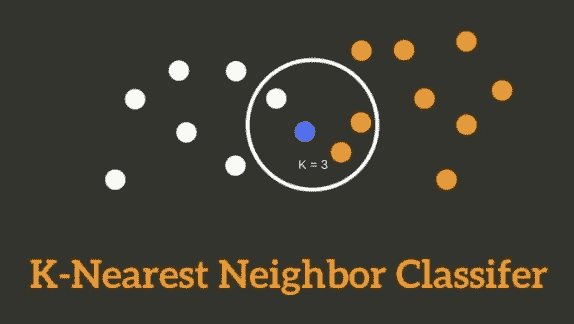
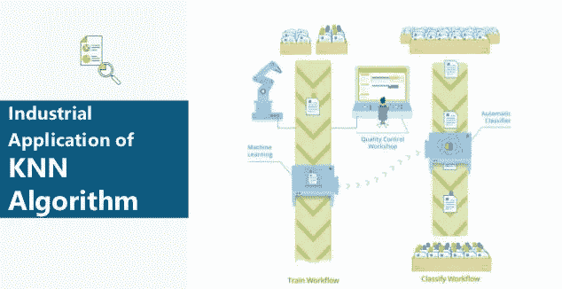
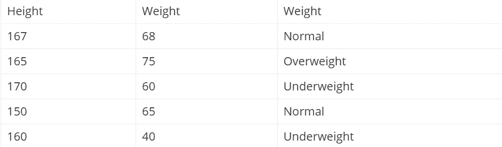
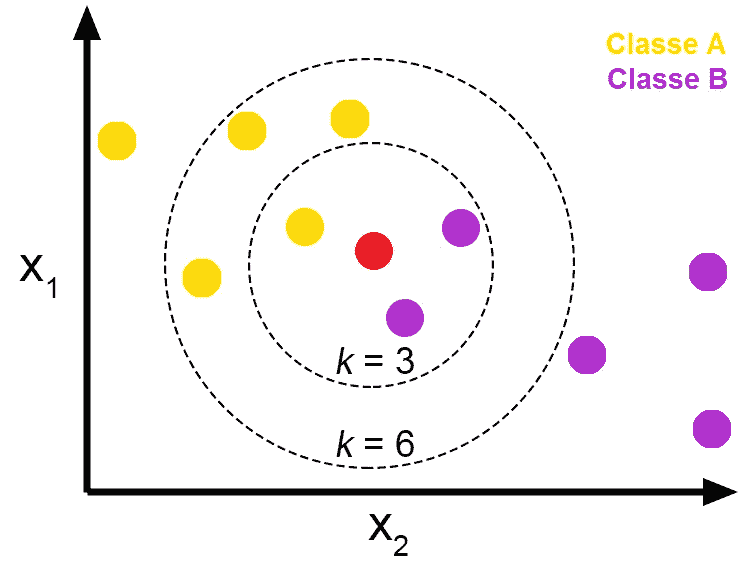
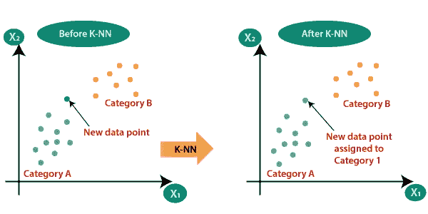

# k-最近邻(KNN)

> 原文：<https://medium.com/analytics-vidhya/k-nearest-neighbors-knn-8f027ae1228f?source=collection_archive---------9----------------------->

在这篇博客中，我将写一个非常著名的监督学习算法，即 k 近邻算法，简称 KNN。

在这里，我将解释什么是 KNN 算法，KNN 算法的工业用途，KNN 算法如何工作，如何选择 K 值，优点/缺点，最后我将提供链接到我的 KNN 算法实现的简要说明 Jupyter 笔记本。

此外，我将提供链接到我的**数字分类(在 mnsit 数据集)**使用 KNN 算法实现。因此，没有任何进一步的到期让我们开始。

# **什么是 KNN 算法？**

KNN 是一种根据最相似的点对数据点进行分类的模型。它使用测试数据对未分类点应分类为什么做出“有根据的猜测”。

KNN 是一种被认为是非参数的算法，也是懒惰学习的一个例子。这两个术语到底是什么意思？

*   非参数意味着它不做任何假设。该模型完全是由提供给它的数据组成的，而不是假设它的结构是正常的。
*   懒惰学习意味着算法不进行归纳。这意味着使用这种方法时几乎不需要培训。因此，当使用 KNN 时，所有的训练数据也用于测试。

**KNN 的 K 是什么？**

k =最近邻的数量

如果 k=1，则测试示例被赋予与训练集中最接近的示例相同的标签。如果 k=3，则检查三个最接近的类的标签，并分配最常见的(即，至少出现两次)标签，对于较大的 k，依此类推。

构建 k-最近邻分类器时，您需要选择 k 的值。您可能已经有了一个特定的 k 值，或者您可以划分您的数据并使用类似交叉验证的方法来测试 k 的几个值，以便确定哪个值最适合您的数据。对于 n=1000 的情况，我敢打赌最佳的 k 值在 1 到 19 之间，但是你真的要试一试才能确定。

# **KNN 算法的工业应用**

k-最近算法被应用于日常生活的各个领域。它很容易使用，所以数据科学家和机器学习的初学者使用这个算法来完成一个简单的任务。k 最近邻算法的一些用途包括:

## 发现糖尿病比率

糖尿病基于年龄、健康状况、家庭传统和饮食习惯。但是在一个特定的位置，我们可以基于 K 最近邻算法来判断糖尿病的比率。如果你计算出年龄、怀孕、血糖、血压、皮肤厚度、胰岛素、体重指数和其他所需的数据，我们可以很容易地绘制出某一年龄患糖尿病的概率。

## 推荐系统

如果我们在任何在线商店搜索任何产品，它都会显示该产品。决定特定产品时，它会推荐一些其他产品。当你知道亚马逊 35%的收入来自于推荐系统后，你会惊讶不已。决定在线商店，YouTube，网飞，和所有的搜索引擎使用的算法 k-最近邻。

## 概念搜索

概念搜索是 K 近邻算法的工业应用。这意味着同时搜索相似的文档。互联网上的数据每秒都在增加。主要问题是从大量数据库中提取概念。k-最近邻有助于从简单的方法中找到概念。

## 发现乳腺癌的比率

在医学领域，KNN 算法被广泛使用。它被用来预测乳腺癌。这里使用 KNN 算法作为分类器。K 最近邻是这里最容易应用的算法。根据当地的历史、年龄和其他条件，KNN 适合标记数据。

# KNN 算法是如何工作的

考虑具有两个变量体重和身高的数据集。每个点被分为超重、正常和体重不足。不，我给出一组数据:

现在如果我给出身高 157 cm 的值。之前没有给出数据。根据最接近的值，它预测体重为 157 厘米。它使用的是 k 近邻模型。

我们可以使用欧几里德距离公式来实现 k 近邻算法。它通过确定两个坐标的距离来工作。在图中，如果我们绘制(x，y)和(a，b)的值，那么我们将暗示公式为:

距离(d)=(x-a)+(y-b)

# 选择正确的 K 值

为了选择最适合您的数据的 K，我们使用不同的 K 值运行 KNN 算法几次，并选择减少我们遇到的错误数量的 K，同时保持算法在给定以前从未见过的数据时准确做出预测的能力。

以下是一些需要记住的事情:

1.  当我们把 K 值减小到 1 时，我们的预测变得不稳定。只需思考一分钟，想象 K=1，我们有一个由几个红色和一个绿色包围的查询点(我在想上面彩色图的左上角)，但绿色是单个最近邻。合理地说，我们会认为查询点最有可能是红色的，但是因为 K=1，KNN 错误地预测查询点是绿色的。
2.  相反，当我们增加 K 的值时，由于多数投票/平均，我们的预测变得更加稳定，因此，更有可能做出更准确的预测(直到某一点)。最终，我们开始看到越来越多的错误。在这一点上，我们知道我们把 K 值推得太远了。
3.  如果我们在标签中采取多数投票(例如，在分类问题中选择模式)，我们通常将 K 设为奇数，以进行平局决胜。

# **KNN 算法的优势**

1.  该算法简单，易于实现。
2.  没有必要建立一个模型，调整几个参数，或作出额外的假设。
3.  算法是通用的。它可以用于分类、回归和搜索(我们将在下一节中看到)。

# KNN 算法的缺点

1.  随着示例和/或预测器/独立变量的数量增加，算法变得明显更慢。

这是我的 Jupyter 笔记本，上面简要介绍了 KNN 的实现(从头开始)。

 [## shag 10/机器学习

### 这个库包含机器学习算法的基础。基于监督学习的算法…

github.com](https://github.com/Shag10/Machine-Learning/blob/master/Internity_Internship/Day-8/KNN.ipynb) 

**这是我的 Jupyter 笔记本，简要说明了使用 KNN(使用内置模型)对 mnsit 数据进行数字分类的实现。**

 [## shag 10/机器学习

### 这个库包含机器学习算法的基础。基于监督学习的算法…

github.com](https://github.com/Shag10/Machine-Learning/blob/master/Internity_Internship/Day-8/Digit_Classification__KNN.ipynb) 

**我试图提供所有关于开始使用线性回归及其实现的重要信息。希望你能在这里找到有用的东西。谢谢你一直读到最后。**

# **参考文献**

 [## K 近邻算法在现实生活中的应用

### k 最近邻算法是一种非常简单易行的机器学习算法，用于模式识别…

www.fossguru.com](https://www.fossguru.com/the-application-of-k-nearest-neighbor-algorithm-in-real-life/)  [## 基于 K-最近邻算法的机器学习基础

### k-最近邻(KNN)算法是一个简单，易于实现的监督机器学习算法，可以…

towardsdatascience.com](https://towardsdatascience.com/machine-learning-basics-with-the-k-nearest-neighbors-algorithm-6a6e71d01761)