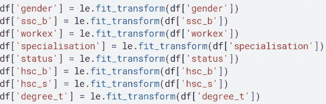
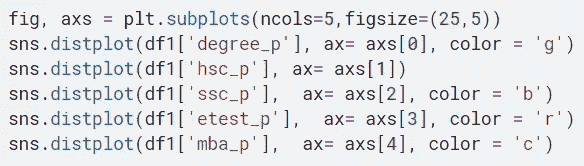
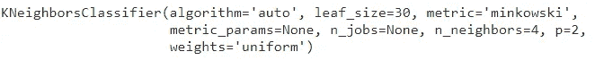

# 布局数据的 k 近邻(KNN)算法

> 原文：<https://medium.com/analytics-vidhya/k-nearest-neighbors-knn-algorithm-for-placements-data-5c0c1f81de4?source=collection_archive---------5----------------------->

k 最近邻(KNN)

# 介绍

k-最近邻(KNN)算法是一种监督最大似然算法，可用于分类以及回归预测问题。但在工业上主要用于分类预测问题。以下两个特性可以很好地定义 KNN

*   **懒惰学习算法**—KNN 是一种懒惰学习算法，因为它没有专门的训练阶段，并且在分类时使用所有数据进行训练。
*   **非参数学习算法**—KNN 也是一种非参数学习算法，因为它没有对底层数据做任何假设。

在这些文章中，我们将创建一个关于校园安置数据的 KNN 分类器模型…

让我们导入所有的库并读取数据。

现在让我们检查所有列中的所有唯一值…

它显示所有唯一的值……

我们可以看到所有列都有相同数量的缺失值…..

以上图表显示了候选人的性别、SSC 委员会、HSC 委员会和 HSC 流的数量。

上面的图表显示了有工作经验的候选人的数量，他们选择的专业，以及是否被录用的状态。

从上面的相关矩阵可以看出，职位安排和薪酬与三个因素有很强的相关性

1)degree_ p 即学位%，2)HSC _ p 即 HSC %，3)SSC _ p 即 SSC %分数。

上图显示了学位百分比与性别地位的关系，无论是否被录用。

上图显示了学位百分比、HSC 百分比、SSC 百分比、MBA 百分比得分的距离图。

上面显示了安置后的工资直方图。

上面的图表显示了不同参数之间的关系，例如 HSC 分数的百分比与学位百分比，与职位或性别、他们选择的专业之间的关系。

**KNN 分类器**

列车数据分割:

将训练数据拆分成 X_ train，X_ test，y_ train，y_ test。

**型号**

现在我们可以建立我们的 KNN 模型了。

预测未知:

比较实际值和预测值:

显示包含实际值和预测值的数据框

最后计算准确度分数、分类报告和混淆矩阵……

**优点:**

1.  KNN-是一种**非参数算法。**
2.  **K-NN 是一种基于*实例的学习算法。***

*****缺点:*****

***除了一些优点之外，这种易于实现的算法也有一些缺点。一些定义如下:***

1.  ***K-NN 是一种 ***懒学习*** 算法。***
2.  **对于 ***高维问题*** 表现不佳。所以维度的诅咒也在这里。**
3.  **这个算法是 ***比较慢的*** 去求值，需要存储整个训练数据。因此，它也可能是 ***计算量大的*** 。**