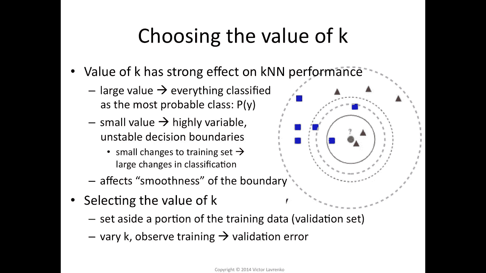
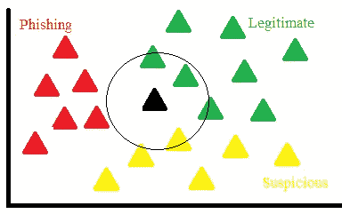
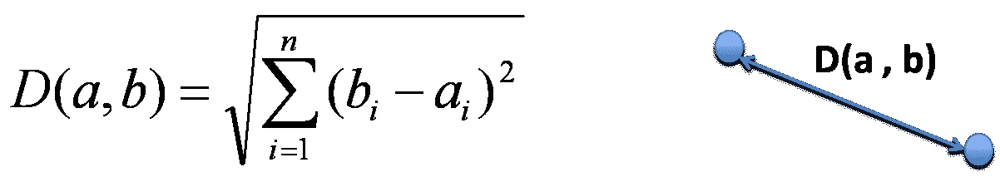

# k 近邻

> 原文：<https://medium.com/analytics-vidhya/k-nearest-neighbours-db303d1351f?source=collection_archive---------30----------------------->

机器学习算法


KNN 是一种简单直观的机器学习算法。它可用于分类和回归。这是一种监督学习，我们得到 x 和 y。

KNN 是非参数的，这意味着它不做任何假设，因此准确性取决于数据的质量。这是易于使用，以及有一个快速的计算时间。



然而，它也有一定的缺点，如在边界上分类数据点的能力很差。我们必须找到 k(我们将要预测的最近邻的数量)的最佳值。



我们有黑点作为测试点，我们必须预测它属于哪一类！！因此，我们计算每个点的欧几里德距离，然后找到 k 个最小距离(最近的邻居)。之后，我们将检查每个职业的多数票。最接近的类别将是测试点的类别。



> 这是最蛮力的算法，你用的任何其他算法都应该比这个好(精度更高，复杂度更低)。这个预测不涉及任何训练。所有的工作都发生在查询时。

KNN 的 ets 代码

```
def dis(x1,x2):
    return np.sqrt(sum((x1-x2)**2))def knn(X,Y,query,k=5):
    val = []
    m = X.shape[0]

    for i in range(m):
        d = dis(query , X[i])
        val.append((d,Y[i]))
    val=sorted(val)
    val=val[:k]
    val=np.array(val)
    print(val)

    new_val = np.unique(val[:,1],return_counts=True)
    print(new_val)

    max_freq_index = new_val[1].argmax()
    pred = new_val[0][max_freq_index]

    return pred
```

逐步解释我们在这段代码中做了什么！！

1.  加载数据
2.  将 K 初始化为您选择的邻居数量

3.对于数据中的每个例子

3.1 根据数据计算查询示例和当前示例之间的距离。

3.2 将示例的距离和索引添加到有序集合中

4.按距离从小到大(按升序)对距离和索引的有序集合进行排序

5.从排序的集合中挑选前 K 个条目

6.获取所选 K 个条目的标签

7.如果是回归，返回 K 个标签的平均值

8.如果分类，返回 K 标签的模式。

现在我们可以选择 k 的值？

通常找到的最佳 **K 值**是 N 的平方根，其中 N 是样本总数。

> 要获得 knn，您可以将它应用于 MNIST 数据集！！