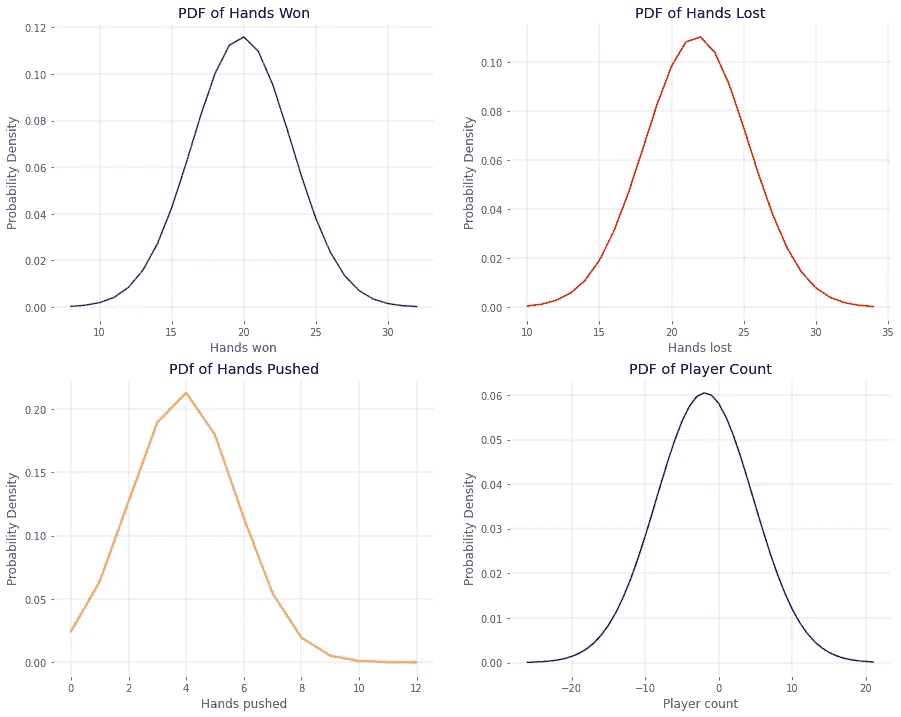
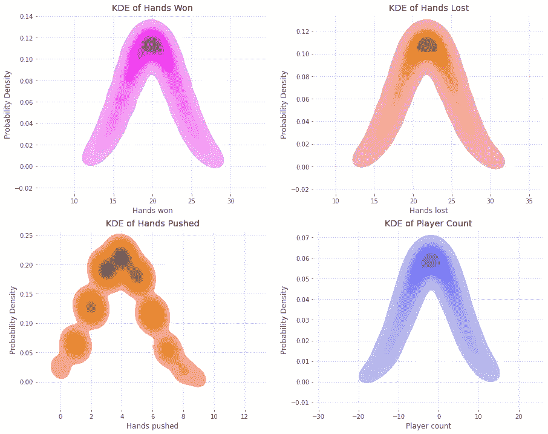
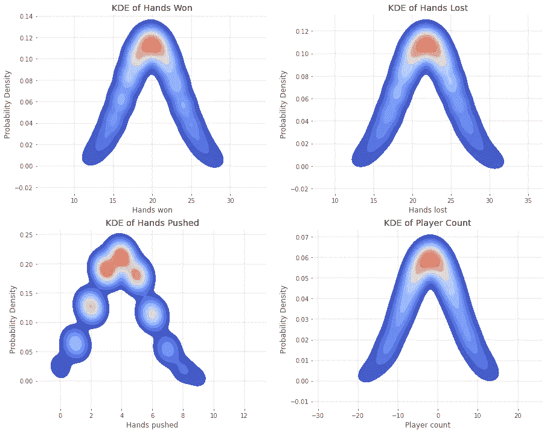

# Python 中的 KDE vs PDF

> 原文：<https://medium.com/analytics-vidhya/kde-vs-pdf-in-python-53ffbf578995?source=collection_archive---------4----------------------->

今天我用 Python 绘制了概率密度函数和核密度估计。

为了首先理解概率密度函数或 PDF，我们需要先看看 [scipy.stats.norm](https://docs.scipy.org/doc/scipy/reference/generated/scipy.stats.norm.html) 的文档。

# scipy.stats.norm

> 正态连续随机变量。
> 
> location ( `loc`)关键字指定了平均值。scale ( `scale`)关键字指定标准偏差。

给定一个数据帧和该数据帧中的一列，我们可以使用以下公式计算变量的概率密度函数:

```
from scipy import statsdata = df['column']
loc = data.mean()
scale = data.std()pdf = stats.norm.pdf(data, loc=loc, scale=scale)
```

我们还可以使用 stats.norm 来查找事件发生的概率。使用累积分布函数，找出点 p 的曲线下的面积，我们可以找到 p 出现的概率。如果我们需要经过点 p 的曲线下的面积，我们可以用 1-p，或者事件不会发生的概率。

```
prob = stats.norm(loc=loc, scale=scale)
event = prob.cdf(point)
event2 = 1 - prob.cdf(point)# Write the probability as a percentage
event_pct = str(round(event*100, 1)) + '%'
print('The probability that the event will occur is: ', event_pct)
```

# **seaborn.lineplot**

使用 [seaborn.lineplot](https://seaborn.pydata.org/generated/seaborn.lineplot.html) ，我们可以绘制如下所示的 PDF:

```
import seaborn as snsfig, ax = plt.subplots()
ax = sns.lineplot(x=data, y=pdf, ax=ax)
plt.show()
```

# 用例

数据取自我的[二十一点项目](https://github.com/kaseymallette/blackjack)，其中 shoe_df 是一个数据帧，包含关于 2880 双六张二十一点牌的信息。我找到了玩家赢、玩家输、手推和玩家数(赢的手减去输的手)的 PDF，然后绘制了所有四个 PDF。

```
def plot_pdf(x, ax, xlabel, title, color):
    'Creates subplots of probability density functions' data = shoe_df[x]
    loc = data.mean()
    scale = data.std()
    pdf = stats.norm.pdf(data, loc=loc, scale=scale) # Plot pdf using sns.lineplot
    ax = sns.lineplot(x=data, y=pdf, color=color, ax=ax) # Change face color and grid lines
    ax.set_facecolor('white')
    ax.grid(which='major', linewidth='0.2', color='gray') # Set title, x and y labels
    ax.set_title(title)
    ax.set_xlabel(xlabel)
    ax.set_ylabel('Probability Density') # Create four subplots
fig, ((ax1, ax2), (ax3, ax4)) = plt.subplots(2,2, figsize=(15,12))# Find the pdf's of player win, loss, push, and count
plot_pdf('player_win', ax1, 'Hands won', 'PDF of Hands Won', 'purple')
plot_pdf('player_loss', ax2, 'Hands lost', 'PDF of Hands Lost', 'red')
plot_pdf('push', ax3, 'Hands pushed', 'PDF of Hands Pushed', 'orange')
plot_pdf('player_count', ax4, 'Player count', 'PDF of Player Count', 'blue)# Show plots
plt.show()
```



# seaborn.kdeplot

我们可以使用 [seaborn.kdeplot](https://seaborn.pydata.org/generated/seaborn.kdeplot.html) 来绘制 KDE 的 PDF，以获得更平滑的曲线。

> 核密度估计(KDE)图是一种可视化数据集中观察值分布的方法，类似于直方图。KDE 使用一维或多维的连续概率密度曲线来表示数据。

```
def plot_kde(x, ax, xlabel, title, color):
    'Creates subplots of kernel density estimations' data = shoe_df[x]
    loc = data.mean()
    scale = data.std()
    pdf = stats.norm.pdf(data, loc=loc, scale=scale) # Plot pdf as a kde
    ax = **sns.kdeplot**(x=data, y=pdf, color=color, **fill=True**, ax=ax) # Change face color and grid lines
    ax.set_facecolor('white')
    ax.grid(which='major', linewidth='0.2', color='gray') # Set title, x and y labels
    ax.set_title(title)
    ax.set_xlabel(xlabel)
    ax.set_ylabel('Probability Density') # Create subplots
fig, ((ax1, ax2), (ax3, ax4)) = plt.subplots(2,2, figsize=(15,12))# Find the kde's of player win, loss, push, and count
plot_kde('player_win', ax1, 'Hands won', 'PDF of Hands Won', 'purple')
plot_kde('player_loss', ax2, 'Hands lost', 'PDF of Hands Lost', 'red')
plot_kde('push', ax3, 'Hands pushed', 'PDF of Hands Pushed', 'orange')
plot_kde('player_count', ax4, 'Player count', 'PDF of Player Count', 'blue)# Show plots
plt.show()
```



# 彩色地图

我们可以改变 KDE 的色彩映射表以获得不同的绘图效果。matplotlib 中关于色彩映射表的文档可以在[这里](https://matplotlib.org/stable/tutorials/colors/colormaps.html)找到。

```
def plot_kde(x, ax, xlabel, title):
    'Creates subplots of kernel density estimations' data = shoe_df[x]
    loc = data.mean()
    scale = data.std()
    pdf = stats.norm.pdf(data, loc=loc, scale=scale) # Plot pdf as a kde
    ax = sns.kdeplot(x=data, y=pdf, fill=True, 
                     **cmap='coolwarm'**, ax=ax) # Change face color and grid lines
    ax.set_facecolor('white')
    ax.grid(which='major', linewidth='0.2', color='gray') # Set title, x and y labels
    ax.set_title(title)
    ax.set_xlabel(xlabel)
    ax.set_ylabel('Probability Density') # Create subplots
fig, ((ax1, ax2), (ax3, ax4)) = plt.subplots(2,2, figsize=(15,12))# Find the kde's of player win, loss, push, and count
plot_kde('player_win', ax1, 'Hands won', 'PDF of Hands Won')
plot_kde('player_loss', ax2, 'Hands lost', 'PDF of Hands Lost')
plot_kde('push', ax3, 'Hands pushed', 'PDF of Hands Pushed')
plot_kde('player_count', ax4, 'Player count', 'PDF of Player Count')# Show plots
plt.show()
```



我希望这有助于理解概率密度函数和核密度估计，也有助于你制作一些非常酷的图表！

更多关于使用数据的文章，请在 LinkedIn 上联系我。

编码快乐！