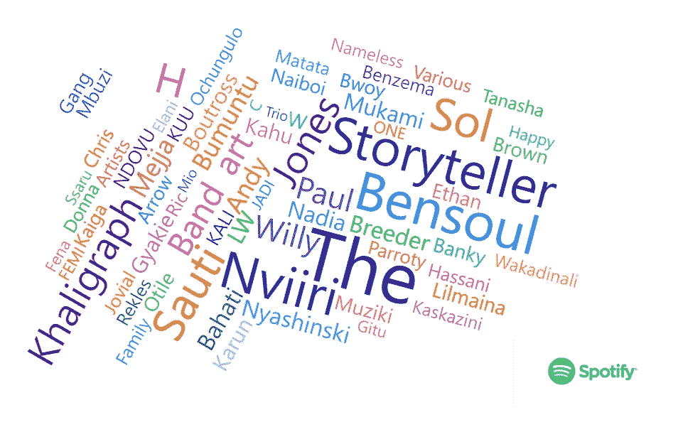
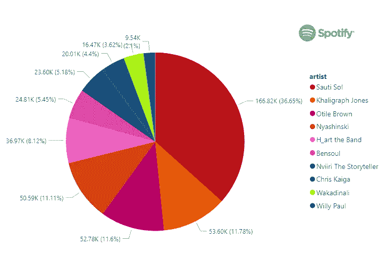
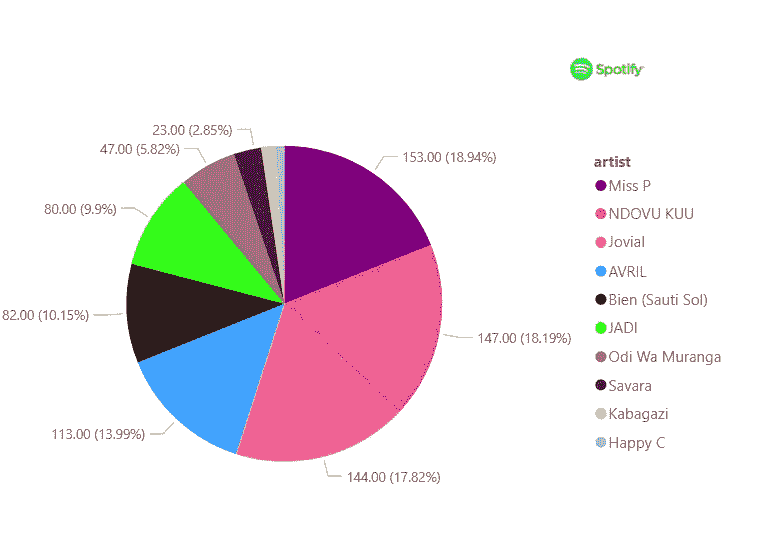
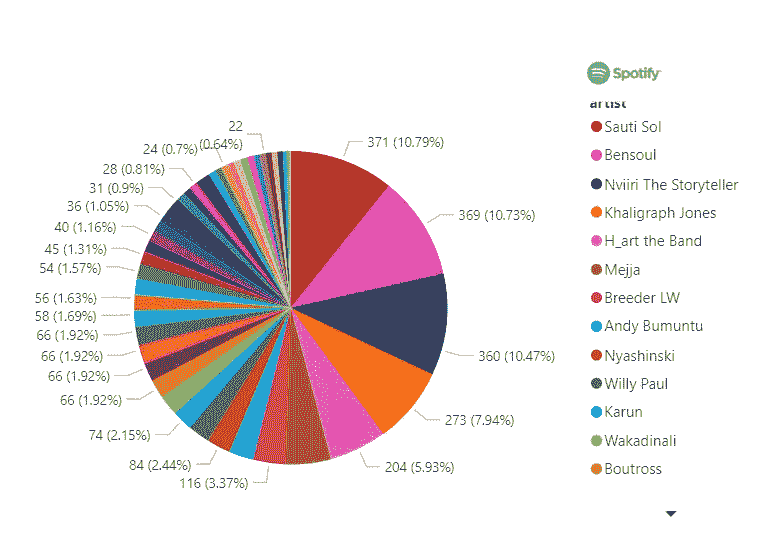
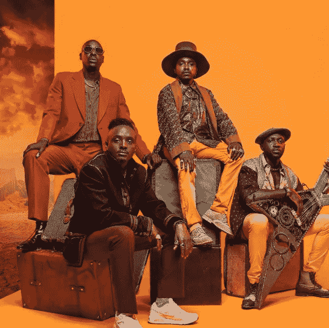
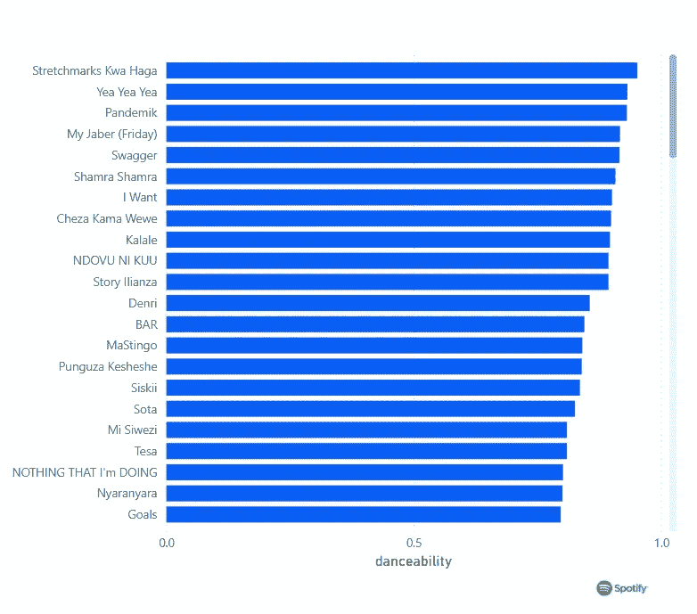
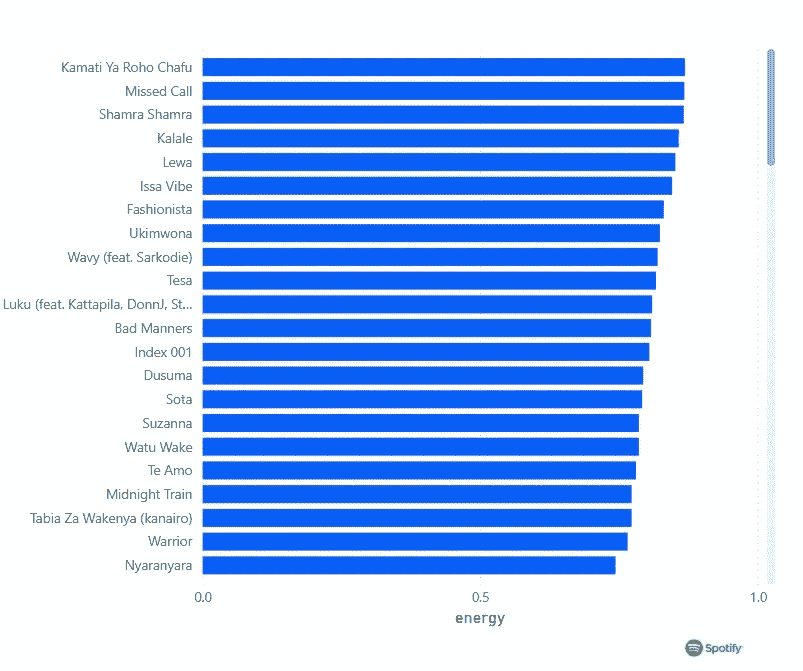
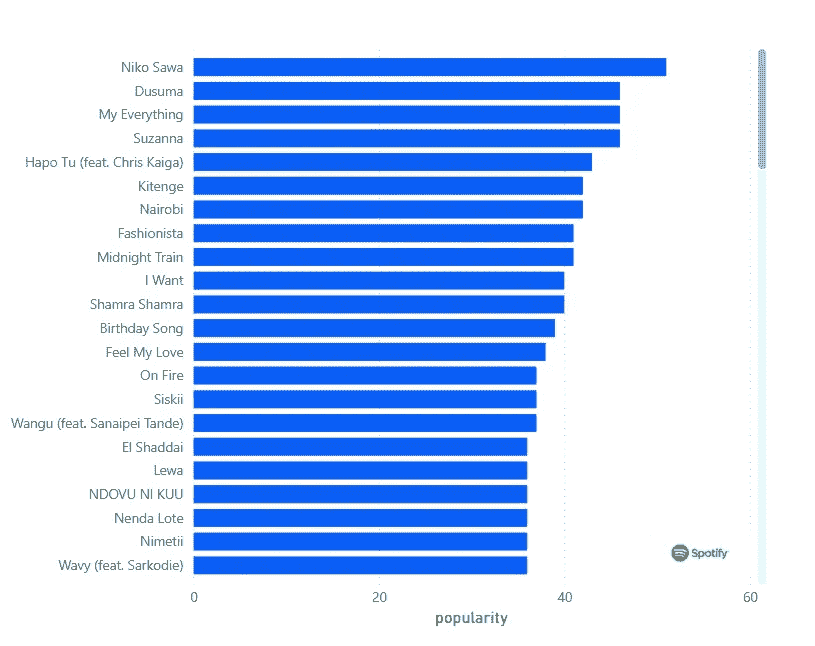
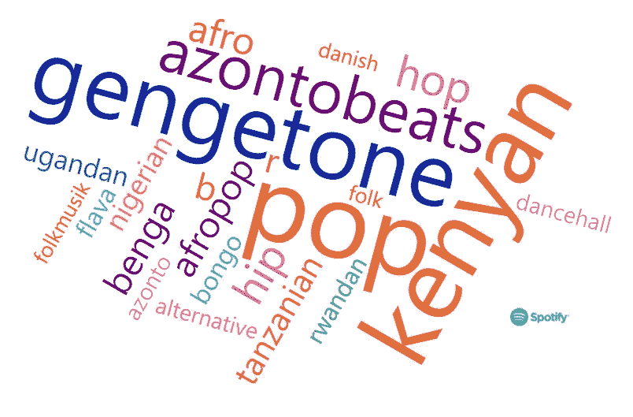

# 使用 Spotify 数据的肯尼亚艺术家受欢迎程度

> 原文：<https://medium.com/analytics-vidhya/kenyan-artists-popularity-using-spotify-data-7d79599c7270?source=collection_archive---------10----------------------->

Spotify 上受欢迎的肯尼亚艺术家

瑞典企业家丹尼尔·E·K 拥有的音乐流媒体服务 Spotify 最近将其服务带到了肯尼亚。尽管它从 2006 年就已经存在了，但直到最近我们国家的音乐爱好者才可以访问它，除了那些知道什么是 VPN 的人。

数据科学是科技行业的一个新领域，涉及从各种来源获取数据并分析这些数据。作为一名数据科学家和音乐爱好者，我最近发现了 Spotify 及其允许我们获取艺术家数据的 API，我决定戴上我的数据科学家帽子和耳机来分析我最喜欢的音乐流派之一，肯尼亚音乐，这是我的发现。

# 追随者

## 最高追随者😎

就像其他社交网站一样，Spotify 允许用户关注用户和艺术家。站在顶端的不是别人，正是拥有 167，267 名追随者的四人男孩乐队 SAUTI SOL👏👏👏排在第二位的是拥有 53773 英镑的“波浪先生”👏👏OTILE BROWN、NYASHINSKI 和 H_ART 乐队占据了其余的前五名。

以下是前十名的名单，瓦卡迪纳利出人意料地名列第九，威利·保罗名列第十

## 最低追随者🥴

跟那些追随者最少但绝对不是最没有才华的艺术家们在一起。P 小姐以 153 名粉丝高居榜首，而 001 指数中的新星 HAPPY C 粉丝数量最少，只有 8 人。令人惊讶的是，零零年代的流行女明星艾薇儿只有 113 名粉丝，两个 Sauti Sol 男孩 SAVARA 和 BIEN 也在名单中。这些家伙真的应该努力提高他们的追随者数量，因为更多的追随者=更多的听众。

# 流行

Spotify 从 1 到 100 的范围内对音乐家的受欢迎程度进行排名，100 是最受欢迎的，这是根据所有艺术家歌曲的受欢迎程度计算出来的。所以基本上他们把所有歌手的歌曲流行度相加，然后从 1-100 的范围内找出平均值

让我们看看谁名列榜首

## 最受欢迎😎

又来了！索迪索尔以 53 的受欢迎率高居榜首。干得好，索蒂·索尔，他们的学生本索尔和讲故事的 Nviiri 分列第二和第三。接管肯尼亚音乐舞台的索尔一代

最受欢迎和拥有最多追随者的艺术家

在 Spotify 上听 Sauti Sol[https://open.spotify.com/artist/4Rj9lQm9oSiMlirgpsM6eo](https://open.spotify.com/artist/4Rj9lQm9oSiMlirgpsM6eo)

# 歌曲

Spotify 为我们提供了不同的歌曲属性，例如

1.  歌曲的可舞性
2.  能量，
3.  长度、活性和
4.  响度，我们来看几个

## 可跳舞性💃

在脱衣舞娘的第一位置或杆位，双关语，舞蹈能力最高分，鼓点请🥁🥁拉伸马克夸哈加！！！LIL·梅纳的新歌以 0.95 的可舞性得分(满分 1 分)名列第一🔥🔥🔥。舞蹈能力得分第二的布特罗斯·耶耶耶以 0.93 分排在第二位，与潘德米克的 0.93 分持平

看看下面的分数

肯尼亚歌曲的可舞性评分

在 Spotify 上听 Stretchmarks Kwa Haga

[https://open.spotify.com/track/19typQ3WrdX17WF0QRDS5u?si=de7713955d12423d](https://open.spotify.com/track/19typQ3WrdX17WF0QRDS5u?si=de7713955d12423d)

## 活力🔥

在能源类别中，至少对我来说，Bien(Sauti Sol)的 Kamati ya Roho 夫差和 Willy Paul 以 0.87 的分数高居能源得分榜榜首，饲养员 LW 的 MISSED CALL 与 Mbuzi Gang 的 SHAMRA SHAMRA 并列第一，得分也为 0.87。

在 Spotify 上收听饲养员 LWs 未接来电

【https://open.spotify.com/track/4RAHERsvTGgzHNXbmJL198? si=484f161f90334897

## 流行🏆

一首歌曲的受欢迎程度。该值将介于 0 和 100 之间，100 是最受欢迎的。
一首曲目的流行度是一个介于 0 和 100 之间的值，100 是最流行的。流行度是通过算法计算的，并且在很大程度上基于该曲目的总播放次数以及这些播放的最近时间。因此，一首歌的播放次数越多，播放时间越近，流行度得分就越高。

与我写这篇文章时正在听的歌曲相匹配的是，NIKO·SAWA-恩维里的《讲故事的人》(SAUTI SOL)以 51 的受欢迎度排名第一，奥蒂尔·布朗(OTILE BROWN)的《杜苏玛》(Dusuma)以 46 的受欢迎度排名第二。

# 体裁

更通！！像 BOUTROSS，gengetone 伦理国王，MASAUTI，饲养员 LW，我想击中明星克里斯凯加，FEMI 一和 KAHU$H 等艺术家继续高居排行榜榜首。肯尼亚流行音乐和 Azontobeats 也是 Spotify 上最受欢迎的肯尼亚流派，不同国家的音乐，如尼日利亚、乌干达、坦桑尼亚和卢旺达的音乐也出现在肯尼亚的播放列表中。

肯尼亚音乐中的流行流派

KPIKenya 通过电话 0715353311 提取、转换、加载和处理这些数据，以便对数据科学项目进行查询。

特别感谢 DJ BARUTI 和 PROJECT DREAMS，他们是我用来提取这些数据的 Spotify 上的播放列表。

在 Spotify 上听 DJ BARUTI 的肯尼亚混音

通过梦想工程

https://Spotify/playlist/5 gowcaxcniu 2 l 6 moesmbbx