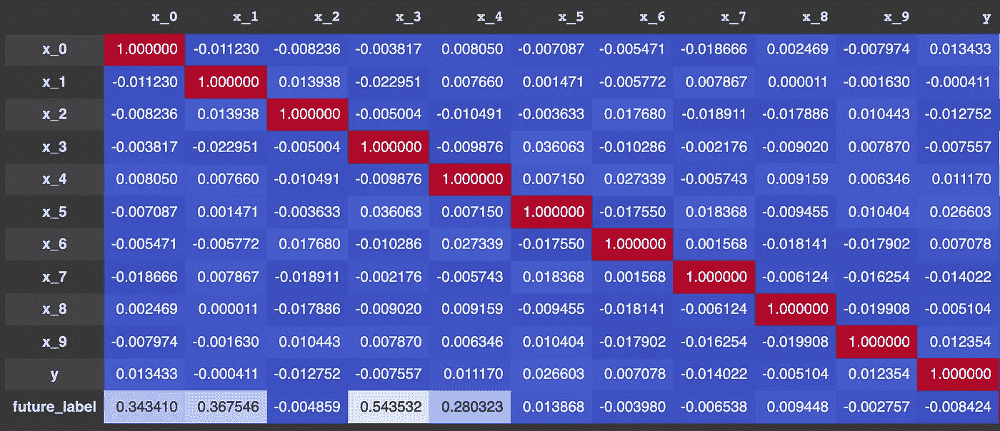
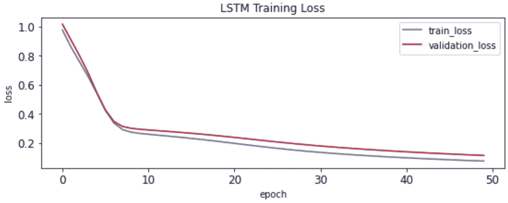
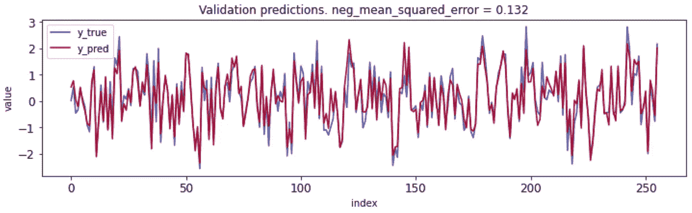
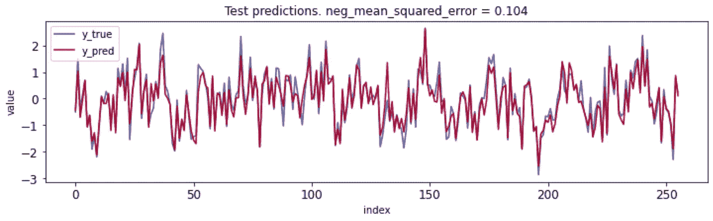

# 使用合成数据的喀拉斯 LSTM 预报

> 原文：<https://medium.com/analytics-vidhya/keras-lstm-forecasting-using-synthetic-data-9e1ae4e07d47?source=collection_archive---------0----------------------->

这篇文章最初发表在我的网站[adamnovotny.com](https://adamnovotny.com/blog/lstm-forecast-synthetic-data.html)

## 摘要

Keras LSTM 可以成为一个强有力的预测工具。下面是一个简单的模板笔记本，展示了如何设置数据科学预测实验。

**数据集**

使用 scikit-learn 回归生成器 [make_friedman1](https://scikit-learn.org/stable/modules/generated/sklearn.datasets.make_friedman1.html#sklearn.datasets.make_friedman1) 生成合成数据集。数据集是非线性的，有噪声，一些特征被手动缩放，使深度学习任务更具挑战性。通过使每个标签成为 *make_friedman1* 生成的值和先前标签的加权平均值来创建时间序列相关性。详见笔记本函数 *generate_data()* 。

下图显示了生成的要素、为同一时间段生成的 y 标注以及我们尝试预测的实际 future_label 之间的相关性。特征 x _ 0-x _ 4 是唯一的信息特征，从底部一行可以验证，显示有意义但不是很强的相关性:

**模特培训**

该模型是一个简单的神经网络，具有定义为 *keras.layers.LSTM(32)* 的单个隐藏层。

生成的数据集被分为训练集、验证集和测试集，每个数据集都遵循数据的时间序列特性。验证集用于提前停止训练，以防止过度拟合。然而，从下面的图表中可以看出，我们的合成数据集并不担心这一点。随着训练时期的继续，验证曲线从未开始增加:

**模型评估**

比较验证集的预测和实际标签显示了很强的性能，尽管在接近极值时可以进行明显的优化:

然而，验证集已经在训练期间用于早期停止的目的。这就是为什么我们留出一个模型在训练中从未见过的测试数据集。测试数据集是模型预期性能的唯一真实评估，在这种情况下，它确认模型对于合成数据集表现良好:

## 笔记本

*   [嵌入博文](https://adamnovotny.com/blog/lstm-forecast-synthetic-data.html#notebook)
*   [作为 html](https://adamnovotny.com/notebooks/lstm_synthetic_data.html)
*   [作为 Github 要诀](https://gist.github.com/adamnovotnycom/36af4c4400a7f970982685472661eba1)