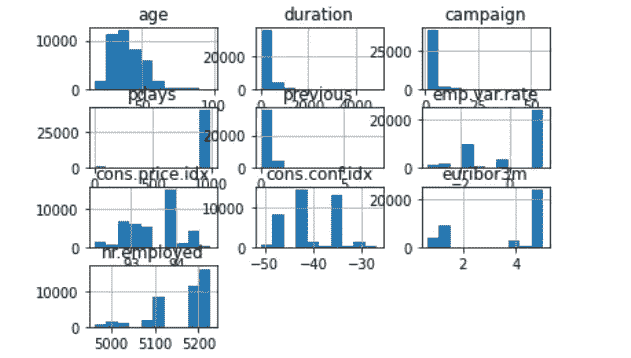

# 从零开始的核支持向量机

> 原文：<https://medium.com/analytics-vidhya/kernel-support-vector-machines-from-scratch-483ebd4175c?source=collection_archive---------4----------------------->

**SVM** (支持向量机)是一种**监督的** **机器学习**算法，通常用于**二分类问题**。这就是为什么训练数据可用于训练模型。

SVM 背后有三个主要想法:

*   **最大边距分隔符**:画一条线或超平面，使分隔符和训练数据之间的距离最大化，从而引入一个边距块
*   **软页边距分隔符**:当不同标签的数据混淆时，考虑页边距内的样本，画出最佳分隔线
*   **内核技巧**:对于数据分离边界不是线性的更复杂的模型，允许使用高阶多项式甚至非多项式函数

在本文中，让我们以一种描述性的方式来讨论 SVM 和内核的使用。

SVM 使用核函数在更高维度中绘制支持向量分类器。内核函数的类型有:

1.  线性的
2.  多项式
3.  径向基函数

Kernel trick 实际上是指使用高效且成本较低的方式将数据转换到更高维度。

核函数只计算每一对点之间的关系，就好像它们在更高维度中一样；他们实际上并没有进行转化。这种计算高维度关系而不实际将数据转换到更高维度的技巧被称为**内核技巧**。

让我们深入编码吧！

将遵循以下步骤。

# 1.按照数据挖掘过程中的指定对数据集进行预处理

正在读取数据集。

该数据与一家葡萄牙银行机构的直接营销活动相关。营销活动以电话为基础。通常，同一个客户需要不止一个联系人，以了解产品(银行定期存款)是否认购(“是”)或不认购(“否”)。目标是预测客户是否会认购定期存款。可以通过使用给定的链接来访问数据集。[https://archive.ics.uci.edu/ml/datasets/bank+marketing#](https://archive.ics.uci.edu/ml/datasets/bank+marketing#)

以下代码片段可用于将银行数据 CSV 文件加载到 pandas 数据框中，它将显示前 10 个数据点。

可以使用' df_original.info()'和' df_original.describe()'进一步分析数据集。

处理缺失值和异常值。

要进行预测，首先需要进行数据清洗。第一步，如果数据集中有缺失值，则将其删除。

由于输出为 false，因此该数据集中没有缺失值。为了检查是否有异常值，首先需要绘制箱线图。离群值是远离其余数据点的值。看不出任何异常值。

Q-Q 图和直方图。

通过绘制 Q-Q 图和直方图，我们可以分析是否需要进行转换，以及需要哪些功能。

如上所示，可以为每个特征绘制概率图来分析行为，通过直方图，我们可以看到‘年龄’、‘持续时间’、‘活动’、‘先前’是右偏的，而 nr.employed 是左偏的。因此，它需要做一个转变。

转变。

为了确定是否需要转换，可以使用 Q-Q 图和直方图。然后可以识别数据点是否处于正态分布。绘制直方图和 Q-Q 图后，我们可以看到一个特征是右偏还是左偏。如果一个特征是右偏的，我们使用平方根变换，如果是左偏的，我们使用平方变换将它们调整到正态分布。

转换年龄特征后，Q-Q 图和直方图如下所示。同样，根据需要对特征进行规范化。

特征编码。

特征编码的目的是将分类文本数据转换成数值。这里我们有两种方法，

1.  一键编码
2.  标签编码

在一次性编码中，我们使用向量，在标签编码中，我们使用整数作为标签。当有一个或两个类别时，一个热编码是最好的。但是当新的特征被添加到数据集时，很难使用一次性编码。如果有许多类别，标签编码是有用的，它也是一种流行的特征编码方式。

对于特征编码，将为分类特征创建一个单独的数据框，并使用一键编码对裂缝“y”进行编码。那么 y 柱已经被选择作为要预测的目标。

标准化的特征。

对特征进行缩放和/或标准化，使平均值=0，标准偏差=1。我们不应该缩放分类变量。

列车测试分离

在继续其余部分之前，让我们将整个数据集分成训练数据集和测试数据集。

我们应该预测的特征也应该从数据集的其余部分中分离出来。在我们的例子中，这将是“y”。

相关矩阵

由于 nr.employed 和 euribor3m 高度相关，因此可以删除一个功能。因此，euribor3m 已被放弃。

# 2.使用主成分分析的特征工程

对于降维，可以使用主成分分析(PCA)或奇异值分解(SVD)。这里我用了 PCA。PCA 将数据集中的维度投影到特征向量空间。然后，我们可以得到方差比来决定哪些特征将被丢弃。

通过查看 PCA 对象解释的 variance_ratio，我们可以决定在不影响实际数据的情况下可以减少多少个要素(组件)。我选择了 4 个组件来获得超过 99%的高方差维度。

# 3.应用具有核的支持向量机(SVM)来预测该值

我使用了“rbf”核，其中 C=1.2，gamma=0.5，以获得高精度测量。

**gamma**:RBF、poly、sigmoid 的核系数。更高的伽马值将试图精确地拟合每个训练数据集，即泛化误差，并导致过拟合问题。

**C:** 误差项的惩罚参数 C。它还控制平滑决策边界和正确分类训练点之间的权衡。

