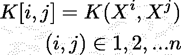

# 核

> 原文：<https://medium.com/analytics-vidhya/kernels-e8fc0a51fc0a?source=collection_archive---------7----------------------->

这个看似过时的想法，是理解机器学习和控制它的数学的重要一步。

# **特征图:**

让 y 表示两个类(用红色和蓝色斑点表示)，我们的数据有两个属性 X & X。

线性可分的

现在，我们可能有这样一种情况，我们的数据是线性可分的，我们可以清楚地画一条线来分隔这两个类。

但是，我们也可能遇到这样的情况，那是不可能的。

不可能线性分离

在这种情况下，没有一条线可以把这两个阶层分开。

在这种情况下，我们将输入映射到一个新的“特征空间”,这样我们可以使用一个更高维的超平面来分离我们的类。

我们定义一个函数，从 R -> R 取输入点

应用这个转换后，我们的数据看起来像这样。

现在，**我们可以画一个平面来分隔数据**。首先，我们可以看到这是如何工作的。唯一的区别是在第三维度。外圆的 X 和 X 值较大，导致 z 轴上的值较小。

# **内核:**

通常，只要我们需要两个输入变量的乘积，并且我们已经将输入空间转换成特征图，我们就需要计算特征图的点积**。计算或存储这些通常是非常昂贵的，这就是“内核技巧”的由来。**

例如在 SVM，

SVM 的优化问题[参考](http://web.mit.edu/6.034/wwwbob/svm-notes-long-08.pdf)

一旦我们将 Xi 和 Xj 转换成 Phi(Xi)和 Phi(Xj)，我们需要计算点积的有效方法。

SVM 的优化问题[参考](http://web.mit.edu/6.034/wwwbob/svm-notes-long-08.pdf)

让我们以一个非常常见的内核为例:

# **多项式核:**

二阶多项式核

所以这个内核所做的就是在两个 d 维向量之间取点积，然后求平方。这将花费 **O(d)时间**。

更具体地说，让我们以 **d=2 为例。**

K(X，Z)是多少？

膨胀，

现在，如果我们有一个如下的特征地图

由此我们可以清楚地看到，上面两者的点积与核函数的输出是一样的

我们的特征图的点积等于我们的内核

如果我们在没有内核的情况下计算 Phi(X)和 Phi(Z ),我们将不得不花费 O(d)来进行变换&随后的点积。

用我们的多项式核(3D 近似)转换我们的原始圆数据

在没有“核心技巧”的情况下，具有 10 个训练样本的 1000 维矩阵的输出时间大约为 5.5 秒

对于相同大小的矩阵，内核特技时间大约为 0.05 秒。

主要提示:每当我们有单个输入属性向量的点积时，我们可以使用核来提高计算效率。

# **克矩阵:**

实际上，如果我们有 N 个训练样本，我们形成一个 **Gram 矩阵(具有为一对样本计算的核值的矩阵)**如下:

训练样本

矩阵的第 I 行和第 j 列如下:

**有效内核的条件:**

为了使核有效，构造的矩阵必须是对称的(这应该是相当明显的，因为 K[j，i] = K[i，j]，因为点积保持不变)。此外，它们必须是半正定的(特征值是非负的)。我们可以用“能量测试”来证明这一点，对于任何向量 x，

