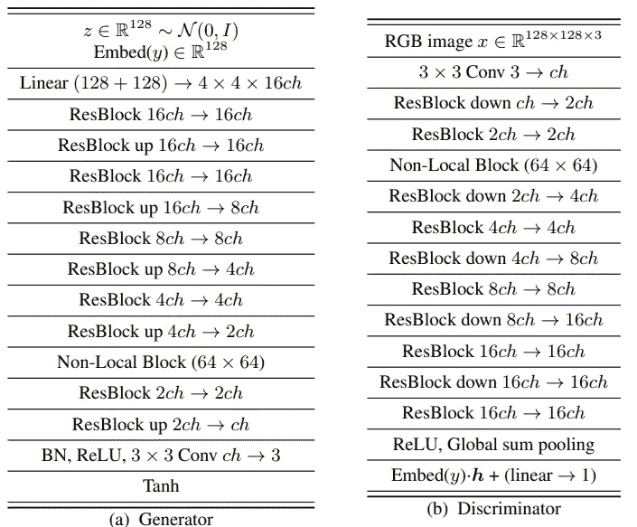
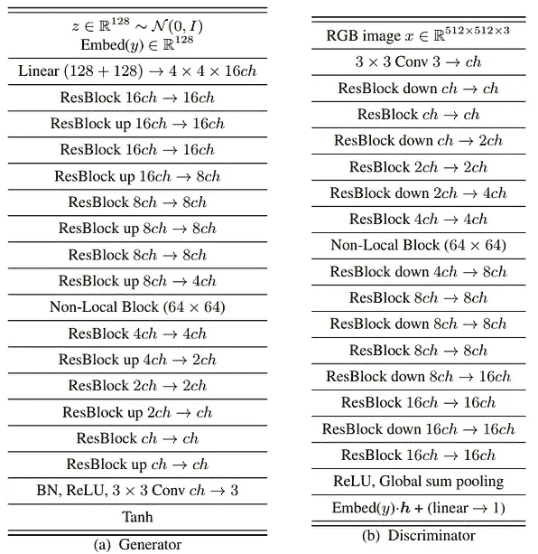

# BigGAN 的关键概念:训练和评估大规模图像生成

> 原文：<https://medium.com/analytics-vidhya/key-concepts-of-biggan-training-and-assessing-large-scale-image-generation-4c8303dcf73f?source=collection_archive---------6----------------------->

论文[高保真自然图像合成的大规模 GAN 训练](https://arxiv.org/abs/1809.11096)

由所提出的方法生成的 512×512 图像的例子

哇！这种具有高多样性和高分辨率的伟大图像可以通过 bigGAN 生成。我们将回顾该模型提出的关键见解和整体方法。尽管已经有多篇研究论文提出了高质量图像生成的这一阶段，但是本文中的方法并不复杂。

# 关键概念

*   本文建立在 SAGAN(自我注意 GAN)之上，它由自我注意机制组成，从细节上参考完整的图像。自我注意块在本文中被称为“非局部块”。
*   这项工作表明，简单地增加批量大小和缩放模型可以极大地影响图像质量。
*   潜在向量 Z 和类嵌入 y 通过具有多尺度的类条件 BatchNorm 的生成器，并帮助在生成的图像中加强类一致性。
*   这篇论文对 G 和 D 在训练和模崩溃时的行为提供了有趣的见解。

## 铰链损耗

铰链损耗是一种类似上图的损耗，也用于支持向量机。这种用于对抗性训练的铰链损耗被用于 SA-GAN，并且训练发生器和鉴别器有一点不同。鉴别器被训练来预测 D(x)>1 的真实数据和 D(G(z)) 0。为了精确起见，每个网络的损耗公式描述如下。

## 扩大 gan 的规模

根据实验结果，GANs 的性能可以从基线 SA-GAN 得到显著改善。上表比较了将批处理大小从最初的 256 增加到 2048 所带来的性能优势。该模型还可以在更少的迭代中达到更好的最终性能，如表中所示。渠道规模增加 50%也会使 IS(初始得分)增加 21%。

## 跳过 z，共享嵌入

对于 skip-z 连接，所提出的模型将潜在向量分成块，并且每个块被馈送到与类嵌入连接的残差块中。更具体地，140 个浮点的向量被分割成 7 个 20 个浮点的切片，并被馈送到每个残差块中的条件批量归一化层。嵌入对于每个残差块是共享的，因为它显示了经验性能提高。

## 条件批处理规范化

在批处理规范化中，批处理规范化图层的参数被设置为批处理元素的平均值和方差。在条件批处理规范化中，平均值和方差被设置为神经网络的输出。在这种情况下，它基于潜在切片 z 和类嵌入来进行调节。该模型获得关于类嵌入和噪声的知识的唯一方式是通过有条件的批量规范化。

图片来自代码为的[张纸](https://paperswithcode.com/method/conditional-batch-normalization#)

## 截断技巧

增加截断的影响。从左到右，阈值设置为 2，1，0.5，0.04。(b)对条件差的模型应用截断产生的饱和伪像。

本文提出的截断技巧是一种折衷生成图像的多样性和质量的方法。这是通过改变潜在向量 z 的范围来实现的。如上图所述，如果潜在向量被截断到一个较小的范围内，图像质量会高得多，尽管会损失一些变化。

## 自我注意机制/非局部阻滞

[萨根](https://arxiv.org/abs/1805.08318)在网络的中间层应用自我关注，使得能够从完整图像的细节进行调节。SAGAN 论文中详细阐述了这一指标，这超出了本文讨论 bigGAN 方法的范围。BigGAN 在生成器和鉴别器的 64x64 分辨率中都应用了自我关注层。

# 模型架构

BIgGAN 架构，分别用于 128x128、256x256、512x512 图像生成。

分别为生成器架构、G 剩余块、D 剩余块架构。

上面关于 BigGAN 模型架构的图总结了完整的管道。潜在向量 z 和类嵌入被连接并馈入生成器中的每个残差块。每个剩余块基本上由两个卷积和一个跳跃连接组成。类嵌入连接在鉴别器的最后一层之前。

## 比根深海

BIgGAN-deep 架构，分别用于 128x128、256x256、512x512 图像生成。

分别为生成器架构、G 剩余块、D 剩余块架构。

本文还提出了原始模型的一个更深层次的变体:BigGAN-deep。残差块结构变得更加复杂，具有 4 个卷积，残差块的数量增加了一倍，导致模型深度增加了大约 4 倍。如下表所述，这个修改版本显示了 IS/FID 的显著增加，并显示了 GANs 也从增加深度中受益。

## 评估不稳定性

本文实验了各种情况下的模式崩溃，并观察了 D 和超参数配置的各种约束的训练曲线。这在论文的大部分和附录中有详细的阐述，我强烈推荐阅读原文。可以读到关于 G 和 D 在训练期间和在模式崩溃时的行为的有趣见解。

> 作者引用
> 
> 我们还观察到，在训练期间，D 的损失接近于零，但在崩溃时会急剧上升。 **这种行为的一种可能解释是 D 对训练集过度拟合，**记忆训练实例而不是学习真实和生成图像之间的一些有意义的边界。作为对 D 的记忆的简单测试，我们在 ImageNet 训练和验证集上评估未崩溃的鉴别器，并测量被分类为真实或生成的样本的百分比。虽然训练准确率始终在 98%以上，但验证准确率却在 50–55%之间，不比随机猜测好多少。**这证实了 D 确实在背训练集；**我们认为这符合 D 的角色，D 的角色不是明确地进行概括，而是提取训练数据，并为 g 提供有用的学习信号。
> 
> **我们发现稳定性不仅仅来自 G 或 D，而是来自他们在对抗训练过程中的相互作用**。虽然他们状态不佳的症状可以用来跟踪和识别不稳定性，但确保合理的状态对于训练来说是必要的，但不足以防止最终的训练崩溃。通过强约束 D 来加强稳定性是可能的，但是这样做会导致巨大的性能损失。使用当前的技术，**可以通过放松这种调节并允许在训练的后期阶段发生崩溃来实现更好的最终性能，此时模型已经得到充分的训练以实现良好的结果。**

# 摘要

在本文中，我们回顾了在训练 BigGAN 生成大规模图像时使用的各种方法。我们回顾了以下技术:

*   铰链损耗
*   自我注意机制
*   条件批处理规范化
*   扩大模型规模的能力(批量大小、深度、渠道)
*   截断技巧
*   BigGAN/BigGAN-deep 建筑

我们还了解到 GAN 培训中存在的问题

*   鉴别器在训练图像上过度拟合，因此不能向发生器提供有意义的信号。
*   在不约束 D 的情况下，模式崩溃是不可避免的，并且必须是可能的，这将导致性能下降。