# Cole Nussbaumer Knaflic 的《用数据讲故事》一书的要点

> 原文：<https://medium.com/analytics-vidhya/key-points-from-the-book-storytelling-with-data-by-cole-nussbaumer-knaflic-8c0a7b08960?source=collection_archive---------9----------------------->

从数据中编织一个好故事的关键步骤如下:

1.  理解上下文
2.  选择合适的显示器
3.  消除杂乱
4.  在你想要的地方吸引注意力
5.  像设计师一样思考
6.  讲故事

# 理解上下文

## **为我们的解释性工作的背景而提出的问题**

1.  我们在和谁交流？
2.  我们想让观众知道什么或者做什么？
3.  我们如何利用这些数据来证明这一点？

## 背景咨询:要问的问题

通常，对于一个给定的项目，分析人员可能没有得到合适的上下文，所以在这一点上，最重要的是寻找设置项目上下文的信息。可以帮助我们的问题有:

1.  什么背景信息是相关的或重要的？
2.  谁是决策者？我们对他们了解多少？
3.  我们的受众有哪些偏见会让他们支持或抵制我们的信息？
4.  有什么数据可以加强我们的论点？我们的观众对这些数据熟悉吗，还是新的？
5.  成功的结果会是什么样的？

**可能帮助我们成功传达研究结果的 3 种沟通辅助手段是“3 分钟故事”、“大创意”和“故事板”。**

1.  3 分钟故事——一个非常简洁的故事，却包含了所有重要的信息。
2.  大想法——传达句子中最重要的观点。
3.  故事板——按照您希望向观众展示的顺序直观地排列信息。作者的建议是使用低技术的方法，比如在一张纸上写下想法，而不是过多地依赖演示软件。

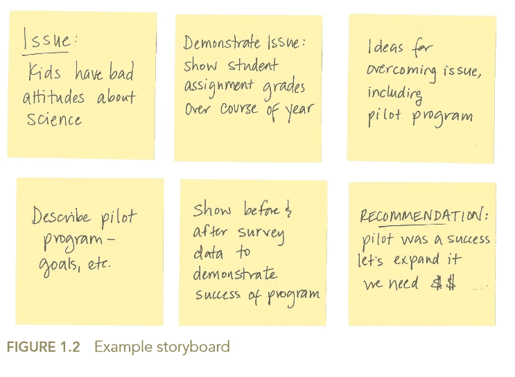

# 消除杂乱

*启发式是视觉感知*的格式塔原则，它可以用来识别我们视觉中的哪些元素是*信号*(我们想要传达的信息)，哪些可能是*噪音*(杂乱)。原则有:*接近性、相似性、封闭性、闭合性、连续性、连接性。*

**接近度**

我们倾向于认为物理上靠得很近的物体属于一个群体的一部分。

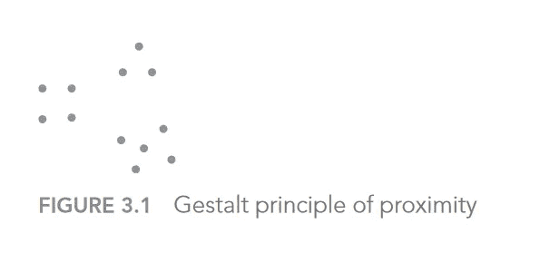

我们可以利用这一点，让人们在没有任何界限的情况下查看密切相关的信息。

**相似度**

颜色、形状、大小或方向相似的物体被认为是相关的或属于一个群体的一部分。

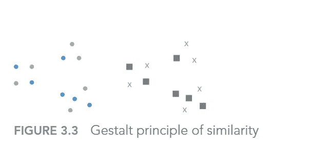

1.  这可以在表格中加以利用，以帮助将观众的目光吸引到我们希望他们关注的方向。
2.  用单一颜色对特定的行进行颜色编码是一种提示，让我们的眼睛阅读整个行(而不是整个列)，这消除了任何不必要的边界。

**外壳**

我们认为物理上封闭在一起的物体属于一个群体的一部分。

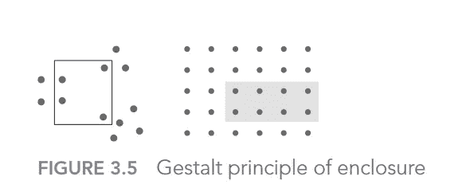

我们可以利用封闭原则的一个方法是在我们的数据中画出一个视觉区别，如下图所示。

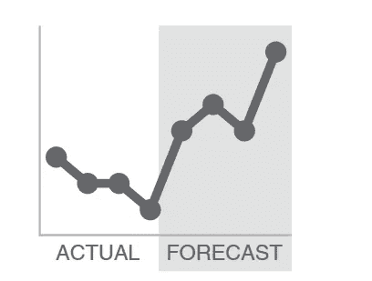

**关闭**

1.  封闭概念认为人们喜欢事情简单，并且符合我们头脑中已经存在的结构。正因为如此，人们倾向于将一组单独的元素感知为一个单一的、可识别的形状——当整体的一部分缺失时，我们的眼睛会填补空白。
2.  闭合原理告诉我们，图表中的各种边界是不必要的——我们可以删除它们，我们的图表仍然显示为一个内聚的实体。额外收获:当我们去掉那些不必要的元素时，我们的数据会更加突出。

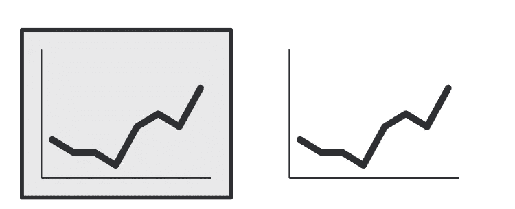

**连接**

1.  我们倾向于将物理连接的对象视为一个组的一部分。
2.  我们经常利用连接原理的一种方式是在线图中，以帮助我们的眼睛看到数据中的顺序。

## 整理图表:使用*格式塔原理*一步一步来

原始图表

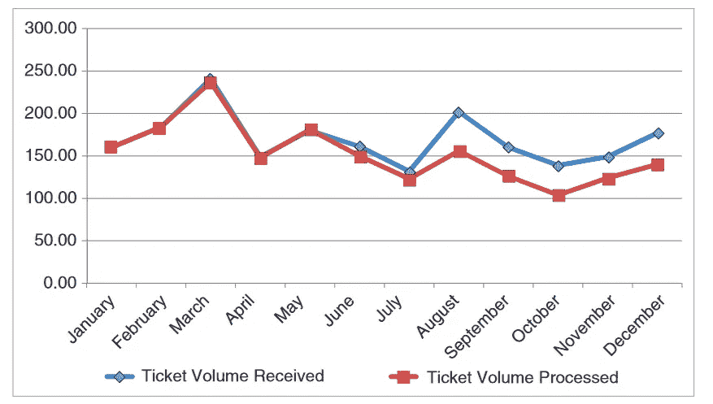

第一步:删除图表边框

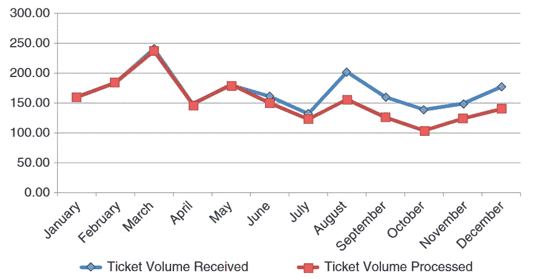

第二步:去除网格线。

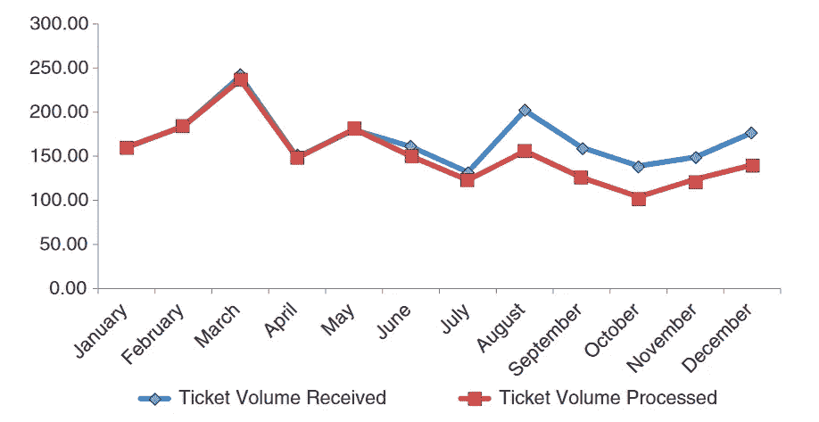

第三步:删除数据标记

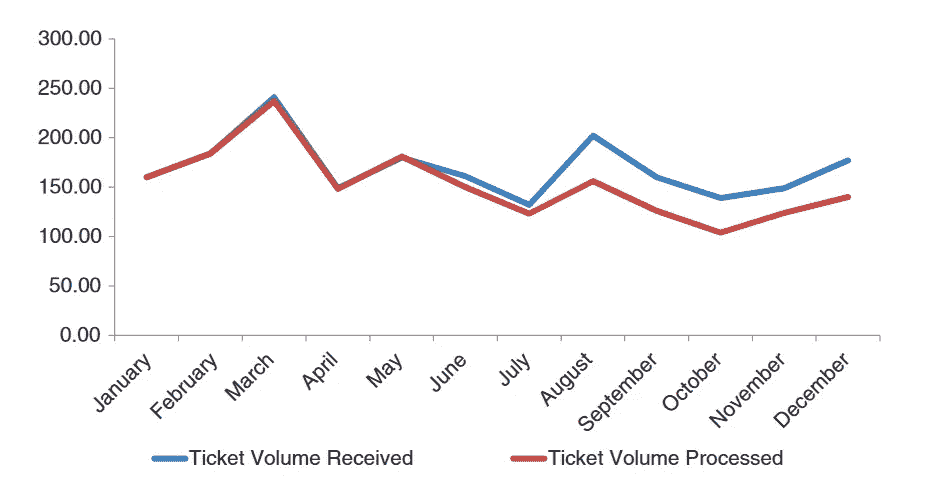

第四步:清理轴标签。

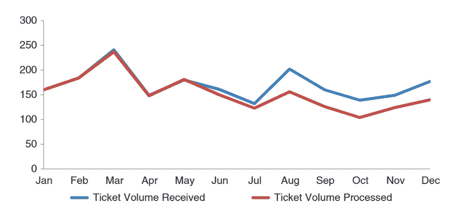

第五步:直接标记数据

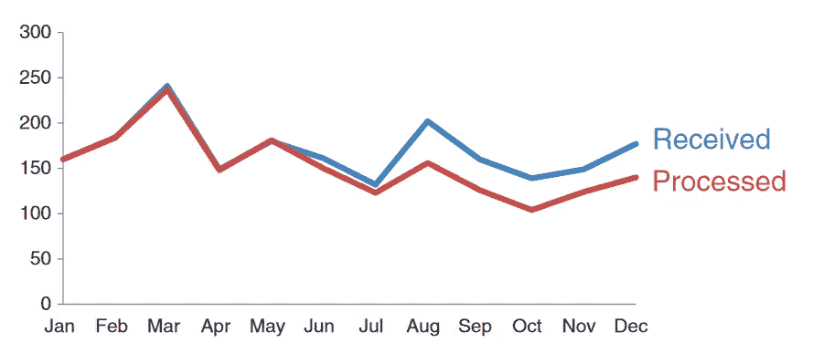

什么是前注意属性？

前注意属性是我们不用有意识的努力就能注意到的视觉属性。

# 在你想要的地方吸引注意力

战略性地使用前注意属性可以帮助我们让我们的观众在他们知道他们正在看之前就看到我们想让他们看到的东西！

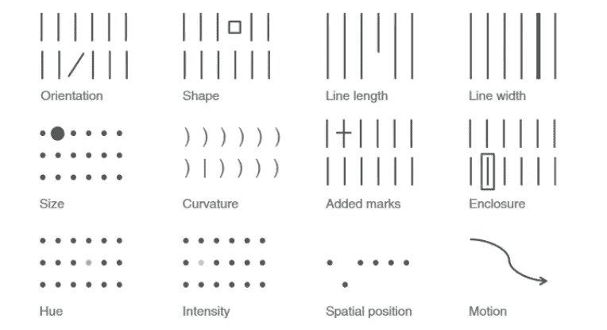

# 像设计师一样思考

**启示的概念**——由于物体的精心设计，很容易理解它们的用途。

如何在我们的故事讲述中运用这个概念？

我们提供的任何数据都必须让受众容易理解。我们如何做到这一点？1.突出重要的东西。消除分心，和 3。创建清晰的信息层级。

**易访问性的概念—** 设计应该可供不同能力的人使用。

如何使我们的数据更容易被具有不同程度技术专长的人访问？

1.  不要把事情过分复杂化。
2.  尽可能使用视觉文本。使用文本来标记复杂视觉的各个方面。

**美学的概念** —这意味着我们的数据必须赏心悦目。

1.  *巧用色彩。*色彩的使用应该始终是一个有意的决定；谨慎而有策略地使用颜色来突出视觉效果的重要部分。
2.  *注意对准*。组织页面上的元素，创建干净的垂直和水平线条，以建立统一和凝聚力的感觉。
3.  *利用空白。*保留页边距；不要为了填满空间而拉伸你的图形，或者仅仅因为你有多余的空间而添加东西。

# 参考

用数据讲故事

*本帖所有图片均取自参考书。