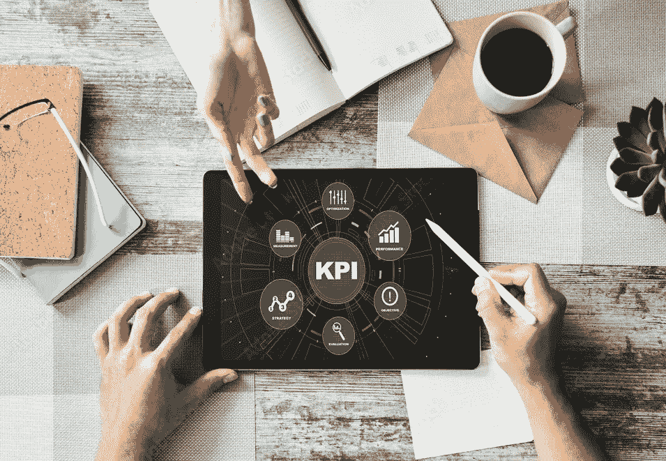
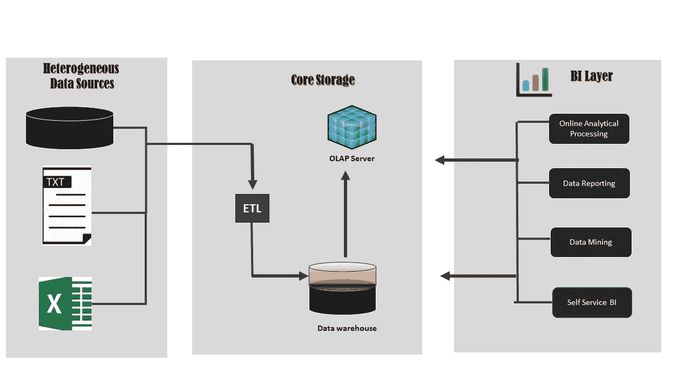

# 商业智能的关键！

> 原文：<https://medium.com/analytics-vidhya/key-to-business-intelligence-cabe3d3406e0?source=collection_archive---------7----------------------->

## “一张照片的最大价值在于它能迫使我们注意到我们从未想过会看到的东西。”约翰·图基

今天，我们都生活在一个数据驱动的世界，我们都知道数据是如何飞速发展的。世界正在处理来自许多应用程序的各种数据、来自 IOT 设备的数据以及更多数据。这种被操作的数据可以是不同的形式，例如结构化的、非结构化的和半结构化的。总的来说,“数据是当今企业的命脉”,组织在业务的各个方面捕获的数据比以往任何时候都多。

**照片-**

# ****让我们把事情说清楚！什么导致 BI？****

**如前所述，企业拥有各种形式和来自各种来源的大量数据，一些自动化流程会将这些数据存储到面向主题的数据仓库中。既然我们已经将业务的所有方面都放在一个公共数据存储中，那么就可以通过使用创建的数据仓库来进行报告和可视化。**

****

****解决方案架构—数据仓库和商业智能****

**简而言之，商业智能就是利用我们的业务所需的数据，以便我们可以分析和可视化这些数据，从而深入了解我们的业务表现。基本上，商业智能在正确的时间向管理层提供相关和可靠的信息，以便管理层做出更好的商业决策。**

****维基百科**将商业智能定义为“企业用于商业信息数据分析的策略和技术的集合。”他们有各种各样的定义，但你应该明白商业智能的主要概念是揭示隐藏的模式，并最终促进决策。**

**为了更好地理解，让我们讨论一个实际使用商业智能(BI)的真实场景！**

**假设你是一家零售连锁店的经理，该连锁店允许在商店和在线平台上进行交易，并且你还向顾客提供可以在商店或通过在线平台刷卡的会员卡。忠诚卡将两种交易与唯一的忠诚卡号相关联。在这种情况下，BI 方法和软件能够对客户信息数据运行分析报告。无论公司的规模是否扩大，BI 都有助于管理部门发现客户对我们品牌的忠诚度，他们购买的产品和频率，以及他们是否喜欢从商店或网上购买。最终，你将能够理解商业智能引导你预测单个客户群的需求、习惯、偏好等等。**

**让我们深入了解一下**为什么企业应该拥有商业智能解决方案？****

****

*   **加速和改善决策**
*   **优化内部业务流程**
*   **有助于预测业务的未来，同时分析现在和过去。**
*   **提高运营效率。**
*   **对业务相关的查询做出更快的响应**
*   **不要再猜了。**

**了解商业智能的需求和重要性目前，行业中正在使用许多具有良好特性和特征的商业智能工具。BI 解决方案的选择取决于企业的需求。但是总的来说，现在的现代 BI 工具有一些**共同的和最重要的特征**。**

1.  **云 BI -大多数新部署源自云。**
2.  **数据连接和接收——允许合并来自不同来源的数据**
3.  **数据加载选择-内置索引数据、管理数据加载和刷新计划的能力。**
4.  **数据准备——在可视化之前，提供高效的功能来清理和转换数据，满足用户需求。**
5.  **可扩展性——通过优化的性能和大型用户部署和能力处理大量数据和复杂模型。**
6.  **交互式数据可视化——帮助交互式地分析和操作数据。**
7.  **增强信息发现——自动发现视觉效果和各种重要发现，如相关性、异常、聚类、链接和与用户相关的数据预测，而无需用户构建模型或编写自己的算法。**
8.  **工作流协作——允许用户拥有一个可视化的共享协作环境。**

# ****这里有一些 2021 年流行的现代商务智能工具****

1.  **Microsoft Power BI**
2.  **（舞台上由人扮的）静态画面**
3.  **Oracle 分析云**
4.  **邓达斯毕**
5.  **板**
6.  **微观战略**
7.  **西森斯**
8.  **Qlik**
9.  **多莫**

# ****这些公司是如何使用商务智能的？****

**公司主要使用 BI 来监控业务的各个方面，如销售规划和预测、客户行为分析、容量和资源规划、定价和报价优化、质量保证分析、实时流程监控，而其他一些部门，如供应优化、维护预测、欺诈预防和安全分析也在业务环境中使用 BI。**

****

**[万花筒](https://unsplash.com/@kaleidico?utm_source=medium&utm_medium=referral)在 [Unsplash](https://unsplash.com?utm_source=medium&utm_medium=referral) 上拍摄的照片**

**好吧！现在是时候介绍我们应该理解的第一件也是最重要的事情了，以一个好的商业智能分析结束。为了进行成功的分析和预测，我们应该知道在仪表板或报告中使用哪种图形表示更好，以便于管理层看到隐藏的模式和各种未公开的数据故事。**

**从分析师的角度来看，图形表示被称为可视化。一些最常见的可视化是条形图，饼图，散点图，直方图等等。我们还应该意识到这样一个事实，即并非所有的视觉效果都能帮助我们识别数据中隐藏的模式。选择正确的可视化方式来清晰准确地呈现信息是一门艺术，只要稍加练习，你就可以成为这方面的专家。**

****

# **很少有可视化和他们的目的…**

1.  **分析一段时间内的趋势-折线图、KPI、面积图**
2.  **分析数据以进行比较和排名-条形图、气泡图、柱形图**
3.  **分析变量之间的关系-散点图、簇状柱形图、气泡图**
4.  **分析某些属性是如何分布的——盒须图、直方图、折线图**
5.  **分析部分到整体的关系-饼图、圆环图、树形图、热图。**

**现在基本都弄好了！很适合动手体验现代商务智能工具。希望这能让你更好地理解商业智能的关键概念。希望在下一篇文章中提出另一个有趣的话题，直到那时…**

*****快乐解析！*****

**科维莎·卡莱切尔万**

**数据科学(本科)**