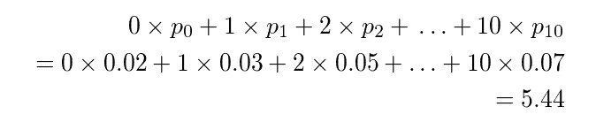

# KL 发散寻找最佳

> 原文：<https://medium.com/analytics-vidhya/kl-divergence-to-find-the-best-5c2d38560b13?source=collection_archive---------6----------------------->

好吧，让我告诉你，我不知道 KL 散度，直到我参加了一个课程。因为对我来说这是一个相当复杂的概念，所以我想写一下！

我看了一些关于 KL 发散的文章。根据我的经验，用语言表达的最好方式就是举例。我将继续引用[这篇令人惊叹的文章](https://www.countbayesie.com/blog/2017/5/9/kullback-leibler-divergence-explained)中的一段话(我鼓励你去读它)。有时，我们可能希望将我们的数据分布呈现为更简单的分布。

想象一下，美国宇航局有一个新的任务，派遣太空科学家到一个新的星球观察咬人的蠕虫。科学家们发现蠕虫有同样数量的牙齿，但随着时间的推移，它们会因为*咀嚼*而失去牙齿。不管怎样？所以，他们把他们的数据放在一起，这就是他们的任务结束:

摘自[此处](https://www.countbayesie.com/blog/2017/5/9/kullback-leibler-divergence-explained)。

一个问题。他们必须将这些数据发送到地球进行更多的检查。但是它们离地球很远。发送这些数据会很昂贵。他们能做什么？他们可以减少参数的数量！但是，要做到这一点，他们必须找到最佳分布来拟合这些数据，以减少信息损失。

他们可以尝试均匀分布。这个分布需要唯一参数是可能的值。数据有 11 个可能的值。

***P_uniform = 1 /可能值= 1 / 11 = 0.0909***

每个蠕虫都有相同的统一可能性。

取自[此处](https://www.countbayesie.com/blog/2017/5/9/kullback-leibler-divergence-explained)。

现在，我们没有多样性。显然，均匀分布不是他们数据的最佳选择。

他们可以试试二项分布。我们可以定义二项分布的均值和方差。

***均值= np
方差= np(1-p)***

他们可以使用二项分布的平均值。 *n* 是从蠕虫种群中观察到的最大齿数，为 10。*表示*是蜗杆的预期齿数。我们可以这样计算:

摘自[此处](https://towardsdatascience.com/light-on-math-machine-learning-intuitive-guide-to-understanding-kl-divergence-2b382ca2b2a8)。

***5.44 = 10×p***

***p = 0.544***

摘自[此处](https://www.countbayesie.com/blog/2017/5/9/kullback-leibler-divergence-explained)

好像也不符合我们原来的分布。那他们该怎么办？他们如何找到最适合他们原始分布的分布呢？

让我们稍微分解一下。

他们想要的是用较少的参数发送数据以降低成本，并找到最佳分布以减少信息的损失。

现在，我更清楚了。为了理解我们设法减少信息，我们需要知道数据最初有多少信息。

## 熵

熵是*信息论*中的一个重要度量。信息论的主要目标是量化数据中的信息量。

我想引用一个我在网上找到的关于熵的很好的定义:

> 熵允许我们对生活中最紧迫的问题之一做出精确的陈述和进行计算:不知道事情会如何发展。换句话说，熵是不确定性的一种 T2 度量。

当然还有一个也是唯一的等式:

[你可以说香农熵](https://towardsdatascience.com/entropy-is-a-measure-of-uncertainty-e2c000301c2c)

如果我们使用 *log* 2 进行计算，我们可以将熵解释为“对信息进行编码所需的最小位数”。在这种情况下，信息将是给定我们的经验分布的牙齿计数的每个观察值。给定我们观察到的数据，我们的概率分布具有 3.12 比特的熵。位数告诉我们，平均来说，我们需要多少位来编码我们在单一情况下观察到的齿数的下限。[1]

如果我们的目标是最小化不确定性(熵),我们应该远离均匀分布。因为对于**均匀**分布，所有结果具有相同的概率(你可以从上面看到)。在我们的例子中，对于蠕虫的牙齿计数概率，它不能正确地代表我们的数据。

哪个更好的最好测试是询问哪个分布保存了来自我们原始数据源的最多信息。这就是 Kullback-Leibler 散度 的用武之地。

# KL-散度

> Kullback-Leibler 散度只是对我们的熵公式的一个小小的修改。除了概率分布 p，我们还加入了近似分布 q。

设 p(x)和 q(x)是一个离散随机变量 x 的两个概率分布，即 p(x)和 q(x)之和均为 1，且对于 x 中的任意一个 x，p(x) > 0，q(x)> 0 . D _ KL(p(x)，q(x))定义为:[4]

摘自[此处](https://www.countbayesie.com/blog/2017/5/9/kullback-leibler-divergence-explained)

KL 散度(T1)是一个 T2 概率分布(T3)与另一个参考概率分布(T3)不同的度量。

> *【p | | g】*中的两条垂直线是指 q 分布不同于 p 分布。

你可能会得出这样的结论，因为 *KL 散度度量两个分布之间的距离*，所以它是一个 ***距离*** 度量。但这并不是因为它的 ***不是一个*** ***公制度量*** 。

KL 散度不**对称**:从 p(x)到 q(x)的 KL 一般和从 q(x)到 p(x)的 KL 不一样。

DKL( *p* || *q* )是一个非负测度。DKL(*p*|*q*)≥0 且 DKL(*p*|*q*)= 0 当且仅当 *p* = *q* 。

# **实施**

下面的代码是实现两个高斯分布之间的 KL 散度。对于这种实现，我们需要两个高斯分布样本。

好吧，过了一段时间就这样了。我将写更多关于高级统计概念的内容。等着吧！

# 参考

[【1】](https://www.countbayesie.com/blog/2017/5/9/kullback-leibler-divergence-explained)库尔贝克-莱布勒散度解释

[【2】](https://towardsdatascience.com/light-on-math-machine-learning-intuitive-guide-to-understanding-kl-divergence-2b382ca2b2a8)光论数学机器学习直观指南理解 KL 发散

熵是对不确定性的一种度量

[【4】](http://hanj.cs.illinois.edu/cs412/bk3/KL-divergence.pdf)KL-散度

[【5】](https://github.com/inzva/AI-Labs-Joint-Program/blob/main/inzva%20x%20METU%20ImageLab%20Joint%20Program/Week%202%20-%20Autoregressive%20Models%2C%20Maximum%20Likelihood%20Estimation/inzva_x_METU_ImageLab_Joint_Program_Week_2_Solutions_Notebook.ipynb)AI 实验室联合计划