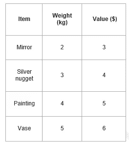

# 背包动态规划

> 原文：<https://medium.com/analytics-vidhya/knapsack-dynamic-programing-45dbb4b74f77?source=collection_archive---------10----------------------->

让我们举一个例子，我们将通过背包动态规划来解决它。

分数背包问题，顾名思义，物品在这里是可分的。如果拿走全部物品是不可能的，我们甚至可以把任何物品的一部分放进背包。用贪心法求解。

# 背包问题变体-

背包问题有以下两种变体-

1.分数背包问题

2.0/1 背包问题

**分数背包问题采用贪婪方法求解，步骤如下-**

# 第一步:

对于每个项目，计算其价值/重量比。

# 第二步:

按照价值/重量比的降序排列所有项目。

# 步骤 03:

从比率最高的物品开始，将物品放入背包。

把尽可能多的东西放进背包。

# 时间复杂度-

主要的耗时步骤是按照价值/重量比的降序对所有物品进行分类。

如果项目已经按要求的顺序排列，那么 while 循环需要 O(n)时间。

[**快速排序**](https://www.gatevidyalay.com/quick-sort-sorting-algorithms/) 的平均时间复杂度为 O(nlogn)。

因此，包括排序在内的总时间为 O(nlogn)。

# 0/1 背包问题-

在 0/1 背包问题中，

顾名思义，物品在这里是不可分割的。

我们不能拿任何项目的分数。

我们要么完全接受一个项目，要么完全放弃它。

采用动态规划方法求解。

# 使用动态规划的 0/1 背包问题

考虑一下-

背包重量容量= w

有一定重量和价值的物品数量= n

0/1 背包问题使用动态规划在以下步骤中解决

# 第一步:

画一个表格，比如“T ”,有(n+1)行和(w+1)列。

用零填充第 0 行和第 0 列的所有方框，如下所示-

# 第二步:

开始从左到右从上到下逐行填充表格。

使用以下公式-

**T (i，j) = max { T ( i-1，j)，value i + T( i-1，j —权重 i ) }**

这里，T(i，j) =所选物品的最大值，如果我们可以取物品 1 至 I，重量限制为 j。

这一步导致完全填充表格。

然后，最后一个盒子的值代表可以放入背包的最大可能值。

# 步骤 03:

为了识别必须放入背包以获得最大利润的物品，

考虑表格的最后一列。

开始从下到上扫描条目。

当遇到一个条目的值与存储在其上面的条目的值不同时，标记该条目的行标签。

扫描完所有条目后，标记的标签代表必须放入背包的物品。

# 时间复杂度-

表中的每个条目需要恒定的时间θ(1)来进行计算。

填充(n+1)(w+1)个表格条目需要θ(nw)时间。

因为追踪过程追踪 n 行，所以追踪解需要θ(n)时间。

因此，使用动态规划求解 0/1 背包问题需要总的θ(nw)时间。

> ***问题陈述:*** *一个小偷入室抢劫。他包里最多能装 5 公斤的东西。房子里有 4 件物品，重量和价值如下。如果小偷完全拿走或完全留下物品，他应该拿什么物品？*

**解决方案:**

前提条件:

背包容量(w) = 5 公斤

项目数(n) = 4

第一步:绘制 T (n+1)行和(w+1)列的表格。

n =物品数量，w =重量

我们可以用给定的公式来识别这些值: **T (i，j) = max {T (i-1，j)，value i + T (i-1，j — weight i ) }**

**识别 T (1，1):**

我们有，

i = 1

j = 1

(值)i =(值)1 = 3

(重量)i =(重量)1 = 2

让我们把价值和确定的 T (1，1)

代入这些值，我们得到-

T (1，1)= max { T(1–1，1)，3+T(1–1，1–2)}

T (1，1) = max {T (0，1)，3 + T (0，-1)}

T (1，1) = T (0，1){忽略 T (0，-1)}

T (1，1) = 0

类似地，计算所有条目。

在计算完所有条目并将其填入表格后，我们得到了下表-

最后一项表示可以放入背包的最大可能值。

**因此，可以放入背包的最大可能值= 7。**