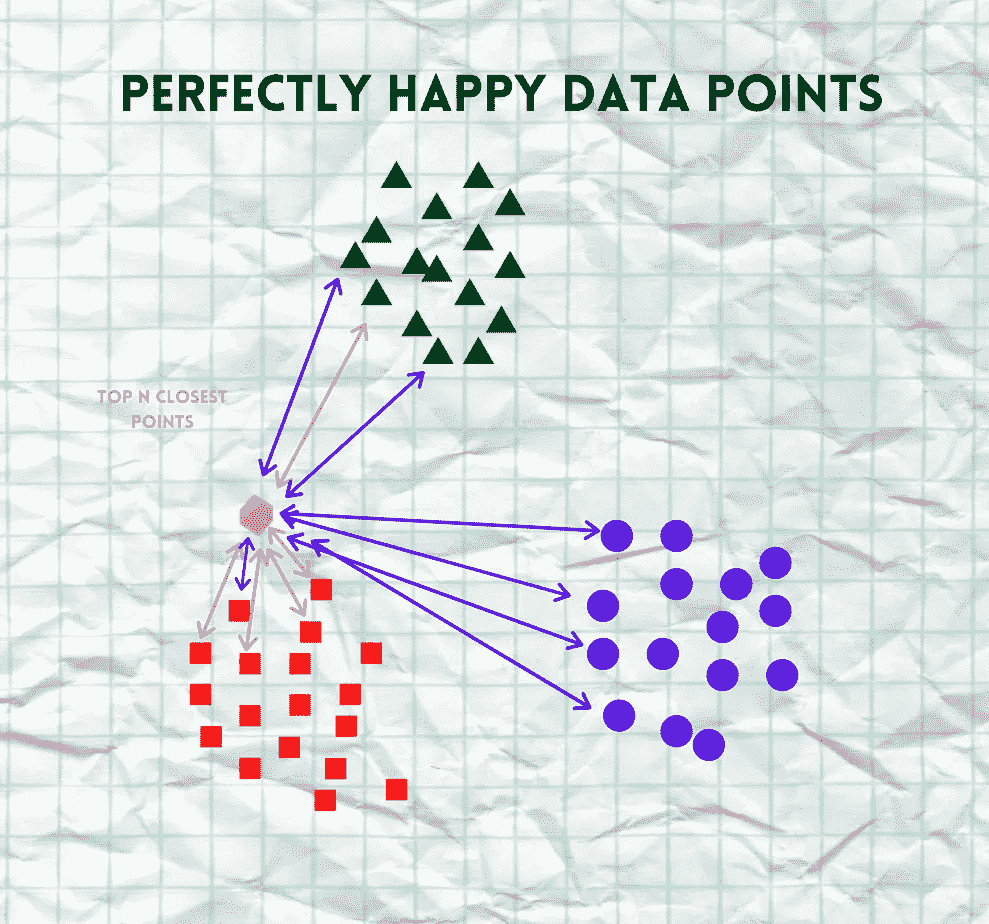

# KNN-从零开始实现(96.6%的准确率)| Python |机器学习

> 原文：<https://medium.com/analytics-vidhya/knn-implementation-from-scratch-96-6-accuracy-python-machine-learning-31ba66958644?source=collection_archive---------2----------------------->


对于初学者来说，术语“*机器学习*似乎是一件非常复杂和困难的事情。毫无疑问，它是发展最快的领域之一，但这并不意味着它必须太复杂。在本教程中，我们将会看到一个非常简单，但是非常有用的算法，叫做“***K-最近邻算法*** ”。

我们都听说过这句话:

> *“你是由你结交的朋友定义的”*

KNN 从字面上理解😁。这在我们看算法的时候会更清晰。

本教程中使用的全部代码可以在[这里](https://github.com/Moosa-Ali/KNN-Implementation.git)找到。

更多机器学习文章，点击下方；

[](https://writersbyte.com/) [## ▤作家字节

### 思想，故事和想法。

writersbyte.com](https://writersbyte.com/) 

# **理解算法:**

KNN 是一种监督算法，即它需要一个带标签的训练数据集才能工作。为了便于理解，让我们创建一个故事。下面我们可以看到，我们有 3 个不同的定居点(3 个不同的数据点；红色、绿色、紫色)。


精细聚类数据点的表示

OMG 一个狂野的斑点出现了！！(一个测试数据点)。它看起来迷路了，我们现在该怎么办？😲


野外的一个斑点

不要害怕，因为我们知道 KNN 算法。

我们只需计算每个定居点中每栋房屋与野生斑点之间的距离(数学术语中的欧几里德距离)。


**！！请记住，我们需要计算每隔一个数据点的距离，插图显示的线条较少，因为插图绘制者可能有点懒🙃！！**

现在，我们所做的就是选择 N 个离我们的斑点最近的点。( *N 这里是一个超参数，即一个我们必须自己最佳决定的数字*



现在让我们看看最近的 N 个点中哪个定居点存在的最多。红色定居点在我们的野生斑点附近有更多的点，因此野生斑点现在成为红色定居点的一部分(它被赋予标签；红色)。


我们对每个测试数据点都这样做。就是这样，这就是算法。

好了，故事时间结束了，让我们开始编码吧。

在继续之前，如果你觉得这篇文章有帮助，请考虑在《T21》上支持我。

[](http://ko-fi.com/moosaali9906)

让我们导入必要的库。

[](https://writersbyte.com/technology/tpu-on-a-phone-the-pixel-6-by-google/) [## 手机上的 TPU-谷歌的 Pixel 6。- WritersByte

### 当谷歌本月宣布他们的新 Pixel 手机 Pixel 6 时，看到了一个非常有趣的公告。谷歌…

writersbyte.com](https://writersbyte.com/technology/tpu-on-a-phone-the-pixel-6-by-google/) 

我们将在本演示中使用的数据集称为 ***虹膜*** 数据集。这是一个开源数据集，可以在下面的链接中找到:[鸢尾花数据集| Kaggle](https://www.kaggle.com/arshid/iris-flower-dataset)

让我们来探索这个数据集。

我们总共有 4 个输入特征和花卉类别的名称作为输出标签。


数据样本

将输出文本标签转换为数字表示。

```
*#Seperating the input features and output labels*
X = dataset.iloc[:, :-1].values
y = dataset.iloc[:, 4].values*#converting text labels to numeric form*
labels, unique = pd.factorize(y)
```

让我们编写简单的算法。

和往常一样，我们需要将数据分成测试样本和训练样本。

```
*#splitting data in test and train segments*
**from** **sklearn.model_selection** **import** train_test_split
X_train, X_test, y_train, y_test = train_test_split(X, labels, test_size = 0.40)
```

我们对总数据使用了 60-40 的分割。

所有步骤就绪后，就该测试准确性了。

我们在下面的代码中使用了一个助手函数。

```
*#Creating a helper function* 
**def** takeSecond(elem):     
   **return** elem[1]
```

所有步骤就绪后，就该测试准确性了。

```
#getting predicted values using our algorithm
predictions = list(map(KNNClassify, X_test))
```

```
#calling the accuracy function
accuracy(predictions, y_test)
```


96.67%!！这是一个非常好的数字。

[](https://writersbyte.com/datascience/ai-for-beginners-3/) [## 面向初学者的人工智能:计算机视觉和自然语言处理

### 我们已经谈了很多关于人工智能的一般意义以及它对我们世界的影响。在以前的文章中，我们…

writersbyte.com](https://writersbyte.com/datascience/ai-for-beginners-3/) 

# **结论**

这可能只是我们为机器学习算法编写的最小代码，但它的准确率高达 96.67%。我们最初的说法是，最大似然算法不需要复杂，它们可以像我们刚刚在本文中学习的 KNN 一样简单。在多个数据集上尝试这种算法，看看它在这些数据集上的表现会很有趣。

感谢您的阅读。

如果这篇文章对你有帮助，可以考虑给我买一个。

[](http://ko-fi.com/moosaali9906)