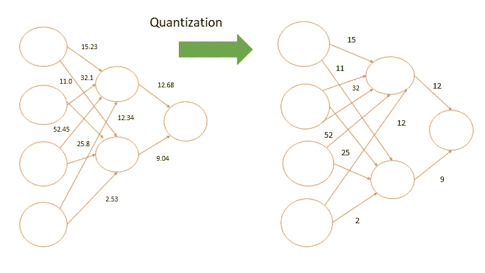
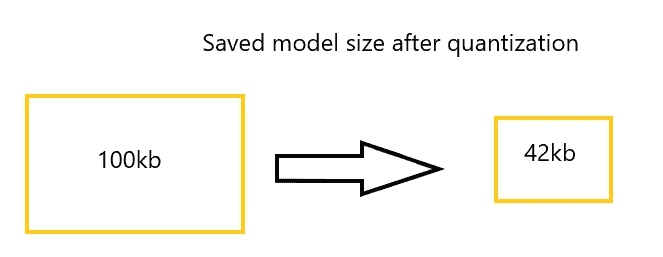
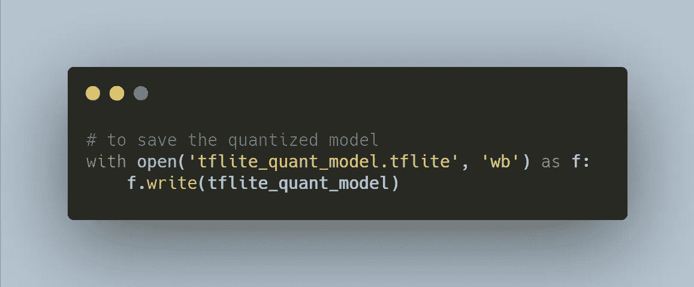
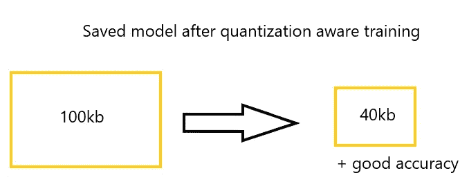
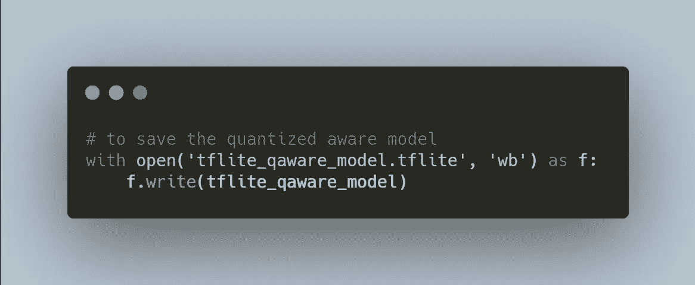

# 了解张量流中的量子化

> 原文：<https://medium.com/analytics-vidhya/know-about-quantization-in-tensorflow-7f111eedd2a6?source=collection_archive---------2----------------------->

细说量子化的奇迹

# 动机

每当我从事深度学习项目来训练一个模型，并通过保存模型为生产做好准备时，它都会给我带来巨大的记忆。然后我开始研究减少节省的模型内存，在这里我发现了一个名字叫做“量化”。我想用一些代码样本和背后的理论来解释更多关于这个量化的内容。

乌萨马·阿扎姆在 [Unsplash](https://unsplash.com?utm_source=medium&utm_medium=referral) 上的照片

有两种量化形式:

1.  训练后量化。
2.  量化感知训练。

从训练后量化开始，因为它更容易使用，尽管量化感知训练通常对模型准确性更好。

来源:“作者图片”

通过上面的图像，我们可以说，通过量化，我们可以将模型的权重从浮点数减少到整数，甚至可以减少模型的大小来释放内存。

# 训练后量化概述

训练后量化包括减少 CPU 和硬件加速器延迟、处理和模型大小的一般技术，而模型精度几乎没有下降。这些技术可以在已经训练好的 float TensorFlow 模型上执行，并在 TensorFlow Lite 转换期间应用。这些技术在 TensorFlow Lite 转换器中作为选项启用。

权重可以转换为精度降低的类型，如 16 位浮点数或 8 位整数。我们通常建议 GPU 加速使用 16 位浮点，CPU 执行使用 8 位整数。

来源:“作者图片”

在这里，使用上面的代码行，我们可以减少保存的模型的大小并开始生产。但是当我们使用训练后量化时，精度可能随着先前训练的模型而变化。所以，使用量化感知训练。

来源:“作者图片”

# 量化感知培训概述

量化感知训练模拟推理时量化，创建一个模型，下游工具将使用它来产生实际的量化模型。量化模型使用较低的精度(例如，8 位而不是 32 位浮点)，从而在部署期间带来好处。

量化通过模型压缩和延迟减少带来改进。使用 API 默认值，模型大小缩小了 4 倍，我们通常会看到测试后端的 CPU 延迟提高了 1.5 到 4 倍。

来源:“作者图片”

为了进行这种量化感知训练，我们需要开始量化保存的模型 TF 模型。然后通过编译来拟合量化模型，用一些历元来拟合。随后，微调量化的拟合模型，并通过使用 tf lite 转换器提取 Tf lite 模型，以获得良好的部署精度。

来源:“作者图片”

# 结论

通过这种量化，我们可以减少所保存的 TF 模型的大小，并为其生产获得良好的精度。此外，它易于实现，重量轻，最重要的是在构建大型神经网络时没有内存。

希望你喜欢，感谢阅读！！