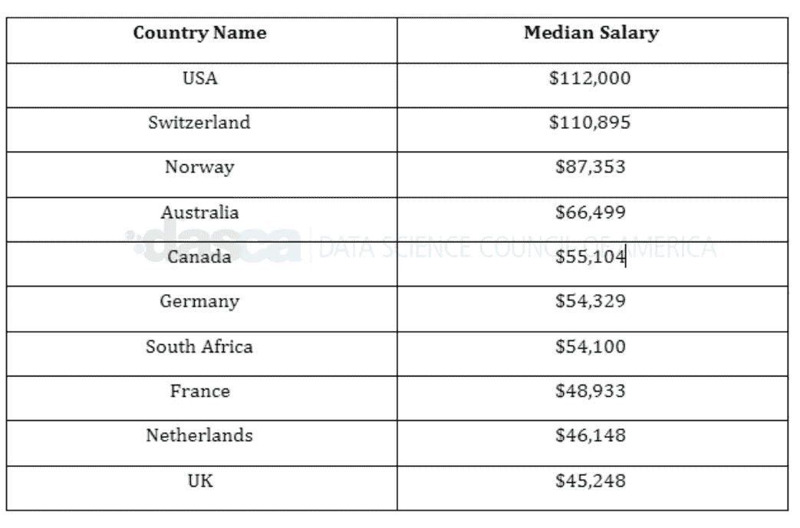

# 了解一位资深数据科学家的完整旅程

> 原文：<https://medium.com/analytics-vidhya/know-the-complete-journey-of-a-senior-data-scientist-d1b4f6991fc0?source=collection_archive---------15----------------------->

> 在 2018 年至 2028 年之间，该职业预计将增长 16%，并在美国创造 5200 个就业机会

~ **Zippia**

数据科学是当今世界迅速发展的领域。许多行业都在以某种形式利用数据科学。这导致了对数据专业人员的需求，他们拥有解决数据相关问题的技能，有助于推动企业走向成功。

数据科学专业人员发挥着至关重要的作用，因为他们仔细检查并利用企业的数据集来增强企业实现端到端目标的能力。高级数据专家有助于企业继续向分析型和数据驱动型文化发展。

在本文中，让我们深入探讨成为一名 [**高级数据科学家**](https://www.dasca.org/data-science-certifications/senior-data-scientist) 意味着什么的几个要素。

# 成为高级数据科学家的要求

高级数据专业人员从数据中获得帮助，以确定业务发展的方向。他们指导和雇用初级员工的工作，领导几个数据驱动的项目。以下是成为高级数据科学家的一些要求:

## 教育

统计学、机器学习、数学、计算机科学、经济学或任何其他相关定量领域的学士学位。

## 经验

作为数据科学家，在任何行业都有丰富的经验，即至少 5 年的工作经验。

# 。成为高级数据科学家的基本技能

高级数据科学专业人员主要与业务利益相关者合作，了解他们的目标，并确定如何使用数据来实现这些目标。为了完成所有这些，他们需要掌握一些日常工作所需的基本技能:

## 技术

**。编程**——编写计算机程序，分析海量数据集，得出复杂问题的答案。他们需要用 Java、R、Python 和 SQL 等语言编写代码。

**。统计分析** —识别数据中的模式，这也包括对异常和模式检测的深入了解。

**。机器学习** —应用算法和统计模型，使计算机自动从给定的数据中学习。

**。计算机科学** —应用数据库系统、人工智能、数值分析、软件工程、人机交互的概念。

**。数据叙事** —使用数据传达可行的见解，通常面向利益相关者和非技术受众。

# 。非技术技能

除了技术技能，成为一名高级数据科学家还需要软技能，因为它们在帮助公司做出以目标为导向的决策方面发挥着至关重要的作用。这些是以下软技能:

**。人际交往技能** —与公司各个层面的不同受众沟通。

**。商业直觉**——他们还与利益相关者联系，以更好地理解他们想要解决的问题。

**。批判性思维**——在得出结论之前对事实进行客观分析。

**。分析思维**——为抽象的商业问题寻求更好的分析解决方案。

**。求知欲** —理解表面之外的东西，发现数据中的模式和解决方案。

参加数据科学认证是非常可取的，可以学习成为高级人员所需的技能。证书通常被认为是提升一个人职业生涯的主要方面之一。

# 高级数据科学家的职责

与非高级数据科学家相比，高级数据科学家在公司发展非常需要的几个领域提供许多高级专业知识。他们的工作职责包括几项重要职责。

1.  保持对数据科学和相邻领域的最新进展的更新，以确保有好的结果。
2.  建议和管理对企业利益有价值的数据驱动项目。
3.  整理和清理来自不同实体的数据，以便对初级数据科学家有所帮助。
4.  为利用数据库中企业的大量数据收集制定创造性的想法。
5.  监控初级数据科学家的表现，并给予他们必要的实际指导。
6.  管理初级数据科学家的活动，并确保他们正确履行其工作职责，这应与企业的愿景和目标保持一致。
7.  寻找并应用先进的统计程序，以获得可操作的见解。
8.  与初级数据科学家合作，构建最新和改进的分析系统，例如从原型到生产。
9.  交叉验证模型，将工作委托给初级数据科学家，以获得更好的结果，并按时完成项目。
10.  制作和传播非技术性报告，详细说明每个项目的成就和局限性。

# 大数据科学家薪酬最高的国家

高级别的 [**数据科学专业人士**](https://www.dasca.org/) 拿着诱人的薪水。这些薪水通常因地域而异。北美的工资通常比欧洲高。以下是薪资最高的国家名单，以及以美元计算的薪资中值。

此外，随着高级数据专业人员获得经验和相关的大数据认证，他们通常会转移到更高级的职位，获得更好更高的薪酬。其中包括:

**。**数据科学经理:年薪 135，401 美元

**。数据科学总监:每年 157，273 美元**

# 结束注释

数据是目前任何行业最重要的工具。几乎所有的公司都需要专家型的专业人士，他们的专业知识将为他们的业务增加更多的价值，并为其发展而努力。获得认证将确保成为高度渴望的人才库的一部分。