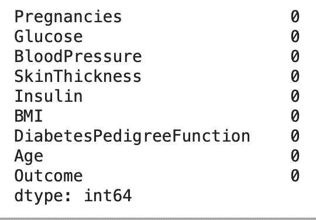

# 通过模型可解释性更好地了解您的机器学习模型

> 原文：<https://medium.com/analytics-vidhya/know-your-machine-learning-models-better-with-model-interpretability-2722390163b4?source=collection_archive---------2----------------------->


# 介绍

机器学习已经成为许多数据驱动问题的解决方案。无论是识别银行系统中的欺诈交易、贷款预测、某种疾病的早期预测还是预测客户流失。

随着自动化取代了许多重复的过程，ML 模型的使用提出了一系列的问题。

1.  我们如何仅仅通过查看 RMSE、R 平方得分、MAPE、准确度、AUC、精确度和召回率等指标来依赖特定模型的性能呢？？
2.  模型如何达到特定的决策或价值？
3.  什么特征促使模型做出特定的决策？

本文通过解释[糖尿病预测](https://www.kaggle.com/uciml/pima-indians-diabetes-database)的用例来解释 ML 可解释性领域。在这篇文章结束时，你将理解为什么在训练后和推理过程中解释每一个 ML 模型是重要的。重点将更多地放在解释如何应用不同的模型解释方法上，而不是模型训练上。

# 复杂性与可解释性

为了更好地理解复杂性和可解释性之间的权衡，让我们首先理解训练 ML 模型的过程。

每一个 ML 模型训练过程都包括以下内容-

1.  求解方程
2.  损失函数
3.  【计算机】优化程序
4.  反向预测/权重更新

为了获得更高的精度，我们经常尝试应用更复杂的方程(分量 1)从训练数据中学习。这并不意味着我们不应该使用具有复杂数据的复杂模型。我们可以尝试不同的方法，如集成，甚至训练深度学习模型，以获得更好的评分模型。但是请记住，高度复杂的数据可能非常准确，但是不太容易解释。


不同 ML 模型的准确性和可解释性。来源: [A](https://www.analyticsvidhya.com/blog/2019/08/decoding-black-box-step-by-step-guide-interpretable-machine-learning-models-python/) 维迪亚分析

参考上面提供的图表，我们可以看出，线性回归可能不如决策树准确，但其高度可解释性和深度神经网络可能高度准确，但可解释性较差。

但是，我们如何使用复杂的建模技术，并仍然能够解释这些模型？

这正是下一节要讨论的内容。

# 用例—糖尿病预测

本练习使用的数据集是[皮马印第安人糖尿病数据库](https://www.kaggle.com/uciml/pima-indians-diabetes-database)，其中包含糖尿病患者的重要信息。数据集有 8 个特征，数据集中的目标变量是以二进制格式标记的结果，0 表示无糖尿病，1 表示糖尿病。

从探索性数据分析开始，接着是特征工程和用不同的集合模型进行实验。还采用了叠加等先进的建模方法，以增加演示模型的复杂性。

```
dia_df = pd.read_csv(‘/content/diabetes.csv’)dia_df.head()
```


```
dia_df.info()
```


```
dia_df.isna().sum()
```



```
dia_df[‘Outcome’].value_counts(normalize=True)
```


这表明目标变量是不平衡的。我们使用过采样来平衡数据。

```
# train test splitX_train, X_test, y_train, y_test = train_test_split(dia_df.drop(‘Outcome’, axis=1), dia_df[‘Outcome’], test_size=0.3, random_state=1234)# oversampling
over_sampler = RandomOverSampler(random_state=1234)X_train, y_train = over_sampler.fit_resample(X_train, y_train)
```

接下来，我们执行特征工程，如缩放数字特征。

```
scaler = MinMaxScaler()X_train = scaler.fit_transform(X_train)X_test = scaler.transform(X_test)
```

一旦数据准备完成，我们就可以开始建模部分。让我们开始尝试不同的模型。

1.  ***K-最近邻***

```
knn = KNeighborsClassifier()
knn.fit(X_train, y_train)def show_metrics(y_true, y_pred):
    print('Classification Report: \n')
    print(classification_report(y_true, y_pred))
    print('\nConfusion Matrix: \n')
    print(confusion_matrix(y_true, y_pred))y_pred_knn = knn.predict(X_test)show_metrics(y_test, y_pred_knn)
```


2. ***渐变助推模型***

```
gb_ensemble_model = GradientBoostingClassifier(n_estimators=500, learning_rate=0.001, max_depth=4, min_samples_split=4)gb_ensemble_model.fit(X_train, y_train)y_pred_gb = gb_ensemble_model.predict(X_test)show_metrics(y_test, y_pred_gb)
```


3. ***堆叠集合模型***

```
clf1 = GradientBoostingClassifier(n_estimators=1000, learning_rate=0.001, max_depth=4, min_samples_split=4)clf2 = KNeighborsClassifier(n_neighbors=20)meta_clf = LogisticRegression()stacked_ensemble = StackingClassifier([clf1, clf2], meta_classifier=meta_clf, use_probas=True)stacked_ensemble.fit(X_train, y_train)y_pred_se = stacked_ensemble.predict(X_test)show_metrics(y_test, y_pred_se)
```


我们尝试了不同的建模技术，从简单的 KNN 模型和越来越复杂的不同模型开始。让我们假设，堆叠集合模型给出了最好的预测结果，我们想用它来进行推断。在下一节中，我们将演示使用机器学习的可解释性来理解集合模型。

# 模型解释

1.  ***特征重要性图***

如果您使用集合模型，Scikit-Learn 在模型类中提供了一个变量，称为“feature_importances_”。一旦模型训练完成，我们就可以得到特征的重要性，并绘制一个图表，如下所示。

```
rf_model = RandomForestClassifier()
rf_model.fit(X_train, y_train)features = dia_df.drop('Outcome', axis=1).columns.tolist()importances = rf_model.feature_importances_feature_imp_df = pd.DataFrame({'feature': features, 'importance': importances}).sort_values('importance', ascending=False)plt.figure(figsize=(10,8))plt.title('Random Forest Feature Importance')sns.barplot(y='feature', x='importance', data=feature_imp_df, color='skyblue')
```


查看上面的图，我们可以对在决策中驱动模型的特征有一些基本的了解。我们可以根据我们的领域知识添加/删除一些功能，然后再看剧情。

2. ***决策树代理***

模型解释的另一种方法是代理模型。当当前模型的决策复杂时，可以使用代理模型，我们使用我们的模型提供的结果来训练另一个高度可解释的模型。在这种情况下，我们选择决策树，因为通过绘制决策树更容易理解。需要注意的一点是，用于训练决策树的目标变量将是我们的堆叠集合模型的预测输出，而不是实际的目标。

```
dt_model = DecisionTreeClassifier()# stacked ensemble predictions
y_pred_train_se = stacked_ensemble.predict(X_train)# training on predicted targets
dt_model.fit(X_train, y_pred_train_se)fig, axes = plt.subplots(nrows = 1,ncols = 1,figsize = (5,3), dpi=300)out = plot_tree(dt_model, feature_names=features, class_names=['Not Diabetic', 'Diabetic'], max_depth=2, filled=True, fontsize=4)for o in out:
     arrow = o.arrow_patch
     if arrow is not None:
        arrow.set_edgecolor('black')
        arrow.set_linewidth(0.2)plt.show()
```


3. ***石灰交代者***

LIME 代表局部可解释的模型不可知解释。顾名思义，这种解释在给定一行数据作为模型输入的情况下输出一系列值。它有助于我们理解推动模型做出特定决策的特征。LIME 是模型不可知的，这意味着它可以应用于任何可能的 ML 模型。

```
def predict_proba(data):
    return np.array(list(zip(1-stacked_ensemble.predict(data),     stacked_ensemble.predict(data))))explainer = lime.lime_tabular.LimeTabularExplainer(X_train, mode='classification', training_labels=y_train.values, feature_names=features)def explain_instance(data):
    exp = explainer.explain_instance(data, predict_proba,  num_features=len(features))
    exp.show_in_notebook(show_table=True)explain_instance(X_train[0])
```


```
explain_instance(X_train[100])
```


4.***SHAP 交代***

SHAP 主张沙普利附加解释。基于每个特征的 shapley 值给出模型解释。它提供了局部和全局的解释。

```
def local_explanation(data, i):
    shap.initjs()
    explainer = shap.TreeExplainer(gb_ensemble_model)
    shap_values = explainer.shap_values(data)
    return shap.force_plot(explainer.expected_value, shap_values[i], features=data[i], feature_names=features)local_explanation(X_train, 0)
```


```
local_explanation(X_train, 100)
```


```
# global explanation
shap.initjs()
explainer = shap.TreeExplainer(gb_ensemble_model)
shap_values = explainer.shap_values(X_train)
shap.summary_plot(shap_values, features=X_train, feature_names=features, plot_size=(12,8))
```


# 结论

本文向我们介绍了机器学习可解释性背后的基本思想，并解释了如何使用不同的方法来解释 ML 模型。

如果你对深入研究模型解释感兴趣，我推荐你阅读这本电子书。

本文中使用的代码可以通过这个[链接](https://gist.github.com/iamrajatroy/c91296e6f611bfb9d1cc66ea69be8358)访问。