# 了解卷积基础知识

> 原文：<https://medium.com/analytics-vidhya/knowing-convolution-basics-3b53a2cf1e23?source=collection_archive---------15----------------------->

在这篇文章中，我们将学习灰度图像，彩色图像和卷积的过程。

# 灰度图像

一种灰度图像，其中图像仅由灰色阴影表示。使用从 0 到 255 的值来表示图像的各个像素的强度。即按照 8 位整数从黑到白。它只使用一个通道。

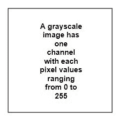

# 彩色图像

彩色图像是由红、绿、蓝(RGB)三种颜色以不同的比例组合而成的。这三种颜色因此被称为原色。彩色图像像素包含三个通道:R 通道、G 通道和 B 通道，每个通道都有自己的亮度值，范围从 0 到 255。

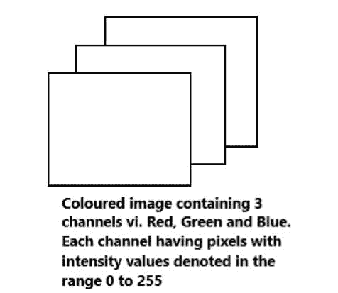

# 什么是卷积？

卷积是将每个像素与滤镜的相应像素值相乘，然后将所有乘积相加得到结果的过程。这些结果的组合给出了输出图像表示。

现在让我们看一个卷积的例子。

我们让一个 6x6 的输入通过一个滤波器(这里我们用的是垂直滤波器)。我们得到 4x4 的输出。

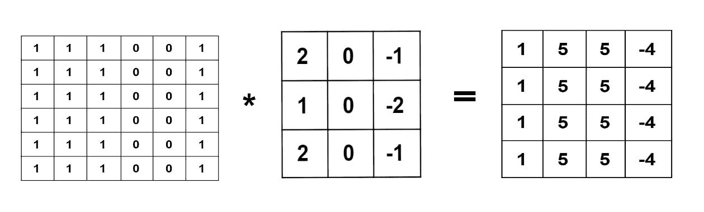

现在让我们看看输出中的每个条目是如何获得的。

我们将过滤器放在输入的顶部，从左上角开始，直到右下角。然后我们执行卷积的过程(将相应的条目相乘并相加)。获得的结果是相应的输出条目。这里我们取步幅值为 1。也就是说，每次计算后，我们向右跳一步。当我们到达列尾时，我们向下跳一行。这个过程一直持续到我们到达右下角。

卷积操作:在每一步中要与滤波器卷积的输入部分被突出显示。

第 1 个输出条目:*1(2)+1(0)+1(-1)+1(1)+1(0)+1(-2)+1(0)+1(-1)
= 2–1+1–2+2–1
= 1*

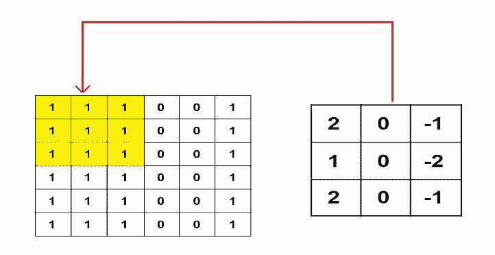

第 2 个输出条目:*1(2)+1(0)+0+1(1)+1(0)+0+1(2)+1(0)+0
= 2+0+0+1+0+0+2+0+0
= 5*

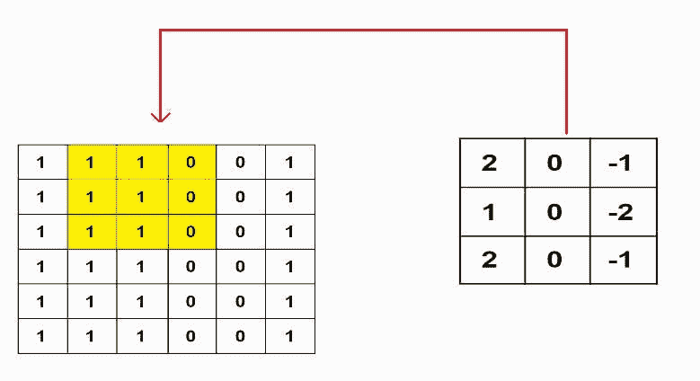

第 3 个输出条目:*1(2)+1(1)+1(2)
= 2+1+2
= 5*

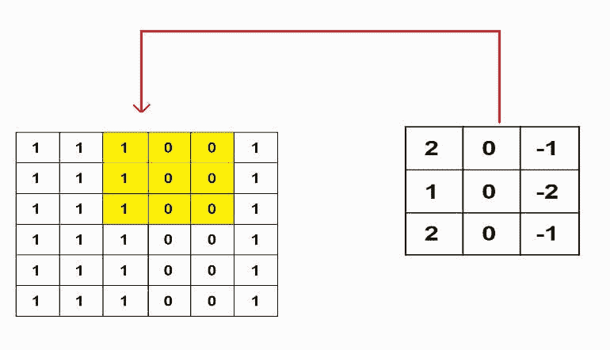

第 4 个输出条目:*1(-1)+1(-2)+1(-1)
=-1–2–1
=-4*

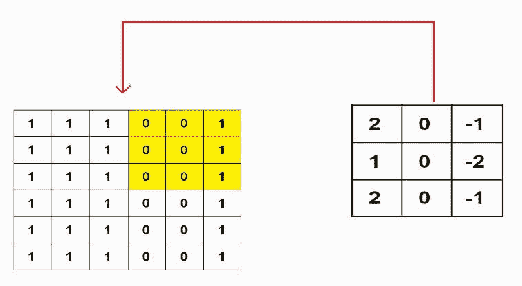

*通过执行类似的计算；*
第 5 个输出条目= *1*

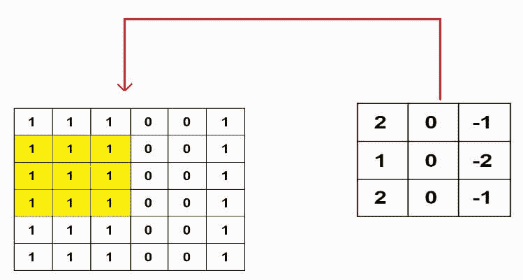

第 6 个输出条目= *第 5 个*

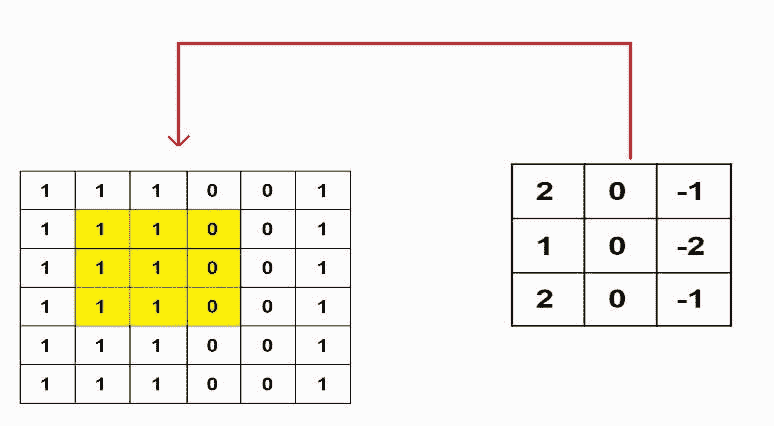

第 7 个输出条目= *5*

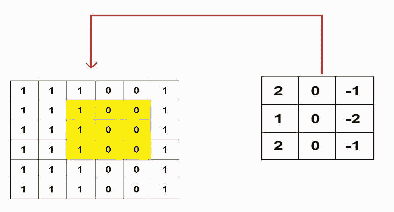

第 8 个输出条目= *-4*

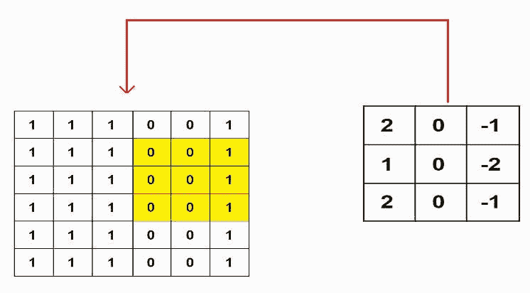

第 9 个输出条目= *1*

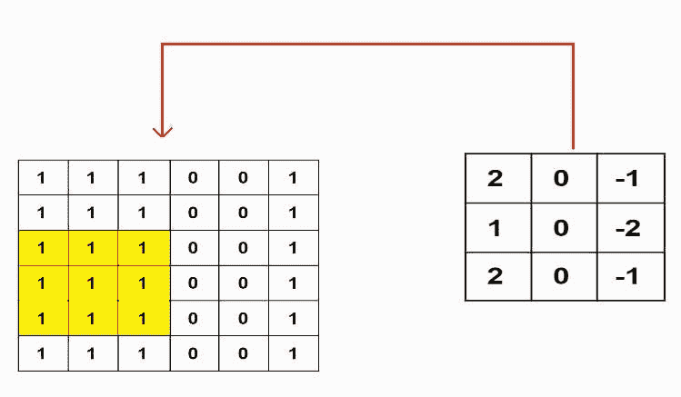

第 10 个输出条目= *5*

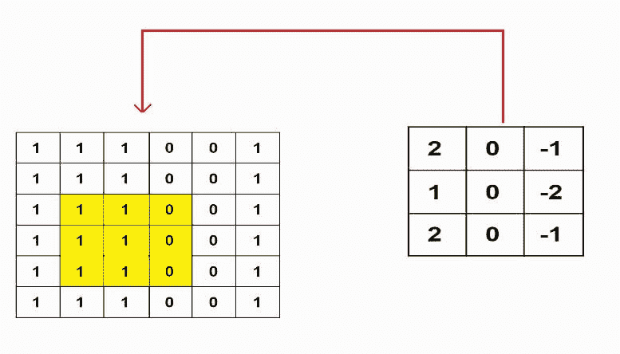

第 11 个输出条目= *5*

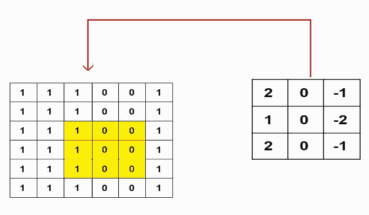

第 12 个输出条目= *-4*

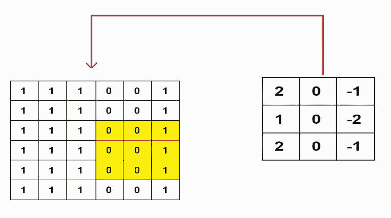

第 13 个输出条目= *1*

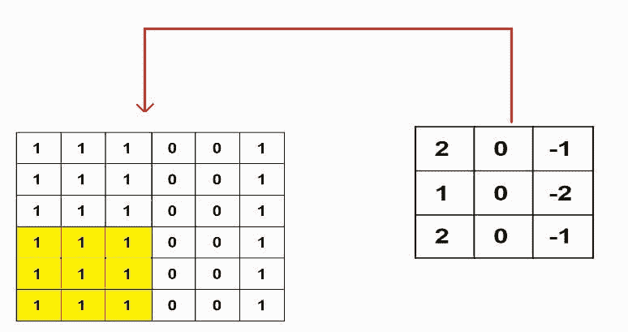

第 14 个输出条目= *5*

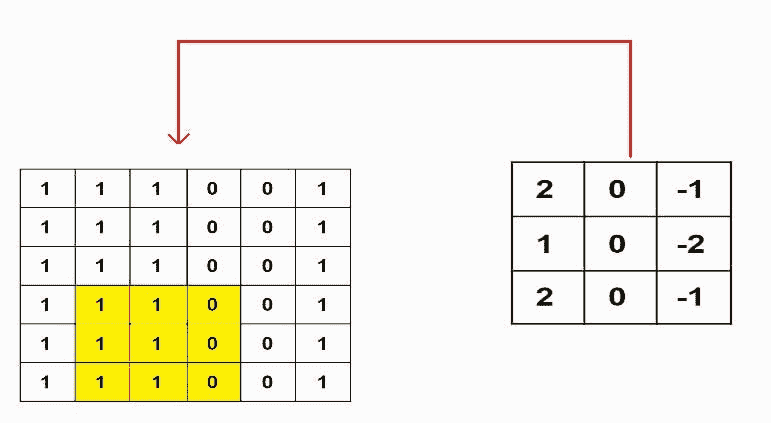

第 15 个输出条目= *5*

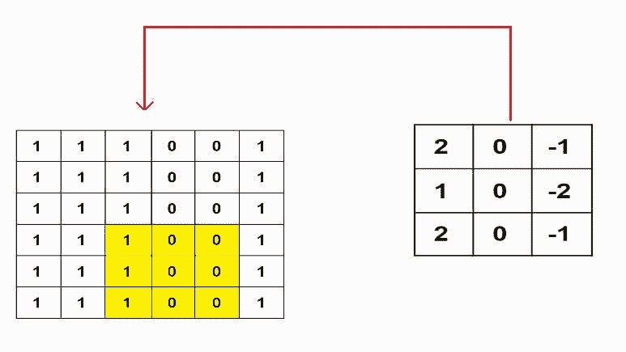

第 16 个输出条目= *-4*

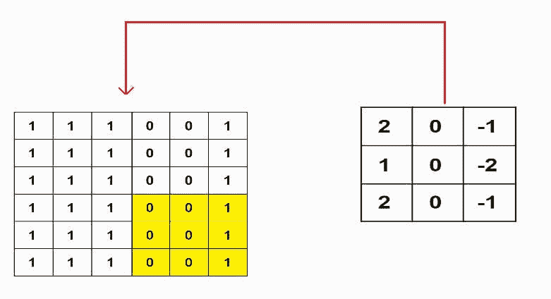

我们这里得到的输出是 4 阶的，而我们给出的输入是 6 阶的。因此，我们可以说这里发生了一些信息丢失。

为了防止这种信息的丢失，我们使用了填充技术，这将在以后的文章中讨论。

感谢您的阅读。如果你喜欢这篇文章，请考虑分享。