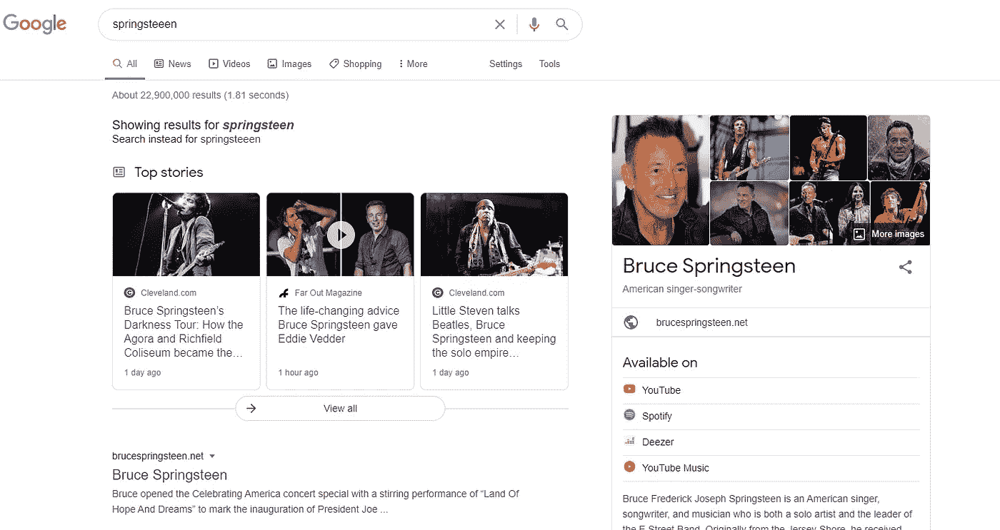
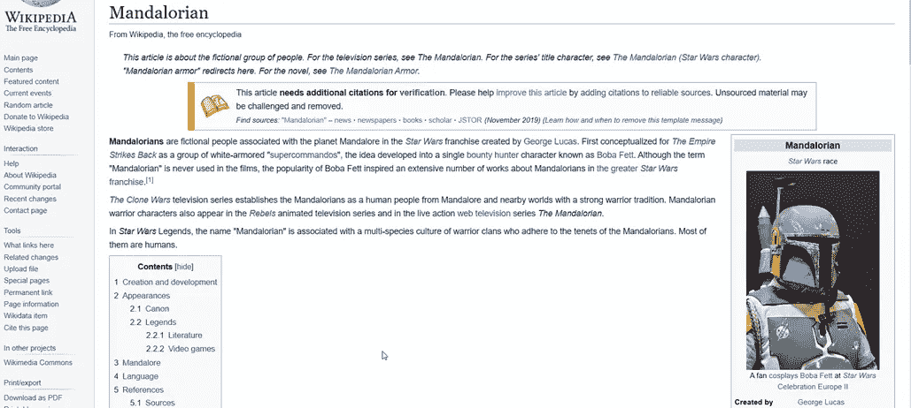
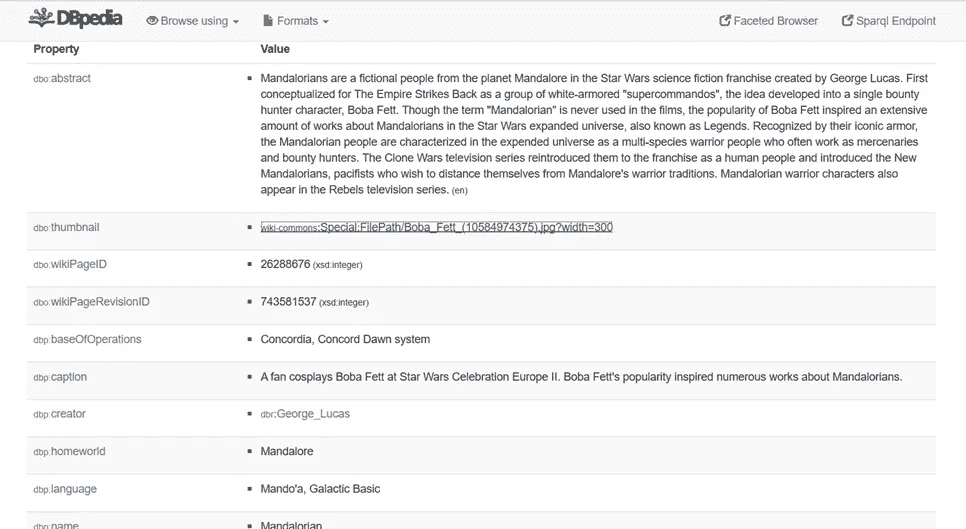
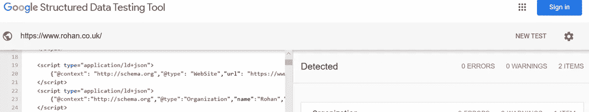

# 知识图表

> 原文：<https://medium.com/analytics-vidhya/knowledge-graphs-7807c9e85879?source=collection_archive---------8----------------------->

术语“**知识图**”可以追溯到 2010 年的谷歌知识图，“谷歌知识图背后的基本格言是搜索事物而不是字符串。”[1].谷歌知识图的成功与知识库的增加不谋而合，这并不奇怪。近年来，知识图已经成为一种流行的表示数据的方式，并且可以被认为是知识发现、数据挖掘、语义网和自然语言处理的相似物。

本质上，知识图涉及图形格式的结构化数据的性质，并用于表示其数据点之间的关系。Kejriwal 将知识图的标准抽象地描述为:

*‘人类知识的一种图论表示，这样它就可以被机器用语义摄取。换句话说，这是一种用图表来表达“知识”的方式，在这种方式下，机器将能够对这个图表进行推理和推断，以某种有意义的方式回答查询(“问题”)凯杰里瓦尔(2019)。*

在图 1 中可以找到一个知识图的图示，在 Google 中为搜索查询“springsteen”呈现了一个面板，该面板本身由以知识图为中心的技术支持。类似的应用程序包括 Wikidata 和 Freebase。

图 1 谷歌知识面板

然而，从功能的角度来看，知识图是从代表一个事实的一组**三元组**中派生出来的。在其基本形式中，三元组是一个三元组(h，r，t ),其中 h 表示头部实体，t 表示尾部实体，r 表示两个实体 h 和 t 之间的关系。一个简单的例子将有助于解释三元组的概念。

狗菲多从玛丽的花园里偷了一根骨头

与这个句子相关的三元组可以分类为:

{(Fido，is-a，狗)，

(菲多，披肩，骨头)，

(骨头，is-a，骨头)，

(骨头，位于，花园)，

(花园，is-a，花园)，

(花园，属于，玛丽)，

(玛丽，is-a，人)}。

如前所述，三元组表示一个断言，其中元素 1 和 3 表示一个实体，而元素 2 通常被称为关系。在例如 Mary，DOB，' 12/07/95 '的情况下，数字或字符串被表示为文字。

为了构建知识图，进行了一个**信息提取**的过程，即，结合**本体**“对事物、关系及其特征的描述”，Powell (2015)对语言(可以是半结构化的和/或未结构化的)进行阅读和翻译。信息提取的过程包括:

**命名实体识别**，NER，用于识别和划分命名实体，并将这些实体归类到预定义的类别中。

**关系抽取**，用于识别语义关系

**事件提取**决定了发生了什么，什么时候发生的。这一领域最近令人兴奋的发展已经利用了生成对抗网络(GANs) [2]

顾名思义，构建知识图的下一步是**实体解析**，这需要将数据中的实体链接到现实世界的数据。当然，特别是在自然语言的情况下，困难在于导致误解的微妙之处和歧义，“即使在今天，尽管进步很快，机器仍然不能像人类一样阅读和理解英语。”施普林格(2019)

**资源描述框架(RDF)和本体**

我们在上一节谈到了本体以及本体如何定义事物的类型，也就是说，它们与其他事物的关系以及适用于这些事物的属性。本体可以被认为是“词汇表的图形模型”，Powell (2015)并且在某种程度上是分类法**的扩展，分类法**本身是一种用于对层次关系进行分组的图形结构。在本体中，分类法被扩展，以便你表达事物之间的逻辑关系、组中的成员关系、多重继承关系、关系的对称性、排他性以及给定事物的各种特征。鲍威尔(2015)。

本体利用一阶逻辑来表达关于真理的陈述，类似于我们已经讨论过的三元组。构建本体的过程包括:

1.根据领域信息选择独特的术语

2.定义每个术语

3.分层组织术语

**资源描述框架**，RDF，可以被描述为“数据网和语义网的数据模型，提供根据一些数据结构定义的逻辑组织，以支持给定应用领域中感兴趣的对象的表示、访问、约束和关系。”Curè (2015)。RDF 还利用了与国际化资源标识符相对应的三元组数据模型。IRI，与 URI 或 URL 非常相似，但允许使用 Unicode 字符。一个 URL 可以解析到一个特定的网址，而一个 IRI 却不能解析任何东西。一个来自 DBpedia 的 IRI 的例子，DBpedia 是一个 RDFs 的集合，其来源是 Wikipedia 并标识一本书:

[http://dbpedia.org/resource/The_Road](https://dbpedia.org/page/The_Road)

RDF 模型要求您能够将任何主语、谓语或宾语 IRI 与词汇表联系起来。一个词汇表，比如一个分类法或本体论，标识了 IRI 是什么，并提供了关于它与词汇表中其他条目的关系的信息鲍威尔(2015)。W3C 概述了从语义 web 查询和操作 RDF 的过程，并将其翻译成查询语言 Simple Protocol 和 RDF 查询语言( **SPARQL** )。SPARQL 1.0 于 2008 年成为推荐标准[3]，SPARQL 1.1 于 2013 年发布[4]。SPARQL 是一种 RDF 查询语言，可以检索并操作 RDF 中存储的数据。SPARQL 基于基本图形模式的概念，这些基本图形模式是三元模式的集合。三元组模式是 RDF 三元组的扩展，其中一些元素可以是用问号表示的变量。Gayo (2018)。用于数据询问的其他本体语言包括 **RDFS** 和更具表现力的 **OWL/2** 。

**储存**

RDF 图的基础是存储，它可以采用不同的格式，无论是 XML 还是关系和/或 RDF 数据库，也称为三重存储，包括 GraphDB、AllegroGraph、Ontotext 和 Oracle Spatial。Oracle Spatial 基于 RDF WC3 标准，“但是，尽管这一功能提供了一些重要的图形功能，但它没有 Neo4J 等流行的属性图形数据库所提供的功能。”哈里森(2015)。也就是说，正如我们所讨论的，RDF 图为本体和分布式数据源的开发提供了强有力的支持，并且正如我们将看到的，提供了更丰富的数据模型，而 Neo4j 是一个**图数据库**，它有自己的查询语言 Cypher，并且在数学意义上存储了一个图，因为它与一组节点和这些节点之间的关系有关。类似地，图形数据库为图形提供持久性、创建/更新/删除能力、索引、路径遍历以及搜索和查询能力。

**生态系统**

在 **KG 生态系统**中采用知识图的一个例子是 DBpedia，我们在讨论 IRI 时已经提到过。DBpedia 试图利用来自维基百科的结构化信息。曼达洛人维基百科页面上包含的数据(图 2)被提取出来，并以 RDF 格式呈现在 DBpedia 中(图 3)。DBpedia 既可以作为 RDF 转储，也可以作为可查询的 SPARQL 端点。凯杰里瓦尔(2019 年)

图 2 曼达洛人的维基百科页面

图三。曼达洛人的 DBpedia 仪表板

DBpedia 的流行与维基百科的持续增长不谋而合，因为自然语言处理，NLP，生态系统利用数据进行**弱监管**，噪音更大，质量更低，但规模更大的训练集，以及维基百科多语言的额外优势。

虽然通过推理，Schema.org 会建议一个网站，但它实际上是一种标记语言，可以合并到网页中，使网络搜索引擎能够将返回的查询转换为结构化的响应。Schema.org 与谷歌、必应和雅虎合作，通过显示产品图片、星级评定、产品价格、日期甚至事件等附加信息，来改变用户的反应，从而提高网站的知名度。搜索引擎从网站上抓取数据，从而能够收集进一步的相关信息。在下面的例子中，英国服装零售商 Rohan 包含 schema.org 片段，图 4，这使得 Bing 能够提取和显示进一步的信息，包括用户评级，图 5。然而，应该注意，schema.org 并不试图链接到其他 schema.org 标记，因此在某种意义上，它是知识图的松散从属关系。Schema.org 正在启用一种实体解决方案来弥补这一缺陷。

图 4。Rohan 的 HTML 页面中嵌入的 schema.org 片段

图五。Rohan top 15 夹克查询包括一个附加的用户评级面板。

**结论**

我们已经讨论了知识图是如何随着知识库的增加而流行起来的，以及如何通过三元组的过程将数据表示为与信息提取相结合的单一事实，即。使我们能够对真实世界的数据执行实体解析。该过程利用本体论(分类学的扩展)来表达关系，在资源描述框架 RDF 中使用，以提供允许通过国际化资源标识符提取数据的逻辑结构。IRI。

在知识图生态系统中，我们利用了利用这些过程的例子，特别是 DPpedia，它利用维基百科来提取 NLP 的训练集。同样，schema.org 与谷歌、必应和雅虎合作，能够将片段嵌入到 html 页面中，这使得搜索引擎能够包括与搜索查询相关的附加信息，无论是产品图片、星级、产品价格、日期还是事件。

[保罗](https://www.linkedin.com/in/paul-ellis-cardiff/)

**参考文献**

图表、数据和语义网图书馆员指南，詹姆斯·鲍威尔和马修·霍普金斯洛斯阿拉莫斯国家实验室，昌多斯出版社，2015 年

用基本形式本体论构建本体论，罗伯特 Arp，巴里·史密斯，安德鲁·d·斯皮尔，麻省理工学院出版社 2015

特定领域知识图构建，Mayank Kejriwal，2019，Springer

基于图的知识表示概念图的计算基础，米歇尔·谢恩·玛丽-劳雷·穆尼尔，施普林格出版社伦敦有限公司，2009 年

下一代数据库 NoSQL，新 SQL 和大数据，Guy Harrison，2015 年出版

RDF 数据库系统——三倍的存储和 SPARQL 查询处理。奥利维耶·库雷，纪尧姆·布兰，2015 年，爱思唯尔

验证 RDF 数据，Jose Emilio Labra Gayo，奥维多摩根大学和 Claypool 出版社关于语义网的综合讲座:理论和技术#16，2018 年

万尼瓦尔·布什 1943 年的文章“正如我们所想”[http://web.mit.edu/STS.035/www/PDFs/think.pdf](http://web.mit.edu/STS.035/www/PDFs/think.pdf)

1.介绍知识图:事物，而不是字符串。关了。谷歌博客 5 (2012)。[https://www . blog . Google/products/search/introducing-knowledge-graph-things-not/](https://www.blog.google/products/search/introducing-knowledge-graph-things-not/)

2.[https://www . analyticsvidhya . com/blog/2017/06/introductive-generative-adversarial-networks-gans/](https://www.analyticsvidhya.com/blog/2017/06/introductory-generative-adversarial-networks-gans/)

3.普鲁德霍莫和海运。RDF 的 SPARQL 查询语言。W3C 推荐标准，2008 年。[http://www.w3.org/TR/rdf-sparql-query/](http://www.w3.org/TR/rdf-sparql-query/)

4.哈里斯号和海运号。SPARQL 1.1 查询语言。W3C 建议，2013 年。[http://www.w3.org/TR/sparql11-query/](http://www.w3.org/TR/sparql11-query/)