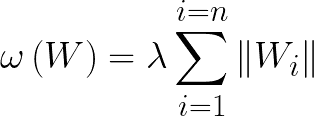
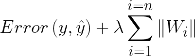
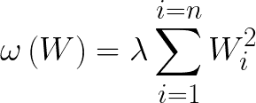
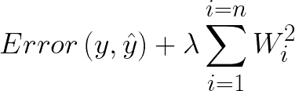
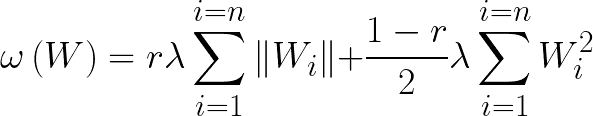
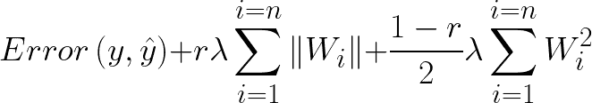

# L1、L2 和 L0.5 正则化技术。

> 原文：<https://medium.com/analytics-vidhya/l1-l2-and-l0-5-regularization-techniques-a2e55dceb503?source=collection_archive---------2----------------------->

在本文中，我的目的是给 L1，L2 和 L0.5 正则化技术一点介绍，这些技术也被称为套索，岭和弹性网回归技术。本文末尾提供了引用的链接。在开始之前，我们需要回答两个问题。

1.  什么是正规化？
2.  为什么需要它？

从第一个问题开始，简单地描述它，正则化是将系数缩小到零的行为，在这种情况下，系数是在模型训练期间学习的权重。根据这个定义，可以说在训练期间获得的权重或系数值越高，我们的机器学习模型就变得越复杂，并且这种复杂性引入了一个问题。这个问题是什么，由第二个问题回答。

为什么需要它？简而言之，正则化用于解决训练机器学习模型时出现的过拟合问题。一个这样的例子是，获得高训练精度，但是当在“相似”但不同的数据集上使用时，您观察到难以置信的低精度。我所说的“相似”是指提供与用于训练的先前数据集密切相关的信息的数据集。现在，为了定义过拟合，这是当机器学习模型试图捕获数据集中的所有信息，但反过来也捕获数据集中的噪声时发生的情况。在这个意义上，噪声是不提供任何形式的信息，但由于随机“出现”而在数据集中发现的数据点。

现在，我们知道了正则化用于防止模型在特定数据集上过度拟合，以使它们在其他数据集上表现良好，我们可以开始了。

**L1 正则化(Lasso Regression)** :

L1 正则化技术是一种通过将系数(权重)收缩到零来减少过拟合的技术，该动作间接执行模型的特征选择。另一方面，特征选择是在数据集中选择特定特征的行为，人们认为这些特征将为机器学习模型提供有价值的信息，以便表现良好。

虽然特征选择的想法很好，因为在大型数据集中，一些特征对模型的学习没有贡献，因此应该被移除，但是 L1 正则化进行这种特征选择，以便只留下将最小化预测误差的变量。这样做的一个小缺点是，我认为这种特征选择模式引入了偏见，因为在消除一个变量之前没有考虑很多因素，从人类的角度来看，这可能不是有效的行为。

控制 L1 正则化技术的方程是:

现在，当引入 L1 正则化方程以及残差平方和的误差函数时，我们有:

在上述第一个等式中，**ω(****ω)可以记为正则项**， **Wi 是权重**，而**λ(λ)是正则化参数**，简单来说，正则化参数控制我们在模型上执行多少正则化。正则化项的值越高，收缩到零的系数越多，出现的特征选择越多。

**L2 正则化(岭回归)**:

在 L2 正则化中，我们将系数(权重)向零收缩，而不消除它们。这种类型的正则化迫使模型依赖于它可用的所有特征，同时仍然防止过度拟合。

支配 L2 正则化技术的方程是:

当我们包括残差平方和的误差函数时，我们有:

与 Lasso 回归(L1)不同，在岭回归(L2)中，正则化参数的值越高，系数越向零收缩，而不是向零收缩，因此没有特征选择。

**L0.5 正则化(弹性网回归)**:

正则化技术是 L1 和 L2 正则化技术的结合。这种技术是为了在一定程度上克服套索回归技术(L1)的小缺点而创造的。这里，弹性网络仍然执行特征选择，但是同时它使用岭回归技术(L2)找到系数(权重)的最优值。

L0.5 正则化技术由以下等式控制:

而当我们加上残差平方和的误差函数时，我们有:

**如上图 r 定义为混合比**，即当 we r=0 时弹性网回归等价于岭回归，当 r = 1 时弹性网回归等价于套索回归。

现在，我们已经结束了这个简短的介绍，也很好地注意到，还有其他形式的正则化技术，特别是在深度学习中，其中一些技术包括退出、提前停止和数据扩充。

参考资料:

 [## 机器学习:偏差与方差

### 什么是偏见？

becominghuman.ai](https://becominghuman.ai/machine-learning-bias-vs-variance-641f924e6c57)  [## 机器学习中的正则化

### 训练机器学习模型的一个主要方面是避免过度拟合。该模型将有一个低…

towardsdatascience.com](https://towardsdatascience.com/regularization-in-machine-learning-76441ddcf99a)  [## 深度学习中的正规化——L1、L2 和辍学

### 深度学习中最重要的正则化技术的理论和实践指南

towardsdatascience.com](https://towardsdatascience.com/regularization-in-deep-learning-l1-l2-and-dropout-377e75acc036)  [## 神经网络中的经典正则化技术

### 众所周知，神经网络很难优化。没有办法计算重量的全局最优值…

medium.com](/@ODSC/classic-regularization-techniques-in-neural-networks-68bccee03764)  [## 避免过度拟合的正则化技术类型

### 正则化是一组技术，可以帮助避免神经网络中的过拟合，从而改善神经网络的性能

analyticsindiamag.com](https://analyticsindiamag.com/types-of-regularization-techniques-to-avoid-overfitting-in-learning-models/) 

如果你想学习如何写出你自己的方程，这篇文章可以帮助你:

 [## 如何在介质上写数学？

### 找到在介质上写数学方程的最佳方法

satyaganesh987.medium.com](https://satyaganesh987.medium.com/how-to-write-mathematics-on-medium-4a46226c7b1e)