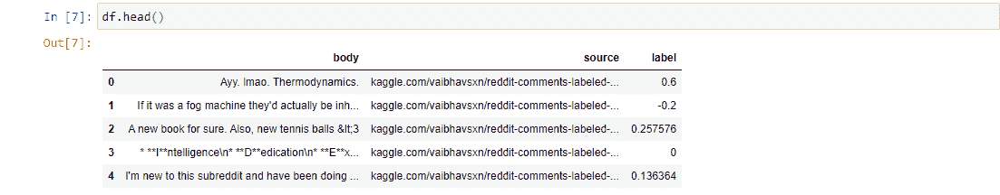
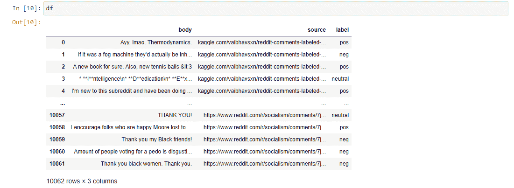
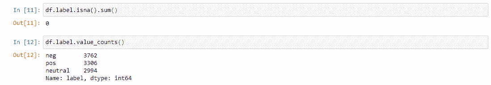
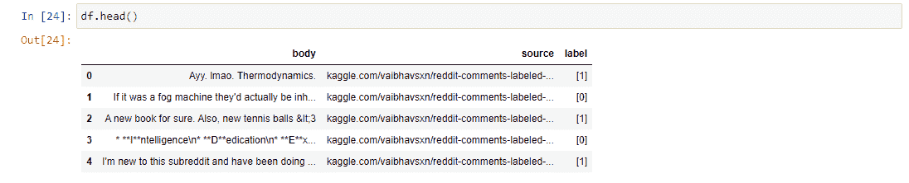
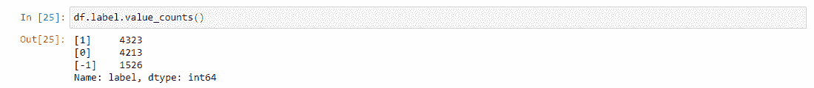

# 使用不同方法标记未标记的 NLP 数据集

> 原文：<https://medium.com/analytics-vidhya/labeling-an-unlabelled-nlp-dataset-s-using-different-methods-9a80b139de27?source=collection_archive---------1----------------------->

**内容:** 1。简介
2。使用文本块
3。使用本地分类器

**引言:** 我最近遇到的一个困境是缺乏合适的数据集或语料库来训练你的模型。有时，即使有足够的数据，如果没有标记，也没什么好处。通常，这类问题的解决方案是无监督学习，以便将它们聚类或分组到类中，从而创建所需的从属列。在本文中，我将尝试使用两种方法来标记一个未标记的数据集，这两种方法是:一个名为 Textblob 的 python 库和一个 pickled 模型。

**使用 TextBlob:** 你问的 TextBlob 是什么？TextBlob 是一个为 NLP 数据和预处理而设计的 Python 库，它与 NLTK 有许多共同的特性，比如单词包、标记化，以及我们今天使用的一个特性:情感分析。如果你听说过 Python Vader，那就把它当成真正志同道合的库，如果不是这里的是一个链接。

为了下载和使用 TextBlob，只需点击此[链接](https://textblob.readthedocs.io/en/dev/#:~:text=TextBlob%20is%20a%20Python%20(2,classification%2C%20translation%2C%20and%20more.)。

现在我们已经成功安装了 TextBlob，下一步就是开始我们的练习。首先，我们需要导入需要使用的库。我们将导入 pandas 库来导入和制表数据，接下来是 Textblob 库和 Textblob 中的“NaiveBayesAnalyzer”。

接下来，我们将导入 CSV 文件，然后，我们将向 dataframe 添加一个新列，以便存储每行的预测(它将作为新的因变量)。

接下来，我们将做一件非常简单的事情，它会让你惊讶它有多简单。正如所看到的，我们所做的是在我们将文本转换为 TextBlob 对象的行上迭代，以便对其进行操作，在本例中，我们将变量命名为“label”。接下来，我们在“label”列中选择相应的单元格，将其设置为变量“label ”,并对其调用函数“impression . polarity ”,以返回 TextBlob 对象的极性，并将其存储在适当的单元格中。

现在让我们看看它在这一点上应该是什么样子。

正如我们在上面的图中看到的，我们现在有一个名为“label”的第三列，它包含一个对应于每个文本的从-1 到 1 的浮点数。这样够了吗？不，因为我们需要这个数据集看起来像我们训练分类模型的东西，因此我们需要将那个列转换成分类列。

我们要做的是创建一个函数，并把它命名为任何东西，但我要把它命名为 *polarity_to_label* ，它将有 *x* 作为参数。这个函数将把标签列传递给它，在这里它将检查值:如果它在-1 和 0 之间，那么它被改变为 *neg* 表示负，如果它等于 0，那么它将改变为 *neutral* ，如果它在 0 和 1 之间，那么它被改变为 *pos* 表示正。现在谈到范围，我不相信这是一个精确的科学，也许你想调整一下，例如，给中性类添加更多的填充。如果你认为事实并非如此，请在评论中告诉我。接下来，我们将在标签列上使用 *apply()* 函数。

现在让我们看看它会是什么样子。

如您所见，我们将“标签”列从连续变量更改为分类值。最后，让我们看看数据框中是否有任何空值，最后让我们看看“标签”列的细分，以了解这三个类的人口统计数据。

到目前为止，听起来像是一个平衡的职业组合，所以这是一个不错的开始。

**使用局部分类器:** 之前我们使用了一个库函数来标记一个数据集，但是还有另一种方法来做同样的事情。我们将尝试使用一个已经构建好的分类器。所以在这种情况下让我们先做一些想象。在此练习之前，我已经构建了一个分类器，并将其保存到一个 joblib 对象中以备将来使用。所以基本上我们要导入一个 joblib 对象，并像使用 TextBlob 库一样使用它。

所以现在我们总是从导入所需的库开始，以便使用它们。

让我们继续导入 CSV 文件并查看一些记录。我们将使用相同的数据集，因为回收很重要。

现在我们与前面的方法有了很大的不同，我们需要导入酸洗模型和酸洗矢量器。所以请记住，如果您希望重现这些步骤，您需要保存模型和矢量器。

接下来，我们创建一个空列来存储预测，我们称它为“label ”,因为我们仍然本着循环利用的精神。接下来，我们将迭代数据帧中的行。对于每一行，我们将把文本转换成一个向量，创建一个名为“label”的变量来临时存储预测，最后我们将指向锚定文本对应的“label”单元格，并将预测存储在其中。

然后，让我们打印新数据帧的头，看看它看起来像什么。

那我们来看看平衡。

