# 伦敦地铁的迷宫。

> 原文：<https://medium.com/analytics-vidhya/labyrinths-of-the-london-underground-561896b6e2bd?source=collection_archive---------19----------------------->

# 我如何使用图像到图像的翻译来创建我自己的迷宫。

如果你去过伦敦，那么你很有可能坐过伦敦的地铁。地铁有一种特定的美学风格，这种风格随着时间的推移而发展，反映了地下建筑的建筑限制以及时代的时尚，因为流行艺术家经常被要求贡献艺术来帮助装饰车站。在形式遵循功能的情况下，反之亦然，为地铁制作的艺术反映并发展了特色风格，例如，标志性的地铁地图、艺术和散布在系统各处的广告都与系统的氛围和功能密切相关。

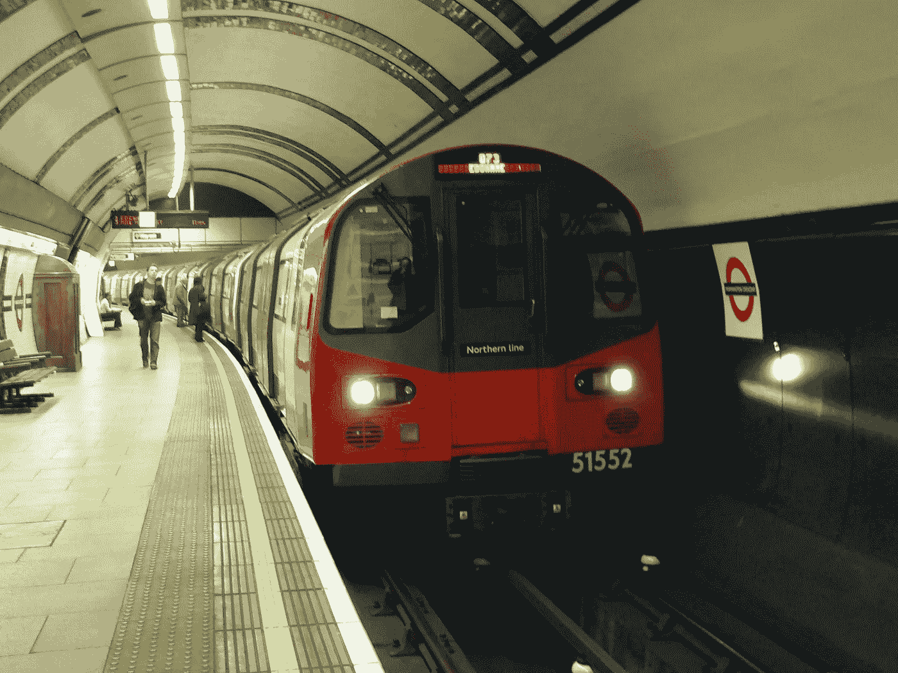

图片来源:克里斯·麦基纳( [CC BY-SA 4.0](https://creativecommons.org/licenses/by-sa/4.0)

艺术家[马克·沃灵格](https://www.tate.org.uk/art/artists/mark-wallinger-2378)为伦敦地铁做出了一项最新的伟大艺术贡献，他是一位以雕塑和艺术品闻名的英国艺术家。他设计了一系列标志性的迷宫，完美地捕捉并提升了电子管的美学风格。在所有 270 个地铁站中，你会发现一个由马克·沃灵格创造的迷宫。每个迷宫都有编号，是独一无二的，并以 11 种不同的互补风格之一形成风格。迷宫通常被描述为生命中灵魂之路的隐喻，复杂的道路最终会将你引向它的中心。沃灵格的每一个设计都有助于游客或通勤者在到达目的地之前，进入地下深处，开始探索之旅。

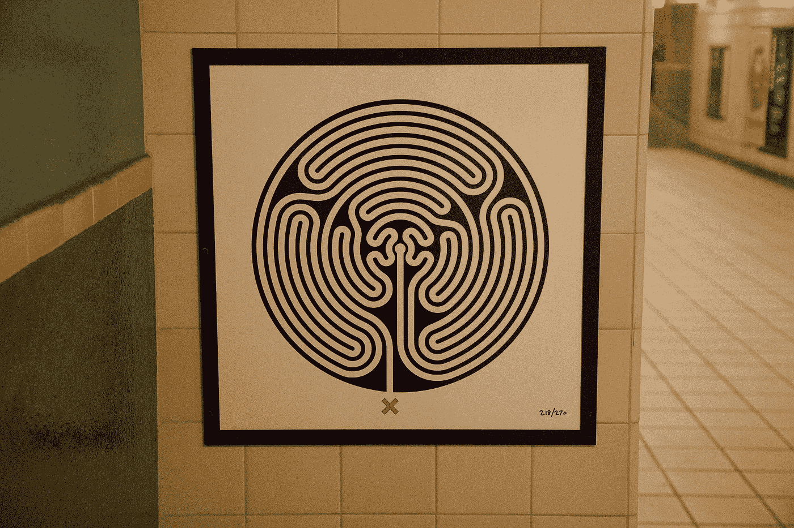

迷宫 218，考克福斯特(马克沃灵格)。图片来源:[杰克·戈登](https://commons.wikimedia.org/wiki/User:Bluegoblin7) ( [CC BY-SA 4.0](https://creativecommons.org/licenses/by-sa/4.0) )

多年来，我多次走过马克·沃灵格的迷宫，总觉得有必要以某种方式完成它们。在他们身上画画和绘制迷宫路径的诱惑总是太诱人而无法抗拒。因此，作为一个小项目，我决定捕捉每个设计的图像，并开发一个简单的算法来解决它们，使用我的图像分析技能来这样做。因为有 270 种不同的设计，我选择不去每个车站拍照。我认为这将花费我数周的时间来完成，所以我买了这本书:[迷宫:伦敦地铁之旅](https://blackwells.co.uk/bookshop/product/9781908970169?gC=5a105e8b&gclid=Cj0KCQjw9_mDBhCGARIsAN3PaFMrpql5A5AU5tgZGaMqRTFPYUf69eg9uXgTIIJ6Mnc7pDYCYHZStZAaAoWiEALw_wcB)作者马克·沃灵格。从这本书里，我可以扫描每一个设计，然后开发一个简单的阈值和搜索算法，绘制出每一个设计的根。如果你想看这样做的指南，我还为此制作了一个视频和指南:【https://www.youtube.com/watch?v=1KHgCRs-x1M[。这种方法也适用于迷宫。](https://www.youtube.com/watch?v=1KHgCRs-x1M)

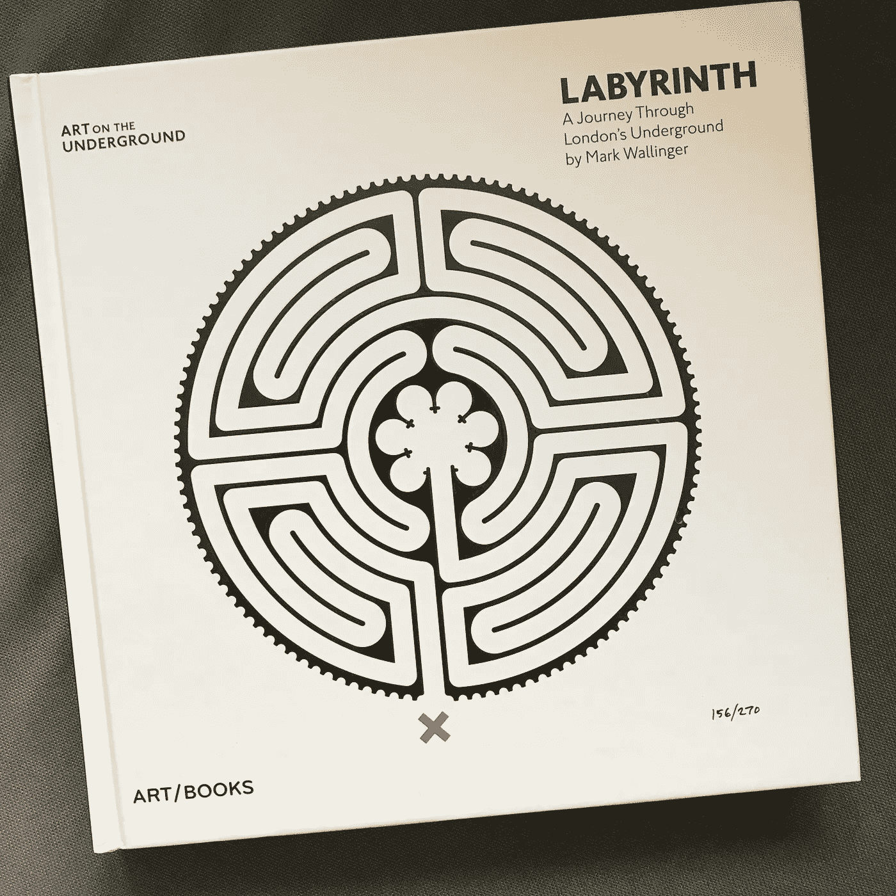

[迷宫:伦敦地铁之旅](https://blackwells.co.uk/bookshop/product/9781908970169?gC=5a105e8b&gclid=Cj0KCQjw9_mDBhCGARIsAN3PaFMrpql5A5AU5tgZGaMqRTFPYUf69eg9uXgTIIJ6Mnc7pDYCYHZStZAaAoWiEALw_wcB)作者马克·沃灵格

一旦我解决了迷宫，我的想法是将每个迷宫的解决方案描绘成一个有趣的视觉项目，也许用一些环境音乐来帮助创建一个基调。然而，我很快意识到，每个迷宫都有点简单，只有一条可能的路线。这意味着有 270 个迷宫的视频可能会有点无聊！我也担心使用如此多的马克·沃灵格的设计，并让他们如此可用，可能侵犯版权，尽管这是一个新颖的用例。因此，我放弃了这个想法，但我想知道我能对所有这些迷宫和我计算出的相应解决方案做些什么

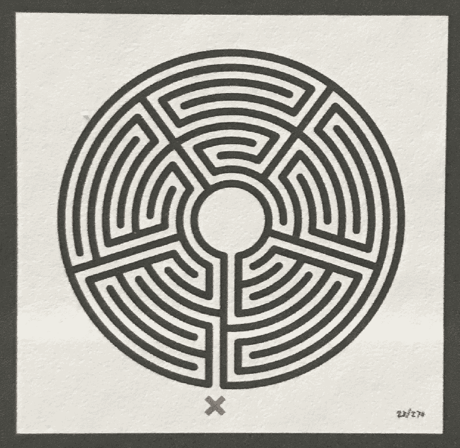

迷宫 28 被我的算法解决了。出现的绿线显示了通过迷宫展开的解决方案(或路线)。

在这一点上，我意识到我已经为一种叫做图像到图像翻译的应用深度学习创建了完美的训练集。在这种深度学习范式中，你需要许多成对的训练图像，其中输入和输出图像通过它们的底层结构联系在一起，但在视觉上是不同的。然后，训练一个网络，学习如何在保持输入结构的同时，将输入格式化为输出。一旦经过训练，网络就可以自动将输入的图像转换成输出的样式。这样做的好处是，它有可能从一个简单的输入创建非常复杂的输出。它的应用包括对图像进行着色或脱色，将草图转换成照片，或者将简单的类似示意图的地图转换成完全成熟的鸟瞰图。用于图像到图像翻译的网络的一个流行选择是已经在许多例子中被证明有效的 [Pix2pix](https://ml4a.github.io/guides/Pix2Pix/) 网络。

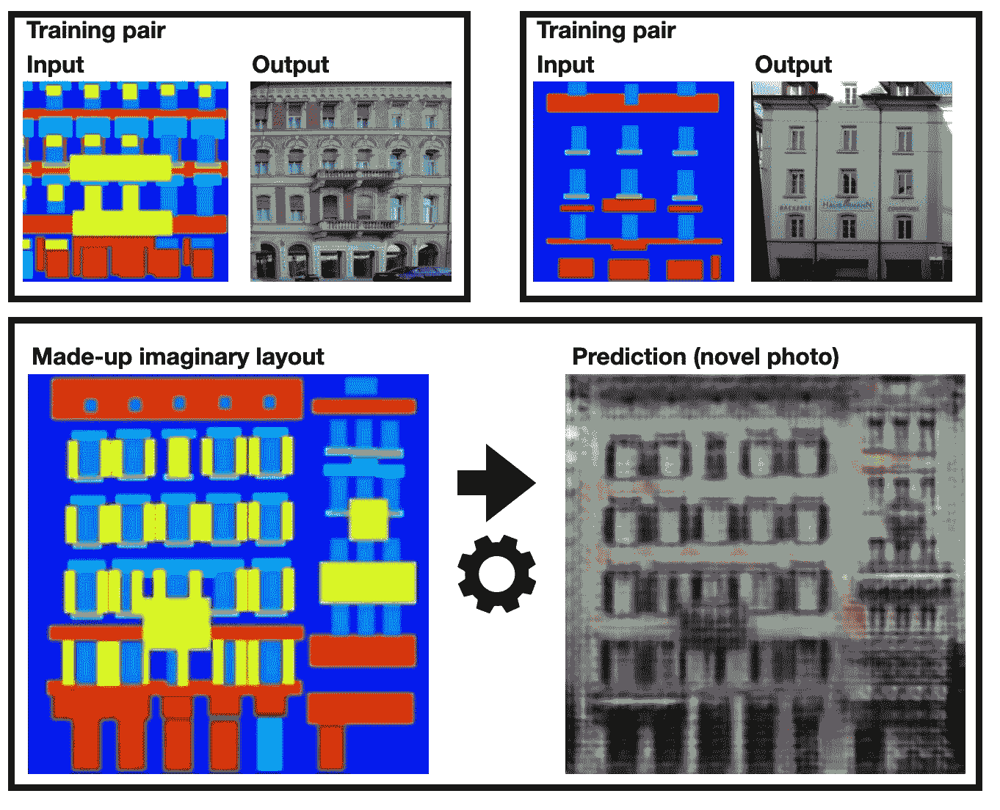

Pix2Pix 网络用例示例(【https://ml4a.github.io/guides/Pix2Pix/】T2)。上排:用于训练网络的训练对。研究人员创建了 1000 对图像，用手绘的结构图像(输入基于建筑物的实际照片(输出))。Pix2Pix 网络一旦用许多像这样的成对例子进行训练，就可以生成想象中的建筑物的照片。下图是网络使用的虚拟布局示例，用于创建表示建筑物新照片的预测输出。

通过使用我的迷宫解决方案，我将计算结果作为输入，将 Mark Wallinger 的设计作为输出，我意识到我可以使用最终训练好的 Pix2Pix 网络来生成无限的独特设计，具有 Mark Wallinger 作品的美感，但具有我选择的路径。

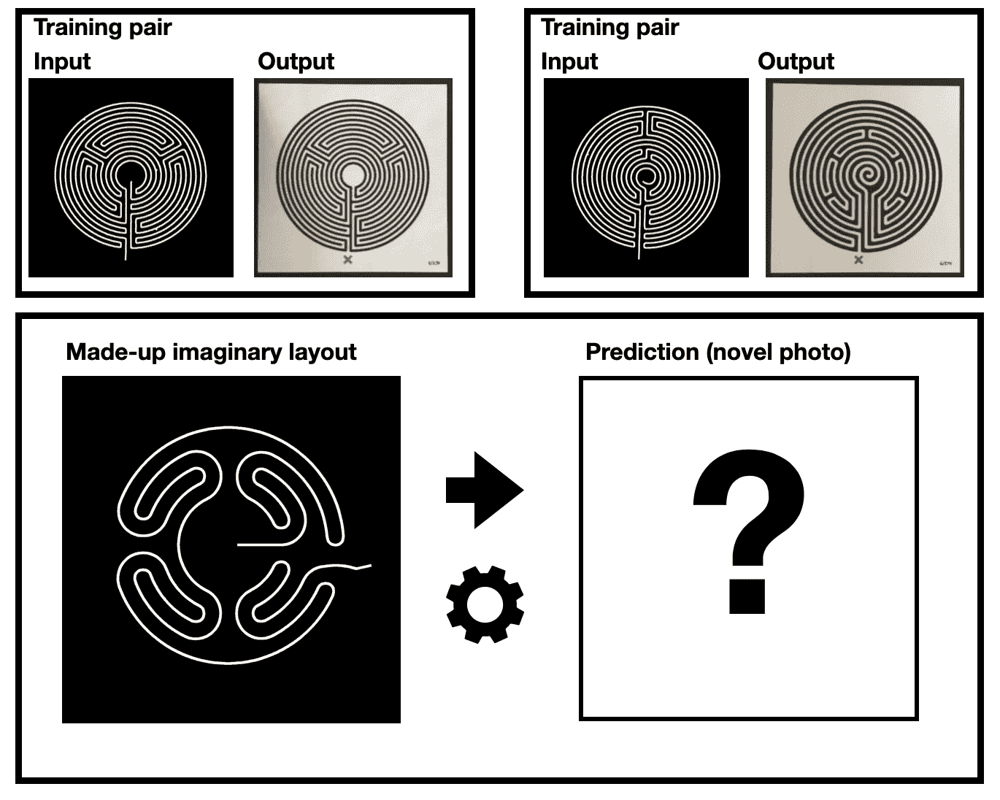

因此，我开始工作，并训练了几个模型，以了解迷宫解决方案和输出迷宫图像之间的关系。马克·沃林格的迷宫有 11 种不同的风格，所以我收集了每一种设计并训练了一些网络。

一旦训练完毕，我就在一个看不见的迷宫布局上测试每个网络，即在训练中没有见过的迷宫解决方案。我发现起初训练过的网络有点脆弱。因为我没有成千上万的成对训练图像，网络已经过拟合，已经学会了从字面上识别输入，而不是真正理解如何根据结构转换它。为了解决这个问题，我在输入中使用了更多的正则化，这是通过创建许多相似但不同的输入和输出图像来实现的。我通过移动 X 和 Y 方向的设计以及旋转迷宫来做到这一点。这在训练材料中产生了更多的变化，意味着网络必须真正理解如何根据输入产生输出，而不仅仅是识别输入。这就像一个真正理解题目的学生，而不是仅仅学习一个考试的答案。通过这一策略，我制作了许多真正体现了马克·沃灵格作品风格的健壮网络。

以下是我创作的一些作品:

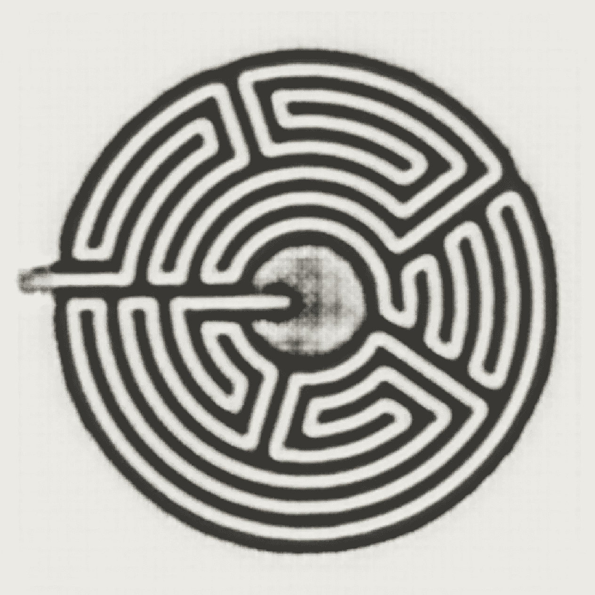

虚构设计 1 ( [访问 Instagram](https://www.instagram.com/p/CNqLyqMjosP/?utm_source=ig_web_copy_link) )

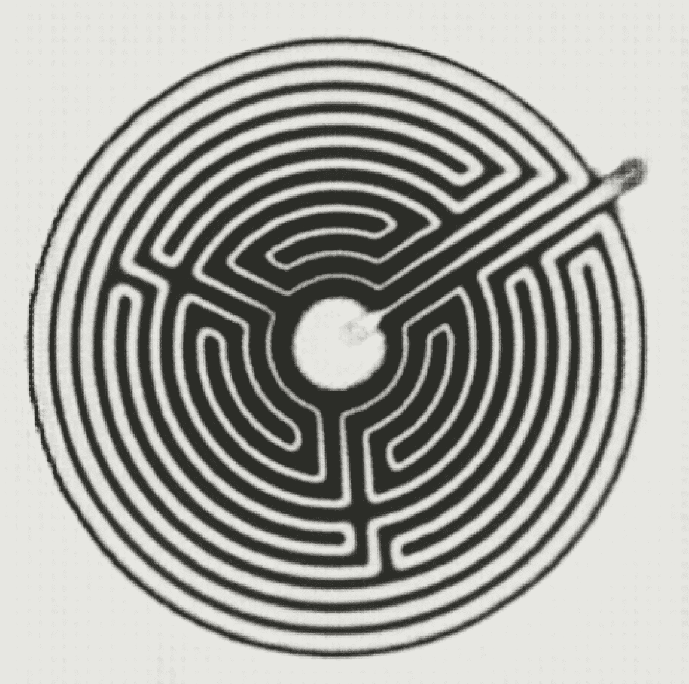

自创设计 2 ( [访问 Instagram](https://www.instagram.com/p/CNqPZIBjlcT/?utm_source=ig_web_copy_link)

虽然不完美，迷宫是相当不错的。他们掉下来的地方是预测红十字，这是每个迷宫的起点和特征起点。这在将来可能会被纠正，但是在这些例子中可以让你相信它们不是来自原始集合。如前所述，我还想制造一些迷宫，所以我尝试了圆形迷宫和迷宫:

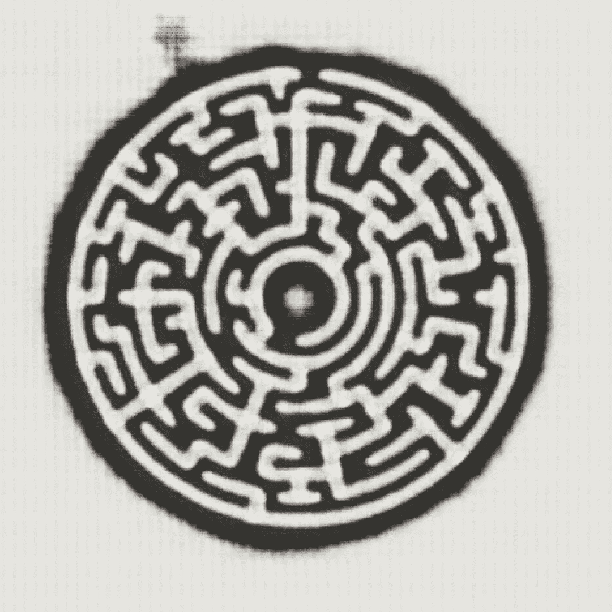

自创设计 3 ( [在 Instagram 上的访问](https://www.instagram.com/p/CNqLZ6QrLiD/?utm_source=ig_web_copy_link))

圆形迷宫运行良好，但方形迷宫产生了一个有趣的假象:

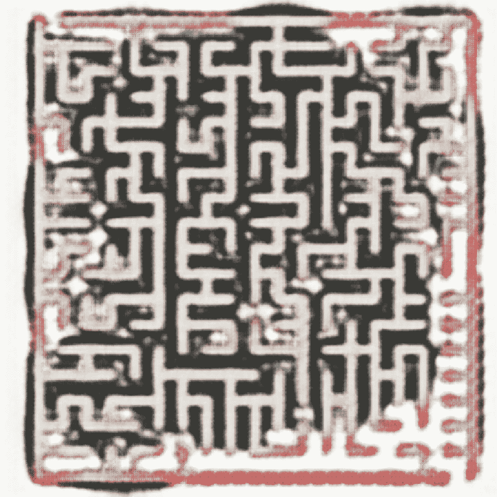

虚构设计 4 ( [访问 Instagram](https://www.instagram.com/p/CNqLf60DZ7C/?utm_source=ig_web_copy_link) )

因为 Pix2pix 网络在训练期间从未见过正方形迷宫(所有 Wallinger 的设计都是圆形的)，所以网络很难处理正常圆形区域之外的区域。这创造了一个有趣的视觉风格，但作为一个功能迷宫失败了。在未来，我将坚持这种特殊的训练方式。

我发现我还可以试验设计，让它旋转和动画，以期望的美感呈现底层设计的每一帧。我发现我越是改变底层结构和布局形式，结果看起来就越不像马克·沃灵格迷宫，尽管一些细节仍然存在。最后，我创造了独特的意象，这些意象受到了马克·沃灵格作品的影响。

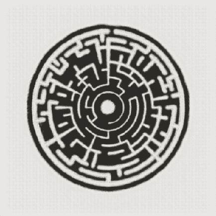

动画圆形迷宫。

所以，下次你参观伦敦地铁时，请留意马克·沃灵格的设计，同时，请欣赏我的艺术作品，它反映并希望庆祝他的风格和贡献。