# 基于 OpenCV 的自动驾驶汽车车道检测

> 原文：<https://medium.com/analytics-vidhya/lane-detection-for-a-self-driving-car-using-opencv-e2aa95105b89?source=collection_archive---------4----------------------->

对于那些想知道如何在一篇文章中涵盖这一概念的人，我要说，事情听起来很复杂，直到你探索了它的深度。我不会说这篇文章会非常容易，但的确，它将建立在非常基本的计算机视觉概念之上。请不要假设这正是特斯拉将在他们的汽车上使用，但它可能是类似的东西。

**先决条件是什么？**了解一些 OpenCV 的基础知识会比较好。如果没有，不要担心，我会试着解释我将使用的 OpenCV 函数，并提供参考资料让你更详细地检查它们。

本文的每一节都将涵盖一个最终将在程序的主要部分使用的函数。此外，在本文中，我将使用图像演示一切。您可以在视频中重用相同的代码(因为视频只是图像的集合)。

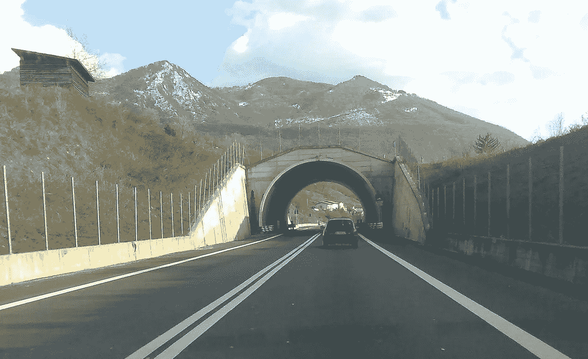

我将在本文中使用的图像

# 步骤 1:边缘检测

我们将使用精明的边缘检测。如果你不确定这是什么，看看我的[以前的文章](/analytics-vidhya/image-simplification-through-binarization-in-opencv-1292d91cae12)，它以一种实用的方式解释了这一点。

```
def canyEdgeDetector(image):
    edged = cv2.Canny(image, 50, 150)
    return edged
```

这是我们应用 canny 边缘检测后的输出

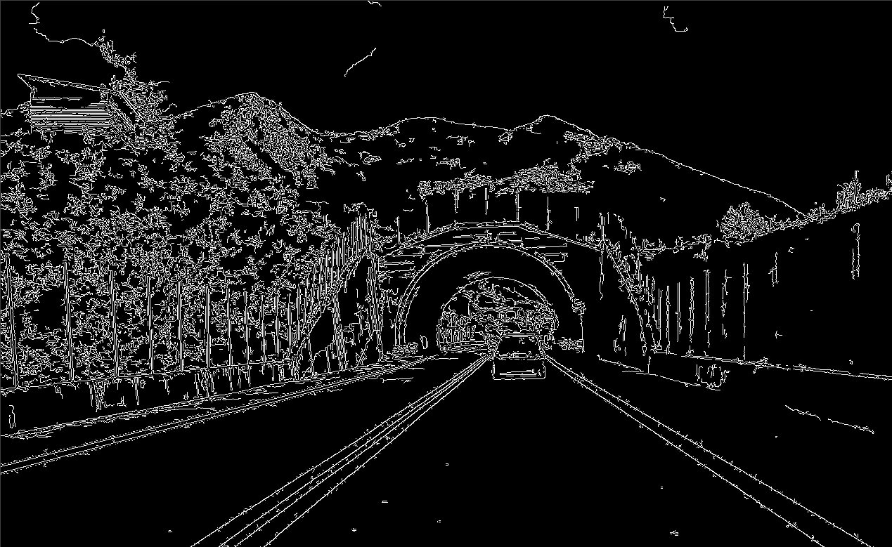

Canny 边缘检测后的输出

# 步骤 2:定义 ROI(感兴趣的区域)

开车时，为了让车保持在车道上，你只需关注当前道路的下一个 100 米。还有，你根本不关心分割线另一边的路。这就是我们感兴趣的*地区*。我们隐藏了图像中不必要的细节，只显示有助于我们找到车道的区域。

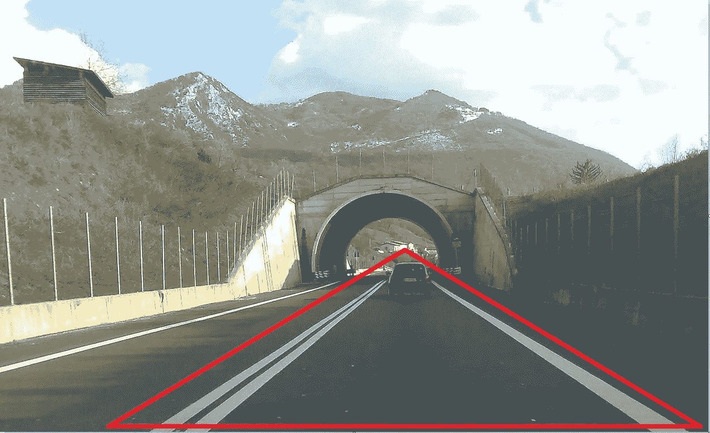

红色三角形表示我们感兴趣的区域

```
def getROI(image):
    height = image.shape[0]
    width = image.shape[1]
    # Defining Triangular ROI: The values will change as per your camera mounts
    triangle = np.array([[(100, height), (width, height), (width-500, int(height/1.9))]])
    # creating black image same as that of input image
    black_image = np.zeros_like(image)
    # Put the Triangular shape on top of our Black image to create a mask
    mask = cv2.fillPoly(black_image, triangle, 255)
    # applying mask on original image
    masked_image = cv2.bitwise_and(image, mask)
    return masked_image
```

1.  我们已经定义了三角形 ROI，其坐标将根据您在汽车上安装摄像机的位置而变化(尽量只保留图像中实际有助于车道检测的部分)。
2.  我们创建了一个与原始图像形状相同的黑色图像:

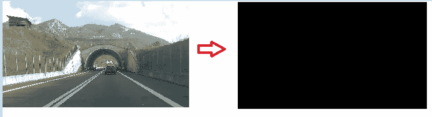

创建与原始图像形状相同的黑色图像

3.**创建一个蒙版:**然后我们使用 *cv2.fillPoly()* 将我们的三角形(带有白色线条)放在我们的黑色图像上来创建一个蒙版。

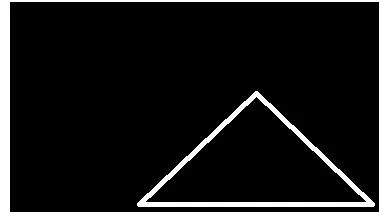

创建一个遮罩

4.在我们的原始图像上应用蒙版，得到只包含我们感兴趣区域的裁剪图像。

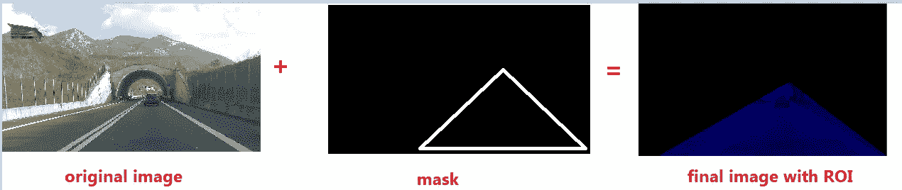

原始图像+蒙版=带 ROI 的最终图像

这一步的输出类似于:

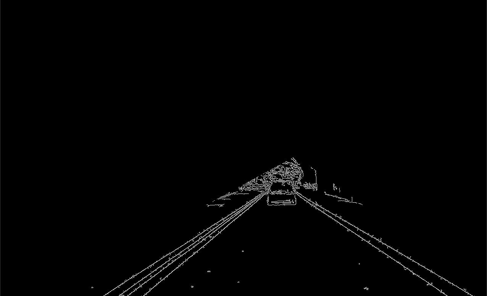

getROI()后的输出

> 在获得 ROI 之前应用边缘检测是很重要的，否则边缘检测也会检测我们的 ROI 的边界。

# 第三步:排队

下一步将是通过 ROI 获得图像中的所有直线。 *cv2。HoughLinesP()* 帮助你实现这一点。这个函数返回它能在输入图像中找到的所有直线的列表。每条线由[x1，y1，x2，y2]表示。

现在，这可能看起来非常简单，但霍夫线检测的基本工作原理需要一点时间来解释。所以我不会在这篇文章中涉及它。相反，我建议你看一下[这个教程](https://www.youtube.com/watch?v=7m-RVJ6ABsY)(28、#29、#30 应该足以理解霍夫线条原理)。

```
def getLines(image):
    lines = cv2.HoughLinesP(image, 0.3, np.pi/180, 100, np.array([]), minLineLength=70, maxLineGap=20)
    return lines
```

cv2 的参数。HoughLinesP()必须根据您的需求进行调整(尝试更改和调试最适合您的方法)。但是我认为上面的那些应该在大多数情况下都管用。这一步的输出如下所示:

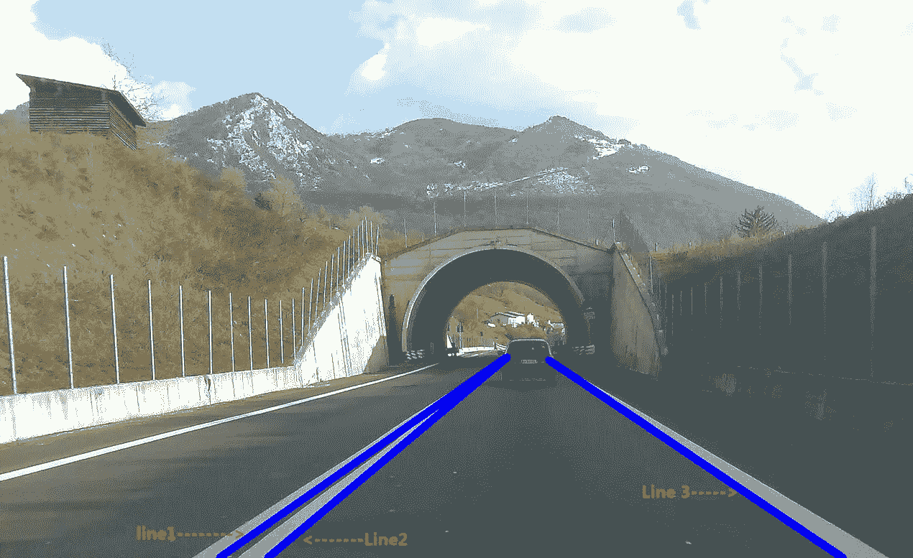

在图像中检测到 3 条线。在您的图像中可能会检测到数百条线。因此，调整您的参数以获得尽可能少的行数

# 步骤 4:一些实用函数

下面的实用函数获取图像和线条列表，并在图像上绘制线条。(此步骤不接受来自步骤 3 的任何输入。相反，这只是一个从步骤 5 调用的实用程序步骤，因此您可以先查看步骤 5，并在需要时访问该步骤。

```
def displayLines(image, lines):
    if lines is not None:
        for line in lines:
            x1, y1, x2, y2 = line.reshape(4) #converting to 1d array
            cv2.line(image, (x1, y1), (x2, y2), (255, 0, 0), 10)
    return image
```

我们定义了另一个效用函数来从它的参数(斜率和截距)中获取线坐标。请记住，直线由 *y=mx+c* 表示，其中 m 是斜率，c 是截距。

```
def getLineCoordinatesFromParameters(image, line_parameters):
    slope = line_parameters[0]
    intercept = line_parameters[1]
    y1 = image.shape[0]  # since line will always start from bottom of image
    y2 = int(y1 * (3.4 / 5))  # some random point at 3/5
    x1 = int((y1 - intercept) / slope)
    x2 = int((y2 - intercept) / slope)
    return np.array([x1, y1, x2, y2])
```

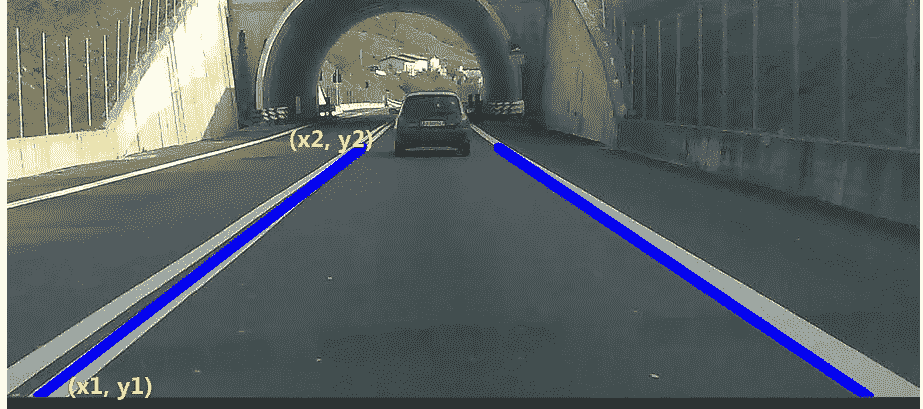

注意我们是如何选择 y1 和 y2 的值的

# **第五步:获得平滑线**

一旦我们从步骤 3 中获得了线条，在这一步中，我们将这些线条分成 2 组(左和右)。如果您注意到步骤 3 的输出图像，该步骤会将 Line1 和 Line 2 放入*左组*中，将 Line3 放入*右组*中。

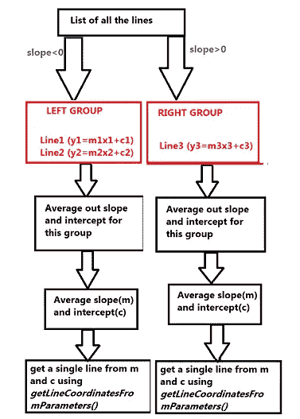

如何获得车道左右侧的公共线

分组后，我们找到该组的平均斜率(m)和截距(c ),并尝试通过调用 getLineCoordinatesFromParameters()并传递 average m 和 average c 为每个组创建一条线。

下面是完成所有这些工作的函数:

```
def getSmoothLines(image, lines):
    left_fit = []  # will hold m,c parameters for left side lines
    right_fit = []  # will hold m,c parameters for right side lines

    for line in lines:
        x1, y1, x2, y2 = line.reshape(4)
        parameters = np.polyfit((x1, x2), (y1, y2), 1)
        slope = parameters[0]
        intercept = parameters[1]

        if slope < 0:
            left_fit.append((slope, intercept))
        else:
            right_fit.append((slope, intercept))

    left_fit_average = np.average(left_fit, axis=0)
    right_fit_average = np.average(right_fit, axis=0)

    # now we have got m,c parameters for left and right line, we need to know x1,y1 x2,y2 parameters
    left_line = getLineCoordinatesFromParameters(image, left_fit_average)
    right_line = getLineCoordinatesFromParameters(image, right_fit_average)
    return np.array([left_line, right_line])
```

这是线条分组后的图像外观:

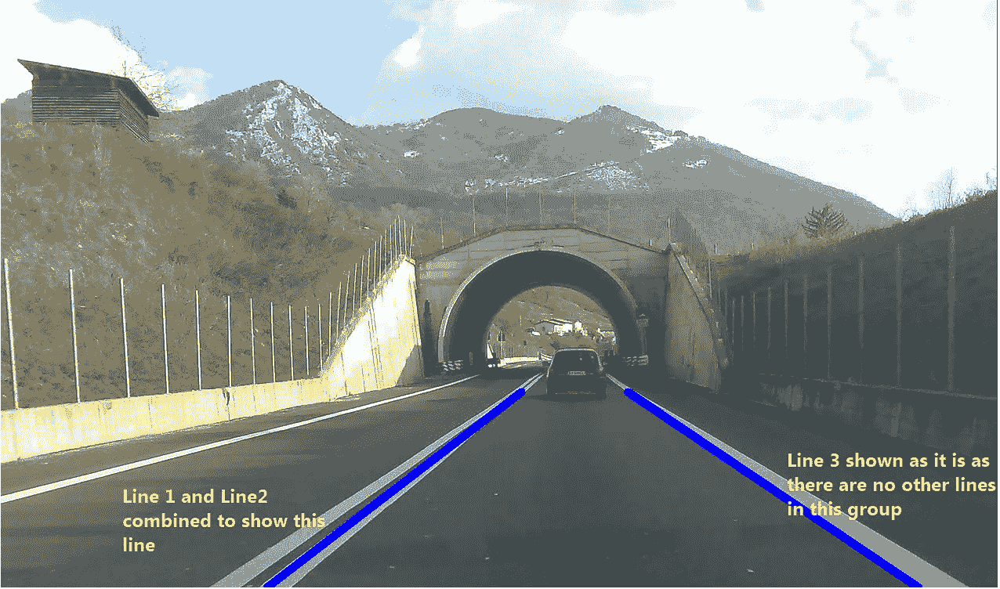

行分组后的输出

# 主代码(逐个调用上面的步骤)

一旦我们准备好了单独的函数，我们只需要在我们的主代码中调用它们，你就会在你的图像中检测到车道。

```
image = cv2.imread("3.jpg") #Load Image

edged_image = canyEdgeDetector(image)   # Step 1
roi_image = getROI(edged_image)         # Step 2

lines = getLines(roi_image)             # Step 3

smooth_lines = getSmoothLines(image, lines)    # Step 5
image_with_smooth_lines = displayLines(image, smooth_lines) # Step 4

cv2.imshow("Output", image_with_smooth_lines)
cv2.waitKey(0)
```

输出将如下所示:

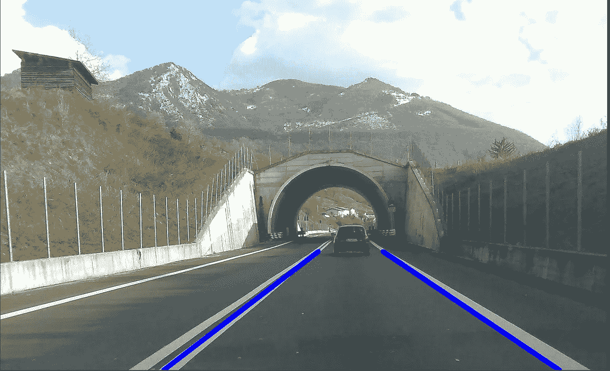

确定车道的最终输出

# 最后的话

你坚持到了文章的结尾。一旦事情被分类并且对图像工作良好，你知道如何让它在视频上工作。你可能已经意识到如何巧妙地使用非常基本的计算机视觉操作来实现如此有用的东西。我还是要说，不要试图将这项工作与特斯拉等更大的公司所做的工作进行比较(他们的基础也是类似的)。相反，用这个作为动力，也许在某个时候，你能够实现类似的事情。

在此之前，请继续探索:)您可以在这里查看本文的 Github 源代码的链接。

*在视频上检测车道后的样本输出(由于视频记录器的原因，帧很慢):*

检测视频中的车道