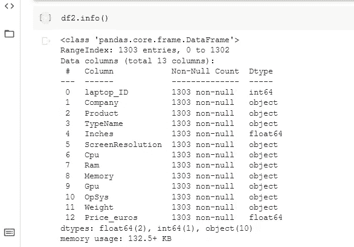

# 基于机器学习的笔记本电脑价格预测

> 原文：<https://medium.com/analytics-vidhya/laptop-price-prediction-by-machine-learning-7e1211bb96d1?source=collection_archive---------1----------------------->


使用 [Python](https://www.python.org/) ， [Numpy](https://numpy.org/) ，[熊猫](https://pandas.pydata.org/) s， [Matplotlib](https://matplotlib.org/) ， [Plotly](https://plotly.com/python/) ， [Scikit-learn](https://scikit-learn.org/stable/) 。

> 关于计算机的好消息是它们会做你让它们做的事情。坏消息是他们按照你说的去做。—泰德·纳尔逊

**膝上型电脑**、**膝上型电脑**或**笔记本电脑**是一种小型便携式个人电脑(PC)，带有屏幕和字母数字键盘。这些通常有一个[翻盖式](https://en.wikipedia.org/wiki/Flip_(form))外形，通常有安装在上盖内部的[屏幕](https://en.wikipedia.org/wiki/Computer_screen)和安装在下盖内部的[键盘](https://en.wikipedia.org/wiki/Alphanumeric_keyboard)，尽管带有可拆卸键盘的 [2 合 1 电脑](https://en.wikipedia.org/wiki/2-in-1_PC)通常作为笔记本电脑或具有笔记本电脑模式销售。笔记本电脑折叠起来便于运输，因此适合[移动使用](https://en.wikipedia.org/wiki/Mobile_computing)。它的名字来源于[大腿](https://en.wikipedia.org/wiki/Lap)，因为它被认为在使用时可以放在人的大腿上。今天，笔记本电脑被用于各种场合，如工作、教育、玩游戏、浏览网页、个人多媒体和普通家用电脑。

截至 2021 年，[美式英语](https://en.wikipedia.org/wiki/American_English)中，**笔记本电脑**和**笔记本电脑**两个术语互换使用；在英语的其他方言中，这种或那种可能更受青睐。术语“笔记本电脑”或“笔记本”最初指的是特定尺寸的笔记本电脑(最初比当时的主流笔记本电脑更小更轻)，这些术语现在指的是同一种东西，而**笔记本**不再指任何特定的尺寸。

# 导入库:

```
import numpy as npimport pandas as pdimport matplotlib.pyplot as pltimport seaborn as sns
import plotly.express as px# Configuring stylessns.set_style("darkgrid")matplotlib.rcParams['font.size'] = 16matplotlib.rcParams['figure.figsize'] = (12, 6)matplotlib.rcParams['figure.facecolor'] = '#00000000'
```

# 正在加载数据集:

```
import io#df2 = pd.read_csv('laptop_price.csv')df2=pd.read_csv('laptop_price.csv',encoding='latin-1')
```

# 显示数据:


# 关于数据集中所有列的信息:



# 数据描述:


# 数据之间的相关性:


# 数据集的形状:


# 数据集的热图:

```
plt.figure(figsize=(16,10))sns.heatmap(df2.corr(), annot=True,cmap ='RdYlGn')
```


# **数据可视化:**


# **笔记本电脑公司分布柱状图:**

我们可以看到，联想、戴尔、惠普笔记本电脑的分布都差不多。这意味着这些是目前销量最高的笔记本电脑。

# **Ram 与欧元价格的直方图:**

# **RAM 散点图对比价格对比公司:**

内存大小与欧元价格成反比，价格较高的笔记本电脑的销售率很低。

# CPU 与价格和公司的散点图:

处理器的代与价格成正比。搭载英特尔、AMD 处理器的笔记本电脑是这里销量最高的。

# **笔记本电脑操作系统分布柱状图:**

我们可以看到人们大多在使用 windows 10。如今，几乎每台笔记本电脑都装有 windows 10 操作系统，但也很少有笔记本电脑装有 windows 7 操作系统。

# **公司对比操作系统对比价格饼状图:**

# **公司 vs Ram vs 操作系统 vs 价格 vs CPU vs 内存散点图:**

# 数据预测:


# 线性回归:

线性回归是一种基于监督学习的机器学习算法。它执行回归任务。回归基于独立变量对目标预测值进行建模。它主要用于找出变量和预测之间的关系。不同的回归模型基于因变量和自变量之间的关系类型、所考虑的因素以及所使用的自变量数量而有所不同。

线性回归执行的任务是根据给定的自变量(x)预测因变量值(y)。因此，这种回归技术找出了 x(输入)和 y(输出)之间的线性关系。因此，其名称为线性回归。y=ax+c


为了获得更好的结果，我们必须从数据集中删除一些实体。

# 从 sklearn 导入模块:

```
import reimport pandas as pdimport seaborn as snsimport numpy as npimport matplotlib.pyplot as plt%matplotlib inlinefrom sklearn.ensemble import AdaBoostRegressor,RandomForestRegressor,VotingRegressorfrom sklearn.linear_model import SGDRegressor,LinearRegressionfrom sklearn.metrics import mean_absolute_error,mean_squared_error,r2_scorefrom sklearn.model_selection import train_test_splitfrom sklearn.neighbors import KNeighborsRegressorfrom sklearn.preprocessing import LabelEncoderfrom sklearn.tree import DecisionTreeRegressorfrom xgboost import XGBRegressor
```

# 标签编码:

标签编码是指将标签转换成数字形式，从而将其转换成机器可读的形式。然后，机器学习算法可以以更好的方式决定这些标签必须如何操作。这是监督学习中结构化数据集的重要预处理步骤。

```
le={}for col in set(df.columns).difference({'Price_euros'}):le[col] = LabelEncoder()df[col]  = le[col].fit_transform(df[col])df
```


# 特征缩放:

特征缩放是一种用于归一化独立变量范围或数据特征的方法。在数据处理中，它也被称为数据规范化，通常在数据预处理步骤中执行。

```
def normalize_col(col_name): return (df[col_name] -           df[col_name].min())/(df[col_name].max()-df[col_name].min())for col in ['Product','Price_euros']: df[col]=normalize_col(col) df
```


# 分成测试集和训练集:

```
#x=df.drop('Price_euros',axis=1)#y=df.Price_eurosx = df.iloc[:, -4:-3].valuesy = df.iloc[:, -1].valuesx_train,x_test,y_train,y_test=train_test_split(x,y,test_size=0.4,random_state=1)
```

这里，我们将数据分为训练集和测试集。

# 使用简单线性回归对训练集进行训练:

```
from sklearn.linear_model import LinearRegressionregressor = LinearRegression()regressor.fit(x_train, y_train)
```

# 对测试集的预测:

```
y_pred = regressor.predict(x_test)y_pred
```

# 可视化训练集:

```
plt.scatter(x_train, y_train, color = 'red')plt.plot(x_train, regressor.predict(x_train), color = 'blue')plt.title("Price vs Product Name of laptop")plt.xlabel("Product Name")plt.ylabel("Price")plt.show()
```


我们可以看到数据点远离直线。证明了线性回归不容易拟合数据点。因此，现在我们必须寻找另一种方法来创建最佳拟合模型。

# 多元回归:

多元线性回归试图通过将线性方程拟合到观察到的数据来模拟两个或多个特征与响应之间的关系。执行多元线性回归的步骤几乎与简单线性回归的步骤相似。区别在于评价。我们可以用它来找出哪个因素对预测产量的影响最大，现在不同的变量相互关联。

这里:Y = B0+B1 * x1+B2 * x2+B3 * x3+……bn * xn Y =因变量而 x1，x2，x3，…… xn =多个自变量。


# 在训练集上训练多元线性回归模型:

```
from sklearn.linear_model import LinearRegressionregressor = LinearRegression()regressor.fit(X_train, y_train)
```

# 预测测试集结果:

```
y_pred = regressor.predict(X_test)np.set_printoptions(precision= 3)print(np.concatenate((y_pred.reshape(len(y_pred), 1), y_test.reshape(len(y_test),1)), 1))
```

# 可视化结果:

```
plt.plot(y_pred)plt.plot(y_test)plt.show()
```


这里，我们对数据集应用了多元线性回归模型。我们可以看到，在某些区域，橙色图形线比蓝色图形线更陡。这证明了多元回归模型比线性回归模型拟合得更好，但它仍然不是最佳拟合图，因为一些预测已经越过了测试值。

# 随机森林:

随机森林或随机决策森林是一种用于分类、回归和其他任务的集成学习方法，它通过在训练时构建大量决策树来操作。对于分类任务，随机森林的输出是大多数树选择的类。对于回归任务，返回单个树的平均值或平均预测值。随机决策森林纠正了决策树过度适应其训练集的习惯 587–588 随机森林通常优于决策树，但其准确性低于梯度提升树。但是，数据特征会影响它们的性能。


# 在训练集上训练随机森林模型:

```
from sklearn.ensemble import RandomForestRegressorregressor = RandomForestRegressor(n_estimators = 95, random_state = 78)regressor.fit(X, y)
```

# 可视化结果:

```
X_grid = np.arange(min(X), max(X), 0.01)X_grid = X_grid.reshape((len(X_grid), 1))plt.scatter(X, y, color = 'red')plt.plot(X_grid, regressor.predict(X_grid), color = 'blue')plt.title("Price vs Product Name of laptop")plt.xlabel("Product Name")plt.ylabel("Price")plt.show()
```


这种随机森林预测更加准确，并且覆盖了大多数数据点。这个模型的准确率是 96%。所以这个模型远比前两个模型更符合。

# 决策树:

决策树是一种决策支持工具，它使用决策及其可能结果(包括偶然事件结果、资源成本和效用)的树状模型。这是显示只包含条件控制语句的算法的一种方式。

决策树通常用于运筹学，特别是决策分析，以帮助确定最有可能达到目标的策略，但也是机器学习中的一种流行工具。

决策树是一种类似流程图的结构，其中每个内部节点代表对一个属性的“测试”(例如，掷硬币是正面还是反面)，每个分支代表测试的结果，每个叶节点代表一个类标签(在计算所有属性后做出的决定)。从根到叶的路径代表分类规则。


# 在训练集上训练决策树模型:

```
from sklearn.tree import DecisionTreeRegressorregressor = DecisionTreeRegressor(random_state = 45)regressor.fit(X,y)
```

# 可视化结果:

```
X_grid = np.arange(min(X), max(X), 0.01)X_grid = X_grid.reshape((len(X_grid), 1))plt.scatter(X, y, color = 'red')plt.plot(X_grid, regressor.predict(X_grid), color = 'blue')plt.title("Price vs Product Name of laptop")plt.xlabel("Product Name")plt.ylabel("Price")plt.show()
```


在决策树模型中，准确率要比线性和多元回归高得多。所以我们可以说这个模型也是最适合的模型之一。

# 支持向量回归模型:

在机器学习中，支持向量机(SVM，也称为支持向量网络)是具有相关学习算法的监督学习模型，这些算法分析数据以进行分类和回归分析。由 Vladimir Vapnik 及其同事(Boser 等人，1992 年，Guyon 等人，1993 年，Vapnik 等人，1997 年)在美国电话电报公司贝尔实验室开发的支持向量机是最稳健的预测方法之一，它基于 Vapnik (1982 年，1995 年)和 Chervonenkis (1974 年)提出的统计学习框架或 VC 理论。给定一组训练样本，每个样本被标记为属于两个类别中的一个，SVM 训练算法建立一个模型，将新样本分配给一个类别或另一个类别，使其成为非概率二元线性分类器(尽管存在诸如普拉特标度的方法，以在概率分类设置中使用 SVM)。SVM 将训练样本映射到空间中的点，以便最大化两个类别之间的差距。然后，新的例子被映射到相同的空间，并根据它们落在差距的哪一边来预测属于哪个类别。

除了执行线性分类，支持向量机还可以使用所谓的核技巧有效地执行非线性分类，将它们的输入隐式映射到高维特征空间。

当数据未标记时，监督学习是不可能的，并且需要非监督学习方法，该方法试图找到数据到组的自然聚类，然后将新数据映射到这些形成的组。由 Hava Siegelmann 和 Vladimir Vapnik 创建的支持向量聚类算法应用在支持向量机算法中开发的支持向量的统计来对未标记的数据进行分类，并且是工业应用中最广泛使用的聚类算法之一。


# 在训练集上训练支持向量回归模型:

```
from sklearn.svm import SVRregressor = SVR(kernel = 'rbf')regressor.fit(X, y)
```

# 可视化结果:

```
plt.scatter(sc_X.inverse_transform(X), sc_y.inverse_transform(y), color = 'red')plt.plot(sc_X.inverse_transform(X), sc_y.inverse_transform(regressor.predict(X)), color = 'blue')plt.title("Price vs Product Name of laptop")plt.xlabel("Product Name")plt.ylabel("Price")plt.show()
```


在 SVM，我们将数据点分成两个平面。在中间，蓝色的平面被称为超平面。但不幸的是，这个模型并不是我们想象中最合适的模型。

