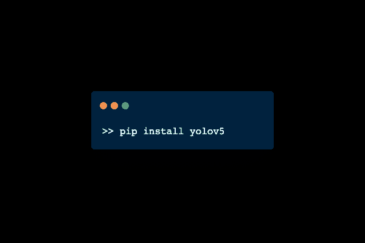
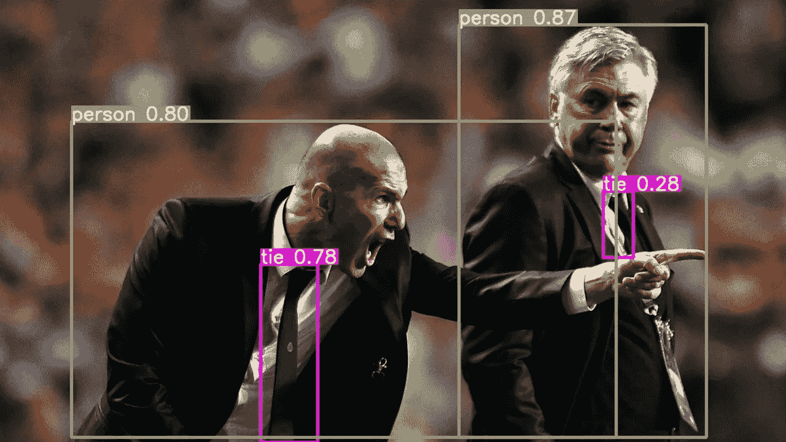
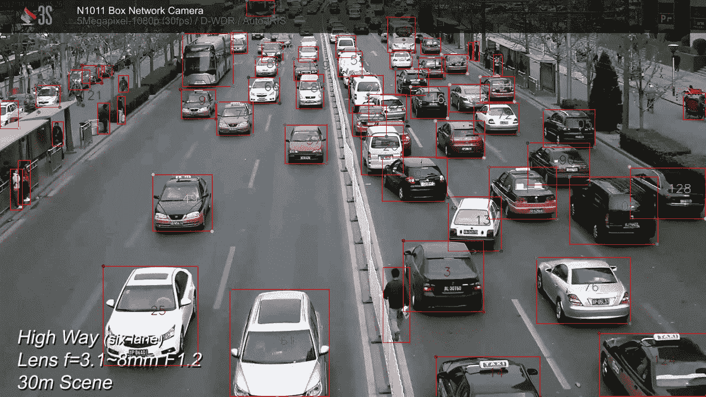
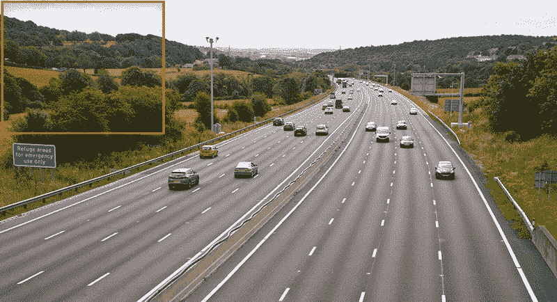

# 用 YOLOv5 软件包进行大规模目标检测和跟踪

> 原文：<https://medium.com/analytics-vidhya/large-scale-object-detection-tracking-with-yolov5-package-31e715d84121?source=collection_archive---------4----------------------->

只有' [pip 安装 yolov5](https://pypi.org/project/yolov5/) '远离你…



就这么简单。

*   你在 Windows/Linux 下安装最新的 YOLO 物体探测器有困难吗？
*   在使用定制的 YOLOv5 模型进行训练/推理时，您是否会遇到错误？
*   你在寻找一个只有几行代码的实时物体跟踪器吗？
*   要不要一键进行大规模(无人机监控/卫星影像/广域监控)物体检测？

> 继续阅读这篇文章，你将能够在几秒钟内解决所有这些问题..

## [YOLOv5](https://pypi.org/project/yolov5/) 物体探测器


[https://ultralytics.com/yolov5](https://ultralytics.com/yolov5)

YOLOv5 是有史以来最快最精确的 YOLO，你可以用它来解决任何你需要的物体探测问题。

安装很简单:在 Windows/Linux 终端中运行 [**pip 安装 yolov5**](https://pypi.org/project/yolov5/) 即可。



[https://ultralytics.com/yolov5](https://ultralytics.com/yolov5)

## 基本用法

```
import yolov5# model
model = yolov5.load('yolov5s')# image
img = 'https://github.com/ultralytics/yolov5/raw/master/data/images/zidane.jpg'# inference
results = model(img)# inference with larger input size
results = model(img, size=1280)# inference with test time augmentation
results = model(img, augment=True)# show results
results.show()# save results
results.save(save_dir='results/')
```

## 培养

运行以下命令对您的数据进行微调。YOLOv5s/m/l/x 在单个 V100 上的训练时间是 2/4/6/8 天(快多个 GPU 倍)。使用您的 GPU 允许的最大`--batch-size`(针对 8 GB 设备显示的批量大小)。详细信息请参考:[https://pypi.org/project/yolov5/](https://pypi.org/project/yolov5/)

```
$ yolov5 train --data coco.yaml --cfg --weights 'yolov5s6.pt' --batch-size 16
```

## 推理

yolov5 detect 命令在各种来源上运行推理，从[最新的 yolov5 版本](https://github.com/ultralytics/yolov5/releases)自动下载模型并将结果保存到`runs/detect`。详细信息请参考:[https://pypi.org/project/yolov5/](https://pypi.org/project/yolov5/)

```
$ yolov5 detect --source 0  # webcam
                         file.jpg  # image
                         file.mp4  # video
                         path/  # directory
                         path/*.jpg  # glob
```

## 使用 YOLOv5 进行最先进的[目标跟踪](https://github.com/tryolabs/norfair/tree/master/demos/yolov5)

您可以用几行代码创建一个实时自定义多对象跟踪器，下面是一个简单的例子:

最先进的 YOLOv5 物体跟踪器，只有几行代码。

这是输出结果:



YOLOv5 对象跟踪演示。

在这个 colab 笔记本中你可以找到一个 YOLOv5 物体追踪器。它可以从任何 YouTube 视频中执行高精度的行人和汽车跟踪！[参考这里获得完整的 YOLOv5 跟踪码](https://github.com/tryolabs/norfair/blob/master/demos/yolov5/yolov5demo.py)。

[**大规模物体检测用 YOLOv5**](https://github.com/obss/sahi/blob/main/demo/inference_for_yolov5.ipynb)

如果您正在处理巨大的卫星图像或广域监控图像，则无法使用标准输入大小进行推断。下面是 [SAHI](https://github.com/obss/sahi/blob/main/demo/inference_for_yolov5.ipynb) 包及其 [*切片推理*](https://github.com/obss/sahi/blob/main/resources/sliced_inference.gif) 特性:



[来自 SAHI 的切片推论。](/codable/sahi-a-vision-library-for-performing-sliced-inference-on-large-images-small-objects-c8b086af3b80)

[在本演示笔记本](https://github.com/obss/sahi/blob/main/demo/inference_for_yolov5.ipynb)中，您可以看到如何用 YOLOv5 用几行代码执行大规模切片推理！

或者您可以从 CLI 执行 YOLOv5 分片推理:

```
python scripts/predict.py --model_type yolov5 --source image/file/or/folder --model_path path/to/model
```

有关 CLI 参数[的详细信息，请参考此处](https://github.com/obss/sahi/blob/main/docs/SCRIPTS.md)。

## 结论

在这篇文章中，我们介绍了:

*   安装 YOLOv5 的最简单方法
*   最简单的 [YOLOv5 训练/推理方式](https://github.com/fcakyon/yolov5-pip#scripts)
*   最简单的方法 [YOLOv5 物体跟踪](https://github.com/tryolabs/norfair/blob/master/demos/yolov5/yolov5_demo.ipynb)
*   最简单的方法 [YOLOv5 切片推理](https://github.com/obss/sahi/blob/main/demo/inference_for_yolov5.ipynb)

如果你在任何一步有困难，请随时提问！