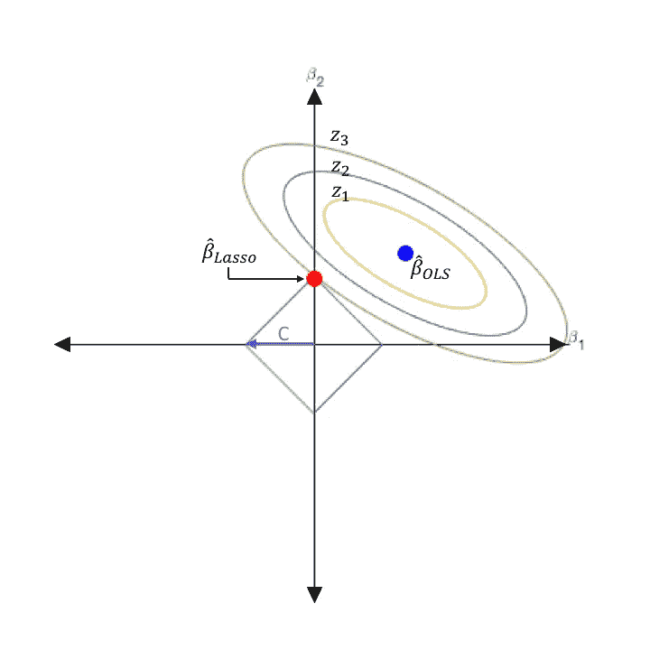
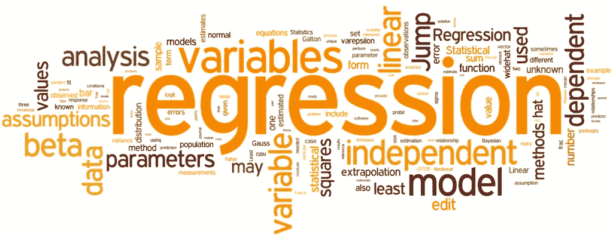
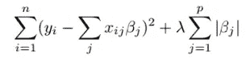

# Python 中的 Lasso 回归基础和建模

> 原文：<https://medium.com/analytics-vidhya/lasso-regression-fundamentals-and-modeling-in-python-ad8251a636cd?source=collection_archive---------0----------------------->

在这篇博文中，我将首先尝试解释套索回归的基础知识。然后，我们将通过 Python 使用数据集构建模型。最后，我们将通过计算均方差来评估模型。让我们一步一步开始吧。

资源:[https://water gramming . WordPress . com/2017/02/22/处理多重共线性-概述-介绍-容忍-方法/](https://waterprogramming.wordpress.com/2017/02/22/dealing-with-multicollinearity-a-brief-overview-and-introduction-to-tolerant-methods/)

# 什么是套索回归？

Lasso 回归的主要目的是通过对这些系数应用惩罚来找到最小化误差平方和的系数。在另一个来源中，它被定义如下:

> “套索”代表 **L** 东**A**b**S**h**S**选举 **O** 操作员。套索回归是一种正则化技术。它用于回归方法之上，以获得更准确的预测。这个模型使用收缩。收缩是指数据值向中间点收缩。Lasso 回归使用 L1 正则化技术。当我们有更多的特征时使用它，因为它自动执行特征选择。

## 套索回归的特征

*   岭回归的所有相关-不相关变量已被提出，以克服离开模型的缺点。
*   套索回归使系数更接近于零。
*   但是当范数 L1 足够大的时候，它使得一些系数为零。因此，变量做出选择。
*   λ选择正确非常重要。为此使用了交叉验证。
*   山脊法和套索法互不优越。

https://spotio.com/blog/regression-analysis/

# 套索回归模型

*   λ表示收缩量。
*   λ = 0 表示考虑了所有特征，这相当于线性回归，其中仅考虑残差平方和来构建预测模型
*   λ = ∞表示不考虑任何特征，即当λ接近无穷大时，它会消除越来越多的特征
*   偏差随着λ的增加而增加
*   方差随着λ的减小而增加

# 用 Python 建模

现在让我们在一个样本数据集上建立一个`Lasso Regression`模型。然后让我们计算模型的平方根，这将给出模型误差。

首先，我们照常导入建模所需的库。

然后我们做数据读取和一些数据编辑操作。

使用套索回归，我们在训练集上建立模型。

我不会深入概念细节，比如什么是 fit，什么是 train set。

我们发现 Lasso 回归模型的常数为 **-5.58** ，其函数如下。

根据我们拥有的数据集中的变量，我们发现 Lasso 模型中的可变系数如下。

众所周知，Lasso 回归中的系数可能会根据确定的 alpha 参数而变化。在下面的操作中，我们根据不同的λ值确定α，然后根据确定的α值建立模型并计算系数。然后，我们用 append 命令将系数添加到名为 coefs 的列表中。

我们可以从下图中看到系数是如何随着我们随机选择的 alpha 值而变化的。

## 预言；预测；预告

现在让我们在不指定任何参数的正常条件下进行模型预测。我们可以看到列车组的模型预测的前 5 个观察值如下。

同样，我们可以看到测试集的模型预测的前 5 个观察值如下。

然后，我们将在测试集上预测的值保存在一个名为 y_pred 的集群中。通过下面的计算，我们发现 RMSE 值为 **356，09** 。

结果我们发现 R 平方的分数是 **0，41** 。R 平方得分是自变量解释的因变量变化的百分比。

换句话说，我们可以说 Lasso 回归模型中的自变量解释了该数据集因变量的 **41，42%** 的变化。

**什么是 R 平方？**

> r 平方(R2)是一种统计测量方法，表示由回归模型中的一个或多个自变量解释的因变量方差的比例。相关性解释了自变量和因变量之间的关系强度，而 R 平方解释了一个变量的方差在多大程度上解释了第二个变量的方差。因此，如果模型的 R2 是 0.50，那么大约一半的观察到的变化可以用模型的输入来解释。

## 模型调整

在本节中，我们将使用 LassoCV 方法进行运算，以找到最佳的 lambda 值。

我们将使用 LassoCV 进行套索调优。我们给出参数的 alpha 数据集为 ***np.random.randint (0，1000，100)*** 。我们将交叉验证的数量设置为 10。随着您增加 cv 的数量，您的结果将会改变，因为您将进行更多的组合。但是做得多并不总是好的。cv 的数量会从某一点开始增加误差值。

我们发现用交叉验证建立的套索模型的 alpha 值为 **169。**

然后我们用这个最佳的 alpha 值来设置正确的套索模型。然后，我们将测试集上的预测值打印到 y_pred。结果，我们发现 RMSE 值为 **362，4。**

我们知道，套索回归中不使用的系数和无关紧要的系数都等于零。你可以这样观察。

# 最后

首先，我们在这篇博文中考察了什么是 Lasso 回归。然后我们讲了 Lasso 回归的特点和基础。数学上，我们检查了这个算法的模型。然后根据当前条件建立模型，计算误差值。在模型调整部分，我们通过用 LassoCV 计算最优 alpha 值，并根据这个 alpha 值重建校正模型，从而计算出调整后的误差值。Lasso 中的基本逻辑是将未使用的系数设置为零。结果我们观察到了这一点。

# 资源

1.  [https://www . mygreatlearning . com/blog/understanding-of-lasso-regression/](https://www.mygreatlearning.com/blog/understanding-of-lasso-regression/)
2.  【https://dataaspirant.com/lasso-regression/ 
3.  [https://www.investopedia.com/terms/r/r-squared.asp](https://www.investopedia.com/terms/r/r-squared.asp)