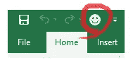
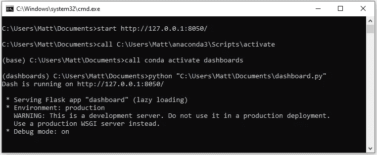

# 从 Excel 本地启动 Python 应用程序

> 原文：<https://medium.com/analytics-vidhya/launch-python-apps-locally-from-excel-754edb0fb50e?source=collection_archive---------5----------------------->

## 想想这个…你刚刚用 Python 开发了一个很棒的 web 应用程序，你想和你的同事分享它。你应该怎么做呢？你有什么选择？


菲利贝托·桑蒂兰在 [Unsplash](https://unsplash.com/s/photos/data-analytics?utm_source=unsplash&utm_medium=referral&utm_content=creditCopyText) 上拍摄的照片

理想情况下，你应该在云服务(AWS、Google Cloud、Heroku 等)上部署你的应用。)并简单地将潜在用户导向一个 url。没有大惊小怪，没有混乱。但是你并不总是希望你的珍贵项目公开。或者你不想为托管服务付费。不管是什么原因，你仍然可以免费分享你的应用程序供本地使用。

> "把你的工具放在一个工具箱里."

说没有人…从来没有…我完全编造了这句话，但它是真的。作为一名开发人员，你不断地构建工具，可能使用不同的语言和不同的程序。你的玩具散落在商店各处。在可能的情况下，试着把事情集中起来，让生活变得简单，不仅仅是为了你，也是为了你的潜在最终用户。

考虑你的目标受众的经验水平。他们是否都能够与命令行交互、激活虚拟环境并使用正确的端口号打开浏览器访问本地主机？他们真的想再打开一个应用程序吗？不太可能。

Excel 呢？大家能打开 Excel 点一下这些坏小子中的一个吗？现在我们正在谈论…



坏男孩。图片作者。

MS Excel 是一个绝对的机构。当你读到这些话的时候，如果你的电脑上没有打开电子表格，我会很惊讶的！诚然，与目前可用的令人兴奋的新编程语言相比，Excel 有点过时，但它无疑是最丰富的分析工具。

这是你可以利用舒适和熟悉的老式 excel 宏按钮的地方，就像给用户一个温暖的拥抱。它所需要的只是幕后的一行 VBA 代码。

```
Sub LaunchDashboard()command = Shell("C:\Users\" & LCase(Environ$("Username")) & "\Documents\Dasboard.bat", vbNormalFocus)End Sub
```

上面的 VBA 代码检索 Windows 用户名，以动态地找到批处理文件的正确路径，并在命令提示符下运行它。“vbNormalFocus”保持命令提示符打开(而不是隐藏)以获得视觉反馈。

现在让我们来看看实际的批次。bat)文件，用于打开命令提示符，激活虚拟环境，然后在 Chrome 中启动您的仪表板。

```
start [http://127.0.0.1:8050/](http://127.0.0.1:8050/)
call C:\Users\%USERNAME%\anaconda3\Scripts\activate
call conda activate dashboards
python "C:\Users\%USERNAME%\Documents\dashboard.py"
cmd /k
```

*   ***启动 http://127 . 0 . 0 . 1:8050****—*在本地主机地址和正确端口(本例中为 8050)启动默认网络浏览器，查看应用。
*   ***调用 C:\ Users \ % USERNAME % \ anaconda 3 \ Scripts \ activate***—有效地将命令提示符变成 Anaconda 提示符，以便能够识别“conda”命令。注意使用 *%USERNAME%* 来动态获取 Windows 用户名。
*   ***调用 conda 激活仪表盘*** —激活虚拟环境。
*   ***python " C:\ Users \ % USERNAME % \ Documents \ dashboard . py "***—使用动态文件路径运行应用程序。
*   ***cmd /k*** —保持命令提示窗口打开以获得视觉反馈。

下面是一个由 VBA 代码执行的批处理文件的示例，它成功地在本地主机上启动了一个仪表板。



成功执行批处理文件和仪表板启动。想象作者。

这个例子需要注意的是，与您共享项目的每个人都需要在同一个相对目录中维护它——所以保持文件路径简单。用户还需要建立一个和你一样的虚拟环境。为了简洁起见，我在这里就不赘述了，如果需要的话，有很多文章可以指导你，但是请相信我——这很容易。在我看来，这些小细节被*“把你的工具放在一个工具箱里”*的实用性和每个人的可访问性所弥补。

试一试，让我知道你的想法！