# 使用 TERRAFORM 启动基础设施

> 原文：<https://medium.com/analytics-vidhya/launching-infrastructure-using-terraform-75ab95fdc9dd?source=collection_archive---------22----------------------->

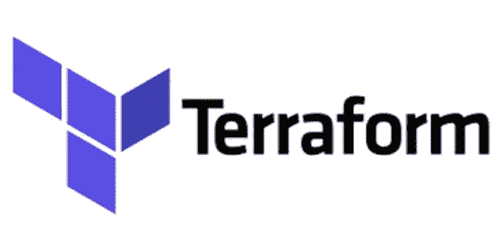

这是我关于 Terraform 的第一篇文章，在这篇文章中，我将讲述 Terraform 的概述和使用 Terraform 创建 EC2 实例。

所以，首先想到的问题是！什么是 Terraform？

嗯，terraform 是一个 IAC(Infrastructure as a Code)工具，用于构建、更改和版本控制基础设施，它支持许多流行的云提供商，包括亚马逊 AWS。

本指南将带您了解使用简单的配置文件和 Terraform provider 配置单个实例的基本知识。

在我们开始之前，有几个额外条件:

配置您的 AWS 凭证。

熟悉命令行(PowerShell)。

前往 [Terraform 下载页面](https://www.terraform.io/downloads.html)，获取你的操作系统的最新版本。

要检查是否安装了 terraform，请打开 CMD 并运行以下命令:

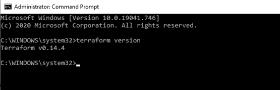

如您所见， **terraform 版本**告诉我们您的系统中安装了哪个版本，从而确认 terraform 已成功配置。

首先，创建一个 terraform 目录，并使用该目录存储所有的 terraform 模板。请记住，您的 terraform 文件的名称将始终以*结尾。tf* 延伸。

使用命令，**记事本【文件名】。tf**

这将创建一个新文件，我们将用它来创建地形模板。在这个演示中，我使用记事本作为创建 terraform 模板的文本编辑器，但是您也可以选择自己喜欢的文本编辑器。

使用 Terraform 的第一步通常是配置要使用的提供者。创建一个名为 *ec2.tf* 的文件，并将以下代码放入其中:

> *供应商“AWS”{*
> 
> *region = "us-west-1"*
> 
> *}*

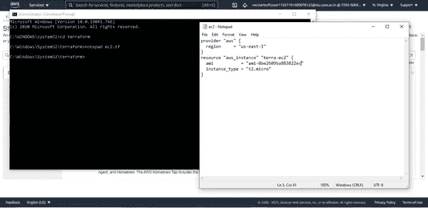

这告诉 Terraform，您将使用 AWS 提供商，并且您希望在 us-east-1 地区部署您的基础架构(AWS 在世界各地都有数据中心，分为不同的区域和可用性区域，us-east-1 是位于 N. Virginia 的数据中心的名称)

如果你使用的是联邦账户(比如 educate)，那么你可以使用上面的代码，只需更新*。aws/credentials* 文件，如果您是 IAM 用户，那么您必须遵循

> *供应商“AWS”{*
> 
> *region = "us-west-1"*
> 
> *ACCESS _ KEY = " YOUR _ ACCESS _ KEY "*
> 
> *秘密密钥= "你的秘密密钥"*
> 
> *}*

此模板用于配置 IAM 身份证明，以便与 AWS 一起使用。

接下来，您将指定想要使用的资源。Terraform 资源的一般语法是:

> *资源"<提供者> _ <类型> " " <名称> " {
> 【配置…】
> }*

其中 *PROVIDER* 是提供者的名称(例如 aws)， *TYPE* 是在该提供者中创建的资源类型(例如实例)， *NAME* 是一个标识符，您可以在整个 Terraform 代码中使用它来引用该资源(例如 terra-ec2)，而 *CONFIG* 由一个或多个特定于该资源的*参数*组成。

对于这个演示，我们只是启动一个 ec2 实例，因此模板也相应地进行了设置。

对于 aws_instance 资源，有许多不同的参数，您可以在 [terraform 文档](https://registry.terraform.io/providers/hashicorp/aws/latest/docs/data-sources/instance)中查看它们。

当第一次开始使用 Terraform 时，您需要运行 **terraform init** 来告诉 terraform 扫描代码，找出您正在使用的提供者，并为他们下载代码。

默认情况下，提供者代码将被下载到*中。terraform* 文件夹，是 terraform 的暂存目录。每当您开始新的 Terraform 代码时，您都需要运行 init，并且多次运行 init 是安全的(该命令是幂等的)。

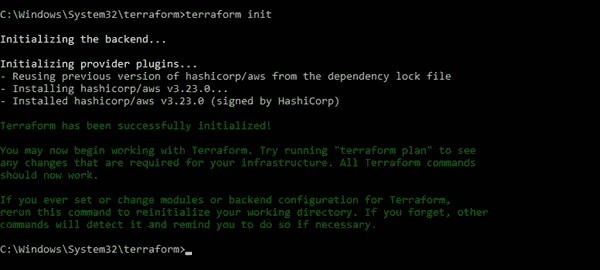

现在您已经下载了提供者代码，运行 **terraform plan** 命令。

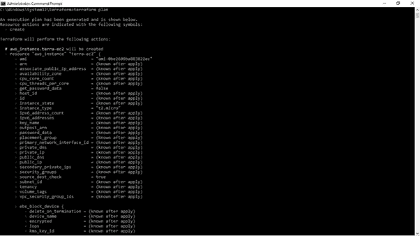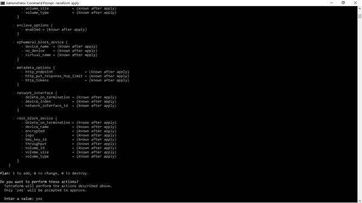

Terraform 生成一个**执行计划，**描述它将做什么来达到期望的状态，然后执行它来构建所描述的基础设施。

带有加号(+)的资源将被创建，带有减号(-)的资源将被删除，带有波浪号(~)的资源将被就地修改。在上面的输出中，您可以看到 Terraform 计划创建一个 EC2 实例，这正是我们想要的。

出现提示时，输入*是*。

使用命令 **terraform apply** 开始将配置部署到您的基础架构。

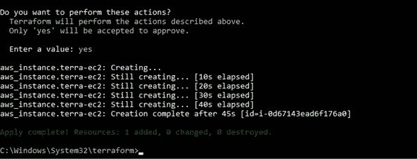

加载配置后，将要求您确认计划的操作。出现提示时，输入*是*。

现在，您已经使用 Terraform 在 AWS 帐户中部署了一个 EC2 实例。让我们检查它是否被创建。打开 AWS 控制台并转到 EC2。请注意您的终端上显示的实例 ID 和 EC2 仪表板上显示的实例 ID。

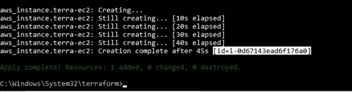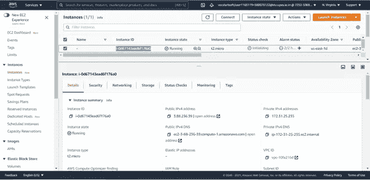

EC2 仪表板

*祝贺您，您刚刚从代码中部署了基础设施！*

要删除实例，使用 **terraform destroy** 命令。

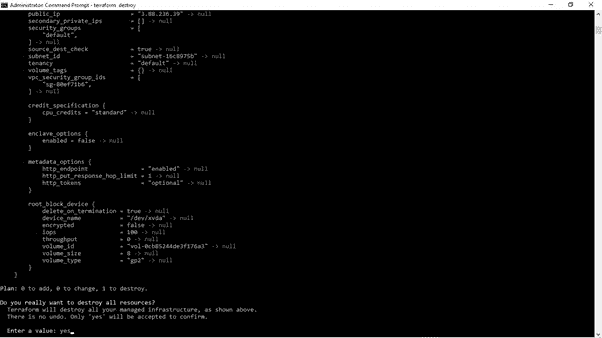

Terraform 将要求确认删除。键入 *yes* 并按回车键。

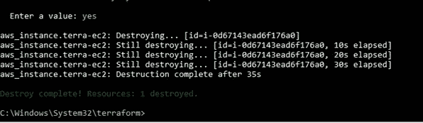

转到您的 EC2 仪表板，检查实例状态。

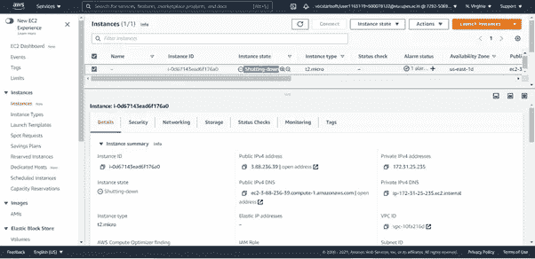

这是对 Terraform 的基本介绍&我们已经部署了第一个 EC2 实例，并使用 Terraform 删除了它。

如果你觉得这篇文章有帮助，请鼓掌。

*谢谢！！*